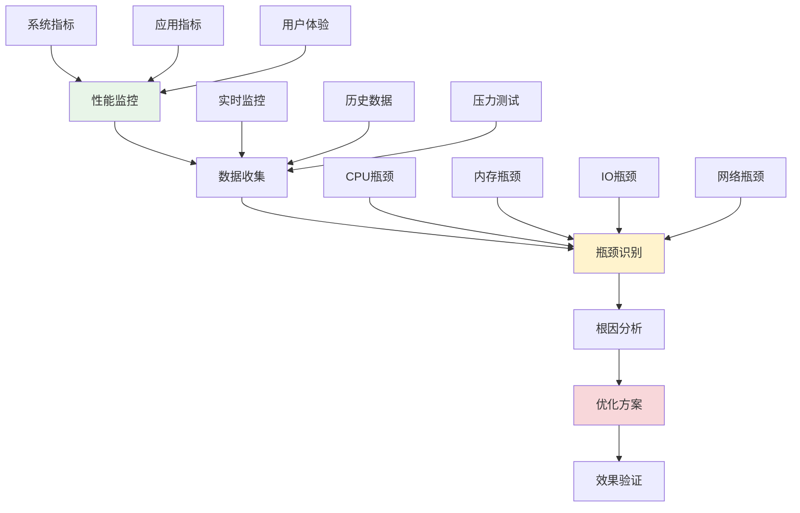

# 性能瓶颈识别

## 🎯 学习目标

通过本节学习，您将能够：
- 掌握系统性的性能分析方法
- 学会使用各种性能监控工具
- 了解常见的性能瓶颈类型和特征
- 掌握性能数据的收集和分析技巧
- 学会制定针对性的优化策略

## 📖 性能瓶颈概述

性能瓶颈是限制系统整体性能的关键因素。在Chat-Room项目中，常见的性能瓶颈包括网络延迟、数据库查询、内存使用、CPU计算等。识别和解决这些瓶颈是提升用户体验的关键。

### 性能分析框架



## 🔍 Chat-Room性能监控系统

### 1. 性能监控器实现

```python
"""
Chat-Room性能监控系统
"""

import time
import psutil
import threading
import sqlite3
from typing import Dict, List, Optional, Any, Callable
from dataclasses import dataclass, field
from datetime import datetime, timedelta
import json
import statistics
from collections import deque, defaultdict


@dataclass
class PerformanceMetric:
    """性能指标数据模型"""
    timestamp: float
    metric_name: str
    value: float
    unit: str
    tags: Dict[str, str] = field(default_factory=dict)

    def to_dict(self) -> Dict[str, Any]:
        """转换为字典"""
        return {
            "timestamp": self.timestamp,
            "metric_name": self.metric_name,
            "value": self.value,
            "unit": self.unit,
            "tags": self.tags
        }


class SystemMonitor:
    """系统性能监控器"""

    def __init__(self, collection_interval: float = 1.0):
        self.collection_interval = collection_interval
        self.metrics_buffer = deque(maxlen=1000)  # 保留最近1000个数据点
        self.is_monitoring = False
        self.monitor_thread = None

        # 性能阈值配置
        self.thresholds = {
            "cpu_usage": 80.0,      # CPU使用率阈值
            "memory_usage": 85.0,   # 内存使用率阈值
            "disk_usage": 90.0,     # 磁盘使用率阈值
            "response_time": 1000.0 # 响应时间阈值(ms)
        }

        # 告警回调
        self.alert_callbacks: List[Callable] = []

    def start_monitoring(self):
        """开始监控"""
        if self.is_monitoring:
            return

        self.is_monitoring = True
        self.monitor_thread = threading.Thread(target=self._monitoring_loop, daemon=True)
        self.monitor_thread.start()
        print("系统性能监控已启动")

    def stop_monitoring(self):
        """停止监控"""
        self.is_monitoring = False
        if self.monitor_thread:
            self.monitor_thread.join()
        print("系统性能监控已停止")

    def _monitoring_loop(self):
        """监控循环"""
        while self.is_monitoring:
            try:
                # 收集系统指标
                self._collect_system_metrics()
                time.sleep(self.collection_interval)
            except Exception as e:
                print(f"监控过程中出错: {e}")

    def _collect_system_metrics(self):
        """收集系统指标"""
        timestamp = time.time()

        # CPU使用率
        cpu_percent = psutil.cpu_percent(interval=None)
        self._add_metric("cpu_usage", cpu_percent, "percent", timestamp)

        # 内存使用情况
        memory = psutil.virtual_memory()
        self._add_metric("memory_usage", memory.percent, "percent", timestamp)
        self._add_metric("memory_available", memory.available / (1024**3), "GB", timestamp)

        # 磁盘使用情况
        disk = psutil.disk_usage('/')
        disk_percent = (disk.used / disk.total) * 100
        self._add_metric("disk_usage", disk_percent, "percent", timestamp)

        # 网络IO
        net_io = psutil.net_io_counters()
        self._add_metric("network_bytes_sent", net_io.bytes_sent, "bytes", timestamp)
        self._add_metric("network_bytes_recv", net_io.bytes_recv, "bytes", timestamp)

        # 进程数量
        process_count = len(psutil.pids())
        self._add_metric("process_count", process_count, "count", timestamp)

        # 检查阈值告警
        self._check_thresholds(timestamp)

    def _add_metric(self, name: str, value: float, unit: str, timestamp: float):
        """添加指标"""
        metric = PerformanceMetric(
            timestamp=timestamp,
            metric_name=name,
            value=value,
            unit=unit
        )
        self.metrics_buffer.append(metric)

    def _check_thresholds(self, timestamp: float):
        """检查阈值告警"""
        recent_metrics = self.get_recent_metrics(60)  # 最近1分钟的数据

        for metric_name, threshold in self.thresholds.items():
            values = [m.value for m in recent_metrics if m.metric_name == metric_name]
            if values:
                avg_value = statistics.mean(values)
                if avg_value > threshold:
                    self._trigger_alert(metric_name, avg_value, threshold, timestamp)

    def _trigger_alert(self, metric_name: str, value: float, threshold: float, timestamp: float):
        """触发告警"""
        alert_data = {
            "metric_name": metric_name,
            "current_value": value,
            "threshold": threshold,
            "timestamp": timestamp,
            "severity": "warning" if value < threshold * 1.2 else "critical"
        }

        for callback in self.alert_callbacks:
            try:
                callback(alert_data)
            except Exception as e:
                print(f"告警回调执行失败: {e}")

    def get_recent_metrics(self, seconds: int = 300) -> List[PerformanceMetric]:
        """获取最近的指标数据"""
        cutoff_time = time.time() - seconds
        return [m for m in self.metrics_buffer if m.timestamp >= cutoff_time]

    def get_metric_statistics(self, metric_name: str, seconds: int = 300) -> Dict[str, float]:
        """获取指标统计信息"""
        recent_metrics = self.get_recent_metrics(seconds)
        values = [m.value for m in recent_metrics if m.metric_name == metric_name]

        if not values:
            return {}

        return {
            "count": len(values),
            "min": min(values),
            "max": max(values),
            "mean": statistics.mean(values),
            "median": statistics.median(values),
            "std_dev": statistics.stdev(values) if len(values) > 1 else 0
        }

    def add_alert_callback(self, callback: Callable):
        """添加告警回调"""
        self.alert_callbacks.append(callback)


class ApplicationMonitor:
    """应用性能监控器"""

    def __init__(self):
        self.request_times = deque(maxlen=1000)
        self.error_counts = defaultdict(int)
        self.active_connections = 0
        self.message_counts = defaultdict(int)
        self.start_time = time.time()

    def record_request_time(self, operation: str, duration: float):
        """记录请求时间"""
        self.request_times.append({
            "operation": operation,
            "duration": duration,
            "timestamp": time.time()
        })

    def record_error(self, error_type: str):
        """记录错误"""
        self.error_counts[error_type] += 1

    def update_connection_count(self, count: int):
        """更新连接数"""
        self.active_connections = count

    def record_message(self, message_type: str):
        """记录消息"""
        self.message_counts[message_type] += 1

    def get_performance_summary(self) -> Dict[str, Any]:
        """获取性能摘要"""
        uptime = time.time() - self.start_time

        # 计算请求时间统计
        recent_requests = [r for r in self.request_times
                          if time.time() - r["timestamp"] < 300]  # 最近5分钟

        request_stats = {}
        if recent_requests:
            durations = [r["duration"] for r in recent_requests]
            request_stats = {
                "total_requests": len(recent_requests),
                "avg_response_time": statistics.mean(durations),
                "p95_response_time": self._percentile(durations, 95),
                "p99_response_time": self._percentile(durations, 99)
            }

        return {
            "uptime_seconds": uptime,
            "active_connections": self.active_connections,
            "total_errors": sum(self.error_counts.values()),
            "error_breakdown": dict(self.error_counts),
            "message_counts": dict(self.message_counts),
            "request_statistics": request_stats
        }

    def _percentile(self, data: List[float], percentile: int) -> float:
        """计算百分位数"""
        if not data:
            return 0.0

        sorted_data = sorted(data)
        index = int((percentile / 100.0) * len(sorted_data))
        return sorted_data[min(index, len(sorted_data) - 1)]


class PerformanceProfiler:
    """性能分析器"""

    def __init__(self):
        self.function_times = defaultdict(list)
        self.call_counts = defaultdict(int)

    def profile_function(self, func_name: str):
        """函数性能分析装饰器"""
        def decorator(func):
            def wrapper(*args, **kwargs):
                start_time = time.time()
                try:
                    result = func(*args, **kwargs)
                    return result
                finally:
                    end_time = time.time()
                    duration = (end_time - start_time) * 1000  # 转换为毫秒

                    self.function_times[func_name].append(duration)
                    self.call_counts[func_name] += 1

                    # 保留最近100次调用的数据
                    if len(self.function_times[func_name]) > 100:
                        self.function_times[func_name] = self.function_times[func_name][-100:]

            return wrapper
        return decorator

    def get_function_stats(self, func_name: str) -> Dict[str, Any]:
        """获取函数性能统计"""
        times = self.function_times.get(func_name, [])
        if not times:
            return {}

        return {
            "call_count": self.call_counts[func_name],
            "avg_time_ms": statistics.mean(times),
            "min_time_ms": min(times),
            "max_time_ms": max(times),
            "p95_time_ms": self._percentile(times, 95),
            "total_time_ms": sum(times)
        }

    def get_all_stats(self) -> Dict[str, Dict[str, Any]]:
        """获取所有函数的性能统计"""
        return {func_name: self.get_function_stats(func_name)
                for func_name in self.function_times.keys()}

    def _percentile(self, data: List[float], percentile: int) -> float:
        """计算百分位数"""
        if not data:
            return 0.0

        sorted_data = sorted(data)
        index = int((percentile / 100.0) * len(sorted_data))
        return sorted_data[min(index, len(sorted_data) - 1)]


# 瓶颈分析器
class BottleneckAnalyzer:
    """瓶颈分析器"""

    def __init__(self, system_monitor: SystemMonitor, app_monitor: ApplicationMonitor):
        self.system_monitor = system_monitor
        self.app_monitor = app_monitor

        # 瓶颈检测规则
        self.bottleneck_rules = {
            "cpu_bottleneck": {
                "condition": lambda stats: stats.get("cpu_usage", {}).get("mean", 0) > 80,
                "description": "CPU使用率过高",
                "suggestions": [
                    "优化计算密集型操作",
                    "使用异步处理",
                    "考虑水平扩展"
                ]
            },
            "memory_bottleneck": {
                "condition": lambda stats: stats.get("memory_usage", {}).get("mean", 0) > 85,
                "description": "内存使用率过高",
                "suggestions": [
                    "检查内存泄漏",
                    "优化数据结构",
                    "实现对象池"
                ]
            },
            "response_time_bottleneck": {
                "condition": lambda stats: stats.get("avg_response_time", 0) > 1000,
                "description": "响应时间过长",
                "suggestions": [
                    "优化数据库查询",
                    "添加缓存层",
                    "减少网络往返"
                ]
            }
        }

    def analyze_bottlenecks(self) -> List[Dict[str, Any]]:
        """分析性能瓶颈"""
        bottlenecks = []

        # 获取系统指标统计
        system_stats = {}
        for metric_name in ["cpu_usage", "memory_usage", "disk_usage"]:
            system_stats[metric_name] = self.system_monitor.get_metric_statistics(metric_name)

        # 获取应用性能摘要
        app_summary = self.app_monitor.get_performance_summary()

        # 合并统计数据
        combined_stats = {**system_stats, **app_summary.get("request_statistics", {})}

        # 检查每个瓶颈规则
        for bottleneck_type, rule in self.bottleneck_rules.items():
            if rule["condition"](combined_stats):
                bottlenecks.append({
                    "type": bottleneck_type,
                    "description": rule["description"],
                    "suggestions": rule["suggestions"],
                    "severity": self._calculate_severity(bottleneck_type, combined_stats),
                    "detected_at": time.time()
                })

        return bottlenecks

    def _calculate_severity(self, bottleneck_type: str, stats: Dict[str, Any]) -> str:
        """计算瓶颈严重程度"""
        if bottleneck_type == "cpu_bottleneck":
            cpu_usage = stats.get("cpu_usage", {}).get("mean", 0)
            if cpu_usage > 95:
                return "critical"
            elif cpu_usage > 90:
                return "high"
            else:
                return "medium"

        elif bottleneck_type == "memory_bottleneck":
            memory_usage = stats.get("memory_usage", {}).get("mean", 0)
            if memory_usage > 95:
                return "critical"
            elif memory_usage > 90:
                return "high"
            else:
                return "medium"

        elif bottleneck_type == "response_time_bottleneck":
            response_time = stats.get("avg_response_time", 0)
            if response_time > 5000:
                return "critical"
            elif response_time > 2000:
                return "high"
            else:
                return "medium"

        return "low"

    def generate_optimization_report(self) -> str:
        """生成优化报告"""
        bottlenecks = self.analyze_bottlenecks()

        report = "=== 性能瓶颈分析报告 ===\n\n"
        report += f"分析时间: {datetime.now().strftime('%Y-%m-%d %H:%M:%S')}\n"
        report += f"检测到 {len(bottlenecks)} 个性能瓶颈\n\n"

        if not bottlenecks:
            report += "✅ 未检测到明显的性能瓶颈\n"
            return report

        # 按严重程度排序
        bottlenecks.sort(key=lambda x: {"critical": 4, "high": 3, "medium": 2, "low": 1}[x["severity"]], reverse=True)

        for i, bottleneck in enumerate(bottlenecks, 1):
            severity_emoji = {
                "critical": "🔴",
                "high": "🟠",
                "medium": "🟡",
                "low": "🟢"
            }

            report += f"{i}. {severity_emoji[bottleneck['severity']]} {bottleneck['description']}\n"
            report += f"   严重程度: {bottleneck['severity']}\n"
            report += f"   优化建议:\n"

            for suggestion in bottleneck['suggestions']:
                report += f"   • {suggestion}\n"

            report += "\n"

        return report


# 实战演示
def demonstrate_performance_monitoring():
    """演示性能监控"""
    print("=== Chat-Room性能监控演示 ===")

    # 1. 启动系统监控
    system_monitor = SystemMonitor(collection_interval=2.0)

    # 添加告警回调
    def alert_handler(alert_data):
        print(f"⚠️  性能告警: {alert_data['metric_name']} = {alert_data['current_value']:.1f} "
              f"(阈值: {alert_data['threshold']})")

    system_monitor.add_alert_callback(alert_handler)
    system_monitor.start_monitoring()

    # 2. 应用监控
    app_monitor = ApplicationMonitor()

    # 模拟一些应用活动
    app_monitor.update_connection_count(25)
    app_monitor.record_request_time("send_message", 150.0)
    app_monitor.record_request_time("get_messages", 80.0)
    app_monitor.record_message("chat")
    app_monitor.record_error("connection_timeout")

    # 3. 性能分析
    profiler = PerformanceProfiler()

    @profiler.profile_function("message_processing")
    def process_message(message):
        # 模拟消息处理
        time.sleep(0.01)
        return f"Processed: {message}"

    # 执行一些操作
    for i in range(10):
        process_message(f"message_{i}")

    # 4. 瓶颈分析
    time.sleep(5)  # 等待收集一些数据

    analyzer = BottleneckAnalyzer(system_monitor, app_monitor)

    # 获取性能统计
    print("\n系统性能统计:")
    for metric in ["cpu_usage", "memory_usage"]:
        stats = system_monitor.get_metric_statistics(metric)
        if stats:
            print(f"  {metric}: 平均 {stats['mean']:.1f}%, 最大 {stats['max']:.1f}%")

    print("\n应用性能摘要:")
    app_summary = app_monitor.get_performance_summary()
    print(f"  活跃连接: {app_summary['active_connections']}")
    print(f"  总错误数: {app_summary['total_errors']}")

    print("\n函数性能统计:")
    func_stats = profiler.get_function_stats("message_processing")
    if func_stats:
        print(f"  message_processing: 调用 {func_stats['call_count']} 次, "
              f"平均 {func_stats['avg_time_ms']:.2f}ms")

    # 生成优化报告
    print("\n" + analyzer.generate_optimization_report())

    # 停止监控
    system_monitor.stop_monitoring()


if __name__ == "__main__":
    demonstrate_performance_monitoring()
```

## 📖 导航

⬅️ **上一节：** [Feature Planning Analysis](feature-planning-analysis.md)

➡️ **下一节：** [Troubleshooting Methodology](troubleshooting-methodology.md)

📚 **返回：** [第17章：高级实践](README.md)

🏠 **主页：** [学习路径总览](../README.md)
