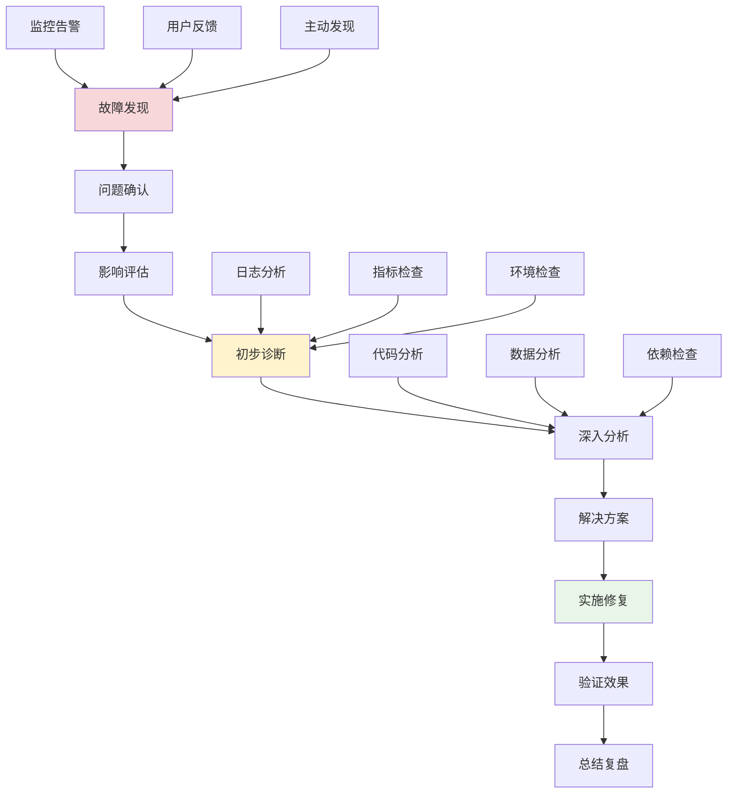

# 故障排查方法论

## 🎯 学习目标

通过本节学习，您将能够：
- 掌握系统性的故障排查方法
- 学会快速定位问题根因
- 了解常见故障类型和解决方案
- 掌握故障预防和应急响应技巧
- 建立有效的故障处理流程

## 📖 故障排查概述

故障排查是软件运维中的核心技能。一个系统性的故障排查方法论可以帮助我们快速定位问题、减少故障影响时间，并从故障中学习以预防类似问题的再次发生。

### 故障排查流程



## 🔧 Chat-Room故障排查实战

### 1. 故障分类和诊断框架

```python
"""
Chat-Room故障排查系统
"""

import time
import json
import logging
import traceback
from typing import Dict, List, Optional, Any, Callable
from dataclasses import dataclass, field
from enum import Enum
from datetime import datetime
import subprocess
import psutil


class IncidentSeverity(Enum):
    """故障严重程度"""
    CRITICAL = "critical"    # 系统完全不可用
    HIGH = "high"           # 核心功能受影响
    MEDIUM = "medium"       # 部分功能受影响
    LOW = "low"            # 轻微影响


class IncidentCategory(Enum):
    """故障类别"""
    NETWORK = "network"           # 网络问题
    DATABASE = "database"         # 数据库问题
    APPLICATION = "application"   # 应用程序问题
    INFRASTRUCTURE = "infrastructure"  # 基础设施问题
    SECURITY = "security"         # 安全问题
    PERFORMANCE = "performance"   # 性能问题


@dataclass
class Incident:
    """故障记录"""
    id: str
    title: str
    description: str
    severity: IncidentSeverity
    category: IncidentCategory
    status: str = "open"
    reporter: str = ""
    assignee: str = ""
    created_at: float = field(default_factory=time.time)
    updated_at: float = field(default_factory=time.time)
    resolved_at: Optional[float] = None
    
    # 故障详情
    symptoms: List[str] = field(default_factory=list)
    affected_components: List[str] = field(default_factory=list)
    timeline: List[Dict[str, Any]] = field(default_factory=list)
    root_cause: str = ""
    resolution: str = ""
    
    def add_timeline_entry(self, action: str, details: str = "", timestamp: float = None):
        """添加时间线条目"""
        if timestamp is None:
            timestamp = time.time()
        
        self.timeline.append({
            "timestamp": timestamp,
            "action": action,
            "details": details
        })
        self.updated_at = timestamp
    
    def to_dict(self) -> Dict[str, Any]:
        """转换为字典"""
        return {
            "id": self.id,
            "title": self.title,
            "description": self.description,
            "severity": self.severity.value,
            "category": self.category.value,
            "status": self.status,
            "reporter": self.reporter,
            "assignee": self.assignee,
            "created_at": self.created_at,
            "updated_at": self.updated_at,
            "resolved_at": self.resolved_at,
            "symptoms": self.symptoms,
            "affected_components": self.affected_components,
            "timeline": self.timeline,
            "root_cause": self.root_cause,
            "resolution": self.resolution
        }


class TroubleshootingToolkit:
    """故障排查工具包"""
    
    def __init__(self):
        self.logger = logging.getLogger(__name__)
    
    def check_system_health(self) -> Dict[str, Any]:
        """检查系统健康状态"""
        health_status = {
            "timestamp": time.time(),
            "overall_status": "healthy",
            "checks": {}
        }
        
        try:
            # CPU检查
            cpu_percent = psutil.cpu_percent(interval=1)
            health_status["checks"]["cpu"] = {
                "status": "healthy" if cpu_percent < 80 else "warning",
                "value": cpu_percent,
                "unit": "percent"
            }
            
            # 内存检查
            memory = psutil.virtual_memory()
            health_status["checks"]["memory"] = {
                "status": "healthy" if memory.percent < 85 else "warning",
                "value": memory.percent,
                "unit": "percent",
                "available_gb": memory.available / (1024**3)
            }
            
            # 磁盘检查
            disk = psutil.disk_usage('/')
            disk_percent = (disk.used / disk.total) * 100
            health_status["checks"]["disk"] = {
                "status": "healthy" if disk_percent < 90 else "warning",
                "value": disk_percent,
                "unit": "percent"
            }
            
            # 网络连接检查
            connections = len(psutil.net_connections())
            health_status["checks"]["network_connections"] = {
                "status": "healthy",
                "value": connections,
                "unit": "count"
            }
            
            # 进程检查
            processes = len(psutil.pids())
            health_status["checks"]["processes"] = {
                "status": "healthy",
                "value": processes,
                "unit": "count"
            }
            
        except Exception as e:
            health_status["overall_status"] = "error"
            health_status["error"] = str(e)
            self.logger.error(f"系统健康检查失败: {e}")
        
        # 确定整体状态
        if any(check.get("status") == "warning" for check in health_status["checks"].values()):
            health_status["overall_status"] = "warning"
        
        return health_status
    
    def check_application_health(self, app_config: Dict[str, Any]) -> Dict[str, Any]:
        """检查应用健康状态"""
        app_health = {
            "timestamp": time.time(),
            "overall_status": "healthy",
            "checks": {}
        }
        
        try:
            # 数据库连接检查
            db_status = self._check_database_connection(app_config.get("database", {}))
            app_health["checks"]["database"] = db_status
            
            # 端口监听检查
            port_status = self._check_port_listening(app_config.get("port", 8888))
            app_health["checks"]["port"] = port_status
            
            # 日志文件检查
            log_status = self._check_log_files(app_config.get("log_path", "logs/"))
            app_health["checks"]["logs"] = log_status
            
            # 配置文件检查
            config_status = self._check_config_files(app_config.get("config_files", []))
            app_health["checks"]["config"] = config_status
            
        except Exception as e:
            app_health["overall_status"] = "error"
            app_health["error"] = str(e)
            self.logger.error(f"应用健康检查失败: {e}")
        
        # 确定整体状态
        if any(check.get("status") in ["warning", "error"] for check in app_health["checks"].values()):
            app_health["overall_status"] = "warning"
        
        return app_health
    
    def _check_database_connection(self, db_config: Dict[str, Any]) -> Dict[str, Any]:
        """检查数据库连接"""
        try:
            import sqlite3
            db_path = db_config.get("path", "chatroom.db")
            
            conn = sqlite3.connect(db_path, timeout=5)
            cursor = conn.cursor()
            cursor.execute("SELECT 1")
            conn.close()
            
            return {"status": "healthy", "message": "数据库连接正常"}
        except Exception as e:
            return {"status": "error", "message": f"数据库连接失败: {e}"}
    
    def _check_port_listening(self, port: int) -> Dict[str, Any]:
        """检查端口监听状态"""
        try:
            connections = psutil.net_connections()
            listening = any(conn.laddr.port == port and conn.status == 'LISTEN' 
                          for conn in connections if conn.laddr)
            
            if listening:
                return {"status": "healthy", "message": f"端口 {port} 正在监听"}
            else:
                return {"status": "warning", "message": f"端口 {port} 未在监听"}
        except Exception as e:
            return {"status": "error", "message": f"端口检查失败: {e}"}
    
    def _check_log_files(self, log_path: str) -> Dict[str, Any]:
        """检查日志文件"""
        try:
            import os
            if os.path.exists(log_path):
                return {"status": "healthy", "message": "日志目录存在"}
            else:
                return {"status": "warning", "message": "日志目录不存在"}
        except Exception as e:
            return {"status": "error", "message": f"日志检查失败: {e}"}
    
    def _check_config_files(self, config_files: List[str]) -> Dict[str, Any]:
        """检查配置文件"""
        try:
            import os
            missing_files = [f for f in config_files if not os.path.exists(f)]
            
            if not missing_files:
                return {"status": "healthy", "message": "所有配置文件存在"}
            else:
                return {"status": "warning", "message": f"缺少配置文件: {missing_files}"}
        except Exception as e:
            return {"status": "error", "message": f"配置文件检查失败: {e}"}
    
    def analyze_logs(self, log_file: str, keywords: List[str] = None, 
                    lines: int = 100) -> Dict[str, Any]:
        """分析日志文件"""
        if keywords is None:
            keywords = ["error", "exception", "failed", "timeout", "connection"]
        
        analysis = {
            "file": log_file,
            "total_lines": 0,
            "error_lines": [],
            "keyword_matches": {},
            "recent_errors": []
        }
        
        try:
            with open(log_file, 'r', encoding='utf-8') as f:
                all_lines = f.readlines()
                analysis["total_lines"] = len(all_lines)
                
                # 分析最近的日志行
                recent_lines = all_lines[-lines:] if len(all_lines) > lines else all_lines
                
                for i, line in enumerate(recent_lines):
                    line_lower = line.lower()
                    
                    # 检查关键词
                    for keyword in keywords:
                        if keyword.lower() in line_lower:
                            if keyword not in analysis["keyword_matches"]:
                                analysis["keyword_matches"][keyword] = 0
                            analysis["keyword_matches"][keyword] += 1
                            
                            # 记录错误行
                            analysis["error_lines"].append({
                                "line_number": len(all_lines) - len(recent_lines) + i + 1,
                                "content": line.strip(),
                                "keyword": keyword
                            })
                
                # 提取最近的错误
                analysis["recent_errors"] = analysis["error_lines"][-10:]
                
        except Exception as e:
            analysis["error"] = f"日志分析失败: {e}"
        
        return analysis
    
    def network_diagnostics(self, target_host: str = "8.8.8.8", 
                          target_port: int = 53) -> Dict[str, Any]:
        """网络诊断"""
        diagnostics = {
            "timestamp": time.time(),
            "target": f"{target_host}:{target_port}",
            "tests": {}
        }
        
        try:
            # Ping测试
            ping_result = subprocess.run(
                ["ping", "-c", "3", target_host],
                capture_output=True,
                text=True,
                timeout=10
            )
            
            diagnostics["tests"]["ping"] = {
                "status": "success" if ping_result.returncode == 0 else "failed",
                "output": ping_result.stdout,
                "error": ping_result.stderr
            }
            
            # 端口连接测试
            import socket
            sock = socket.socket(socket.AF_INET, socket.SOCK_STREAM)
            sock.settimeout(5)
            
            try:
                result = sock.connect_ex((target_host, target_port))
                diagnostics["tests"]["port_connection"] = {
                    "status": "success" if result == 0 else "failed",
                    "result_code": result
                }
            finally:
                sock.close()
            
            # DNS解析测试
            try:
                import socket
                ip = socket.gethostbyname(target_host)
                diagnostics["tests"]["dns_resolution"] = {
                    "status": "success",
                    "resolved_ip": ip
                }
            except Exception as e:
                diagnostics["tests"]["dns_resolution"] = {
                    "status": "failed",
                    "error": str(e)
                }
            
        except Exception as e:
            diagnostics["error"] = f"网络诊断失败: {e}"
        
        return diagnostics


class IncidentManager:
    """故障管理器"""
    
    def __init__(self):
        self.incidents: Dict[str, Incident] = {}
        self.toolkit = TroubleshootingToolkit()
        self.logger = logging.getLogger(__name__)
    
    def create_incident(self, title: str, description: str, 
                       severity: IncidentSeverity, category: IncidentCategory,
                       reporter: str = "") -> str:
        """创建故障记录"""
        incident_id = f"INC-{int(time.time())}"
        
        incident = Incident(
            id=incident_id,
            title=title,
            description=description,
            severity=severity,
            category=category,
            reporter=reporter
        )
        
        incident.add_timeline_entry("故障创建", f"由 {reporter} 报告")
        
        self.incidents[incident_id] = incident
        self.logger.info(f"创建故障记录: {incident_id} - {title}")
        
        return incident_id
    
    def update_incident(self, incident_id: str, **updates) -> bool:
        """更新故障记录"""
        if incident_id not in self.incidents:
            return False
        
        incident = self.incidents[incident_id]
        
        for key, value in updates.items():
            if hasattr(incident, key):
                setattr(incident, key, value)
        
        incident.updated_at = time.time()
        
        # 记录更新到时间线
        update_details = ", ".join([f"{k}={v}" for k, v in updates.items()])
        incident.add_timeline_entry("故障更新", update_details)
        
        return True
    
    def resolve_incident(self, incident_id: str, resolution: str, 
                        root_cause: str = "") -> bool:
        """解决故障"""
        if incident_id not in self.incidents:
            return False
        
        incident = self.incidents[incident_id]
        incident.status = "resolved"
        incident.resolution = resolution
        incident.root_cause = root_cause
        incident.resolved_at = time.time()
        
        incident.add_timeline_entry("故障解决", resolution)
        
        self.logger.info(f"故障已解决: {incident_id}")
        return True
    
    def run_diagnostics(self, incident_id: str) -> Dict[str, Any]:
        """运行诊断"""
        if incident_id not in self.incidents:
            return {"error": "故障记录不存在"}
        
        incident = self.incidents[incident_id]
        
        diagnostics = {
            "incident_id": incident_id,
            "timestamp": time.time(),
            "system_health": self.toolkit.check_system_health(),
            "application_health": self.toolkit.check_application_health({}),
            "network_diagnostics": self.toolkit.network_diagnostics()
        }
        
        # 根据故障类别运行特定诊断
        if incident.category == IncidentCategory.DATABASE:
            # 数据库特定诊断
            pass
        elif incident.category == IncidentCategory.NETWORK:
            # 网络特定诊断
            pass
        
        # 更新故障记录
        incident.add_timeline_entry("运行诊断", "系统诊断完成")
        
        return diagnostics
    
    def generate_incident_report(self, incident_id: str) -> str:
        """生成故障报告"""
        if incident_id not in self.incidents:
            return "故障记录不存在"
        
        incident = self.incidents[incident_id]
        
        report = f"""
=== 故障报告 ===

故障ID: {incident.id}
标题: {incident.title}
严重程度: {incident.severity.value}
类别: {incident.category.value}
状态: {incident.status}

报告人: {incident.reporter}
负责人: {incident.assignee}
创建时间: {datetime.fromtimestamp(incident.created_at).strftime('%Y-%m-%d %H:%M:%S')}
解决时间: {datetime.fromtimestamp(incident.resolved_at).strftime('%Y-%m-%d %H:%M:%S') if incident.resolved_at else '未解决'}

故障描述:
{incident.description}

症状:
{chr(10).join(['• ' + symptom for symptom in incident.symptoms])}

受影响组件:
{chr(10).join(['• ' + component for component in incident.affected_components])}

根本原因:
{incident.root_cause}

解决方案:
{incident.resolution}

时间线:
"""
        
        for entry in incident.timeline:
            timestamp = datetime.fromtimestamp(entry["timestamp"]).strftime('%H:%M:%S')
            report += f"{timestamp} - {entry['action']}: {entry['details']}\n"
        
        return report
    
    def get_incident_statistics(self) -> Dict[str, Any]:
        """获取故障统计"""
        total_incidents = len(self.incidents)
        resolved_incidents = len([i for i in self.incidents.values() if i.status == "resolved"])
        
        # 按严重程度统计
        severity_stats = {}
        for severity in IncidentSeverity:
            count = len([i for i in self.incidents.values() if i.severity == severity])
            severity_stats[severity.value] = count
        
        # 按类别统计
        category_stats = {}
        for category in IncidentCategory:
            count = len([i for i in self.incidents.values() if i.category == category])
            category_stats[category.value] = count
        
        # 平均解决时间
        resolved_times = []
        for incident in self.incidents.values():
            if incident.resolved_at:
                resolution_time = incident.resolved_at - incident.created_at
                resolved_times.append(resolution_time)
        
        avg_resolution_time = sum(resolved_times) / len(resolved_times) if resolved_times else 0
        
        return {
            "total_incidents": total_incidents,
            "resolved_incidents": resolved_incidents,
            "resolution_rate": resolved_incidents / total_incidents if total_incidents > 0 else 0,
            "severity_distribution": severity_stats,
            "category_distribution": category_stats,
            "average_resolution_time_hours": avg_resolution_time / 3600
        }


# 实战演示
def demonstrate_troubleshooting():
    """演示故障排查"""
    print("=== Chat-Room故障排查演示 ===")
    
    # 1. 创建故障管理器
    incident_manager = IncidentManager()
    
    # 2. 模拟故障报告
    incident_id = incident_manager.create_incident(
        title="用户无法发送消息",
        description="多个用户反馈无法发送聊天消息，点击发送按钮无响应",
        severity=IncidentSeverity.HIGH,
        category=IncidentCategory.APPLICATION,
        reporter="用户支持团队"
    )
    
    print(f"创建故障记录: {incident_id}")
    
    # 3. 更新故障信息
    incident_manager.update_incident(incident_id, 
                                   assignee="开发团队",
                                   symptoms=["发送按钮无响应", "消息不显示在聊天窗口"],
                                   affected_components=["消息发送模块", "WebSocket连接"])
    
    # 4. 运行诊断
    print("\n运行系统诊断...")
    diagnostics = incident_manager.run_diagnostics(incident_id)
    
    print("系统健康状态:")
    system_health = diagnostics["system_health"]
    print(f"  整体状态: {system_health['overall_status']}")
    for check_name, check_result in system_health["checks"].items():
        print(f"  {check_name}: {check_result['status']} ({check_result['value']}{check_result['unit']})")
    
    # 5. 解决故障
    incident_manager.resolve_incident(
        incident_id,
        resolution="重启WebSocket服务，修复连接池配置问题",
        root_cause="WebSocket连接池配置错误，导致连接耗尽"
    )
    
    # 6. 生成报告
    print("\n" + incident_manager.generate_incident_report(incident_id))
    
    # 7. 统计信息
    stats = incident_manager.get_incident_statistics()
    print(f"\n故障统计:")
    print(f"  总故障数: {stats['total_incidents']}")
    print(f"  解决率: {stats['resolution_rate']:.1%}")
    print(f"  平均解决时间: {stats['average_resolution_time_hours']:.2f} 小时")


if __name__ == "__main__":
    demonstrate_troubleshooting()
```

## 📊 常见故障模式

### Chat-Room典型故障场景

```python
"""
Chat-Room常见故障场景和解决方案
"""

COMMON_ISSUES = {
    "connection_timeout": {
        "symptoms": ["用户连接超时", "频繁断线重连"],
        "possible_causes": [
            "网络不稳定",
            "服务器负载过高", 
            "防火墙配置问题",
            "客户端网络问题"
        ],
        "diagnostic_steps": [
            "检查服务器CPU和内存使用率",
            "检查网络连接质量",
            "查看服务器日志中的连接错误",
            "测试不同网络环境下的连接"
        ],
        "solutions": [
            "优化服务器性能",
            "调整连接超时参数",
            "实现连接重试机制",
            "检查防火墙配置"
        ]
    },
    
    "message_delivery_failure": {
        "symptoms": ["消息发送失败", "消息丢失", "消息重复"],
        "possible_causes": [
            "数据库连接问题",
            "消息队列故障",
            "网络传输错误",
            "客户端状态异常"
        ],
        "diagnostic_steps": [
            "检查数据库连接状态",
            "查看消息处理日志",
            "验证消息序列化/反序列化",
            "检查客户端连接状态"
        ],
        "solutions": [
            "修复数据库连接问题",
            "实现消息确认机制",
            "添加消息重试逻辑",
            "优化错误处理"
        ]
    },
    
    "performance_degradation": {
        "symptoms": ["响应时间变长", "系统卡顿", "内存使用增长"],
        "possible_causes": [
            "内存泄漏",
            "数据库查询效率低",
            "并发处理瓶颈",
            "资源竞争"
        ],
        "diagnostic_steps": [
            "监控内存使用趋势",
            "分析慢查询日志",
            "检查线程池状态",
            "进行性能压测"
        ],
        "solutions": [
            "修复内存泄漏",
            "优化数据库查询",
            "调整并发参数",
            "实现资源池化"
        ]
    }
}
```

## 📋 学习检查清单

完成本节学习后，请确认您能够：

- [ ] **故障识别**：快速识别和分类不同类型的故障
- [ ] **诊断工具**：熟练使用各种诊断和监控工具
- [ ] **根因分析**：系统性地分析问题根本原因
- [ ] **解决方案**：制定和实施有效的解决方案
- [ ] **文档记录**：完整记录故障处理过程
- [ ] **预防措施**：从故障中学习并建立预防机制
- [ ] **应急响应**：建立高效的应急响应流程

## 🚀 下一步

完成故障排查方法论学习后，请继续学习：
- [应急响应处理](emergency-response-handling.md) - 建立应急响应机制
- [监控告警体系](monitoring-alerting-system.md) - 完善监控告警系统

---

**系统性的故障排查能力是高级工程师的核心技能！** 🔧
