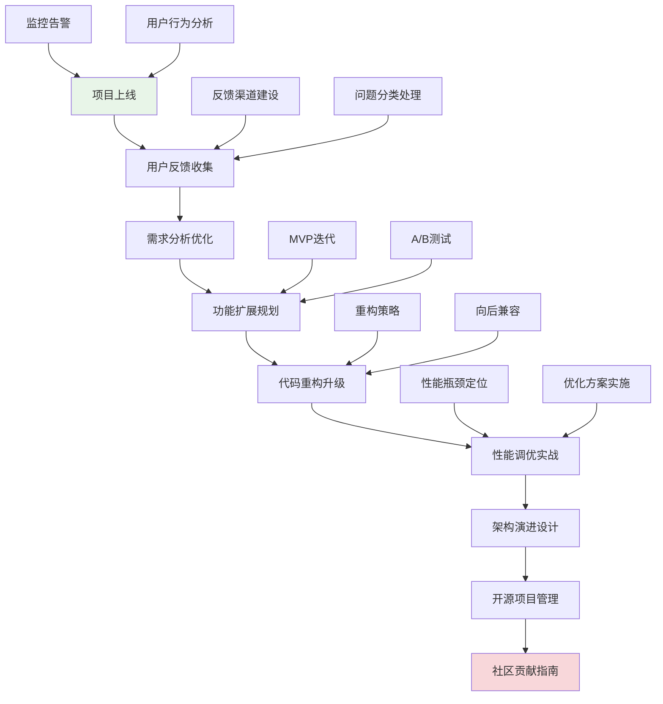

# 第18章：进阶实战项目

## 🎯 学习目标

通过本章学习，您将能够：
- 掌握项目上线后的持续演进策略
- 学会处理用户反馈和需求变更
- 了解代码重构和架构升级的方法
- 掌握性能调优的实战技巧
- 学会开源项目的管理和贡献方式

## 📖 本章概览

本章是整个学习路径的最高级阶段，专注于Chat-Room项目上线后的持续改进和演进。我们将从实际的生产环境问题出发，学习如何处理真实世界中的复杂挑战，包括功能扩展、性能优化、用户反馈处理等高级主题。

### 学习路径

## 📚 章节内容

### 1. [功能扩展和优化策略](feature-optimization.md)
**学习时间：** 8-10小时  
**难度等级：** ⭐⭐⭐⭐⭐

学习内容：
- 用户需求分析和功能规划
- MVP（最小可行产品）迭代策略
- A/B测试和灰度发布
- 功能开关和配置管理

**实战项目：** Chat-Room功能扩展规划和实施

### 2. [代码重构和架构演进](code-refactoring.md)
**学习时间：** 10-12小时  
**难度等级：** ⭐⭐⭐⭐⭐

学习内容：
- 重构的时机和策略选择
- 大规模代码重构的安全实践
- 架构演进的渐进式方法
- 向后兼容性保证

**实战项目：** Chat-Room架构升级和代码重构

### 3. [性能调优实战案例](tuning-case.md)
**学习时间：** 8-10小时  
**难度等级：** ⭐⭐⭐⭐⭐

学习内容：
- 真实性能问题的诊断方法
- 系统瓶颈的定位和分析
- 优化方案的设计和实施
- 性能监控和持续改进

**实战项目：** Chat-Room性能优化实战

### 4. [生产环境问题排查](troubleshooting-production.md)
**学习时间：** 6-8小时  
**难度等级：** ⭐⭐⭐⭐

学习内容：
- 生产环境问题的快速定位
- 日志分析和错误追踪
- 应急响应和故障恢复
- 事后分析和改进措施

**实战项目：** 模拟生产环境故障处理

### 5. [用户反馈处理和迭代](user-feedback.md)
**学习时间：** 6-8小时  
**难度等级：** ⭐⭐⭐⭐

学习内容：
- 用户反馈收集渠道建设
- 反馈分类和优先级排序
- 快速响应和问题解决
- 用户体验持续改进

**实战项目：** Chat-Room用户反馈系统

### 6. [开源项目贡献指南](contributing-guide.md)
**学习时间：** 4-6小时  
**难度等级：** ⭐⭐⭐

学习内容：
- 开源项目的管理和维护
- 社区建设和贡献者指导
- 代码审查和质量控制
- 开源协议和法律问题

**实战项目：** 将Chat-Room项目开源化

## 🔧 前置知识要求

- **完整项目经验：** 已完成前17章的学习和实践
- **生产环境理解：** 了解软件部署和运维基础
- **问题解决能力：** 具备独立分析和解决复杂问题的能力
- **团队协作经验：** 理解多人协作开发的流程和规范

## ⏱️ 预计学习时间

| 内容 | 预计时间 | 累计时间 |
|------|----------|----------|
| 功能扩展优化 | 8-10小时 | 8-10小时 |
| 代码重构演进 | 10-12小时 | 18-22小时 |
| 性能调优实战 | 8-10小时 | 26-32小时 |
| 生产问题排查 | 6-8小时 | 32-40小时 |
| 用户反馈处理 | 6-8小时 | 38-48小时 |
| 开源项目贡献 | 4-6小时 | 42-54小时 |
| **总计** | **42-54小时** | **7-9天** |

## 📋 学习顺序建议

### 第1-2天：项目演进规划
1. **功能扩展优化** - 学习需求分析和功能规划
2. **代码重构演进** - 掌握架构升级方法

### 第3-4天：性能优化实战
3. **性能调优实战** - 解决真实性能问题
4. **生产问题排查** - 提高故障处理能力

### 第5-6天：用户体验改进
5. **用户反馈处理** - 建立用户反馈循环
6. **持续改进实践** - 形成迭代优化流程

### 第7天：开源化实践
7. **开源项目贡献** - 学习开源项目管理
8. **社区建设** - 了解开源社区运营

## ✅ 学习检查清单

### 项目管理能力
- [ ] 能够制定合理的功能扩展计划
- [ ] 掌握MVP迭代和A/B测试方法
- [ ] 理解用户需求分析和优先级排序
- [ ] 会使用项目管理工具和方法

### 技术架构能力
- [ ] 能够识别代码重构的时机
- [ ] 掌握安全重构的方法和工具
- [ ] 理解架构演进的渐进式策略
- [ ] 会保证系统的向后兼容性

### 性能优化能力
- [ ] 能够定位和分析性能瓶颈
- [ ] 掌握多种性能优化技术
- [ ] 会设计性能监控和告警系统
- [ ] 理解性能优化的权衡和取舍

### 问题解决能力
- [ ] 能够快速定位生产环境问题
- [ ] 掌握日志分析和错误追踪技巧
- [ ] 会制定应急响应和恢复计划
- [ ] 能够进行事后分析和改进

### 用户体验能力
- [ ] 能够建设用户反馈收集渠道
- [ ] 掌握用户反馈分析和处理方法
- [ ] 会设计用户体验改进方案
- [ ] 理解用户行为分析和数据驱动决策

### 开源协作能力
- [ ] 了解开源项目的管理流程
- [ ] 掌握代码审查和质量控制方法
- [ ] 会编写清晰的贡献指南和文档
- [ ] 理解开源协议和社区建设

## 🎯 综合实战项目

### Chat-Room 2.0 升级项目
在本章学习过程中，您将参与一个完整的项目升级实战：

1. **需求调研阶段：** 收集用户反馈，分析功能需求
2. **架构设计阶段：** 设计新架构，制定重构计划
3. **开发实施阶段：** 实现新功能，重构旧代码
4. **性能优化阶段：** 定位瓶颈，实施优化方案
5. **测试验证阶段：** 全面测试，确保质量
6. **上线部署阶段：** 灰度发布，监控反馈
7. **持续改进阶段：** 收集数据，持续优化

### 项目成果展示
- 完整的Chat-Room 2.0版本
- 详细的架构升级文档
- 性能优化报告和对比数据
- 用户反馈处理流程和工具
- 开源项目管理规范

## 🚨 学习难点和解决方案

### 常见难点
1. **需求分析的复杂性**
   - 解决方案：学习用户研究方法，使用数据驱动决策
   - 重点理解：用户真实需求vs表达需求的差异

2. **大规模重构的风险控制**
   - 解决方案：采用渐进式重构，完善测试覆盖
   - 重点理解：重构的安全边界和回滚策略

3. **性能优化的权衡取舍**
   - 解决方案：建立性能基准，量化优化效果
   - 重点理解：性能、可维护性、开发成本的平衡

4. **生产环境问题的紧急性**
   - 解决方案：建立标准化的故障处理流程
   - 重点理解：快速定位、临时修复、根本解决的策略

### 学习技巧
- **实战导向：** 所有学习都要结合实际项目进行
- **数据驱动：** 用数据支撑决策，避免主观判断
- **持续改进：** 建立反馈循环，不断优化和改进
- **团队协作：** 模拟真实团队环境，练习协作技能

## 📚 下一步发展

完成本章学习后，您可以考虑以下发展方向：
- **技术专家路线：** 深入特定技术领域，成为技术专家
- **架构师路线：** 学习系统架构设计，成为解决方案架构师
- **产品经理路线：** 学习产品管理，从技术转向产品
- **团队管理路线：** 学习团队管理，成为技术团队负责人
- **创业路线：** 利用技术能力，开始自己的创业项目

## 🏆 学习成就

完成本章学习后，您将获得：
- **高级项目管理能力**：能够独立管理复杂的技术项目
- **架构设计能力**：能够设计和演进大型系统架构
- **性能优化专长**：成为性能优化方面的专家
- **问题解决专家**：具备解决复杂技术问题的能力
- **开源贡献者**：能够参与和管理开源项目

---

**恭喜您即将完成Chat-Room学习之旅的最后一章！这里是技术成长的新起点！** 🚀

*本章最后更新：2025-01-17*
