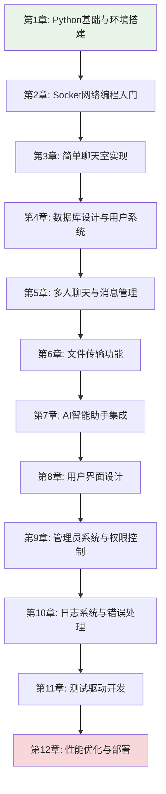

# Chat-Room 渐进式学习文档系统 v2.0

## 🎯 学习目标

本文档系统专为编程初学者设计，通过Chat-Room项目实现从零基础到高级开发的完整学习路径。

### 核心技能培养
- **Python编程**：从基础语法到高级特性（装饰器、异步编程、面向对象设计）
- **Socket网络编程**：从TCP基础通信到高性能网络架构设计
- **数据库技术**：从基本CRUD操作到数据库设计模式和性能优化
- **高级开发技能**：loguru日志系统、设计模式、测试驱动开发、用户界面设计

## 📚 学习路径设计



## 🏗️ 文档结构

```
docs/learning-v02/
├── README.md                    # 本文件 - 学习路径总览
├── 00-preparation/              # 准备工作
│   ├── environment-setup.md     # 开发环境搭建
│   ├── project-overview.md      # 项目整体介绍
│   └── learning-guide.md        # 学习方法指导
├── 01-python-basics/            # 第1章：Python基础
│   ├── syntax-fundamentals.md   # Python语法基础
│   ├── data-structures.md       # 数据结构详解
│   ├── functions-modules.md     # 函数与模块
│   └── oop-basics.md           # 面向对象编程基础
├── 02-socket-programming/       # 第2章：Socket网络编程
│   ├── network-concepts.md      # 网络编程概念
│   ├── tcp-basics.md           # TCP协议基础
│   ├── socket-api.md           # Socket API详解
│   └── simple-client-server.md # 简单客户端-服务器
├── 03-simple-chat/             # 第3章：简单聊天室
│   ├── protocol-design.md       # 通信协议设计
│   ├── message-handling.md      # 消息处理机制
│   ├── threading-basics.md      # 多线程编程基础
│   └── error-handling.md       # 错误处理策略
├── 04-database-user-system/    # 第4章：数据库与用户系统
│   ├── sqlite-basics.md         # SQLite数据库基础
│   ├── database-design.md       # 数据库设计原理
│   ├── user-authentication.md   # 用户认证系统
│   └── data-models.md          # 数据模型设计
├── 05-multi-user-chat/         # 第5章：多人聊天
│   ├── chat-groups.md           # 聊天组管理
│   ├── message-routing.md       # 消息路由机制
│   ├── concurrent-handling.md   # 并发处理
│   └── state-management.md     # 状态管理
├── 06-file-transfer/           # 第6章：文件传输
│   ├── file-protocol.md         # 文件传输协议
│   ├── chunked-transfer.md      # 分块传输技术
│   ├── progress-tracking.md     # 进度跟踪
│   └── security-validation.md  # 安全验证
├── 07-ai-integration/          # 第7章：AI集成
│   ├── api-integration.md       # API集成基础
│   ├── glm4-flash.md           # GLM-4-Flash使用
│   ├── context-management.md    # 上下文管理
│   └── async-processing.md     # 异步处理
├── 08-user-interface/          # 第8章：用户界面
│   ├── tui-concepts.md          # TUI界面概念
│   ├── textual-framework.md     # Textual框架
│   ├── component-design.md      # 组件化设计
│   └── theme-system.md         # 主题系统
├── 09-admin-system/            # 第9章：管理员系统
│   ├── permission-model.md      # 权限模型设计
│   ├── command-system.md        # 命令系统
│   ├── crud-operations.md       # CRUD操作
│   └── security-measures.md    # 安全措施
├── 10-logging-errors/          # 第10章：日志与错误处理
│   ├── loguru-system.md         # Loguru日志系统
│   ├── error-strategies.md      # 错误处理策略
│   ├── debugging-techniques.md  # 调试技巧
│   └── monitoring.md           # 监控与诊断
├── 11-testing/                 # 第11章：测试驱动开发
│   ├── testing-concepts.md      # 测试概念
│   ├── pytest-framework.md     # pytest框架
│   ├── mock-testing.md         # Mock测试
│   └── tdd-practice.md         # TDD实践
├── 12-optimization-deployment/ # 第12章：优化与部署
│   ├── performance-tuning.md    # 性能调优
│   ├── memory-management.md     # 内存管理
│   ├── deployment-strategies.md # 部署策略
│   └── monitoring-production.md # 生产监控
└── appendix/                   # 附录
    ├── code-examples/           # 完整代码示例
    ├── exercises/               # 练习题库
    ├── troubleshooting.md       # 故障排除
    └── resources.md            # 学习资源
```

## 🎓 学习特色

### 1. 渐进式学习架构
- 每个章节都是一个可独立运行的完整功能模块
- 学习路径：基础语法 → 简单通信 → 多人聊天 → 权限管理 → 文件传输 → AI集成 → 高级优化
- 每章结束后学习者都能看到具体的运行效果，获得即时成就感

### 2. 代码集成度
- 所有示例代码直接来自Chat-Room项目的实际实现
- 确保学习内容与真实项目完全一致
- 提供完整的代码演进过程

### 3. 可视化教学
- 大量使用Mermaid图表展示程序流程、数据结构、网络通信时序、系统架构、类关系
- 图文并茂，降低理解难度
- 复杂概念用图表辅助说明

### 4. 中文注释规范
- 所有代码片段包含详细的中文注释
- 解释"为什么这样设计"而不仅仅是"做了什么"
- 设计思路和实现细节并重

## ⏱️ 学习时间安排

| 章节 | 预计学习时间 | 难度等级 | 前置要求 |
|------|-------------|----------|----------|
| 第1章 | 3-5天 | ⭐ | 无 |
| 第2章 | 5-7天 | ⭐⭐ | Python基础 |
| 第3章 | 7-10天 | ⭐⭐⭐ | Socket基础 |
| 第4章 | 5-7天 | ⭐⭐ | Python基础 |
| 第5章 | 7-10天 | ⭐⭐⭐ | 数据库基础 |
| 第6章 | 5-7天 | ⭐⭐⭐ | 网络编程 |
| 第7章 | 3-5天 | ⭐⭐ | API使用 |
| 第8章 | 7-10天 | ⭐⭐⭐⭐ | UI设计概念 |
| 第9章 | 5-7天 | ⭐⭐⭐ | 权限概念 |
| 第10章 | 3-5天 | ⭐⭐ | 调试经验 |
| 第11章 | 7-10天 | ⭐⭐⭐⭐ | 编程经验 |
| 第12章 | 5-7天 | ⭐⭐⭐⭐⭐ | 系统知识 |

**总计学习时间：2-3个月（每天2-3小时）**

## 🚀 快速开始

1. **环境准备**：阅读 `00-preparation/environment-setup.md`
2. **项目概览**：了解 `00-preparation/project-overview.md`
3. **学习方法**：掌握 `00-preparation/learning-guide.md`
4. **开始学习**：从第1章开始，按顺序学习

## 📋 学习检查清单

每章学习完成后，请确认以下内容：

- [ ] 理解本章核心概念
- [ ] 能够运行所有代码示例
- [ ] 完成章节练习题
- [ ] 能够解释设计思路
- [ ] 可以独立实现类似功能

## 🤝 学习支持

- **代码示例**：所有代码都可以在项目中找到对应实现
- **练习题库**：每章提供配套练习，巩固学习效果
- **故障排除**：常见问题解答和调试指导
- **学习资源**：推荐的扩展阅读和参考资料

## 📈 学习成果

完成本学习路径后，您将能够：

1. **独立开发**网络应用程序
2. **设计和实现**数据库系统
3. **构建现代化**用户界面
4. **集成第三方**API服务
5. **编写高质量**的测试代码
6. **优化应用**性能和部署

---

**开始您的Chat-Room学习之旅吧！** 🚀
