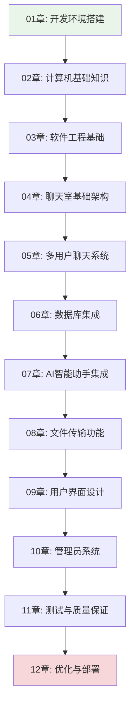

# Chat-Room 渐进式学习文档系统 v2.0

## 🎯 学习目标

本文档系统专为编程初学者设计，通过Chat-Room项目实现从零基础到高级开发的完整学习路径。

### 核心技能培养
- **Python编程**：从基础语法到高级特性（装饰器、异步编程、面向对象设计）
- **Socket网络编程**：从TCP基础通信到高性能网络架构设计
- **数据库技术**：从基本CRUD操作到数据库设计模式和性能优化
- **高级开发技能**：loguru日志系统、设计模式、测试驱动开发、用户界面设计

## 📚 学习路径设计



## 🏗️ 文档结构

```
docs/learning-v02/
├── README.md                                      # 学习路径总览
├── 00-overview/                                 # 准备工作
│   ├── environment-setup.md                       # 开发环境搭建
│   ├── project-overview.md                        # 项目整体介绍
│   └── learning-guide.md                          # 学习方法指导
├── 01-python-basics/                            # Python编程基础
│   ├── python-syntax-fundamentals.md              # Python语法基础
│   ├── functions-modules.md                       # 函数和模块系统
│   ├── object-oriented-programming.md             # 面向对象编程基础
│   ├── exception-handling.md                      # 异常处理基础
│   ├── file-io.md                                 # 文件操作和I/O
│   └── builtin-libraries.md                       # 常用内置库介绍
├── 02-development-environment/                  # 开发环境配置
│   ├── python-installation.md                     # Python安装和版本管理
│   ├── ide-configuration.md                       # IDE选择和配置
│   ├── virtual-environments.md                    # 虚拟环境管理
│   ├── package-management.md                      # 包管理工具（pip/uvx）
│   ├── git-basics.md                              # Git版本控制基础
│   └── debugging-tools.md                         # 调试工具和技巧
├── 03-computer-fundamentals/                    # 计算机基础
│   ├── network-fundamentals.md                    # 网络基础原理（重点）
│   ├── operating-systems.md                       # 操作系统基础
│   ├── database-data-structures.md                # 数据结构和数据库基础
│   ├── encoding-and-charset.md                    # 编码和字符集
│   └── security-basics.md                         # TODO 安全基础概念
├── 04-software-engineering/                     # 软件工程
│   ├── requirements-analysis.md                   # 项目需求分析和设计
│   ├── socket-basics.md                           # 最简单的Socket通信实现
│   ├── system-architecture.md                     # 客户端-服务器架构
│   ├── message-protocol.md                        # 消息收发功能
│   ├── error-handling.md                          # 错误处理
│   └── project-organization.md                    # 项目结构组织
├── 05-chatroom-basics/                          # 简单聊天室原型
│   ├── requirements-analysis.md                   # 项目需求分析和设计
│   ├── socket-basic-demo.md                       # 最简单的Socket通信实现
│   ├── basic-architecture.md                      # 基础客户端-服务器架构
│   ├── message-exchange.md                        # 简单的消息收发功能
│   ├── basic-error-handling.md                    # 基础的错误处理
│   └── structure-overview.md                      # 项目结构组织
├── 06-socket-programming/                       # Socket网络编程
│   ├── network-concepts.md                        # 网络编程概念
│   ├── tcp-basics.md                              # TCP协议基础
│   ├── socket-api.md                              # Socket API详解
├── 07-simple-chat/                              # 简单聊天室
│   ├── protocol-design.md                         # 通信协议设计
│   ├── message-handling.md                        # 消息处理机制
│   ├── threading-basics.md                        # 多线程编程基础
│   └── error-handling.md                          # 错误处理策略
│   └── simple-client-server.md                    # 简单客户端-服务器
├── 08-database-user-system/                     # 数据库与用户系统
│   ├── sqlite-basics.md                           # SQLite数据库基础
│   ├── database-design.md                         # 数据库设计原理
│   ├── user-authentication.md                     # 用户认证系统
│   └── data-models.md                             # 数据模型设计
├── 09-multi-user-chat/                          # 多人聊天
│   ├── group-management.md                        # 聊天组管理
│   ├── message-routing.md                         # 消息路由机制
│   ├── concurrent-handling.md                     # 并发处理
│   └── state-management.md                        # 状态管理
├── 10-file-transfer/                            # 文件传输
│   ├── file-protocol.md                           # 文件传输协议
│   ├── chunked-transfer.md                        # 分块传输技术
│   ├── progress-tracking.md                       # 进度跟踪
│   └── security-validation.md                     # 安全验证
├── 11-ai-integration/                           # AI集成
│   ├── api-integration.md                         # API集成基础
│   ├── glm-4-flash-features.md                    # GLM-4-Flash使用
│   ├── context-management.md                      # 上下文管理
│   └── async-processing.md                        # 异步处理
├── 12-user-interface/                           # 用户界面
│   ├── tui-concepts.md                            # TUI界面概念
│   ├── textual-framework.md                       # Textual框架
│   ├── component-design.md                        # 组件化设计
│   └── theme-system.md                            # 主题系统
├── 13-admin-system/                             # 管理员系统
│   ├── permission-model.md                        # 权限模型设计
│   ├── command-system.md                          # 命令系统
│   ├── crud-operations.md                         # CRUD操作
│   └── security-measures.md                       # 安全措施
├── 14-logging-error-handling/                   # 日志与错误处理
│   ├── loguru-system.md                           # Loguru日志系统
│   ├── error-strategies.md                        # 错误处理策略
│   ├── debugging-techniques.md                    # 调试技巧
│   └── monitoring-diagnostics.md                  # 监控与诊断
├── 15-testing-quality/                          # 测试驱动开发
│   ├── tdd-practices.md                           # TDD实践
│   ├── pytest-framework.md                        # pytest框架
│   ├── unit-testing.md                            # 单元测试
│   ├── integration-testing.md                     # 集成测试
│   ├── test-coverage.md                           # 测试覆盖率
│   └── mock-testing.md                            # TODO Mock测试
├── 16-optimization-deployment/                  # 优化与部署
│   ├── performance-optimization.md                # 性能调优
│   ├── monitoring-operations.md                   # 监控运维
│   ├── containerization-deployment.md             # 容器部署
│   ├── cicd-automation.md                         # 持续集成与部署
│   └── deployment-strategies.md                   # TODO 部署策略
├── 17-advanced-project-practice/                # 高级项目实践
│   ├── feature-optimization.md                    # 功能扩展和优化策略
│   ├── feature-planning-analysis.md               # 功能扩展与规划
│   ├── performance-bottleneck-identification.md   # 性能瓶颈定位
│   └── troubleshooting-methodology.md             # 生产环境问题排查
└── appendix/                                   # 附录资源
    ├── code-examples/                             # 代码示例库
    ├── exercises/                                 # 练习题库
    ├── troubleshooting.md                         # 故障排除指南
    └── resources.md                               # 学习资源推荐
```

## 🎓 学习特色

### 1. 渐进式学习架构
- 每个章节都是一个可独立运行的完整功能模块
- 学习路径：基础语法 → 简单通信 → 多人聊天 → 权限管理 → 文件传输 → AI集成 → 高级优化
- 每章结束后学习者都能看到具体的运行效果，获得即时成就感

### 2. 代码集成度
- 所有示例代码直接来自Chat-Room项目的实际实现
- 确保学习内容与真实项目完全一致
- 提供完整的代码演进过程

### 3. 可视化教学
- 大量使用Mermaid图表展示程序流程、数据结构、网络通信时序、系统架构、类关系
- 图文并茂，降低理解难度
- 复杂概念用图表辅助说明

### 4. 中文注释规范
- 所有代码片段包含详细的中文注释
- 解释"为什么这样设计"而不仅仅是"做了什么"
- 设计思路和实现细节并重

## ⏱️ 学习时间安排

| 章节 | 预计学习时间 | 难度等级 | 前置要求 |
|------|-------------|----------|----------|
| 01章 | 3-5天 | ⭐ | 无 |
| 02章 | 5-7天 | ⭐⭐ | 基础编程概念 |
| 03章 | 7-10天 | ⭐⭐⭐ | Python基础 |
| 04章 | 7-10天 | ⭐⭐⭐ | Socket基础 |
| 05章 | 7-10天 | ⭐⭐⭐⭐ | 网络编程 |
| 06章 | 5-7天 | ⭐⭐⭐ | 数据库概念 |
| 07章 | 3-5天 | ⭐⭐ | API使用 |
| 08章 | 5-7天 | ⭐⭐⭐ | 文件操作 |
| 09章 | 7-10天 | ⭐⭐⭐⭐ | UI设计概念 |
| 10章 | 5-7天 | ⭐⭐⭐ | 权限概念 |
| 11章 | 7-10天 | ⭐⭐⭐⭐ | 编程经验 |
| 12章 | 5-7天 | ⭐⭐⭐⭐⭐ | 系统知识 |

**总计学习时间：2-3个月（每天2-3小时）**

## 🚀 快速开始

1. **环境准备**：阅读 [环境搭建指南](00-overview/environment-setup.md)
2. **项目概览**：了解 [项目整体介绍](00-overview/project-overview.md)
3. **学习方法**：掌握 [学习方法指导](00-overview/learning-guide.md)
4. **开始学习**：从第1章开始，按顺序学习

## 📖 完整学习索引

### [第0章：学习准备工作](00-overview/README.md)
- [环境搭建](00-overview/environment-setup.md) - 开发环境配置
- [项目概览](00-overview/project-overview.md) - 项目整体介绍
- [学习方法](00-overview/learning-guide.md) - 学习方法指导

### [第1章：Python编程基础](01-python-basics/README.md)
- [Python语法基础](01-python-basics/syntax-fundamentals.md) - 语言基础语法
- [数据结构](01-python-basics/data-structures.md) - 列表、字典等数据结构
- [函数和模块](01-python-basics/functions-modules.md) - 函数定义和模块组织
- [面向对象编程](01-python-basics/oop-basics.md) - 类和对象基础
- [异常处理基础](01-python-basics/exception-handling.md) - 错误处理机制
- [文件操作和I/O](01-python-basics/file-io.md) - 文件读写操作
- [常用内置库](01-python-basics/builtin-libraries.md) - Python标准库介绍

### [第2章：开发环境配置](02-development-environment/README.md)
- [Python安装和版本管理](02-development-environment/python-installation.md)
- [IDE选择和配置](02-development-environment/ide-configuration.md)
- [虚拟环境管理](02-development-environment/virtual-environments.md)
- [包管理工具](02-development-environment/package-management.md) - pip/uv等工具
- [Git版本控制基础](02-development-environment/git-basics.md)
- [调试工具和技巧](02-development-environment/debugging-tools.md)

### [第3章：计算机基础知识](03-computer-fundamentals/README.md)
- [网络基础原理](03-computer-fundamentals/network-fundamentals.md) - 重点学习
- [操作系统基础](03-computer-fundamentals/operating-systems.md)
- [数据结构和数据库基础](03-computer-fundamentals/database-data-structures.md)
- [编码和字符集](03-computer-fundamentals/encoding-and-charset.md) - 字符编码处理
- [安全基础概念](03-computer-fundamentals/security-basics.md) - 信息安全基础

### [第4章：软件工程基础](04-software-engineering/README.md)
- [项目需求分析和设计](04-software-engineering/requirements-analysis.md)
- [最简单的Socket通信实现](04-software-engineering/socket-basics.md)
- [客户端-服务器架构](04-software-engineering/system-architecture.md)
- [消息收发功能](04-software-engineering/message-protocol.md)
- [错误处理](04-software-engineering/error-handling.md)
- [项目结构组织](04-software-engineering/project-organization.md)

### [第5章：Chat-Room项目入门](05-chatroom-basics/README.md)
- [项目需求分析和设计](05-chatroom-basics/requirements-analysis.md)
- [最简单的Socket通信实现](05-chatroom-basics/socket-basic-demo.md)
- [基础客户端-服务器架构](05-chatroom-basics/basic-architecture.md)
- [简单的消息收发功能](05-chatroom-basics/message-exchange.md)
- [基础的错误处理](05-chatroom-basics/basic-error-handling.md)
- [项目结构组织](05-chatroom-basics/structure-overview.md)

### [第6章：Socket网络编程](06-socket-programming/README.md)
- [网络编程概念](06-socket-programming/network-concepts.md)
- [TCP协议基础](06-socket-programming/tcp-basics.md)
- [Socket API详解](06-socket-programming/socket-api.md)
- [简单客户端-服务器](06-socket-programming/simple-client-server.md)

### [第7章：简单聊天室](07-simple-chat/README.md)
- [通信协议设计](07-simple-chat/protocol-design.md)
- [消息处理机制](07-simple-chat/message-handling.md)
- [多线程编程基础](07-simple-chat/threading-basics.md)
- [错误处理策略](07-simple-chat/error-handling.md)

### [第8章：数据库与用户系统](08-database-user-system/README.md)
- [SQLite数据库基础](08-database-user-system/sqlite-basics.md)
- [数据库设计原理](08-database-user-system/database-design.md)
- [用户认证系统](08-database-user-system/user-authentication.md)
- [数据模型设计](08-database-user-system/data-models.md)

### [第9章：多人聊天系统](09-multi-user-chat/README.md)
- [聊天组管理](09-multi-user-chat/group-management.md)
- [消息路由机制](09-multi-user-chat/message-routing.md)
- [并发处理](09-multi-user-chat/concurrent-handling.md)
- [状态管理](09-multi-user-chat/state-management.md)
- [用户连接池](09-multi-user-chat/user-connection-pool.md)

### [第10章：文件传输功能](10-file-transfer/README.md)
- [文件传输协议](10-file-transfer/file-protocol.md)
- [分块传输技术](10-file-transfer/chunked-transfer.md)
- [进度跟踪](10-file-transfer/progress-tracking.md)
- [安全验证](10-file-transfer/security-validation.md)

### [第11章：AI智能助手集成](11-ai-integration/README.md)
- [API集成基础](11-ai-integration/api-integration.md)
- [GLM-4-Flash使用](11-ai-integration/glm-4-flash-features.md)
- [上下文管理](11-ai-integration/context-management.md)
- [异步处理](11-ai-integration/async-processing.md)

### [第12章：用户界面设计](12-user-interface/README.md)
- [TUI界面概念](12-user-interface/tui-concepts.md)
- [Textual框架](12-user-interface/textual-framework.md)
- [组件化设计](12-user-interface/component-design.md)
- [主题系统](12-user-interface/theme-system.md)

### [第13章：管理员系统](13-admin-system/README.md)
- [权限模型设计](13-admin-system/permission-model.md)
- [命令系统](13-admin-system/command-system.md)
- [CRUD操作](13-admin-system/crud-operations.md)
- [安全措施](13-admin-system/security-measures.md)

### [第14章：日志与错误处理](14-logging-error-handling/README.md)
- [Loguru日志系统](14-logging-error-handling/loguru-system.md)
- [错误处理策略](14-logging-error-handling/error-strategies.md)
- [调试技巧](14-logging-error-handling/debugging-techniques.md)
- [监控与诊断](14-logging-error-handling/monitoring-diagnostics.md)

### [第15章：测试驱动开发](15-testing-quality/README.md)
- [TDD实践](15-testing-quality/tdd-practices.md)
- [pytest框架](15-testing-quality/pytest-framework.md)
- [单元测试](15-testing-quality/unit-testing.md)
- [集成测试](15-testing-quality/integration-testing.md)
- [测试覆盖率](15-testing-quality/test-coverage.md)
- [Mock测试](15-testing-quality/mock-testing.md) - 待完成

### [第16章：优化与部署](16-optimization-deployment/README.md)
- [性能调优](16-optimization-deployment/performance-optimization.md)
- [监控运维](16-optimization-deployment/monitoring-operations.md)
- [容器部署](16-optimization-deployment/containerization-deployment.md)
- [持续集成与部署](16-optimization-deployment/cicd-automation.md)
- [部署策略](16-optimization-deployment/deployment-strategies.md) - 待完成

### [第17章：高级项目实践](17-advanced-project-practice/README.md)
- [功能扩展和优化策略](17-advanced-project-practice/feature-optimization.md)
- [功能扩展与规划](17-advanced-project-practice/feature-planning-analysis.md)
- [性能瓶颈定位](17-advanced-project-practice/performance-bottleneck-identification.md)
- [生产环境问题排查](17-advanced-project-practice/troubleshooting-methodology.md)

### [附录资源](appendix/README.md)
- [代码示例库](appendix/code-examples/) - 完整代码示例
- [练习题库](appendix/exercises/) - 配套练习题
- [故障排除指南](appendix/troubleshooting.md) - 常见问题解决
- [学习资源推荐](appendix/resources.md) - 扩展学习资料

## 📊 学习进度跟踪

### 章节完成情况

| 章节 | 状态 | 完成时间 | 学习笔记 |
|------|------|----------|----------|
| [第0章：学习准备](00-overview/README.md) | ⬜ 未开始 | - | - |
| [第1章：Python基础](01-python-basics/README.md) | ⬜ 未开始 | - | - |
| [第2章：开发环境](02-development-environment/README.md) | ⬜ 未开始 | - | - |
| [第3章：计算机基础](03-computer-fundamentals/README.md) | ⬜ 未开始 | - | - |
| [第4章：软件工程](04-software-engineering/README.md) | ⬜ 未开始 | - | - |
| [第5章：项目入门](05-chatroom-basics/README.md) | ⬜ 未开始 | - | - |
| [第6章：网络编程](06-socket-programming/README.md) | ⬜ 未开始 | - | - |
| [第7章：简单聊天](07-simple-chat/README.md) | ⬜ 未开始 | - | - |
| [第8章：数据库系统](08-database-user-system/README.md) | ⬜ 未开始 | - | - |
| [第9章：多人聊天](09-multi-user-chat/README.md) | ⬜ 未开始 | - | - |
| [第10章：文件传输](10-file-transfer/README.md) | ⬜ 未开始 | - | - |
| [第11章：AI集成](11-ai-integration/README.md) | ⬜ 未开始 | - | - |
| [第12章：用户界面](12-user-interface/README.md) | ⬜ 未开始 | - | - |
| [第13章：管理员系统](13-admin-system/README.md) | ⬜ 未开始 | - | - |
| [第14章：日志处理](14-logging-error-handling/README.md) | ⬜ 未开始 | - | - |
| [第15章：测试开发](15-testing-quality/README.md) | ⬜ 未开始 | - | - |
| [第16章：优化部署](16-optimization-deployment/README.md) | ⬜ 未开始 | - | - |
| [第17章：高级实践](17-advanced-project-practice/README.md) | ⬜ 未开始 | - | - |

**状态说明：**
- ⬜ 未开始
- 🔄 进行中
- ✅ 已完成
- ⚠️ 需要复习

### 学习统计

- **总章节数：** 19章
- **已完成：** 0章 (0%)
- **进行中：** 0章
- **预计总时间：** 120-150小时
- **实际用时：** 0小时

## 📋 学习检查清单

每章学习完成后，请确认以下内容：

- [ ] 理解本章核心概念
- [ ] 能够运行所有代码示例
- [ ] 完成章节练习题
- [ ] 能够解释设计思路
- [ ] 可以独立实现类似功能
- [ ] 更新学习进度表格

## 🤝 学习支持

- **代码示例**：所有代码都可以在项目中找到对应实现
- **练习题库**：每章提供配套练习，巩固学习效果
- **故障排除**：常见问题解答和调试指导
- **学习资源**：推荐的扩展阅读和参考资料

## 📈 学习成果

完成本学习路径后，您将能够：

1. **独立开发**网络应用程序
2. **设计和实现**数据库系统
3. **构建现代化**用户界面
4. **集成第三方**API服务
5. **编写高质量**的测试代码
6. **优化应用**性能和部署

---

**开始您的Chat-Room学习之旅吧！** 🚀
