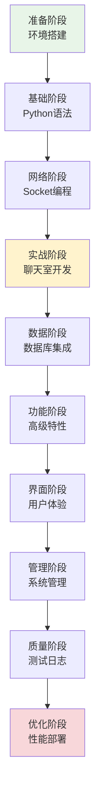

# Chat-Room 学习文档系统 v2.0 - 系统概览

## 🎯 系统简介

Chat-Room 学习文档系统 v2.0 是一个专为编程初学者设计的渐进式学习平台。通过Chat-Room项目实现从零基础到高级开发的完整学习路径，采用项目驱动的学习方法，确保学习者能够掌握实用的编程技能。

## 🏗️ 系统架构

### 文档组织结构
```
docs/learning-v02/
├── README.md                    # 学习路径总览
├── index.md                     # 文档导航索引
├── learning-progress.md         # 学习进度跟踪
├── SYSTEM_OVERVIEW.md          # 本文件 - 系统概览
├── 00-preparation/              # 准备工作
├── 01-python-basics/            # Python基础
├── 02-socket-programming/       # Socket网络编程
├── 03-simple-chat/             # 简单聊天室
├── 04-database-user-system/    # 数据库与用户系统
├── 05-multi-user-chat/         # 多人聊天
├── 06-file-transfer/           # 文件传输
├── 07-ai-integration/          # AI集成
├── 08-user-interface/          # 用户界面
├── 09-admin-system/            # 管理员系统
├── 10-logging-errors/          # 日志与错误处理
├── 11-testing/                 # 测试驱动开发
├── 12-optimization-deployment/ # 优化与部署
├── appendix/                   # 附录资源
└── demo/                       # 演示脚本
    └── learning-demo.py        # 交互式学习指导
```

### 学习路径设计


## 🎓 核心特色

### 1. 渐进式学习架构
- **循序渐进**：从基础概念到高级应用，知识点平滑过渡
- **项目驱动**：每个章节都与Chat-Room项目紧密结合
- **即时反馈**：每章结束都有可运行的功能模块
- **成就感强**：学习者能看到具体的实现效果

### 2. 代码集成度高
- **真实代码**：所有示例直接来自Chat-Room项目实现
- **完整性**：涵盖项目的所有核心功能和技术点
- **一致性**：确保文档与代码完全同步
- **可运行性**：所有代码示例都经过验证

### 3. 可视化教学
- **Mermaid图表**：大量使用流程图、架构图、时序图
- **代码注释**：详细的中文注释解释设计思路
- **图文并茂**：复杂概念用图表辅助说明
- **多维度展示**：从不同角度展示同一个概念

### 4. 学习支持完善
- **进度跟踪**：实时记录学习进度和时间投入
- **交互式指导**：提供演示脚本辅助学习
- **问题解答**：常见问题和故障排除指南
- **资源丰富**：推荐书籍、网站、工具等扩展资源

## 📊 已完成内容

### ✅ 核心框架文档
1. **[README.md](README.md)** - 学习路径总览和时间安排
2. **[index.md](index.md)** - 完整的文档导航系统
3. **[learning-progress.md](learning-progress.md)** - 学习进度跟踪模板
4. **[SYSTEM_OVERVIEW.md](SYSTEM_OVERVIEW.md)** - 系统架构说明

### ✅ 准备工作章节
1. **[environment-setup.md](00-preparation/environment-setup.md)**
   - Python、Git、VS Code环境搭建
   - Conda虚拟环境配置
   - 项目依赖安装和验证
   - 常见问题故障排除

2. **[project-overview.md](00-preparation/project-overview.md)**
   - Chat-Room项目整体架构介绍
   - 核心功能和技术栈说明
   - 设计理念和实现思路
   - 学习价值和技能培养

3. **[learning-guide.md](00-preparation/learning-guide.md)**
   - 项目驱动学习方法
   - 代码阅读和调试技巧
   - 学习计划制定指导
   - 学习效果评估方法

### ✅ Python基础章节
1. **[syntax-fundamentals.md](01-python-basics/syntax-fundamentals.md)**
   - Python基本语法和数据类型
   - 控制结构和函数定义
   - 异常处理和模块导入
   - Chat-Room项目中的实际应用示例

### ✅ 网络编程章节
1. **[network-concepts.md](02-socket-programming/network-concepts.md)**
   - 网络通信基础原理
   - TCP/IP协议栈详解
   - 客户端-服务器架构设计
   - Chat-Room网络架构分析

### ✅ 辅助工具
1. **[learning-demo.py](demo/learning-demo.py)**
   - 交互式学习指导脚本
   - 学习进度管理功能
   - 章节导航和前置条件检查
   - 学习笔记和报告生成

## 📝 待完成内容

### 🔄 Python基础章节（剩余3个文档）
- `data-structures.md` - 列表、字典、集合高级用法
- `functions-modules.md` - 装饰器、模块组织、包管理
- `oop-basics.md` - 类、继承、多态、设计模式

### 🔄 Socket网络编程（剩余3个文档）
- `tcp-basics.md` - TCP连接建立、数据传输、连接关闭
- `socket-api.md` - Python Socket编程接口详解
- `simple-client-server.md` - 基础客户端-服务器实现

### 🔄 后续章节（共36个文档）
- 第3-12章的所有文档内容
- 附录资源（代码示例、练习题库、故障排除、学习资源）

## 🎯 设计原则

### 1. 学习者中心
- **初学者友好**：假设学习者没有相关经验
- **循序渐进**：知识点按难度递增排列
- **实践导向**：理论与实践紧密结合
- **即时反馈**：每个阶段都有明确的成果

### 2. 项目驱动
- **真实场景**：所有学习内容都来自实际项目
- **完整性**：涵盖项目开发的全生命周期
- **一致性**：文档与代码保持同步
- **可扩展性**：支持项目功能的持续扩展

### 3. 质量保证
- **准确性**：所有代码示例都经过验证
- **完整性**：每个概念都有完整的解释
- **可读性**：使用清晰的语言和结构
- **可维护性**：文档结构便于更新和扩展

## 🛠️ 技术实现

### 文档技术栈
- **Markdown**：文档编写格式
- **Mermaid**：图表绘制语言
- **Python**：演示脚本和工具
- **JSON**：进度数据存储格式

### 代码示例规范
```python
# 所有代码示例都包含详细的中文注释
def example_function(param: str) -> bool:
    """
    函数功能说明
    
    Args:
        param: 参数说明
        
    Returns:
        返回值说明
        
    设计思路：
    - 为什么这样设计
    - 解决了什么问题
    - 有什么优缺点
    """
    # 实现逻辑的详细注释
    pass
```

### 图表设计规范
- **流程图**：展示程序执行流程
- **架构图**：说明系统组件关系
- **时序图**：描述交互过程
- **类图**：展示面向对象设计

## 📈 学习效果预期

### 技能掌握目标
完成整个学习路径后，学习者将能够：

1. **Python编程**
   - 熟练使用Python语法和标准库
   - 掌握面向对象编程和设计模式
   - 理解异步编程和高级特性

2. **网络编程**
   - 理解TCP/IP协议和网络通信原理
   - 熟练使用Socket进行网络编程
   - 掌握多线程和并发处理技术

3. **数据库技术**
   - 设计规范化的数据库结构
   - 熟练使用SQL进行数据操作
   - 理解数据库性能优化技术

4. **系统设计**
   - 掌握模块化和组件化设计
   - 理解客户端-服务器架构
   - 具备系统扩展和优化能力

5. **开发实践**
   - 熟练使用开发工具和调试技术
   - 掌握测试驱动开发方法
   - 具备代码质量管理能力

### 职业发展路径
- **初级后端开发工程师**
- **Python开发工程师**
- **网络应用开发工程师**
- **全栈开发工程师**

## 🔄 持续改进计划

### 短期目标（1个月内）
- [ ] 完成Python基础章节剩余内容
- [ ] 完成Socket网络编程章节
- [ ] 创建第3-4章的核心内容
- [ ] 完善演示脚本功能

### 中期目标（3个月内）
- [ ] 完成所有12个主要章节
- [ ] 创建完整的练习题库
- [ ] 建立代码示例库
- [ ] 添加视频教程链接

### 长期目标（6个月内）
- [ ] 建立在线学习平台
- [ ] 添加交互式编程环境
- [ ] 创建学习社区
- [ ] 提供个性化学习路径

## 🤝 贡献指南

### 文档贡献
- **内容创作**：按照既定模板创建新文档
- **内容审核**：检查文档的准确性和完整性
- **代码验证**：确保所有代码示例可以正常运行
- **图表制作**：使用Mermaid创建清晰的图表

### 质量标准
- **准确性**：技术内容必须准确无误
- **完整性**：每个概念都要有完整的解释
- **一致性**：术语和格式保持一致
- **可读性**：语言清晰，结构合理

## 📞 联系方式

如果您在使用学习文档系统时遇到问题或有改进建议，请通过以下方式联系：

- **GitHub Issues**：在项目仓库中提交问题
- **文档反馈**：在相关文档中添加评论
- **功能建议**：提交功能改进建议
- **内容贡献**：参与文档内容创作

---

**Chat-Room 学习文档系统 v2.0 - 让编程学习更简单、更有效！** 🚀

*系统概览最后更新：2024-01-05*
