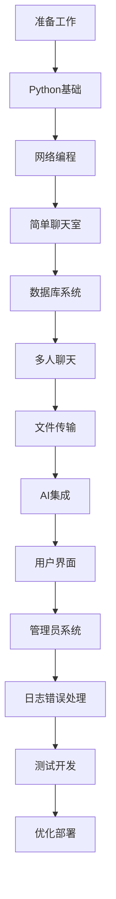

# Chat-Room 学习文档导航

## 🎯 快速导航

### 📚 [学习路径总览](README.md)
完整的学习路径介绍、时间安排和学习目标

### 📊 [学习进度跟踪](learning-progress.md)
实时跟踪学习进度、记录学习笔记和里程碑

## 🗂️ 章节目录

### 📋 准备工作
| 文档 | 内容 | 状态 | 预计时间 |
|------|------|------|----------|
| [环境搭建](00-preparation/environment-setup.md) | Python、Git、VS Code配置 | ✅ 完成 | 1天 |
| [项目概览](00-preparation/project-overview.md) | Chat-Room架构和功能介绍 | ✅ 完成 | 1天 |
| [学习指导](00-preparation/learning-guide.md) | 学习方法和技巧指导 | ✅ 完成 | 1天 |

### 🐍 第1章：Python基础
| 文档 | 内容 | 状态 | 预计时间 |
|------|------|------|----------|
| [语法基础](01-python-basics/syntax-fundamentals.md) | 变量、控制结构、函数、异常 | ✅ 完成 | 3天 |
| [数据结构](01-python-basics/data-structures.md) | 列表、字典、集合高级用法 | ✅ 完成 | 2天 |
| [函数模块](01-python-basics/functions-modules.md) | 装饰器、模块组织、包管理 | ✅ 完成 | 2天 |
| [面向对象](01-python-basics/oop-basics.md) | 类、继承、多态、设计模式 | ✅ 完成 | 3天 |

### 🌐 第2章：Socket网络编程
| 文档 | 内容 | 状态 | 预计时间 |
|------|------|------|----------|
| [网络概念](02-socket-programming/network-concepts.md) | TCP/IP、客户端-服务器架构 | ✅ 完成 | 2天 |
| [TCP基础](02-socket-programming/tcp-basics.md) | 连接建立、数据传输、关闭 | ✅ 完成 | 3天 |
| [Socket API](02-socket-programming/socket-api.md) | Python Socket编程接口 | ✅ 完成 | 3天 |
| [简单通信](02-socket-programming/simple-client-server.md) | 基础客户端-服务器实现 | ✅ 完成 | 2天 |

### 💬 第3章：简单聊天室
| 文档 | 内容 | 状态 | 预计时间 |
|------|------|------|----------|
| [协议设计](03-simple-chat/protocol-design.md) | 消息格式、通信协议 | ✅ 完成 | 2天 |
| [消息处理](03-simple-chat/message-handling.md) | 消息解析、验证、路由 | ✅ 完成 | 2天 |
| [多线程基础](03-simple-chat/threading-basics.md) | 并发处理多个客户端 | ✅ 完成 | 2天 |
| [错误处理](03-simple-chat/error-handling.md) | 网络异常、连接管理 | ✅ 完成 | 1天 |

### 🗄️ 第4章：数据库与用户系统
| 文档 | 内容 | 状态 | 预计时间 |
|------|------|------|----------|
| [SQLite基础](04-database-user-system/sqlite-basics.md) | 数据库操作、SQL语句 | ✅ 完成 | 2天 |
| [数据库设计](04-database-user-system/database-design.md) | 表结构设计、关系建模 | ✅ 完成 | 2天 |
| [用户认证](04-database-user-system/user-authentication.md) | 注册、登录、会话管理 | ✅ 完成 | 2天 |
| [数据模型](04-database-user-system/data-models.md) | ORM模式、数据访问层 | ✅ 完成 | 1天 |

### 👥 第5章：多人聊天
| 文档 | 内容 | 状态 | 预计时间 |
|------|------|------|----------|
| [聊天组管理](05-multi-user-chat/chat-groups.md) | 创建、加入、成员管理 | 📝 待创建 | 2天 |
| [消息路由](05-multi-user-chat/message-routing.md) | 群组消息广播、私聊 | 📝 待创建 | 2天 |
| [并发处理](05-multi-user-chat/concurrent-handling.md) | 线程安全、资源共享 | 📝 待创建 | 2天 |
| [状态管理](05-multi-user-chat/state-management.md) | 用户状态、连接状态 | 📝 待创建 | 1天 |

### 📁 第6章：文件传输
| 文档 | 内容 | 状态 | 预计时间 |
|------|------|------|----------|
| [文件协议](06-file-transfer/file-protocol.md) | 文件传输协议设计 | 📝 待创建 | 1天 |
| [分块传输](06-file-transfer/chunked-transfer.md) | 大文件分块处理 | 📝 待创建 | 2天 |
| [进度跟踪](06-file-transfer/progress-tracking.md) | 传输进度显示 | 📝 待创建 | 1天 |
| [安全验证](06-file-transfer/security-validation.md) | 文件类型检查、大小限制 | 📝 待创建 | 1天 |

### 🤖 第7章：AI集成
| 文档 | 内容 | 状态 | 预计时间 |
|------|------|------|----------|
| [API集成](07-ai-integration/api-integration.md) | HTTP请求、JSON处理 | 📝 待创建 | 1天 |
| [GLM-4-Flash](07-ai-integration/glm4-flash.md) | 智谱AI接口使用 | 📝 待创建 | 1天 |
| [上下文管理](07-ai-integration/context-management.md) | 对话历史、上下文窗口 | 📝 待创建 | 1天 |
| [异步处理](07-ai-integration/async-processing.md) | 非阻塞AI请求 | 📝 待创建 | 1天 |

### 🖥️ 第8章：用户界面
| 文档 | 内容 | 状态 | 预计时间 |
|------|------|------|----------|
| [TUI概念](08-user-interface/tui-concepts.md) | 终端用户界面原理 | 📝 待创建 | 1天 |
| [Textual框架](08-user-interface/textual-framework.md) | 组件、布局、事件 | 📝 待创建 | 3天 |
| [组件设计](08-user-interface/component-design.md) | 自定义组件开发 | 📝 待创建 | 2天 |
| [主题系统](08-user-interface/theme-system.md) | 样式、颜色、主题切换 | 📝 待创建 | 1天 |

### 👑 第9章：管理员系统
| 文档 | 内容 | 状态 | 预计时间 |
|------|------|------|----------|
| [权限模型](09-admin-system/permission-model.md) | 角色、权限、访问控制 | 📝 待创建 | 1天 |
| [命令系统](09-admin-system/command-system.md) | 命令解析、执行、响应 | 📝 待创建 | 2天 |
| [CRUD操作](09-admin-system/crud-operations.md) | 用户管理、群组管理 | 📝 待创建 | 2天 |
| [安全措施](09-admin-system/security-measures.md) | 权限验证、操作审计 | 📝 待创建 | 1天 |

### 📊 第10章：日志与错误处理
| 文档 | 内容 | 状态 | 预计时间 |
|------|------|------|----------|
| [Loguru系统](10-logging-errors/loguru-system.md) | 日志配置、格式化、轮转 | 📝 待创建 | 1天 |
| [错误策略](10-logging-errors/error-strategies.md) | 异常分类、处理策略 | 📝 待创建 | 1天 |
| [调试技巧](10-logging-errors/debugging-techniques.md) | 断点调试、日志分析 | 📝 待创建 | 1天 |
| [监控诊断](10-logging-errors/monitoring.md) | 性能监控、问题诊断 | 📝 待创建 | 1天 |

### 🧪 第11章：测试驱动开发
| 文档 | 内容 | 状态 | 预计时间 |
|------|------|------|----------|
| [测试概念](11-testing/testing-concepts.md) | 单元测试、集成测试、功能测试 | 📝 待创建 | 1天 |
| [pytest框架](11-testing/pytest-framework.md) | 测试编写、运行、报告 | 📝 待创建 | 2天 |
| [Mock测试](11-testing/mock-testing.md) | 模拟对象、依赖隔离 | 📝 待创建 | 2天 |
| [TDD实践](11-testing/tdd-practice.md) | 测试先行、重构、持续集成 | 📝 待创建 | 2天 |

### ⚡ 第12章：优化与部署
| 文档 | 内容 | 状态 | 预计时间 |
|------|------|------|----------|
| [性能调优](12-optimization-deployment/performance-tuning.md) | 瓶颈分析、优化策略 | 📝 待创建 | 2天 |
| [内存管理](12-optimization-deployment/memory-management.md) | 内存泄漏、垃圾回收 | 📝 待创建 | 1天 |
| [部署策略](12-optimization-deployment/deployment-strategies.md) | 环境配置、服务部署 | 📝 待创建 | 2天 |
| [生产监控](12-optimization-deployment/monitoring-production.md) | 日志监控、性能指标 | 📝 待创建 | 1天 |

### 📖 附录资源
| 文档 | 内容 | 状态 |
|------|------|------|
| [代码示例](appendix/code-examples/) | 完整代码示例库 | 📝 待创建 |
| [练习题库](appendix/exercises/) | 各章节配套练习 | 📝 待创建 |
| [故障排除](appendix/troubleshooting.md) | 常见问题解决方案 | 📝 待创建 |
| [学习资源](appendix/resources.md) | 推荐书籍、网站、工具 | 📝 待创建 |

## 🎯 学习路径建议

### 🚀 快速入门路径（适合有编程基础）

### 📚 完整学习路径（适合初学者）

### 🎨 项目驱动路径（适合实践导向）

## 📊 学习统计

### 文档完成情况
- **已完成**：19/48 (39.6%)
- **进行中**：0/48 (0%)
- **待创建**：29/48 (60.4%)

### 预计学习时间
- **总时间**：60-90天
- **每日学习**：2-3小时
- **周学习**：14-21小时

### 难度分布
- **入门级**：20% (准备工作、Python基础)
- **初级**：30% (网络编程、简单聊天)
- **中级**：35% (数据库、多用户、文件传输)
- **高级**：15% (AI集成、优化部署)

## 🛠️ 学习工具

### 必备工具
- **Python 3.8+**：编程语言
- **VS Code**：代码编辑器
- **Git**：版本控制
- **SQLite**：数据库

### 推荐工具
- **Conda**：环境管理
- **pytest**：测试框架
- **loguru**：日志系统
- **Textual**：TUI框架

## 📞 学习支持

### 获取帮助
- **文档问题**：检查是否有更新版本
- **代码问题**：查看项目源码对应实现
- **概念问题**：参考推荐的学习资源
- **实践问题**：尝试调试和实验

### 学习社区
- **Python官方社区**
- **GitHub讨论区**
- **Stack Overflow**
- **技术博客和论坛**

---

**选择适合您的学习路径，开始Chat-Room学习之旅！** 🚀

*文档索引最后更新：2025-01-17*
