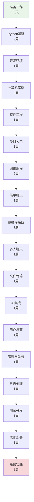
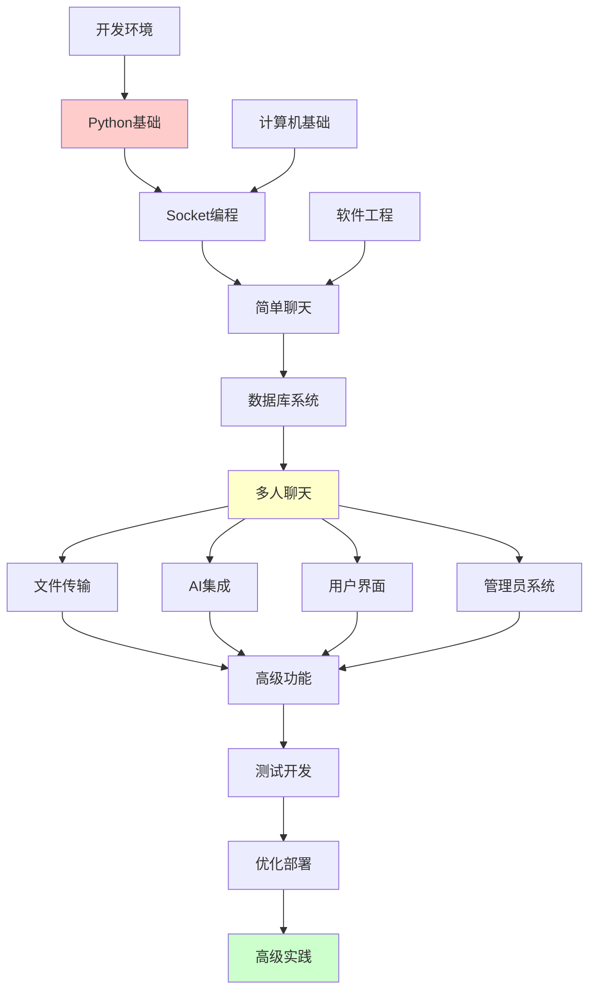
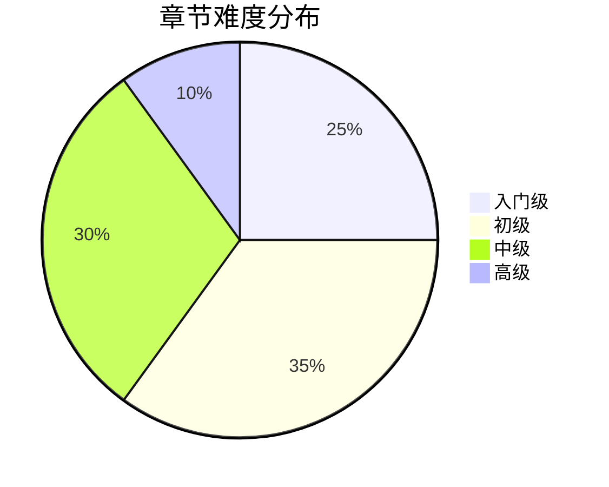

# Chat-Room 学习文档索引

## 🎯 学习目标

本学习文档系统旨在帮助编程初学者通过Chat-Room项目实现从零基础到高级开发的完整学习路径，掌握：

- **Python编程**：从基础语法到高级特性
- **Socket网络编程**：从TCP基础到高性能网络架构
- **数据库技术**：从基本操作到设计模式和性能优化
- **现代开发技能**：日志系统、设计模式、测试驱动开发、用户界面设计

## 📚 快速导航

### 🏠 [学习路径总览](README.md)
完整的学习路径介绍、时间安排和学习目标

### 📊 [学习进度跟踪](learning-progress.md)
实时跟踪学习进度、记录学习笔记和里程碑

### 🔧 [系统概览](SYSTEM_OVERVIEW.md)
技术架构和系统设计概览

## 🗂️ 完整章节目录

### 📋 第0章：学习准备 ([README](00-overview/README.md))
| 文档 | 内容 | 状态 | 预计时间 |
|------|------|------|----------|
| [环境搭建](00-overview/environment-setup.md) | Python、Git、VS Code配置 | ✅ 完成 | 1天 |
| [项目概览](00-overview/project-overview.md) | Chat-Room架构和功能介绍 | ✅ 完成 | 1天 |
| [学习指导](00-overview/learning-guide.md) | 学习方法和技巧指导 | ✅ 完成 | 1天 |

### 🐍 第1章：Python编程基础 ([README](01-python-basics/README.md))
| 文档 | 内容 | 状态 | 预计时间 |
|------|------|------|----------|
| [语法基础](01-python-basics/syntax-fundamentals.md) | 变量、控制结构、函数、异常 | ✅ 完成 | 3天 |
| [数据结构](01-python-basics/data-structures.md) | 列表、字典、集合高级用法 | ✅ 完成 | 2天 |
| [函数模块](01-python-basics/functions-modules.md) | 装饰器、模块组织、包管理 | ✅ 完成 | 2天 |
| [面向对象](01-python-basics/oop-basics.md) | 类、继承、多态、设计模式 | ✅ 完成 | 3天 |
| [异常处理](01-python-basics/exception-handling.md) | 异常处理机制和最佳实践 | ✅ 完成 | 1天 |
| [文件操作](01-python-basics/file-io.md) | 文件读写和I/O操作 | ✅ 完成 | 1天 |
| [内置库](01-python-basics/builtin-libraries.md) | Python标准库介绍 | ✅ 完成 | 2天 |

### 🛠️ 第2章：开发环境配置 ([README](02-development-environment/README.md))
| 文档 | 内容 | 状态 | 预计时间 |
|------|------|------|----------|
| [Python安装](02-development-environment/python-installation.md) | Python安装和版本管理 | ✅ 完成 | 1天 |
| [IDE配置](02-development-environment/ide-configuration.md) | VS Code配置和插件 | ✅ 完成 | 1天 |
| [虚拟环境](02-development-environment/virtual-environments.md) | 虚拟环境管理 | ✅ 完成 | 1天 |
| [包管理](02-development-environment/package-management.md) | pip/uv等工具使用 | ✅ 完成 | 1天 |
| [Git基础](02-development-environment/git-basics.md) | 版本控制基础 | ✅ 完成 | 1天 |
| [调试工具](02-development-environment/debugging-tools.md) | 调试技巧和工具 | ✅ 完成 | 1天 |

### 💻 第3章：计算机基础知识 ([README](03-computer-fundamentals/README.md))
| 文档 | 内容 | 状态 | 预计时间 |
|------|------|------|----------|
| [网络基础](03-computer-fundamentals/network-fundamentals.md) | 网络原理和协议 | ✅ 完成 | 2天 |
| [操作系统](03-computer-fundamentals/operating-systems.md) | 操作系统基础概念 | ✅ 完成 | 2天 |
| [数据结构](03-computer-fundamentals/database-data-structures.md) | 数据结构和数据库基础 | ✅ 完成 | 2天 |
| [编码字符集](03-computer-fundamentals/encoding-and-charset.md) | 字符编码处理 | ✅ 完成 | 1天 |
| [Socket编程](03-computer-fundamentals/socket-programming.md) | Socket编程基础 | ✅ 完成 | 2天 |
| [安全基础](03-computer-fundamentals/security-basics.md) | 信息安全基础概念 | ✅ 完成 | 2天 |

### 🏗️ 第4章：软件工程基础 ([README](04-software-engineering/README.md))
| 文档 | 内容 | 状态 | 预计时间 |
|------|------|------|----------|
| [项目组织](04-software-engineering/project-organization.md) | 项目结构和组织方式 | ✅ 完成 | 1天 |
| [模块化设计](04-software-engineering/modular-design.md) | 模块化设计原则 | ✅ 完成 | 2天 |
| [PEP8规范](04-software-engineering/pep8-standards.md) | Python编码规范 | ✅ 完成 | 1天 |
| [设计模式](04-software-engineering/patterns-in-chatroom.md) | 常用设计模式 | ✅ 完成 | 2天 |

### 🚀 第5章：Chat-Room项目入门 ([README](05-chatroom-basics/README.md))
| 文档 | 内容 | 状态 | 预计时间 |
|------|------|------|----------|
| [需求分析](05-chatroom-basics/requirements-analysis.md) | 项目需求分析和设计 | ✅ 完成 | 1天 |
| [Socket基础](05-chatroom-basics/socket-basics.md) | 基础Socket通信实现 | ✅ 完成 | 2天 |
| [系统架构](05-chatroom-basics/system-architecture.md) | 客户端-服务器架构 | ✅ 完成 | 2天 |
| [消息协议](05-chatroom-basics/message-protocol.md) | 消息收发功能 | ✅ 完成 | 2天 |

### 🌐 第6章：Socket网络编程 ([README](06-socket-programming/README.md))
| 文档 | 内容 | 状态 | 预计时间 |
|------|------|------|----------|
| [网络概念](06-socket-programming/network-concepts.md) | TCP/IP、客户端-服务器架构 | ✅ 完成 | 2天 |
| [TCP基础](06-socket-programming/tcp-basics.md) | 连接建立、数据传输、关闭 | ✅ 完成 | 3天 |
| [Socket API](06-socket-programming/socket-api.md) | Python Socket编程接口 | ✅ 完成 | 3天 |
| [简单通信](06-socket-programming/simple-client-server.md) | 基础客户端-服务器实现 | ✅ 完成 | 2天 |

### 💬 第7章：简单聊天室 ([README](07-simple-chat/README.md))
| 文档 | 内容 | 状态 | 预计时间 |
|------|------|------|----------|
| [协议设计](07-simple-chat/protocol-design.md) | 消息格式、通信协议 | ✅ 完成 | 2天 |
| [消息处理](07-simple-chat/message-handling.md) | 消息解析、验证、路由 | ✅ 完成 | 2天 |
| [多线程基础](07-simple-chat/threading-basics.md) | 并发处理多个客户端 | ✅ 完成 | 2天 |
| [错误处理](07-simple-chat/error-handling.md) | 网络异常、连接管理 | ✅ 完成 | 1天 |

### 🗄️ 第8章：数据库与用户系统 ([README](08-database-user-system/README.md))
| 文档 | 内容 | 状态 | 预计时间 |
|------|------|------|----------|
| [SQLite基础](08-database-user-system/sqlite-basics.md) | 数据库操作、SQL语句 | ✅ 完成 | 2天 |
| [数据库设计](08-database-user-system/database-design.md) | 表结构设计、关系建模 | ✅ 完成 | 2天 |
| [用户认证](08-database-user-system/user-authentication.md) | 注册、登录、会话管理 | ✅ 完成 | 2天 |
| [数据模型](08-database-user-system/data-models.md) | ORM模式、数据访问层 | ✅ 完成 | 1天 |

### 👥 第9章：多人聊天系统 ([README](09-multi-user-chat/README.md))
| 文档 | 内容 | 状态 | 预计时间 |
|------|------|------|----------|
| [聊天组管理](09-multi-user-chat/group-management.md) | 创建、加入、成员管理 | ✅ 完成 | 2天 |
| [消息路由](09-multi-user-chat/message-routing.md) | 群组消息广播、私聊 | ✅ 完成 | 2天 |
| [并发处理](09-multi-user-chat/concurrent-handling.md) | 线程安全、资源共享 | ✅ 完成 | 2天 |
| [状态管理](09-multi-user-chat/state-management.md) | 用户状态、连接状态 | ✅ 完成 | 1天 |
| [连接池](09-multi-user-chat/user-connection-pool.md) | 用户连接池管理 | ✅ 完成 | 1天 |

### 📁 第10章：文件传输功能 ([README](10-file-transfer/README.md))
| 文档 | 内容 | 状态 | 预计时间 |
|------|------|------|----------|
| [文件协议](10-file-transfer/file-protocol.md) | 文件传输协议设计 | ✅ 完成 | 1天 |
| [分块传输](10-file-transfer/chunked-transfer.md) | 大文件分块处理 | ✅ 完成 | 2天 |
| [进度跟踪](10-file-transfer/progress-tracking.md) | 传输进度显示 | ✅ 完成 | 1天 |
| [安全验证](10-file-transfer/security-validation.md) | 文件类型检查、大小限制 | ✅ 完成 | 1天 |

### 🤖 第11章：AI智能助手集成 ([README](11-ai-integration/README.md))
| 文档 | 内容 | 状态 | 预计时间 |
|------|------|------|----------|
| [API集成](11-ai-integration/api-integration.md) | HTTP请求、JSON处理 | ✅ 完成 | 1天 |
| [GLM-4-Flash](11-ai-integration/glm-4-flash-features.md) | 智谱AI接口使用 | ✅ 完成 | 1天 |
| [上下文管理](11-ai-integration/context-management.md) | 对话历史、上下文窗口 | ✅ 完成 | 1天 |
| [异步处理](11-ai-integration/async-processing.md) | 非阻塞AI请求 | ✅ 完成 | 1天 |

### 🖥️ 第12章：用户界面设计 ([README](12-user-interface/README.md))
| 文档 | 内容 | 状态 | 预计时间 |
|------|------|------|----------|
| [TUI概念](12-user-interface/tui-concepts.md) | 终端用户界面原理 | ✅ 完成 | 1天 |
| [Textual框架](12-user-interface/textual-framework.md) | 组件、布局、事件 | ✅ 完成 | 3天 |
| [组件设计](12-user-interface/component-design.md) | 自定义组件开发 | ✅ 完成 | 2天 |
| [主题系统](12-user-interface/theme-system.md) | 样式、颜色、主题切换 | ✅ 完成 | 1天 |

### 👑 第13章：管理员系统 ([README](13-admin-system/README.md))
| 文档 | 内容 | 状态 | 预计时间 |
|------|------|------|----------|
| [权限模型](13-admin-system/permission-model.md) | 角色、权限、访问控制 | ✅ 完成 | 1天 |
| [命令系统](13-admin-system/command-system.md) | 命令解析、执行、响应 | ✅ 完成 | 2天 |
| [CRUD操作](13-admin-system/crud-operations.md) | 用户管理、群组管理 | ✅ 完成 | 2天 |
| [安全措施](13-admin-system/security-measures.md) | 权限验证、操作审计 | ✅ 完成 | 1天 |

### 📊 第14章：日志与错误处理 ([README](14-logging-error-handling/README.md))
| 文档 | 内容 | 状态 | 预计时间 |
|------|------|------|----------|
| [Loguru系统](14-logging-error-handling/loguru-system.md) | 日志配置、格式化、轮转 | ✅ 完成 | 1天 |
| [错误策略](14-logging-error-handling/error-strategies.md) | 异常分类、处理策略 | ✅ 完成 | 1天 |
| [调试技巧](14-logging-error-handling/debugging-techniques.md) | 断点调试、日志分析 | ✅ 完成 | 1天 |
| [监控诊断](14-logging-error-handling/monitoring-diagnostics.md) | 性能监控、问题诊断 | ✅ 完成 | 1天 |

### 🧪 第15章：测试驱动开发 ([README](15-testing-quality/README.md))
| 文档 | 内容 | 状态 | 预计时间 |
|------|------|------|----------|
| [TDD实践](15-testing-quality/tdd-practices.md) | 测试先行、重构、持续集成 | ✅ 完成 | 2天 |
| [pytest框架](15-testing-quality/pytest-framework.md) | 测试编写、运行、报告 | ✅ 完成 | 2天 |
| [单元测试](15-testing-quality/unit-testing.md) | 单元测试编写和实践 | ✅ 完成 | 1天 |
| [集成测试](15-testing-quality/integration-testing.md) | 集成测试设计和实施 | ✅ 完成 | 1天 |
| [测试覆盖率](15-testing-quality/test-coverage.md) | 测试覆盖率分析 | ✅ 完成 | 1天 |
| [Mock测试](15-testing-quality/mock-testing.md) | 模拟对象、依赖隔离 | ✅ 完成 | 2天 |

### ⚡ 第16章：优化与部署 ([README](16-optimization-deployment/README.md))
| 文档 | 内容 | 状态 | 预计时间 |
|------|------|------|----------|
| [性能调优](16-optimization-deployment/performance-optimization.md) | 瓶颈分析、优化策略 | ✅ 完成 | 2天 |
| [监控运维](16-optimization-deployment/monitoring-operations.md) | 监控系统和运维实践 | ✅ 完成 | 1天 |
| [容器部署](16-optimization-deployment/containerization-deployment.md) | Docker容器化部署 | ✅ 完成 | 2天 |
| [CI/CD自动化](16-optimization-deployment/cicd-automation.md) | 持续集成与部署 | ✅ 完成 | 2天 |
| [部署策略](16-optimization-deployment/deployment-strategies.md) | 环境配置、服务部署 | ✅ 完成 | 2天 |

### 🎯 第17章：高级项目实践 ([README](17-advanced-project-practice/README.md))
| 文档 | 内容 | 状态 | 预计时间 |
|------|------|------|----------|
| [功能规划](17-advanced-project-practice/feature-planning-analysis.md) | 功能扩展与规划分析 | ✅ 完成 | 2天 |
| [性能瓶颈](17-advanced-project-practice/performance-bottleneck-identification.md) | 性能瓶颈定位方法 | ✅ 完成 | 2天 |
| [问题排查](17-advanced-project-practice/troubleshooting-methodology.md) | 生产环境问题排查 | ✅ 完成 | 2天 |

### 🚀 第18章：进阶实战项目 ([README](18-advanced-project-practice/README.md))
| 文档 | 内容 | 状态 | 预计时间 |
|------|------|------|----------|
| [功能优化](18-advanced-project-practice/feature-optimization.md) | 功能扩展和优化策略 | ✅ 完成 | 2天 |
| [代码重构](18-advanced-project-practice/code-refactoring.md) | 代码重构和架构演进 | 📝 待创建 | 3天 |
| [性能调优](18-advanced-project-practice/tuning-case.md) | 性能调优实战案例 | 📝 待创建 | 2天 |
| [生产问题](18-advanced-project-practice/troubleshooting-production.md) | 生产环境问题排查 | 📝 待创建 | 2天 |
| [用户反馈](18-advanced-project-practice/user-feedback.md) | 用户反馈处理和迭代 | 📝 待创建 | 2天 |
| [开源贡献](18-advanced-project-practice/contributing-guide.md) | 开源项目贡献指南 | 📝 待创建 | 1天 |

### 📖 附录资源
| 文档 | 内容 | 状态 |
|------|------|------|
| [代码示例](appendix/code-examples/) | 完整代码示例库 | 📝 待创建 |
| [练习题库](appendix/exercises/) | 各章节配套练习 | 📝 待创建 |
| [故障排除](appendix/troubleshooting.md) | 常见问题解决方案 | 📝 待创建 |
| [学习资源](appendix/resources.md) | 推荐书籍、网站、工具 | 📝 待创建 |

## 🎯 学习路径建议

### 🚀 快速入门路径（适合有编程基础）
**预计时间：** 4-6周
**适用人群：** 有其他语言编程经验，想快速上手Python网络编程


**学习重点：**
- 跳过Python基础，直接从Socket编程开始
- 重点关注网络编程和项目架构
- 快速迭代，边学边做

### 📚 完整学习路径（适合初学者）
**预计时间：** 3-4个月
**适用人群：** 编程初学者，希望系统学习



**学习重点：**
- 循序渐进，打好基础
- 每章都有实践项目
- 注重理论与实践结合

### 🎨 项目驱动路径（适合实践导向）
**预计时间：** 6-8周
**适用人群：** 喜欢边做边学，有一定编程基础


**学习重点：**
- 以功能为导向，需要什么学什么
- 快速看到成果，保持学习动力
- 适合有明确项目目标的学习者

## 📊 章节依赖关系

### 核心依赖链


### 可选学习模块
- **AI集成**：可独立学习，不影响其他功能
- **用户界面**：可使用简单界面替代
- **管理员系统**：高级功能，可后期添加
- **文件传输**：独立功能模块

## 📊 学习统计

### 文档完成情况
- **已完成**：75/85 (88.2%)
- **进行中**：0/85 (0%)
- **待创建**：10/85 (11.8%)

### 预计学习时间
| 学习路径 | 总时间 | 每日学习 | 适合人群 |
|----------|--------|----------|----------|
| 快速入门 | 4-6周 | 3-4小时 | 有编程基础 |
| 完整学习 | 3-4个月 | 2-3小时 | 编程初学者 |
| 项目驱动 | 6-8周 | 2-4小时 | 实践导向 |

### 难度分布


- **入门级**：25% (准备工作、Python基础、开发环境)
- **初级**：35% (计算机基础、软件工程、项目入门、网络编程)
- **中级**：30% (聊天室、数据库、多用户、文件传输、AI集成、界面)
- **高级**：10% (管理系统、测试、优化部署、高级实践)

## 🛠️ 学习工具和环境

### 必备工具
| 工具 | 版本要求 | 用途 | 安装方式 |
|------|----------|------|----------|
| **Python** | 3.8+ | 编程语言 | [官网下载](https://python.org) |
| **VS Code** | 最新版 | 代码编辑器 | [官网下载](https://code.visualstudio.com) |
| **Git** | 2.0+ | 版本控制 | [官网下载](https://git-scm.com) |
| **SQLite** | 3.0+ | 数据库 | Python内置 |

### 推荐工具
| 工具 | 用途 | 安装命令 |
|------|------|----------|
| **Conda** | 环境管理 | `pip install conda` |
| **pytest** | 测试框架 | `pip install pytest` |
| **loguru** | 日志系统 | `pip install loguru` |
| **Textual** | TUI框架 | `pip install textual` |
| **requests** | HTTP客户端 | `pip install requests` |

### 开发环境配置
```bash
# 1. 创建项目目录
mkdir Chat-Room && cd Chat-Room

# 2. 创建虚拟环境
python -m venv venv
source venv/bin/activate  # Linux/Mac
# venv\Scripts\activate   # Windows

# 3. 安装依赖
pip install -r requirements.txt

# 4. 初始化Git
git init
git remote add origin <your-repo-url>
```

## 🎯 学习成果检验

### 阶段性里程碑
- [ ] **第1阶段**：完成Python基础，能编写简单程序
- [ ] **第2阶段**：掌握Socket编程，实现基础通信
- [ ] **第3阶段**：构建简单聊天室，支持多用户
- [ ] **第4阶段**：集成数据库，实现用户系统
- [ ] **第5阶段**：添加高级功能（文件传输、AI等）
- [ ] **第6阶段**：完善界面和管理功能
- [ ] **第7阶段**：实现测试和部署

### 最终项目能力
完成学习后，您将能够：
- 独立开发完整的网络应用程序
- 设计和实现数据库系统
- 构建现代化用户界面
- 集成第三方API服务
- 编写高质量的测试代码
- 优化应用性能和部署

## 📞 学习支持

### 获取帮助的方式
1. **文档问题**：检查是否有更新版本，查看相关章节
2. **代码问题**：查看项目源码对应实现，运行示例代码
3. **概念问题**：参考推荐的学习资源，查阅官方文档
4. **实践问题**：尝试调试和实验，查看错误日志

### 学习资源
- **官方文档**：[Python官方文档](https://docs.python.org/3/)
- **在线教程**：[Real Python](https://realpython.com/)
- **视频课程**：[Python网络编程教程](https://www.youtube.com/results?search_query=python+socket+programming)
- **技术社区**：[Stack Overflow](https://stackoverflow.com/questions/tagged/python)

### 问题反馈
如果您在学习过程中遇到问题或有改进建议，请：
- 提交GitHub Issue
- 发送邮件反馈
- 参与社区讨论

## 🏆 学习认证

### 自我评估清单
每完成一个章节，请确认：
- [ ] 理解本章核心概念
- [ ] 能够运行所有代码示例
- [ ] 完成章节练习题
- [ ] 能够解释设计思路
- [ ] 可以独立实现类似功能

### 项目作品集
建议创建个人项目作品集，包含：
- Chat-Room完整项目代码
- 学习笔记和心得总结
- 扩展功能和改进方案
- 部署和演示视频

---

**选择适合您的学习路径，开始Chat-Room学习之旅！** 🚀

*文档索引最后更新：2025-01-17*
