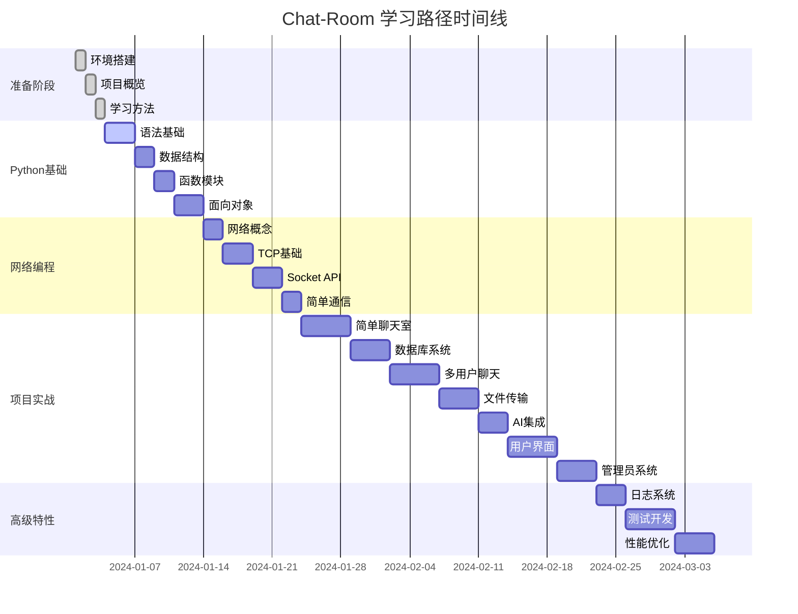

# Chat-Room 学习进度跟踪

## 📊 整体学习进度



## 📋 学习检查清单

### 准备阶段 ✅
- [x] **环境搭建**：Python、Git、VS Code配置完成
- [x] **项目概览**：理解Chat-Room整体架构和功能
- [x] **学习方法**：掌握项目驱动学习方法

### 第1章：Python基础 ✅
- [x] **语法基础**：变量、控制结构、函数、异常处理
- [x] **数据结构**：列表、字典、集合的高级用法
- [x] **函数模块**：装饰器、模块组织、包管理
- [x] **面向对象**：类、继承、多态、设计模式

### 第2章：Socket网络编程 ✅
- [x] **网络概念**：TCP/IP、客户端-服务器架构
- [x] **TCP基础**：连接建立、数据传输、连接关闭
- [x] **Socket API**：Python Socket编程接口详解
- [x] **简单通信**：实现基础的客户端-服务器通信

### 第3章：简单聊天室 ⏳
- [ ] **协议设计**：消息格式、通信协议定义
- [ ] **消息处理**：消息解析、验证、路由
- [ ] **多线程**：并发处理多个客户端连接
- [ ] **错误处理**：网络异常、连接管理

### 第4章：数据库与用户系统 ⏳
- [ ] **SQLite基础**：数据库操作、SQL语句
- [ ] **数据库设计**：表结构设计、关系建模
- [ ] **用户认证**：注册、登录、会话管理
- [ ] **数据模型**：ORM模式、数据访问层

### 第5章：多人聊天 ⏳
- [ ] **聊天组管理**：创建、加入、成员管理
- [ ] **消息路由**：群组消息广播、私聊
- [ ] **并发处理**：线程安全、资源共享
- [ ] **状态管理**：用户状态、连接状态

### 第6章：文件传输 ⏳
- [ ] **文件协议**：文件传输协议设计
- [ ] **分块传输**：大文件分块处理
- [ ] **进度跟踪**：传输进度显示
- [ ] **安全验证**：文件类型检查、大小限制

### 第7章：AI集成 ⏳
- [ ] **API集成**：HTTP请求、JSON处理
- [ ] **GLM-4-Flash**：智谱AI接口使用
- [ ] **上下文管理**：对话历史、上下文窗口
- [ ] **异步处理**：非阻塞AI请求

### 第8章：用户界面 ⏳
- [ ] **TUI概念**：终端用户界面原理
- [ ] **Textual框架**：组件、布局、事件
- [ ] **组件设计**：自定义组件开发
- [ ] **主题系统**：样式、颜色、主题切换

### 第9章：管理员系统 ⏳
- [ ] **权限模型**：角色、权限、访问控制
- [ ] **命令系统**：命令解析、执行、响应
- [ ] **CRUD操作**：用户管理、群组管理
- [ ] **安全措施**：权限验证、操作审计

### 第10章：日志与错误处理 ⏳
- [ ] **Loguru系统**：日志配置、格式化、轮转
- [ ] **错误策略**：异常分类、处理策略
- [ ] **调试技巧**：断点调试、日志分析
- [ ] **监控诊断**：性能监控、问题诊断

### 第11章：测试驱动开发 ⏳
- [ ] **测试概念**：单元测试、集成测试、功能测试
- [ ] **pytest框架**：测试编写、运行、报告
- [ ] **Mock测试**：模拟对象、依赖隔离
- [ ] **TDD实践**：测试先行、重构、持续集成

### 第12章：优化与部署 ⏳
- [ ] **性能调优**：瓶颈分析、优化策略
- [ ] **内存管理**：内存泄漏、垃圾回收
- [ ] **部署策略**：环境配置、服务部署
- [ ] **生产监控**：日志监控、性能指标

## 📈 学习统计

### 完成情况
- **已完成章节**：5/12 (41.7%)
- **进行中章节**：0/12 (0%)
- **待开始章节**：7/12 (58.3%)

### 时间投入
- **总预计时间**：60-90天
- **已用时间**：10天
- **剩余时间**：50-80天
- **平均每日学习**：2-3小时

### 技能掌握度
```mermaid
radar
    title 技能掌握雷达图
    options
        scale: 0-5

    Python基础 : 4
    网络编程 : 4
    数据库技术 : 1
    用户界面 : 1
    AI集成 : 1
    测试开发 : 1
    系统设计 : 2
    性能优化 : 1
```

## 🎯 当前学习重点

### 本周目标（第3周）
1. **开始简单聊天室开发**
   - 消息协议设计
   - 多线程处理
   - 错误处理机制

2. **数据库系统集成**
   - SQLite数据库设计
   - 用户认证系统
   - 数据模型实现

### 学习方法调整
- **增加实践时间**：理论学习40%，实践编程60%
- **每日总结**：记录学习要点和疑问
- **代码注释**：为每个练习添加详细中文注释
- **问题记录**：建立问题和解决方案库

## 📝 学习笔记摘要

### 重要概念记录

#### Python核心概念
```python
# 函数装饰器 - 在Chat-Room中用于权限检查
def require_login(func):
    """要求用户登录的装饰器"""
    def wrapper(self, *args, **kwargs):
        if not self.is_logged_in:
            return "请先登录"
        return func(self, *args, **kwargs)
    return wrapper

# 异常处理 - 网络编程中的关键技能
try:
    socket.connect((host, port))
except ConnectionRefusedError:
    print("服务器拒绝连接")
except socket.timeout:
    print("连接超时")
```

#### 网络编程要点
```python
# TCP三次握手的理解
# 1. 客户端发送SYN
# 2. 服务器回复SYN-ACK  
# 3. 客户端发送ACK
# 连接建立完成

# Socket编程基本流程
server_socket = socket.socket(socket.AF_INET, socket.SOCK_STREAM)
server_socket.bind((host, port))
server_socket.listen(max_connections)
client_socket, address = server_socket.accept()
```

### 常见问题及解决方案

#### 问题1：端口被占用
```bash
# 检查端口占用
netstat -an | grep 8888

# 解决方案
# 1. 更换端口号
# 2. 杀死占用进程
# 3. 使用SO_REUSEADDR选项
```

#### 问题2：编码问题
```python
# 问题：字符串编码错误
# 解决：统一使用UTF-8编码
message = "你好世界"
encoded = message.encode('utf-8')
decoded = encoded.decode('utf-8')
```

## 🔄 学习反思

### 学习效果评估
1. **理论理解**：✅ 概念掌握较好
2. **实践能力**：⚠️ 需要更多编程练习
3. **问题解决**：⚠️ 调试技能需要提升
4. **知识连贯**：✅ 能够理解模块间关系

### 改进计划
1. **增加编程练习**：每天至少1小时编程实践
2. **建立代码库**：收集和整理有用的代码片段
3. **定期复习**：每周复习前面学过的内容
4. **寻求帮助**：遇到问题及时查阅资料或求助

## 📚 学习资源记录

### 有用的参考资料
- **Python官方文档**：https://docs.python.org/3/
- **Socket编程教程**：Real Python Socket Programming
- **SQLite教程**：SQLite官方文档
- **Textual文档**：https://textual.textualize.io/

### 实用工具
- **代码编辑器**：VS Code + Python扩展
- **调试工具**：Python Debugger (pdb)
- **版本控制**：Git + GitHub
- **数据库工具**：DB Browser for SQLite

## 🎉 学习里程碑

### 已达成的里程碑
- [x] **第1个里程碑**：成功搭建开发环境
- [x] **第2个里程碑**：理解项目整体架构
- [x] **第3个里程碑**：掌握Python基础语法
- [x] **第4个里程碑**：理解网络编程概念
- [x] **第5个里程碑**：掌握Python高级特性
- [x] **第6个里程碑**：完成Socket编程学习
- [x] **第7个里程碑**：实现简单的Socket通信

### 即将达成的里程碑
- [ ] **第8个里程碑**：完成基础聊天功能
- [ ] **第9个里程碑**：集成数据库存储
- [ ] **第10个里程碑**：实现多用户聊天
- [ ] **第11个里程碑**：添加文件传输功能

### 最终目标
- [ ] **终极目标**：独立开发完整的聊天室应用
- [ ] **技能目标**：掌握Python网络编程和系统设计
- [ ] **职业目标**：具备初级后端开发能力

---

**继续加油！每一步都在向目标靠近！** 🚀

*最后更新时间：2024-01-06*
