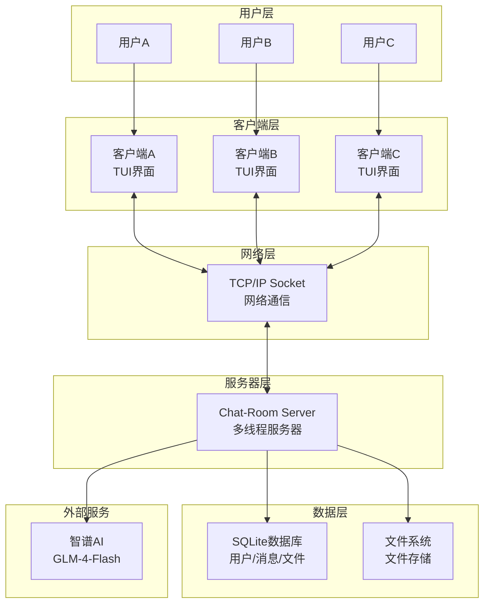
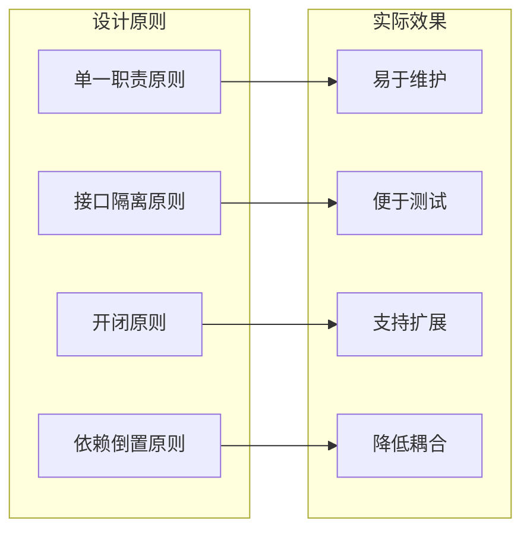
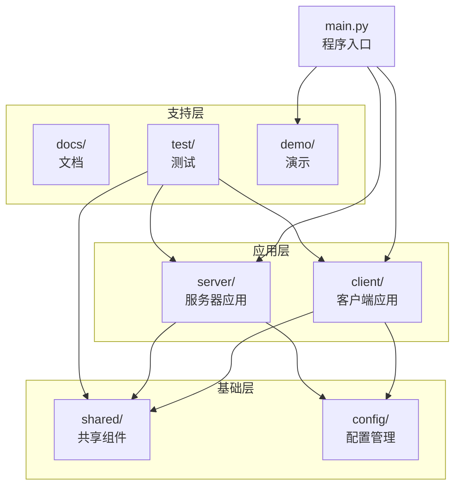
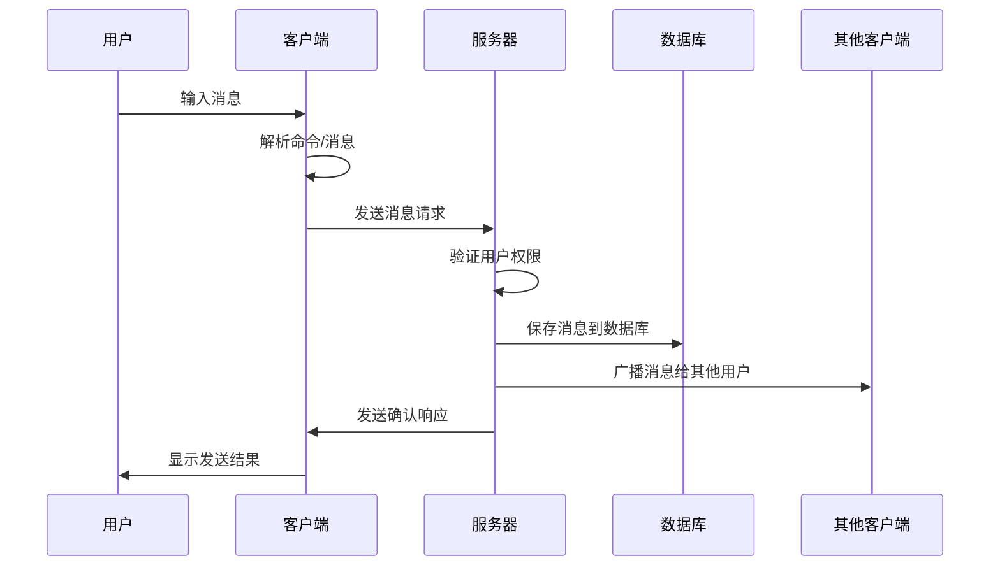
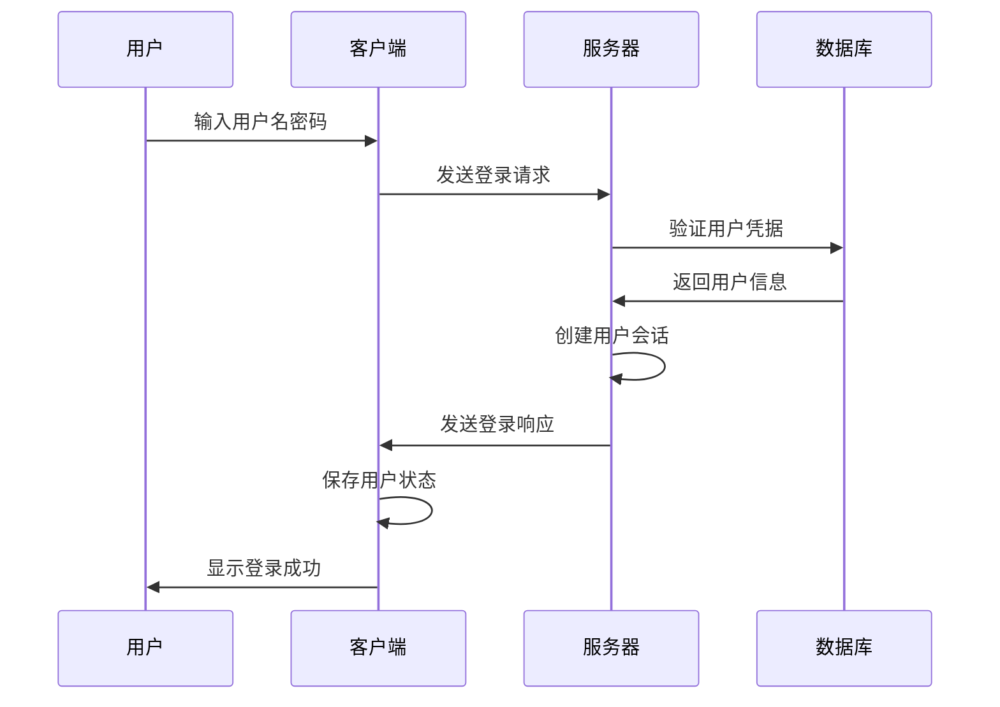

# Chat-Room 项目架构深度解析

## 📐 整体架构概览

Chat-Room项目采用经典的**客户端-服务器架构**，这是网络应用程序最常见的架构模式。让我们从宏观到微观，逐步理解这个项目的设计思想。

### 🏗️ 架构层次图



## 🎯 为什么选择这种架构？

### 客户端-服务器架构的优势

1. **集中管理**：所有用户数据和聊天记录集中存储在服务器
2. **实时通信**：服务器作为中转站，实现用户间的实时消息传递
3. **可扩展性**：可以支持任意数量的客户端连接
4. **数据一致性**：统一的数据管理避免了数据冲突
5. **安全性**：敏感操作在服务器端执行，提高安全性

### 模块化设计的好处



## 📁 项目目录结构解析

### 顶层目录设计思想

```
Chat-Room/
├── client/          # 客户端模块 - 用户交互层
├── server/          # 服务器模块 - 业务逻辑层
├── shared/          # 共享模块 - 通用组件层
├── config/          # 配置文件 - 配置管理层
├── docs/            # 文档目录 - 知识管理层
├── test/            # 测试代码 - 质量保证层
├── demo/            # 演示代码 - 学习展示层
├── archive/         # 归档文件 - 历史管理层
└── main.py          # 程序入口 - 启动控制层
```

**设计思考**：
- **按功能分层**：每个目录都有明确的职责
- **依赖关系清晰**：shared被client和server依赖，但不依赖它们
- **配置外置**：配置文件独立管理，便于部署和维护
- **文档完善**：详细的文档支持学习和维护

### 模块依赖关系



## 🔧 核心模块详解

### 1. 共享模块 (shared/)

**作用**：定义客户端和服务器都需要使用的通用组件

```python
shared/
├── constants.py     # 常量定义 - 避免魔法数字
├── messages.py      # 消息协议 - 统一通信格式
├── exceptions.py    # 异常定义 - 统一错误处理
├── logger.py        # 日志系统 - 统一日志管理
└── config_manager.py # 配置管理 - 统一配置接口
```

**设计亮点**：
- **避免重复代码**：公共逻辑只写一次
- **保证一致性**：客户端和服务器使用相同的协议
- **便于维护**：修改协议只需要改一个地方

### 2. 服务器模块 (server/)

**作用**：处理业务逻辑、数据存储、用户管理

```python
server/
├── main.py          # 服务器入口
├── core/            # 核心业务逻辑
│   ├── server.py    # 主服务器类
│   ├── user_manager.py   # 用户管理
│   └── chat_manager.py   # 聊天管理
├── database/        # 数据库操作
│   ├── models.py    # 数据模型
│   └── connection.py # 数据库连接
├── ai/              # AI集成
│   └── ai_manager.py # AI管理器
└── utils/           # 工具函数
    └── auth.py      # 认证工具
```

**架构特点**：
- **分层设计**：core处理业务逻辑，database处理数据，utils提供工具
- **单一职责**：每个模块只负责一个特定功能
- **依赖注入**：通过参数传递依赖，便于测试

### 3. 客户端模块 (client/)

**作用**：提供用户界面、处理用户输入、与服务器通信

```python
client/
├── main.py          # 客户端入口
├── core/            # 核心通信
│   └── client.py    # 网络客户端
├── ui/              # 用户界面
│   ├── app.py       # 主应用
│   ├── components.py # UI组件
│   └── themes/      # 主题系统
├── commands/        # 命令系统
│   └── parser.py    # 命令解析
└── config/          # 客户端配置
```

**设计思想**：
- **MVC模式**：ui负责视图，core负责模型，commands负责控制
- **组件化**：UI组件可以独立开发和测试
- **可扩展**：新命令和新主题可以轻松添加

## 🔄 数据流分析

### 消息发送流程



### 用户登录流程



## 🎨 设计模式应用

### 1. 单例模式 (Singleton)
```python
# 数据库连接管理
class DatabaseManager:
    _instance = None
    
    def __new__(cls):
        if cls._instance is None:
            cls._instance = super().__new__(cls)
        return cls._instance
```

**为什么使用**：确保整个应用只有一个数据库连接实例

### 2. 工厂模式 (Factory)
```python
# 消息创建工厂
def create_message_from_dict(data: Dict[str, Any]) -> BaseMessage:
    message_type = data.get("message_type")
    message_class = message_classes.get(message_type, BaseMessage)
    return message_class.from_dict(data)
```

**为什么使用**：根据消息类型动态创建不同的消息对象

### 3. 观察者模式 (Observer)
```python
# UI组件响应数据变化
class StatusPanel(Static):
    connection_status = reactive("未连接")  # 响应式属性
    
    def watch_connection_status(self, old_value, new_value):
        self.refresh()  # 自动更新界面
```

**为什么使用**：界面自动响应数据状态变化

### 4. 装饰器模式 (Decorator)
```python
# 命令参数验证装饰器
def require_args(min_args: int = 1):
    def decorator(func):
        def wrapper(self, command):
            if len(command.args) < min_args:
                return False, "参数不足"
            return func(self, command)
        return wrapper
    return decorator
```

**为什么使用**：为函数添加通用的参数验证逻辑

## 🚀 架构优势总结

### 1. 可维护性
- **模块化设计**：每个模块职责单一，修改影响范围小
- **清晰的接口**：模块间通过明确的接口通信
- **完善的文档**：详细的代码注释和文档

### 2. 可扩展性
- **插件化架构**：新功能可以作为插件添加
- **配置驱动**：通过配置文件控制功能开关
- **标准化接口**：新模块遵循现有接口规范

### 3. 可测试性
- **依赖注入**：便于模拟依赖进行单元测试
- **分层架构**：每一层都可以独立测试
- **接口抽象**：通过接口隔离具体实现

### 4. 性能优化
- **多线程处理**：服务器支持并发连接
- **连接池管理**：数据库连接复用
- **缓存机制**：减少重复计算和查询

## 💡 学习建议

1. **从整体到局部**：先理解整体架构，再深入具体模块
2. **关注接口设计**：重点学习模块间的接口定义
3. **理解设计模式**：识别和理解项目中使用的设计模式
4. **动手实践**：尝试修改架构，观察影响
5. **对比学习**：与其他项目的架构进行对比

---

**下一步**：学习具体的功能特性 → [features.md](./features.md)
