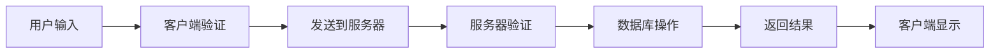
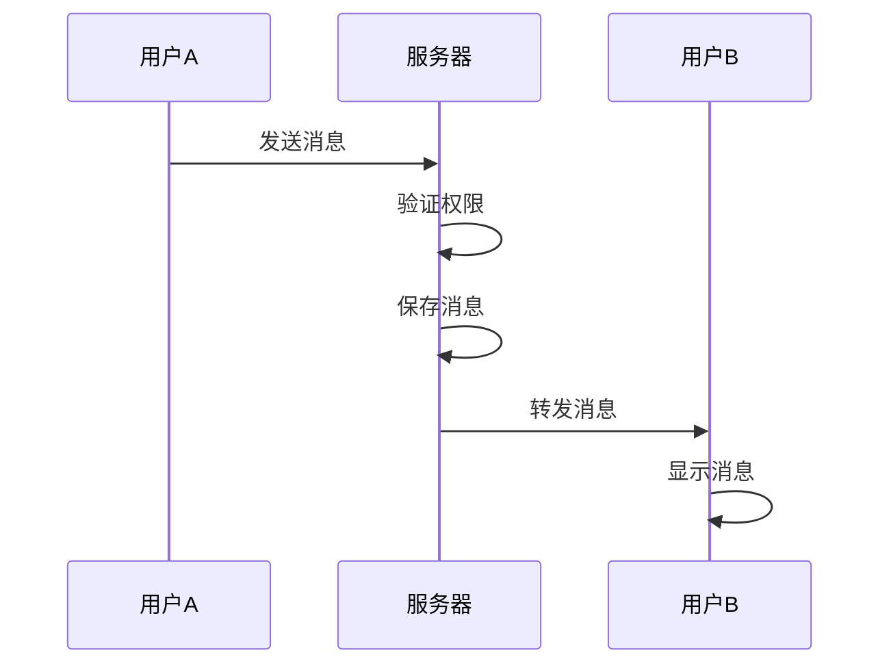
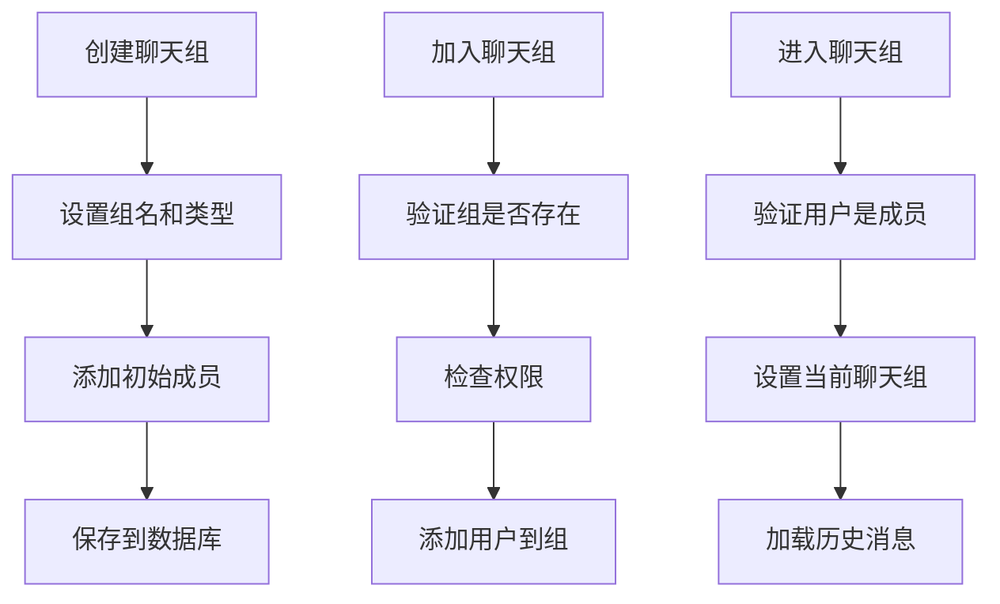
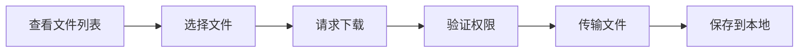
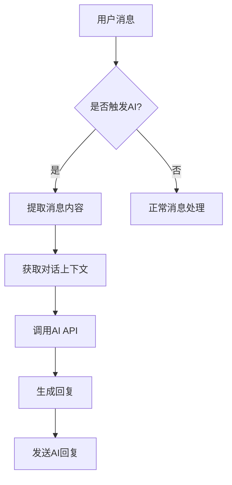
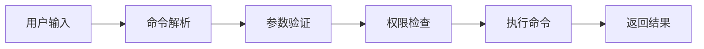

# Chat-Room 功能特性详解

## 🎯 功能概览

Chat-Room是一个功能完整的聊天室系统，包含了现代聊天应用的核心功能。让我们深入了解每个功能的设计思路和实现原理。

## 🔐 用户系统

### 用户注册与登录

**功能描述**：支持新用户注册和已有用户登录

**实现原理**：


**核心代码逻辑**：
```python
# 服务器端用户认证
def authenticate_user(self, username: str, password: str) -> Dict:
    """用户认证 - 验证用户名和密码"""
    user_info = self.db.authenticate_user(username, password)
    if not user_info:
        raise AuthenticationError("用户名或密码错误")
    return user_info
```

**学习要点**：
- **密码安全**：使用哈希算法存储密码，不存储明文
- **会话管理**：登录后创建用户会话，跟踪用户状态
- **错误处理**：友好的错误提示，不泄露敏感信息

### 在线状态管理

**功能描述**：实时显示用户在线/离线状态

**技术实现**：
- **连接跟踪**：服务器维护在线用户的Socket连接
- **状态同步**：用户状态变化时通知所有相关用户
- **心跳检测**：定期检查连接有效性

```python
# 在线用户管理
class UserManager:
    def __init__(self):
        self.online_users: Dict[int, socket.socket] = {}  # 在线用户映射
        self.user_sessions: Dict[int, Dict] = {}          # 用户会话信息
```

## 💬 聊天功能

### 实时消息传输

**功能描述**：支持用户间的实时消息发送和接收

**消息流程**：


**消息格式设计**：
```python
@dataclass
class ChatMessage(BaseMessage):
    """聊天消息数据结构"""
    sender_id: int = 0           # 发送者ID
    sender_username: str = ""    # 发送者用户名
    chat_group_id: int = 0       # 聊天组ID
    content: str = ""            # 消息内容
    timestamp: float = None      # 时间戳
```

**学习要点**：
- **消息序列化**：使用JSON格式进行网络传输
- **消息持久化**：所有消息保存到数据库
- **消息广播**：服务器向聊天组成员广播消息

### 聊天组管理

**功能描述**：支持创建、加入、进入聊天组

**聊天组类型**：
1. **公频聊天**：所有用户默认加入的公共聊天室
2. **群聊**：用户创建的多人聊天组
3. **私聊**：两人之间的私密对话

**操作流程**：


## 📁 文件传输

### 文件上传功能

**功能描述**：支持用户上传文件到聊天组

**技术实现**：
- **分块传输**：大文件分块上传，提高传输效率
- **类型检查**：限制允许上传的文件类型
- **大小限制**：防止过大文件影响系统性能
- **存储管理**：文件存储在服务器指定目录

```python
# 文件上传处理
def handle_file_upload(self, client_socket, user_info, message):
    """处理文件上传请求"""
    # 1. 验证文件信息
    # 2. 创建存储路径
    # 3. 接收文件数据
    # 4. 保存文件元数据
    # 5. 通知其他用户
```

### 文件下载功能

**功能描述**：支持用户下载聊天组中的文件

**下载流程**：


**学习要点**：
- **权限控制**：只能下载有权限访问的文件
- **断点续传**：支持大文件的断点续传
- **进度显示**：实时显示下载进度

## 🤖 AI智能助手

### AI集成架构

**功能描述**：集成智谱AI GLM-4-Flash模型，提供智能对话功能

**AI响应机制**：


**触发条件**：
1. **@AI标记**：在群聊中@AI用户
2. **关键词触发**：包含"AI"、"人工智能"等关键词
3. **私聊模式**：与AI的私聊对话
4. **问号结尾**：以问号结尾的问题

### 上下文管理

**功能描述**：维护对话上下文，提供连贯的对话体验

```python
class ContextManager:
    """AI对话上下文管理器"""
    def __init__(self):
        self.contexts: Dict[str, List[Dict]] = {}  # 上下文存储
        self.max_context_length = 10              # 最大上下文长度
        
    def add_message(self, context_id: str, role: str, content: str):
        """添加消息到上下文"""
        # 实现上下文管理逻辑
```

**学习要点**：
- **上下文限制**：控制上下文长度，避免API调用过长
- **自动清理**：定期清理过期的上下文数据
- **分组管理**：群聊和私聊使用不同的上下文

## 🎨 用户界面

### TUI界面设计

**功能描述**：基于Textual库的现代化终端用户界面

**界面布局**：
```
┌─────────────────────────────────────────────────────────┐
│                    Chat-Room 聊天室                      │
├─────────────────────────────────┬─────────────────────────┤
│                                 │                         │
│           聊天记录区             │        状态信息区        │
│                                 │                         │
│                                 │                         │
├─────────────────────────────────┴─────────────────────────┤
│                     消息输入区                            │
└─────────────────────────────────────────────────────────┘
```

**组件设计**：
```python
class ChatApp(App):
    """主应用界面"""
    def compose(self) -> ComposeResult:
        yield Header()                    # 标题栏
        yield RichLog(id="chat_log")     # 聊天记录
        yield ListView(id="status_list") # 状态列表
        yield Input(id="message_input")  # 输入框
        yield Footer()                   # 状态栏
```

### 主题系统

**功能描述**：支持多种界面主题，提供个性化体验

**主题特性**：
- **颜色方案**：不同的颜色搭配
- **样式定制**：字体、边框、间距等
- **动态切换**：运行时切换主题
- **响应式设计**：适应不同终端大小

## 🔧 命令系统

### 命令解析器

**功能描述**：解析用户输入的斜杠命令

**支持的命令**：
```
/help          - 显示帮助信息
/login         - 用户登录
/signin        - 用户注册
/info          - 显示用户信息
/list -u       - 列出在线用户
/list -c       - 列出聊天组
/create_chat   - 创建聊天组
/join_chat     - 加入聊天组
/enter_chat    - 进入聊天组
/send_files    - 发送文件
/recv_files    - 接收文件
/exit          - 退出系统
```

**命令处理流程**：


### 参数处理

**功能描述**：支持命令参数和选项

```python
@dataclass
class Command:
    """命令数据结构"""
    name: str                    # 命令名称
    args: List[str]             # 位置参数
    options: Dict[str, Any]     # 选项参数
    raw_input: str              # 原始输入
```

## 📊 配置管理

### YAML配置文件

**功能描述**：使用YAML格式的配置文件管理系统参数

**配置结构**：
```yaml
server:
  host: localhost
  port: 8888
  max_connections: 100

database:
  path: server/data/chatroom.db
  backup_enabled: true

ai:
  enabled: true
  api_key: "your-api-key"
  model: glm-4-flash
```

**学习要点**：
- **配置分离**：配置与代码分离，便于部署
- **环境适配**：不同环境使用不同配置
- **热更新**：部分配置支持运行时更新

## 📝 日志系统

### 分级日志记录

**功能描述**：完善的日志记录系统，支持调试和监控

**日志级别**：
- **DEBUG**：详细的调试信息
- **INFO**：一般信息记录
- **WARNING**：警告信息
- **ERROR**：错误信息
- **CRITICAL**：严重错误

**日志格式**：
```
2024-01-15 10:30:45 [INFO] server.core.server: 用户登录成功 user_id=1 username=alice
2024-01-15 10:31:02 [DEBUG] server.ai.ai_manager: AI回复生成 response_time=1.2s
```

## 🔒 安全特性

### 数据安全

1. **密码加密**：使用SHA-256哈希算法
2. **输入验证**：严格验证用户输入
3. **SQL注入防护**：使用参数化查询
4. **文件类型检查**：限制上传文件类型

### 网络安全

1. **连接验证**：验证客户端连接合法性
2. **会话管理**：安全的用户会话机制
3. **错误处理**：不泄露敏感信息的错误提示

## 💡 学习重点

### 对于初学者

1. **理解架构**：重点理解客户端-服务器架构
2. **学习协议**：掌握网络通信协议设计
3. **数据库操作**：学习SQLite数据库的使用
4. **异常处理**：理解完善的错误处理机制

### 对于进阶学习

1. **并发处理**：学习多线程编程
2. **性能优化**：理解系统性能优化方法
3. **扩展开发**：尝试添加新功能
4. **部署运维**：学习系统部署和监控

---

**下一步**：快速上手指南 → [getting-started.md](./getting-started.md)
