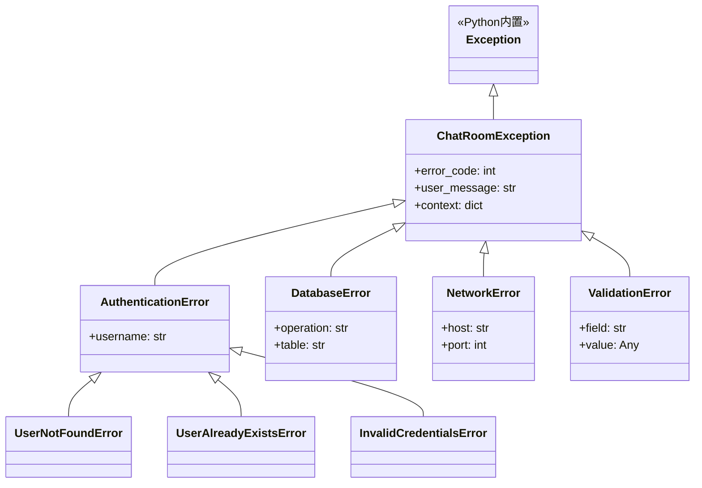

# 异常处理学习 - shared/exceptions.py

## 📋 模块概述

`shared/exceptions.py` 定义了Chat-Room项目中所有的自定义异常类。良好的异常处理是软件质量的重要标志，这个模块展示了如何设计一个完整的异常处理体系。

## 🎯 为什么需要自定义异常？

### Python内置异常的局限性

**内置异常的问题**：
```python
# 使用内置异常，信息不够具体
def authenticate_user(username, password):
    if not username:
        raise ValueError("用户名不能为空")  # 太泛化
    
    user = database.get_user(username)
    if not user:
        raise Exception("用户不存在")     # 太泛化
    
    if not verify_password(password, user.password_hash):
        raise RuntimeError("密码错误")   # 不合适的异常类型
```

**自定义异常的优势**：
```python
# 使用自定义异常，信息更具体
def authenticate_user(username, password):
    if not username:
        raise InvalidUsernameError("用户名不能为空")
    
    user = database.get_user(username)
    if not user:
        raise UserNotFoundError(f"用户 '{username}' 不存在")
    
    if not verify_password(password, user.password_hash):
        raise AuthenticationError("密码错误")
```

### 自定义异常的好处

1. **语义明确**：异常名称直接表达错误类型
2. **便于处理**：可以针对不同异常类型进行不同处理
3. **信息丰富**：可以携带更多上下文信息
4. **便于调试**：清晰的异常层次结构
5. **用户友好**：可以提供更好的错误提示

## 🏗️ 异常层次结构设计

### 异常继承关系



### 基础异常类设计

```python
class ChatRoomException(Exception):
    """Chat-Room项目的基础异常类"""
    
    def __init__(self, message: str, error_code: int = None, 
                 user_message: str = None, context: dict = None):
        """
        初始化异常
        
        Args:
            message: 技术错误信息（用于日志和调试）
            error_code: 错误代码（用于程序处理）
            user_message: 用户友好的错误信息（用于界面显示）
            context: 错误上下文信息（用于调试）
        """
        super().__init__(message)
        self.error_code = error_code
        self.user_message = user_message or message
        self.context = context or {}
        
        # 记录异常创建时间
        self.timestamp = time.time()
    
    def to_dict(self) -> dict:
        """转换为字典格式，便于序列化"""
        return {
            "exception_type": self.__class__.__name__,
            "message": str(self),
            "error_code": self.error_code,
            "user_message": self.user_message,
            "context": self.context,
            "timestamp": self.timestamp
        }
    
    def __str__(self) -> str:
        """字符串表示"""
        if self.error_code:
            return f"[{self.error_code}] {super().__str__()}"
        return super().__str__()
```

**设计亮点**：
- **多层信息**：技术信息、用户信息、错误代码分离
- **上下文保存**：保存错误发生时的环境信息
- **序列化支持**：可以转换为字典进行网络传输
- **时间戳**：记录异常发生时间，便于调试

## 🔐 认证相关异常

### 用户认证异常

```python
class AuthenticationError(ChatRoomException):
    """认证相关异常的基类"""
    
    def __init__(self, message: str, username: str = None, **kwargs):
        super().__init__(message, **kwargs)
        self.username = username

class UserNotFoundError(AuthenticationError):
    """用户不存在异常"""
    
    def __init__(self, username: str):
        super().__init__(
            message=f"用户 '{username}' 不存在",
            username=username,
            error_code=ErrorCode.USER_NOT_FOUND,
            user_message="用户名不存在，请检查输入或注册新账号"
        )

class UserAlreadyExistsError(AuthenticationError):
    """用户已存在异常"""
    
    def __init__(self, username: str):
        super().__init__(
            message=f"用户 '{username}' 已存在",
            username=username,
            error_code=ErrorCode.USER_ALREADY_EXISTS,
            user_message="用户名已被使用，请选择其他用户名"
        )

class InvalidCredentialsError(AuthenticationError):
    """无效凭据异常"""
    
    def __init__(self, username: str):
        super().__init__(
            message=f"用户 '{username}' 的凭据无效",
            username=username,
            error_code=ErrorCode.AUTHENTICATION_FAILED,
            user_message="用户名或密码错误"
        )
```

**使用示例**：
```python
# 在用户管理器中使用
def authenticate_user(self, username: str, password: str):
    try:
        user = self.db.get_user_by_username(username)
    except DatabaseError:
        raise UserNotFoundError(username)
    
    if not self.verify_password(password, user.password_hash):
        raise InvalidCredentialsError(username)
    
    return user
```

## 💾 数据库相关异常

```python
class DatabaseError(ChatRoomException):
    """数据库操作异常"""
    
    def __init__(self, message: str, operation: str = None, 
                 table: str = None, **kwargs):
        super().__init__(message, **kwargs)
        self.operation = operation  # 操作类型：SELECT, INSERT, UPDATE, DELETE
        self.table = table         # 涉及的表名

class DatabaseConnectionError(DatabaseError):
    """数据库连接异常"""
    
    def __init__(self, db_path: str, original_error: Exception = None):
        super().__init__(
            message=f"无法连接到数据库: {db_path}",
            error_code=ErrorCode.DATABASE_CONNECTION_ERROR,
            user_message="数据库连接失败，请联系管理员",
            context={"db_path": db_path, "original_error": str(original_error)}
        )

class DataIntegrityError(DatabaseError):
    """数据完整性异常"""
    
    def __init__(self, message: str, table: str, constraint: str = None):
        super().__init__(
            message=message,
            table=table,
            error_code=ErrorCode.DATA_INTEGRITY_ERROR,
            user_message="数据操作违反了完整性约束",
            context={"constraint": constraint}
        )
```

**实际应用**：
```python
# 在数据库操作中使用
def create_user(self, username: str, password: str) -> int:
    try:
        with self.get_connection() as conn:
            cursor = conn.cursor()
            cursor.execute(
                "INSERT INTO users (username, password_hash) VALUES (?, ?)",
                (username, hash_password(password))
            )
            return cursor.lastrowid
    except sqlite3.IntegrityError as e:
        if "UNIQUE constraint failed" in str(e):
            raise UserAlreadyExistsError(username)
        else:
            raise DataIntegrityError(str(e), "users")
    except sqlite3.Error as e:
        raise DatabaseError(f"创建用户失败: {e}", "INSERT", "users")
```

## 🌐 网络相关异常

```python
class NetworkError(ChatRoomException):
    """网络操作异常"""
    
    def __init__(self, message: str, host: str = None, 
                 port: int = None, **kwargs):
        super().__init__(message, **kwargs)
        self.host = host
        self.port = port

class ConnectionError(NetworkError):
    """连接异常"""
    
    def __init__(self, host: str, port: int, reason: str = None):
        super().__init__(
            message=f"无法连接到 {host}:{port}" + (f" - {reason}" if reason else ""),
            host=host,
            port=port,
            error_code=ErrorCode.CONNECTION_ERROR,
            user_message="无法连接到服务器，请检查网络连接"
        )

class MessageSendError(NetworkError):
    """消息发送异常"""
    
    def __init__(self, message_type: str, reason: str = None):
        super().__init__(
            message=f"发送消息失败: {message_type}" + (f" - {reason}" if reason else ""),
            error_code=ErrorCode.MESSAGE_SEND_ERROR,
            user_message="消息发送失败，请重试",
            context={"message_type": message_type}
        )
```

## ✅ 验证相关异常

```python
class ValidationError(ChatRoomException):
    """数据验证异常"""
    
    def __init__(self, message: str, field: str = None, 
                 value: Any = None, **kwargs):
        super().__init__(message, **kwargs)
        self.field = field
        self.value = value

class InvalidUsernameError(ValidationError):
    """无效用户名异常"""
    
    def __init__(self, username: str, reason: str):
        super().__init__(
            message=f"无效用户名 '{username}': {reason}",
            field="username",
            value=username,
            error_code=ErrorCode.INVALID_USERNAME,
            user_message=f"用户名格式错误: {reason}"
        )

class InvalidPasswordError(ValidationError):
    """无效密码异常"""
    
    def __init__(self, reason: str):
        super().__init__(
            message=f"无效密码: {reason}",
            field="password",
            error_code=ErrorCode.INVALID_PASSWORD,
            user_message=f"密码格式错误: {reason}"
        )
```

## 🎨 异常处理最佳实践

### 1. 异常捕获和转换

```python
def handle_database_operation(func):
    """装饰器：处理数据库操作异常"""
    def wrapper(*args, **kwargs):
        try:
            return func(*args, **kwargs)
        except sqlite3.IntegrityError as e:
            if "UNIQUE constraint failed" in str(e):
                raise UserAlreadyExistsError("用户名已存在")
            else:
                raise DataIntegrityError(str(e), "unknown")
        except sqlite3.Error as e:
            raise DatabaseError(f"数据库操作失败: {e}")
        except Exception as e:
            raise ChatRoomException(f"未知错误: {e}")
    return wrapper

# 使用装饰器
@handle_database_operation
def create_user(self, username: str, password: str):
    # 数据库操作代码
    pass
```

### 2. 异常日志记录

```python
import logging
from functools import wraps

def log_exceptions(logger_name: str = "exceptions"):
    """装饰器：记录异常日志"""
    def decorator(func):
        @wraps(func)
        def wrapper(*args, **kwargs):
            logger = logging.getLogger(logger_name)
            try:
                return func(*args, **kwargs)
            except ChatRoomException as e:
                logger.error(
                    f"业务异常: {e}",
                    extra={
                        "exception_type": e.__class__.__name__,
                        "error_code": e.error_code,
                        "context": e.context
                    }
                )
                raise
            except Exception as e:
                logger.critical(f"系统异常: {e}", exc_info=True)
                raise
        return wrapper
    return decorator
```

### 3. 异常响应处理

```python
def handle_client_exception(client_socket, exception: Exception):
    """处理客户端异常，发送错误响应"""
    if isinstance(exception, ChatRoomException):
        # 发送结构化错误响应
        error_response = ErrorMessage(
            error_code=exception.error_code,
            error_message=exception.user_message,
            context=exception.context
        )
    else:
        # 发送通用错误响应
        error_response = ErrorMessage(
            error_code=ErrorCode.SERVER_ERROR,
            error_message="服务器内部错误"
        )
    
    try:
        response_json = error_response.to_json() + '\n'
        client_socket.send(response_json.encode('utf-8'))
    except:
        # 如果发送失败，断开连接
        client_socket.close()
```

## 🔍 异常调试工具

### 异常分析器

```python
class ExceptionAnalyzer:
    """异常分析工具"""
    
    def __init__(self):
        self.exception_stats = {}
    
    def record_exception(self, exception: Exception):
        """记录异常统计"""
        exc_type = exception.__class__.__name__
        if exc_type not in self.exception_stats:
            self.exception_stats[exc_type] = {
                "count": 0,
                "first_seen": time.time(),
                "last_seen": time.time(),
                "messages": []
            }
        
        stats = self.exception_stats[exc_type]
        stats["count"] += 1
        stats["last_seen"] = time.time()
        stats["messages"].append(str(exception))
    
    def get_report(self) -> str:
        """生成异常报告"""
        report = "异常统计报告\n" + "="*50 + "\n"
        
        for exc_type, stats in self.exception_stats.items():
            report += f"\n{exc_type}:\n"
            report += f"  发生次数: {stats['count']}\n"
            report += f"  首次发生: {datetime.fromtimestamp(stats['first_seen'])}\n"
            report += f"  最后发生: {datetime.fromtimestamp(stats['last_seen'])}\n"
            
            if stats['messages']:
                report += f"  最近消息: {stats['messages'][-1]}\n"
        
        return report
```

## 💡 学习练习

### 练习1：创建文件操作异常

```python
class FileOperationError(ChatRoomException):
    """文件操作异常"""
    
    def __init__(self, message: str, file_path: str = None, 
                 operation: str = None, **kwargs):
        super().__init__(message, **kwargs)
        self.file_path = file_path
        self.operation = operation

class FileNotFoundError(FileOperationError):
    """文件不存在异常"""
    
    def __init__(self, file_path: str):
        super().__init__(
            message=f"文件不存在: {file_path}",
            file_path=file_path,
            operation="read",
            error_code=ErrorCode.FILE_NOT_FOUND,
            user_message="请求的文件不存在"
        )

class FileSizeExceededError(FileOperationError):
    """文件大小超限异常"""
    
    def __init__(self, file_path: str, size: int, max_size: int):
        super().__init__(
            message=f"文件大小超限: {file_path} ({size} > {max_size})",
            file_path=file_path,
            operation="upload",
            error_code=ErrorCode.FILE_SIZE_EXCEEDED,
            user_message=f"文件大小超过限制 ({max_size} bytes)",
            context={"size": size, "max_size": max_size}
        )
```

### 练习2：异常处理中间件

```python
class ExceptionMiddleware:
    """异常处理中间件"""
    
    def __init__(self, app):
        self.app = app
        self.analyzer = ExceptionAnalyzer()
    
    def __call__(self, *args, **kwargs):
        try:
            return self.app(*args, **kwargs)
        except Exception as e:
            self.analyzer.record_exception(e)
            self.handle_exception(e)
            raise
    
    def handle_exception(self, exception: Exception):
        """处理异常"""
        if isinstance(exception, ChatRoomException):
            print(f"业务异常: {exception.user_message}")
        else:
            print(f"系统异常: {exception}")
```

## 🤔 思考题

1. **什么时候应该创建新的异常类？**
   - 需要特殊处理的错误情况
   - 需要携带特定上下文信息
   - 需要区分不同的错误类型

2. **如何平衡异常的详细程度和安全性？**
   - 技术信息用于调试
   - 用户信息要友好且安全
   - 敏感信息不能泄露

3. **异常处理对性能有什么影响？**
   - 异常创建有开销
   - 异常传播影响性能
   - 合理使用异常机制

## 📚 扩展学习

### Python异常处理
- **异常链**：使用`raise ... from ...`语法
- **上下文管理器**：`with`语句和异常处理
- **异常组**：Python 3.11的新特性

### 设计模式
- **责任链模式**：异常处理链
- **策略模式**：不同异常的处理策略
- **观察者模式**：异常事件通知

---

**下一步**：学习日志系统 → [logger.md](./logger.md)
