# 日志系统学习 - shared/logger.py

## 📋 模块概述

`shared/logger.py` 实现了Chat-Room项目的统一日志系统。一个好的日志系统是软件开发和运维的重要工具，它帮助我们调试问题、监控系统状态、分析用户行为。

## 🎯 为什么需要日志系统？

### 开发阶段的价值

**调试问题**：
```python
# 没有日志的代码
def authenticate_user(username, password):
    user = database.get_user(username)
    if user and verify_password(password, user.password_hash):
        return user
    return None  # 不知道失败的原因

# 有日志的代码
def authenticate_user(username, password):
    logger.info(f"用户认证开始: {username}")
    
    user = database.get_user(username)
    if not user:
        logger.warning(f"用户不存在: {username}")
        return None
    
    if verify_password(password, user.password_hash):
        logger.info(f"用户认证成功: {username}")
        return user
    else:
        logger.warning(f"密码错误: {username}")
        return None
```

### 生产环境的价值

**监控和分析**：
- **性能监控**：记录操作耗时，发现性能瓶颈
- **错误追踪**：记录错误详情，快速定位问题
- **用户行为**：分析用户使用模式
- **安全审计**：记录敏感操作，发现安全问题

## 🏗️ 日志系统架构

### 日志级别设计

```mermaid
graph TD
    A[CRITICAL<br/>严重错误] --> B[ERROR<br/>错误]
    B --> C[WARNING<br/>警告]
    C --> D[INFO<br/>信息]
    D --> E[DEBUG<br/>调试]
    
    style A fill:#ff6b6b
    style B fill:#ffa726
    style C fill:#ffeb3b
    style D fill:#66bb6a
    style E fill:#42a5f5
```



**级别说明**：
- **CRITICAL (50)**：系统崩溃级别的错误
- **ERROR (40)**：严重错误，但程序可以继续运行
- **WARNING (30)**：警告信息，可能的问题
- **INFO (20)**：一般信息，记录重要事件
- **DEBUG (10)**：详细的调试信息

### 日志器层次结构

```python
# Chat-Room项目的日志器层次
root_logger = logging.getLogger()                    # 根日志器
chatroom_logger = logging.getLogger("chatroom")      # 项目根日志器
server_logger = logging.getLogger("chatroom.server") # 服务器日志器
client_logger = logging.getLogger("chatroom.client") # 客户端日志器

# 更细粒度的日志器
auth_logger = logging.getLogger("chatroom.server.auth")     # 认证模块
db_logger = logging.getLogger("chatroom.server.database")   # 数据库模块
ai_logger = logging.getLogger("chatroom.server.ai")         # AI模块
```

**层次结构的优势**：
- **继承配置**：子日志器继承父日志器的配置
- **分级控制**：可以为不同模块设置不同的日志级别
- **便于管理**：统一的命名规范，便于配置和过滤

## 🔧 日志配置系统

### 基础配置函数

```python
def setup_logger(name: str, log_file: str = None, 
                level: int = logging.INFO) -> logging.Logger:
    """
    设置日志器
    
    Args:
        name: 日志器名称
        log_file: 日志文件路径
        level: 日志级别
        
    Returns:
        配置好的日志器
    """
    logger = logging.getLogger(name)
    logger.setLevel(level)
    
    # 避免重复添加处理器
    if logger.handlers:
        return logger
    
    # 创建格式化器
    formatter = logging.Formatter(
        '%(asctime)s [%(levelname)s] %(name)s: %(message)s',
        datefmt='%Y-%m-%d %H:%M:%S'
    )
    
    # 控制台处理器
    console_handler = logging.StreamHandler()
    console_handler.setFormatter(formatter)
    logger.addHandler(console_handler)
    
    # 文件处理器（如果指定了文件）
    if log_file:
        # 确保日志目录存在
        os.makedirs(os.path.dirname(log_file), exist_ok=True)
        
        file_handler = logging.FileHandler(log_file, encoding='utf-8')
        file_handler.setFormatter(formatter)
        logger.addHandler(file_handler)
    
    return logger
```

### 高级配置特性

```python
def setup_rotating_logger(name: str, log_file: str, 
                         max_bytes: int = 10*1024*1024,  # 10MB
                         backup_count: int = 5) -> logging.Logger:
    """
    设置轮转日志器
    
    Args:
        max_bytes: 单个日志文件最大大小
        backup_count: 保留的备份文件数量
    """
    from logging.handlers import RotatingFileHandler
    
    logger = logging.getLogger(name)
    logger.setLevel(logging.INFO)
    
    # 轮转文件处理器
    rotating_handler = RotatingFileHandler(
        log_file, 
        maxBytes=max_bytes,
        backupCount=backup_count,
        encoding='utf-8'
    )
    
    formatter = logging.Formatter(
        '%(asctime)s [%(levelname)s] %(name)s: %(message)s'
    )
    rotating_handler.setFormatter(formatter)
    logger.addHandler(rotating_handler)
    
    return logger
```

## 📝 专用日志记录器

### 数据库操作日志

```python
def log_database_operation(operation: str, table: str, 
                          user_id: int = None, **kwargs):
    """
    记录数据库操作日志
    
    Args:
        operation: 操作类型 (SELECT, INSERT, UPDATE, DELETE)
        table: 表名
        user_id: 用户ID
        **kwargs: 额外的上下文信息
    """
    logger = logging.getLogger("chatroom.database")
    
    context = {
        "operation": operation,
        "table": table,
        "user_id": user_id,
        **kwargs
    }
    
    # 使用结构化日志格式
    logger.info(f"数据库操作: {operation} {table}", extra=context)
```

**使用示例**：
```python
# 在数据库操作中使用
def create_user(self, username: str, password: str) -> int:
    log_database_operation("INSERT", "users", username=username)
    
    try:
        with self.get_connection() as conn:
            cursor = conn.cursor()
            cursor.execute(
                "INSERT INTO users (username, password_hash) VALUES (?, ?)",
                (username, hash_password(password))
            )
            user_id = cursor.lastrowid
            
            log_database_operation("INSERT", "users", 
                                 user_id=user_id, 
                                 username=username,
                                 status="success")
            return user_id
            
    except Exception as e:
        log_database_operation("INSERT", "users",
                             username=username,
                             status="error",
                             error=str(e))
        raise
```

### AI操作日志

```python
def log_ai_operation(operation: str, model: str, 
                    user_id: int = None, **kwargs):
    """
    记录AI操作日志
    
    Args:
        operation: 操作类型 (generate_reply, process_message)
        model: AI模型名称
        user_id: 用户ID
        **kwargs: 额外信息（如响应时间、token数量等）
    """
    logger = logging.getLogger("chatroom.ai")
    
    context = {
        "operation": operation,
        "model": model,
        "user_id": user_id,
        **kwargs
    }
    
    logger.info(f"AI操作: {operation} using {model}", extra=context)
```

### 网络操作日志

```python
def log_network_operation(operation: str, client_info: dict = None, 
                         **kwargs):
    """
    记录网络操作日志
    
    Args:
        operation: 操作类型 (connect, disconnect, send_message)
        client_info: 客户端信息 (IP, port, user_id)
        **kwargs: 额外信息
    """
    logger = logging.getLogger("chatroom.network")
    
    context = {
        "operation": operation,
        "client_info": client_info or {},
        **kwargs
    }
    
    logger.info(f"网络操作: {operation}", extra=context)
```

## 🎨 日志格式化

### 自定义格式化器

```python
class ChatRoomFormatter(logging.Formatter):
    """Chat-Room专用日志格式化器"""
    
    def __init__(self):
        super().__init__()
        
        # 不同级别使用不同颜色（终端支持）
        self.COLORS = {
            'DEBUG': '\033[36m',    # 青色
            'INFO': '\033[32m',     # 绿色
            'WARNING': '\033[33m',  # 黄色
            'ERROR': '\033[31m',    # 红色
            'CRITICAL': '\033[35m', # 紫色
            'RESET': '\033[0m'      # 重置
        }
    
    def format(self, record):
        # 基础格式
        log_time = self.formatTime(record, '%Y-%m-%d %H:%M:%S')
        level_name = record.levelname
        logger_name = record.name
        message = record.getMessage()
        
        # 添加颜色（如果是终端输出）
        if hasattr(record, 'stream') and hasattr(record.stream, 'isatty'):
            color = self.COLORS.get(level_name, '')
            reset = self.COLORS['RESET']
            level_name = f"{color}{level_name}{reset}"
        
        # 构建基础日志
        log_line = f"{log_time} [{level_name}] {logger_name}: {message}"
        
        # 添加额外的上下文信息
        if hasattr(record, 'user_id') and record.user_id:
            log_line += f" user_id={record.user_id}"
        
        if hasattr(record, 'operation') and record.operation:
            log_line += f" operation={record.operation}"
        
        if hasattr(record, 'response_time') and record.response_time:
            log_line += f" response_time={record.response_time:.3f}s"
        
        return log_line
```

### JSON格式日志

```python
import json

class JSONFormatter(logging.Formatter):
    """JSON格式的日志格式化器"""
    
    def format(self, record):
        log_entry = {
            "timestamp": self.formatTime(record),
            "level": record.levelname,
            "logger": record.name,
            "message": record.getMessage(),
            "module": record.module,
            "function": record.funcName,
            "line": record.lineno
        }
        
        # 添加额外的字段
        for key, value in record.__dict__.items():
            if key not in ['name', 'msg', 'args', 'levelname', 'levelno', 
                          'pathname', 'filename', 'module', 'lineno', 
                          'funcName', 'created', 'msecs', 'relativeCreated',
                          'thread', 'threadName', 'processName', 'process']:
                log_entry[key] = value
        
        return json.dumps(log_entry, ensure_ascii=False)
```

## 🔍 日志分析工具

### 日志查看器

```python
class LogViewer:
    """日志查看和分析工具"""
    
    def __init__(self, log_file: str):
        self.log_file = log_file
    
    def tail_logs(self, lines: int = 50):
        """显示最新的日志"""
        try:
            with open(self.log_file, 'r', encoding='utf-8') as f:
                all_lines = f.readlines()
                recent_lines = all_lines[-lines:]
                
                for line in recent_lines:
                    print(line.rstrip())
        except FileNotFoundError:
            print(f"日志文件不存在: {self.log_file}")
    
    def filter_logs(self, level: str = None, keyword: str = None):
        """过滤日志"""
        try:
            with open(self.log_file, 'r', encoding='utf-8') as f:
                for line in f:
                    # 级别过滤
                    if level and f"[{level}]" not in line:
                        continue
                    
                    # 关键词过滤
                    if keyword and keyword not in line:
                        continue
                    
                    print(line.rstrip())
        except FileNotFoundError:
            print(f"日志文件不存在: {self.log_file}")
    
    def analyze_errors(self):
        """分析错误日志"""
        error_count = 0
        error_types = {}
        
        try:
            with open(self.log_file, 'r', encoding='utf-8') as f:
                for line in f:
                    if "[ERROR]" in line or "[CRITICAL]" in line:
                        error_count += 1
                        
                        # 提取错误类型
                        if ":" in line:
                            error_msg = line.split(":", 2)[-1].strip()
                            error_type = error_msg.split()[0] if error_msg else "Unknown"
                            error_types[error_type] = error_types.get(error_type, 0) + 1
            
            print(f"总错误数: {error_count}")
            print("错误类型统计:")
            for error_type, count in sorted(error_types.items(), 
                                          key=lambda x: x[1], reverse=True):
                print(f"  {error_type}: {count}")
                
        except FileNotFoundError:
            print(f"日志文件不存在: {self.log_file}")
```

## 💡 实际应用示例

### 服务器启动日志

```python
# server/main.py
def start_server():
    logger = get_logger("chatroom.server")
    
    logger.info("服务器启动开始")
    logger.info(f"配置信息: host={config.host}, port={config.port}")
    
    try:
        # 初始化数据库
        logger.info("初始化数据库")
        init_database()
        logger.info("数据库初始化完成")
        
        # 启动AI服务
        if config.ai_enabled:
            logger.info("启动AI服务")
            ai_manager = AIManager(config.ai_api_key)
            logger.info(f"AI服务状态: {'启用' if ai_manager.is_enabled() else '禁用'}")
        
        # 启动网络服务
        logger.info(f"启动网络服务，监听 {config.host}:{config.port}")
        server = ChatRoomServer(config.host, config.port)
        server.start()
        
        logger.info("服务器启动成功")
        
    except Exception as e:
        logger.critical(f"服务器启动失败: {e}", exc_info=True)
        raise
```

### 用户操作日志

```python
# 用户登录
def handle_login(self, client_socket, message: LoginRequest):
    logger = get_logger("chatroom.server.auth")
    client_ip = client_socket.getpeername()[0]
    
    logger.info("用户登录请求", 
               extra={"username": message.username, "client_ip": client_ip})
    
    try:
        user_info = self.user_manager.authenticate_user(
            message.username, message.password
        )
        
        logger.info("用户登录成功",
                   extra={"user_id": user_info['id'], 
                         "username": message.username,
                         "client_ip": client_ip})
        
    except AuthenticationError as e:
        logger.warning("用户登录失败",
                      extra={"username": message.username,
                            "client_ip": client_ip,
                            "reason": str(e)})
```

## 🛠️ 日志配置管理

### 配置文件方式

```yaml
# config/logging.yaml
version: 1
disable_existing_loggers: false

formatters:
  standard:
    format: '%(asctime)s [%(levelname)s] %(name)s: %(message)s'
    datefmt: '%Y-%m-%d %H:%M:%S'
  
  detailed:
    format: '%(asctime)s [%(levelname)s] %(name)s:%(lineno)d: %(message)s'
    datefmt: '%Y-%m-%d %H:%M:%S'

handlers:
  console:
    class: logging.StreamHandler
    level: INFO
    formatter: standard
    stream: ext://sys.stdout
  
  file:
    class: logging.handlers.RotatingFileHandler
    level: DEBUG
    formatter: detailed
    filename: logs/chatroom.log
    maxBytes: 10485760  # 10MB
    backupCount: 5
    encoding: utf-8

loggers:
  chatroom:
    level: DEBUG
    handlers: [console, file]
    propagate: false
  
  chatroom.server:
    level: INFO
    handlers: [file]
    propagate: true
  
  chatroom.database:
    level: WARNING
    handlers: [file]
    propagate: true

root:
  level: WARNING
  handlers: [console]
```

### 加载配置

```python
import yaml
import logging.config

def load_logging_config(config_file: str = "config/logging.yaml"):
    """加载日志配置"""
    try:
        with open(config_file, 'r', encoding='utf-8') as f:
            config = yaml.safe_load(f)
        
        # 确保日志目录存在
        for handler_name, handler_config in config.get('handlers', {}).items():
            if 'filename' in handler_config:
                log_dir = os.path.dirname(handler_config['filename'])
                os.makedirs(log_dir, exist_ok=True)
        
        logging.config.dictConfig(config)
        print("日志配置加载成功")
        
    except Exception as e:
        print(f"日志配置加载失败: {e}")
        # 使用基础配置
        logging.basicConfig(level=logging.INFO)
```

## 🤔 思考题

1. **如何平衡日志的详细程度和性能？**
   - 合理设置日志级别
   - 使用异步日志记录
   - 避免在循环中记录过多日志

2. **敏感信息如何处理？**
   - 密码等敏感信息不记录
   - 使用脱敏处理
   - 分离敏感和非敏感日志

3. **生产环境的日志管理策略？**
   - 日志轮转和清理
   - 集中化日志收集
   - 实时监控和告警

## 📚 扩展学习

### Python日志进阶
- **异步日志**：使用`concurrent.futures`提高性能
- **结构化日志**：JSON格式便于分析
- **日志聚合**：ELK Stack、Fluentd等工具

### 监控和运维
- **日志分析**：正则表达式、数据分析
- **告警系统**：基于日志的自动告警
- **性能监控**：APM工具集成

---

**下一步**：学习服务器核心模块 → [../03-server-modules/](../03-server-modules/)
