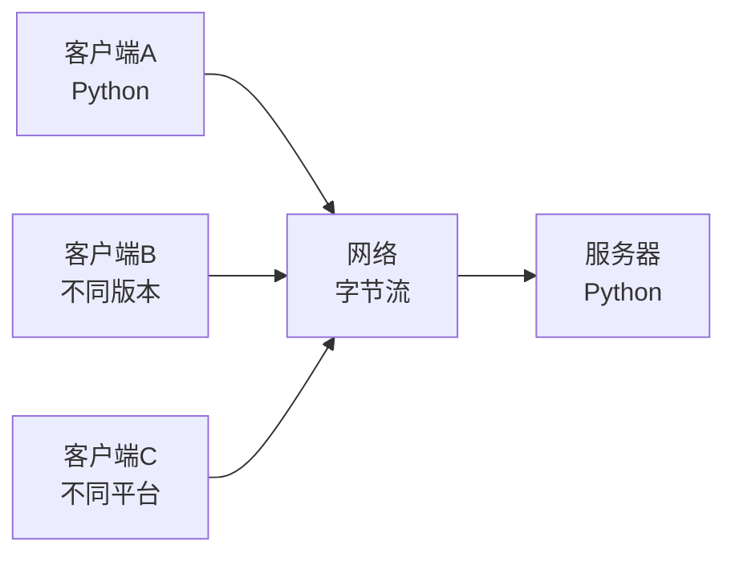
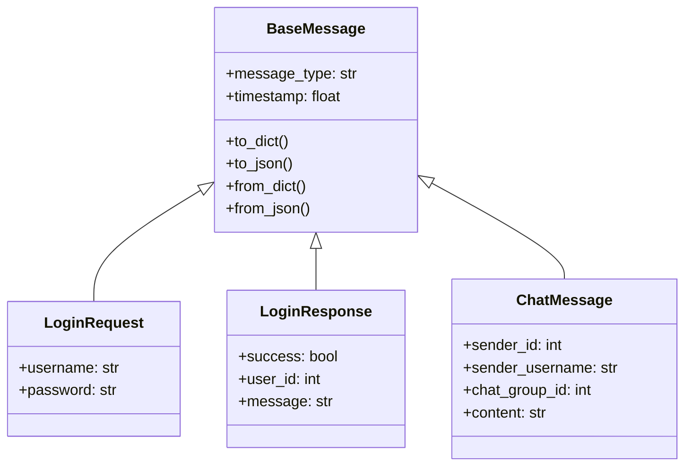
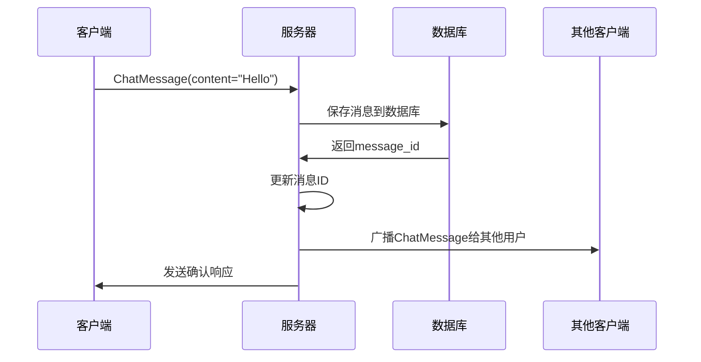

# 消息协议学习 - shared/messages.py

## 📋 模块概述

`shared/messages.py` 是Chat-Room项目的消息协议核心，定义了客户端和服务器之间通信的所有消息格式。这个模块展示了如何设计一个完整的网络通信协议。

## 🎯 消息协议设计原理

### 为什么需要统一的消息格式？

**网络通信的挑战**：


**解决方案**：统一的消息协议
- **序列化**：将Python对象转换为JSON字符串
- **反序列化**：将JSON字符串转换回Python对象
- **类型安全**：使用数据类确保消息格式正确
- **版本兼容**：支持协议的向后兼容

### 消息协议的设计目标

1. **简单易懂**：JSON格式，人类可读
2. **类型安全**：使用Python数据类和类型提示
3. **可扩展**：容易添加新的消息类型
4. **高效传输**：紧凑的数据格式
5. **错误处理**：完善的错误消息机制

## 🏗️ 消息架构设计

### 基础消息类

```python
@dataclass
class BaseMessage:
    """所有消息的基类"""
    message_type: str           # 消息类型标识
    timestamp: float = None     # 时间戳
    
    def __post_init__(self):
        """对象创建后自动设置时间戳"""
        if self.timestamp is None:
            self.timestamp = time.time()
    
    def to_dict(self) -> Dict[str, Any]:
        """转换为字典格式"""
        return asdict(self)
    
    def to_json(self) -> str:
        """转换为JSON字符串"""
        return json.dumps(self.to_dict(), ensure_ascii=False)
```

**设计亮点**：
- **@dataclass装饰器**：自动生成`__init__`、`__repr__`等方法
- **自动时间戳**：`__post_init__`方法自动设置创建时间
- **序列化方法**：提供字典和JSON转换功能
- **中文支持**：`ensure_ascii=False`支持中文字符

### 消息类型层次结构



## 📨 具体消息类型详解

### 1. 认证消息

#### 登录请求消息
```python
@dataclass
class LoginRequest(BaseMessage):
    """登录请求消息"""
    message_type: str = MessageType.LOGIN_REQUEST
    username: str = ""
    password: str = ""
```

**使用示例**：
```python
# 创建登录请求
login_msg = LoginRequest(
    username="alice",
    password="secret123"
)

# 序列化为JSON
json_str = login_msg.to_json()
# 结果：{"message_type": "login_request", "timestamp": 1642345678.9, "username": "alice", "password": "secret123"}

# 发送到服务器
client_socket.send(json_str.encode('utf-8'))
```

#### 登录响应消息
```python
@dataclass
class LoginResponse(BaseMessage):
    """登录响应消息"""
    message_type: str = MessageType.LOGIN_RESPONSE
    success: bool = False
    user_id: int = 0
    username: str = ""
    message: str = ""
```

**服务器端使用**：
```python
# 认证成功
response = LoginResponse(
    success=True,
    user_id=123,
    username="alice",
    message="登录成功"
)

# 认证失败
response = LoginResponse(
    success=False,
    message="用户名或密码错误"
)
```

### 2. 聊天消息

```python
@dataclass
class ChatMessage(BaseMessage):
    """聊天消息"""
    message_type: str = MessageType.CHAT_MESSAGE
    sender_id: int = 0              # 发送者ID
    sender_username: str = ""       # 发送者用户名
    chat_group_id: int = 0          # 聊天组ID
    chat_group_name: str = ""       # 聊天组名称
    content: str = ""               # 消息内容
    message_id: Optional[int] = None # 消息ID（数据库主键）
```

**消息流转过程**：


### 3. 文件传输消息

#### 文件上传请求
```python
@dataclass
class FileUploadRequest(BaseMessage):
    """文件上传请求"""
    message_type: str = MessageType.FILE_UPLOAD_REQUEST
    filename: str = ""              # 原始文件名
    file_size: int = 0              # 文件大小
    file_type: str = ""             # 文件类型
    chat_group_id: int = 0          # 目标聊天组
    chunk_count: int = 0            # 分块数量
```

#### 文件信息响应
```python
@dataclass
class FileInfoResponse(BaseMessage):
    """文件信息响应"""
    message_type: str = MessageType.FILE_INFO_RESPONSE
    files: List[FileInfo] = field(default_factory=list)
    
@dataclass
class FileInfo:
    """文件信息数据结构"""
    file_id: int
    original_filename: str
    file_size: int
    uploader_username: str
    upload_time: str
```

### 4. 列表查询消息

```python
@dataclass
class ListUsersResponse(BaseMessage):
    """用户列表响应"""
    message_type: str = MessageType.LIST_USERS_RESPONSE
    users: List[UserInfo] = field(default_factory=list)

@dataclass
class UserInfo:
    """用户信息数据结构"""
    user_id: int
    username: str
    is_online: bool
```

## 🔧 消息处理机制

### 消息工厂模式

```python
def create_message_from_dict(data: Dict[str, Any]) -> BaseMessage:
    """从字典创建消息对象（工厂模式）"""
    message_type = data.get("message_type")
    
    # 消息类型映射表
    message_classes = {
        MessageType.LOGIN_REQUEST: LoginRequest,
        MessageType.LOGIN_RESPONSE: LoginResponse,
        MessageType.CHAT_MESSAGE: ChatMessage,
        MessageType.FILE_UPLOAD_REQUEST: FileUploadRequest,
        # ... 更多消息类型
    }
    
    message_class = message_classes.get(message_type, BaseMessage)
    return message_class.from_dict(data)
```

**工厂模式的优势**：
- **解耦创建逻辑**：消息创建与具体类型分离
- **易于扩展**：添加新消息类型只需要更新映射表
- **类型安全**：确保创建正确的消息对象

### 消息解析器

```python
def parse_message(json_str: str) -> BaseMessage:
    """解析JSON消息字符串"""
    try:
        data = json.loads(json_str)
        return create_message_from_dict(data)
    except (json.JSONDecodeError, KeyError, TypeError) as e:
        # 解析失败，返回错误消息
        return ErrorMessage(
            error_code=ErrorCode.INVALID_MESSAGE_FORMAT,
            error_message=f"消息解析失败: {str(e)}"
        )
```

**错误处理策略**：
- **捕获异常**：处理JSON解析错误
- **返回错误消息**：而不是抛出异常
- **保持系统稳定**：避免因单个错误消息导致系统崩溃

## 🎨 高级特性

### 1. 消息验证

```python
@dataclass
class ChatMessage(BaseMessage):
    content: str = ""
    
    def __post_init__(self):
        super().__post_init__()
        # 验证消息内容
        if not self.content.strip():
            raise ValueError("消息内容不能为空")
        if len(self.content) > 1000:
            raise ValueError("消息内容过长")
```

### 2. 消息压缩

```python
import gzip
import base64

class BaseMessage:
    def to_compressed_json(self) -> str:
        """压缩的JSON格式"""
        json_str = self.to_json()
        compressed = gzip.compress(json_str.encode('utf-8'))
        return base64.b64encode(compressed).decode('ascii')
    
    @classmethod
    def from_compressed_json(cls, compressed_str: str):
        """从压缩JSON创建对象"""
        compressed = base64.b64decode(compressed_str.encode('ascii'))
        json_str = gzip.decompress(compressed).decode('utf-8')
        return cls.from_json(json_str)
```

### 3. 消息加密

```python
from cryptography.fernet import Fernet

class SecureMessage(BaseMessage):
    """加密消息基类"""
    
    def to_encrypted_json(self, key: bytes) -> str:
        """加密的JSON格式"""
        json_str = self.to_json()
        f = Fernet(key)
        encrypted = f.encrypt(json_str.encode('utf-8'))
        return base64.b64encode(encrypted).decode('ascii')
```

## 💡 实际应用示例

### 客户端发送消息

```python
# client/core/client.py
class NetworkClient:
    def send_chat_message(self, content: str, chat_group_id: int) -> bool:
        """发送聊天消息"""
        message = ChatMessage(
            sender_id=self.user_id,
            sender_username=self.username,
            chat_group_id=chat_group_id,
            content=content
        )
        
        try:
            json_str = message.to_json() + '\n'  # 添加换行符作为消息分隔符
            self.socket.send(json_str.encode('utf-8'))
            return True
        except socket.error:
            return False
```

### 服务器处理消息

```python
# server/core/server.py
class ChatRoomServer:
    def handle_client_message(self, client_socket, json_str: str):
        """处理客户端消息"""
        # 解析消息
        message = parse_message(json_str)
        
        # 根据消息类型分发处理
        if isinstance(message, LoginRequest):
            self.handle_login_request(client_socket, message)
        elif isinstance(message, ChatMessage):
            self.handle_chat_message(client_socket, message)
        elif isinstance(message, FileUploadRequest):
            self.handle_file_upload(client_socket, message)
        else:
            self.send_error(client_socket, "未知消息类型")
```

## 🔍 调试和测试

### 消息调试工具

```python
def debug_message(message: BaseMessage):
    """调试消息内容"""
    print(f"消息类型: {message.message_type}")
    print(f"时间戳: {datetime.fromtimestamp(message.timestamp)}")
    print(f"JSON格式: {message.to_json()}")
    print(f"字节大小: {len(message.to_json().encode('utf-8'))} bytes")
```

### 消息测试用例

```python
import unittest

class TestMessages(unittest.TestCase):
    def test_login_request_serialization(self):
        """测试登录请求序列化"""
        msg = LoginRequest(username="test", password="123")
        json_str = msg.to_json()
        
        # 反序列化
        parsed_msg = LoginRequest.from_json(json_str)
        
        self.assertEqual(msg.username, parsed_msg.username)
        self.assertEqual(msg.password, parsed_msg.password)
    
    def test_message_factory(self):
        """测试消息工厂"""
        data = {
            "message_type": "login_request",
            "username": "test",
            "password": "123"
        }
        
        msg = create_message_from_dict(data)
        self.assertIsInstance(msg, LoginRequest)
        self.assertEqual(msg.username, "test")
```

## 🤔 思考题

1. **为什么使用数据类而不是普通类？**
   - 自动生成方法
   - 类型提示支持
   - 代码更简洁

2. **如何处理消息版本兼容性？**
   - 添加版本字段
   - 向后兼容设计
   - 渐进式升级

3. **大消息如何优化传输？**
   - 消息分块
   - 压缩算法
   - 流式传输

## 📚 扩展学习

### Python相关
- **数据类 (dataclass)**：深入学习数据类的高级特性
- **JSON序列化**：学习自定义JSON编码器
- **类型提示**：掌握复杂类型提示的使用

### 网络协议
- **Protocol Buffers**：Google的序列化协议
- **MessagePack**：高效的二进制序列化格式
- **WebSocket协议**：现代Web实时通信协议

---

**下一步**：学习异常处理机制 → [exceptions.md](./exceptions.md)
