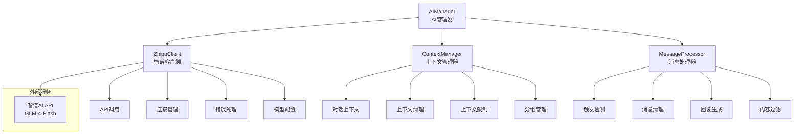

# AI集成模块学习 - server/ai/ai_manager.py

## 📋 模块概述

`server/ai/ai_manager.py` 实现了Chat-Room项目的AI智能助手功能，集成了智谱AI GLM-4-Flash模型，提供智能对话、上下文管理、自动回复等功能。这是现代聊天应用的重要特性。

## 🎯 AI集成架构设计

### 系统组件架构



### 核心类设计

```python
class AIManager:
    """AI管理器 - 统一的AI服务入口"""
    
    def __init__(self, api_key: str = None):
        """
        初始化AI管理器
        
        Args:
            api_key: 智谱AI API密钥
        """
        self.zhipu_client = None
        self.context_manager = ContextManager()
        self.enabled = False
        self.logger = get_logger("server.ai.ai_manager")
        
        # 尝试初始化智谱客户端
        try:
            self.zhipu_client = ZhipuClient(api_key)
            if self.zhipu_client.test_connection():
                self.enabled = True
                self.logger.info("✅ AI功能已启用")
            else:
                self.logger.warning("❌ AI连接测试失败，AI功能已禁用")
        except Exception as e:
            self.logger.error(f"❌ AI初始化失败: {e}")
            self.logger.info("💡 请设置正确的API密钥启用AI功能")
        
        # 启动定期清理任务
        if self.enabled:
            self._start_cleanup_task()
```

**设计特点**：
- **容错设计**：AI服务不可用时不影响其他功能
- **自动检测**：启动时自动测试API连接
- **资源管理**：自动清理过期的上下文数据
- **日志完善**：详细的状态和错误日志

## 🤖 智谱AI客户端

### API客户端设计

```python
class ZhipuClient:
    """智谱AI客户端"""
    
    def __init__(self, api_key: str):
        """
        初始化智谱客户端
        
        Args:
            api_key: API密钥
        """
        self.api_key = api_key
        self.base_url = "https://open.bigmodel.cn/api/paas/v4/"
        self.model = "glm-4-flash"
        self.max_tokens = 1024
        self.temperature = 0.7
        self.top_p = 0.9
        
        # 初始化HTTP客户端
        self.client = ZhipuAI(api_key=api_key)
        self.logger = get_logger("server.ai.zhipu_client")
    
    def test_connection(self) -> bool:
        """测试API连接"""
        try:
            # 发送简单的测试请求
            response = self.client.chat.completions.create(
                model=self.model,
                messages=[{"role": "user", "content": "Hello"}],
                max_tokens=10
            )
            
            if response and response.choices:
                self.logger.info("API连接测试成功")
                return True
            else:
                self.logger.warning("API连接测试失败：无响应")
                return False
                
        except Exception as e:
            self.logger.error(f"API连接测试失败: {e}")
            return False
```

### 聊天完成API调用

```python
def chat_completion(self, messages: List[Dict], system_prompt: str = None) -> str:
    """
    调用聊天完成API
    
    Args:
        messages: 对话消息列表
        system_prompt: 系统提示词
        
    Returns:
        AI回复内容
    """
    try:
        # 构建请求消息
        request_messages = []
        
        # 添加系统提示词
        if system_prompt:
            request_messages.append({
                "role": "system",
                "content": system_prompt
            })
        
        # 添加对话消息
        request_messages.extend(messages)
        
        # 记录请求开始时间
        start_time = time.time()
        
        # 调用API
        response = self.client.chat.completions.create(
            model=self.model,
            messages=request_messages,
            max_tokens=self.max_tokens,
            temperature=self.temperature,
            top_p=self.top_p,
            stream=False  # 不使用流式响应
        )
        
        # 计算响应时间
        response_time = time.time() - start_time
        
        # 提取回复内容
        if response and response.choices and len(response.choices) > 0:
            reply_content = response.choices[0].message.content
            
            # 记录成功日志
            self.logger.info(f"AI回复生成成功，耗时: {response_time:.2f}s")
            
            # 记录token使用情况
            if hasattr(response, 'usage'):
                usage = response.usage
                self.logger.debug(f"Token使用: 输入={usage.prompt_tokens}, "
                                f"输出={usage.completion_tokens}, "
                                f"总计={usage.total_tokens}")
            
            return reply_content.strip()
        else:
            self.logger.warning("API返回空响应")
            return None
            
    except Exception as e:
        self.logger.error(f"AI API调用失败: {e}")
        return None

def get_model_info(self) -> Dict:
    """获取模型信息"""
    return {
        "model": self.model,
        "max_tokens": self.max_tokens,
        "temperature": self.temperature,
        "top_p": self.top_p,
        "api_key_status": "已配置" if self.api_key else "未配置"
    }
```

## 🧠 上下文管理系统

### 上下文管理器设计

```python
class ContextManager:
    """AI对话上下文管理器"""
    
    def __init__(self):
        """初始化上下文管理器"""
        # 上下文存储 {context_id: [messages]}
        self.contexts: Dict[str, List[Dict]] = {}
        
        # 上下文元数据 {context_id: metadata}
        self.context_metadata: Dict[str, Dict] = {}
        
        # 配置参数
        self.max_context_length = 10      # 最大上下文长度
        self.context_timeout = 3600       # 上下文超时时间（秒）
        
        # 线程锁
        self._lock = threading.RLock()
        
        # 系统提示词
        self.system_prompts = {
            "group": """你是Chat-Room聊天室的AI助手。你的任务是：
1. 友好、有帮助地回答用户问题
2. 保持对话自然流畅
3. 在群聊中，注意上下文中的多个用户
4. 回复要简洁明了，避免过长的回答
5. 如果不确定答案，诚实地说不知道""",
            
            "private": """你是Chat-Room聊天室的AI助手。在私聊中：
1. 提供更详细和个性化的回答
2. 可以进行深入的对话
3. 记住用户的偏好和之前的对话内容
4. 保持友好和专业的态度
5. 主动提供有用的建议和信息"""
        }
```

### 上下文操作方法

```python
def add_message(self, context_id: str, role: str, content: str, 
               is_group_chat: bool = True):
    """
    添加消息到上下文
    
    Args:
        context_id: 上下文ID（群聊用group_id，私聊用user_id）
        role: 消息角色（user/assistant）
        content: 消息内容
        is_group_chat: 是否为群聊
    """
    with self._lock:
        # 初始化上下文
        if context_id not in self.contexts:
            self.contexts[context_id] = []
            self.context_metadata[context_id] = {
                "created_at": time.time(),
                "last_updated": time.time(),
                "is_group_chat": is_group_chat,
                "message_count": 0
            }
        
        # 添加消息
        message = {
            "role": role,
            "content": content,
            "timestamp": time.time()
        }
        
        self.contexts[context_id].append(message)
        
        # 更新元数据
        metadata = self.context_metadata[context_id]
        metadata["last_updated"] = time.time()
        metadata["message_count"] += 1
        
        # 限制上下文长度
        if len(self.contexts[context_id]) > self.max_context_length:
            # 保留最新的消息，但保留第一条系统消息（如果有）
            messages = self.contexts[context_id]
            if messages[0].get("role") == "system":
                self.contexts[context_id] = [messages[0]] + messages[-(self.max_context_length-1):]
            else:
                self.contexts[context_id] = messages[-self.max_context_length:]

def get_context(self, context_id: str, is_group_chat: bool = True) -> List[Dict]:
    """
    获取对话上下文
    
    Args:
        context_id: 上下文ID
        is_group_chat: 是否为群聊
        
    Returns:
        上下文消息列表
    """
    with self._lock:
        if context_id not in self.contexts:
            return []
        
        # 检查上下文是否过期
        metadata = self.context_metadata[context_id]
        if time.time() - metadata["last_updated"] > self.context_timeout:
            self.clear_context(context_id)
            return []
        
        # 返回上下文消息（不包含时间戳）
        messages = []
        for msg in self.contexts[context_id]:
            messages.append({
                "role": msg["role"],
                "content": msg["content"]
            })
        
        return messages

def clear_context(self, context_id: str):
    """清除指定的上下文"""
    with self._lock:
        self.contexts.pop(context_id, None)
        self.context_metadata.pop(context_id, None)

def get_system_prompt(self, context_type: str) -> str:
    """获取系统提示词"""
    return self.system_prompts.get(context_type, self.system_prompts["group"])
```

### 上下文清理机制

```python
def cleanup_expired_contexts(self):
    """清理过期的上下文"""
    current_time = time.time()
    expired_contexts = []
    
    with self._lock:
        for context_id, metadata in self.context_metadata.items():
            if current_time - metadata["last_updated"] > self.context_timeout:
                expired_contexts.append(context_id)
        
        # 清理过期上下文
        for context_id in expired_contexts:
            self.clear_context(context_id)
    
    if expired_contexts:
        logger.info(f"清理了 {len(expired_contexts)} 个过期的AI上下文")

def get_context_summary(self) -> Dict:
    """获取上下文统计摘要"""
    with self._lock:
        total_contexts = len(self.contexts)
        group_contexts = sum(1 for meta in self.context_metadata.values() 
                           if meta.get("is_group_chat", True))
        private_contexts = total_contexts - group_contexts
        
        total_messages = sum(meta.get("message_count", 0) 
                           for meta in self.context_metadata.values())
        
        return {
            "total_contexts": total_contexts,
            "group_contexts": group_contexts,
            "private_contexts": private_contexts,
            "total_messages": total_messages,
            "max_context_length": self.max_context_length,
            "context_timeout": self.context_timeout
        }
```

## 🎯 消息处理和触发机制

### 消息触发检测

```python
def should_respond_to_message(self, message_content: str, 
                             is_group_chat: bool = True) -> bool:
    """
    判断是否应该回复消息
    
    Args:
        message_content: 消息内容
        is_group_chat: 是否为群聊
        
    Returns:
        是否应该回复
    """
    if not self.is_enabled():
        return False
    
    # 私聊中总是回复
    if not is_group_chat:
        return True
    
    # 群聊中的触发条件
    message_lower = message_content.lower()
    
    # 1. 检查@AI标记
    if f"@{AI_USERNAME.lower()}" in message_lower or "@ai" in message_lower:
        return True
    
    # 2. 检查AI相关关键词
    ai_keywords = ["ai", "人工智能", "助手", "机器人", "智能", "问答"]
    for keyword in ai_keywords:
        if keyword in message_lower:
            return True
    
    # 3. 检查问号结尾的问题
    if message_content.strip().endswith(("?", "？")):
        return True
    
    # 4. 检查特定的求助词汇
    help_keywords = ["帮助", "help", "怎么", "如何", "为什么", "什么是"]
    for keyword in help_keywords:
        if keyword in message_lower:
            return True
    
    return False

def _clean_message(self, message_content: str) -> str:
    """
    清理消息内容，移除@AI标记等
    
    Args:
        message_content: 原始消息内容
        
    Returns:
        清理后的消息内容
    """
    import re
    
    # 移除@AI标记
    cleaned = re.sub(r'@ai\b|@AI\b|@智能助手\b', '', message_content, flags=re.IGNORECASE)
    
    # 移除多余的空格
    cleaned = re.sub(r'\s+', ' ', cleaned).strip()
    
    return cleaned
```

### 主要消息处理方法

```python
def process_message(self, user_id: int, username: str, message_content: str,
                   chat_group_id: int = None) -> Optional[str]:
    """
    处理用户消息并生成AI回复
    
    Args:
        user_id: 用户ID
        username: 用户名
        message_content: 消息内容
        chat_group_id: 聊天组ID，None表示私聊
        
    Returns:
        AI回复内容，None表示不回复
    """
    if not self.is_enabled():
        return None
    
    is_group_chat = chat_group_id is not None
    
    # 判断是否应该回复
    if not self.should_respond_to_message(message_content, is_group_chat):
        return None
    
    try:
        # 清理消息内容
        cleaned_message = self._clean_message(message_content)
        
        # 获取上下文ID
        context_id = str(chat_group_id) if is_group_chat else str(user_id)
        
        # 添加用户消息到上下文
        self.context_manager.add_message(
            context_id, "user", f"{username}: {cleaned_message}", is_group_chat
        )
        
        # 获取对话上下文
        context_messages = self.context_manager.get_context(context_id, is_group_chat)
        
        # 获取系统提示词
        context_type = "group" if is_group_chat else "private"
        system_prompt = self.context_manager.get_system_prompt(context_type)
        
        # 调用AI生成回复
        ai_reply = self.zhipu_client.chat_completion(context_messages, system_prompt)
        
        if ai_reply:
            # 添加AI回复到上下文
            self.context_manager.add_message(
                context_id, "assistant", ai_reply, is_group_chat
            )
            
            return ai_reply
        else:
            return "抱歉，我现在无法回复您的消息。"
            
    except Exception as e:
        self.logger.error(f"处理AI消息时发生错误: {e}")
        return "抱歉，处理您的消息时出现了问题。"
```

## 🛠️ AI命令处理

### AI专用命令

```python
def handle_ai_command(self, command: str, user_id: int, 
                     chat_group_id: int = None) -> str:
    """
    处理AI相关命令
    
    Args:
        command: 命令内容
        user_id: 用户ID
        chat_group_id: 聊天组ID
        
    Returns:
        命令执行结果
    """
    try:
        command_parts = command.strip().split()
        if not command_parts:
            return "请提供有效的AI命令"
        
        cmd = command_parts[0].lower()
        
        if cmd == "status":
            return self._handle_status_command()
        
        elif cmd == "clear":
            return self._handle_clear_command(user_id, chat_group_id)
        
        elif cmd == "help":
            return self._handle_help_command()
        
        elif cmd == "stats":
            return self._handle_stats_command()
        
        else:
            return f"未知的AI命令: {cmd}。输入 'ai help' 查看可用命令。"
            
    except Exception as e:
        self.logger.error(f"处理AI命令时发生错误: {e}")
        return "命令执行失败"

def _handle_status_command(self) -> str:
    """处理状态查询命令"""
    if not self.enabled:
        return "❌ AI功能未启用"
    
    status_info = self.get_ai_status()
    
    status_text = "🤖 AI助手状态:\n"
    status_text += f"• 服务状态: {'✅ 正常' if status_info['enabled'] else '❌ 异常'}\n"
    status_text += f"• API连接: {'✅ 正常' if status_info['api_connected'] else '❌ 异常'}\n"
    status_text += f"• 模型: {status_info['model_info'].get('model', 'Unknown')}\n"
    
    context_summary = status_info.get('context_summary', {})
    status_text += f"• 活跃对话: {context_summary.get('total_contexts', 0)}\n"
    
    return status_text

def _handle_clear_command(self, user_id: int, chat_group_id: int = None) -> str:
    """处理清除上下文命令"""
    context_id = str(chat_group_id) if chat_group_id else str(user_id)
    self.context_manager.clear_context(context_id)
    
    return "✅ AI对话上下文已清除"

def _handle_help_command(self) -> str:
    """处理帮助命令"""
    help_text = """🤖 AI助手帮助:

可用命令:
• ai status - 查看AI服务状态
• ai clear - 清除当前对话上下文
• ai help - 显示此帮助信息
• ai stats - 查看AI使用统计

触发方式:
• @AI 或 @ai - 在群聊中@AI
• 包含AI相关关键词
• 以问号结尾的问题
• 私聊中直接对话"""
    
    return help_text
```

## 📊 监控和统计

### AI状态监控

```python
def get_ai_status(self) -> Dict[str, Any]:
    """
    获取AI状态信息
    
    Returns:
        AI状态字典
    """
    status = {
        "enabled": self.enabled,
        "api_connected": False,
        "model_info": {},
        "context_summary": {}
    }
    
    if self.zhipu_client:
        status["api_connected"] = self.zhipu_client.test_connection()
        status["model_info"] = self.zhipu_client.get_model_info()
    
    if self.context_manager:
        status["context_summary"] = self.context_manager.get_context_summary()
    
    return status

def _start_cleanup_task(self):
    """启动定期清理任务"""
    def cleanup_worker():
        while self.enabled:
            try:
                time.sleep(3600)  # 每小时清理一次
                self.context_manager.cleanup_expired_contexts()
            except Exception as e:
                self.logger.error(f"AI上下文清理错误: {e}")
    
    cleanup_thread = threading.Thread(target=cleanup_worker, daemon=True)
    cleanup_thread.start()
    self.logger.info("AI上下文清理任务已启动")
```

## 💡 学习要点

### AI集成设计

1. **容错机制**：AI服务不可用时不影响其他功能
2. **上下文管理**：维护对话连贯性
3. **触发机制**：智能判断何时回复
4. **性能优化**：合理控制API调用频率

### API集成最佳实践

1. **错误处理**：完善的API错误处理
2. **超时控制**：避免长时间等待
3. **重试机制**：网络异常时的重试策略
4. **监控日志**：详细的API调用日志

### 上下文管理策略

1. **内存控制**：限制上下文长度和数量
2. **过期清理**：定期清理过期上下文
3. **分组管理**：群聊和私聊分别管理
4. **持久化**：重要上下文的持久化存储

## 🤔 思考题

1. **如何优化AI响应速度？**
   - 异步处理
   - 响应缓存
   - 模型优化

2. **如何控制AI使用成本？**
   - 请求频率限制
   - 上下文长度控制
   - 智能触发机制

3. **如何提高AI回复质量？**
   - 优化提示词
   - 上下文丰富化
   - 用户反馈机制

---

**下一步**：学习客户端核心模块 → [../04-client-modules/](../04-client-modules/)
