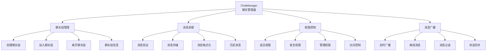
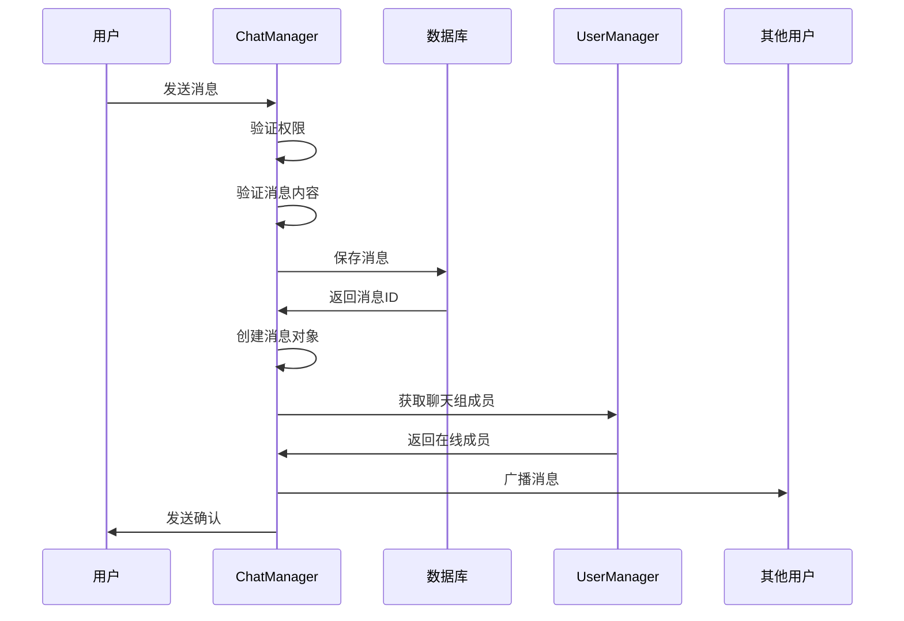

# 聊天管理系统学习 - server/core/chat_manager.py

## 📋 模块概述

`server/core/chat_manager.py` 实现了Chat-Room项目的聊天管理系统，负责聊天组管理、消息路由、消息存储、权限控制等核心功能。这是聊天功能的业务逻辑中心。

## 🎯 聊天管理系统设计

### 系统架构



### 核心类设计

```python
class ChatManager:
    """聊天管理器"""
    
    def __init__(self, user_manager: UserManager):
        """
        初始化聊天管理器
        
        Args:
            user_manager: 用户管理器实例
        """
        self.user_manager = user_manager
        self.db = get_db()
        self.logger = get_logger("server.chat_manager")
        
        # 消息缓存（可选，用于性能优化）
        self.message_cache: Dict[int, List[ChatMessage]] = {}
        self.cache_lock = threading.RLock()
```

**设计特点**：
- **依赖注入**：通过构造函数注入UserManager依赖
- **数据库集成**：直接与数据库层交互
- **缓存机制**：可选的消息缓存提高性能
- **线程安全**：使用锁保证多线程安全

## 🏠 聊天组管理

### 聊天组类型

```python
# 聊天组类型定义
class ChatType(Enum):
    PUBLIC = "public"      # 公频聊天（所有用户默认加入）
    GROUP = "group"        # 群聊（多人聊天组）
    PRIVATE = "private"    # 私聊（两人对话）
```

### 创建聊天组

```python
def create_chat_group(self, name: str, creator_id: int,
                     initial_members: List[int] = None,
                     is_private_chat: bool = False) -> int:
    """
    创建聊天组
    
    Args:
        name: 聊天组名称
        creator_id: 创建者用户ID
        initial_members: 初始成员列表
        is_private_chat: 是否为私聊
        
    Returns:
        新创建的聊天组ID
        
    Raises:
        ChatGroupAlreadyExistsError: 聊天组名称已存在
        PermissionDeniedError: 权限不足
    """
    try:
        # 1. 验证聊天组名称
        if not validate_chat_group_name(name):
            raise InvalidChatGroupNameError(name)
        
        # 2. 检查名称是否已存在
        try:
            existing_group = self.db.get_chat_group_by_name(name)
            if existing_group:
                raise ChatGroupAlreadyExistsError(name)
        except ChatGroupNotFoundError:
            # 聊天组不存在，可以创建
            pass
        
        # 3. 创建聊天组
        group_id = self.db.create_chat_group(name, is_private_chat)
        
        # 4. 添加创建者到聊天组
        self.db.add_user_to_chat_group(group_id, creator_id)
        
        # 5. 添加初始成员
        if initial_members:
            for user_id in initial_members:
                if user_id != creator_id:  # 避免重复添加创建者
                    try:
                        # 验证用户是否存在
                        self.db.get_user_by_id(user_id)
                        self.db.add_user_to_chat_group(group_id, user_id)
                    except UserNotFoundError:
                        self.logger.warning(f"添加不存在的用户 {user_id} 到聊天组 {name}")
        
        # 6. 自动添加AI用户到所有聊天组
        from shared.constants import AI_USER_ID
        try:
            self.db.add_user_to_chat_group(group_id, AI_USER_ID)
        except Exception as e:
            self.logger.warning(f"无法将AI用户添加到聊天组 {name}: {e}")
        
        self.logger.info(f"聊天组创建成功: {name} (ID: {group_id})")
        return group_id
        
    except Exception as e:
        self.logger.error(f"创建聊天组失败: {e}")
        raise
```

**创建流程要点**：
- **名称验证**：确保聊天组名称符合规范
- **唯一性检查**：避免重复的聊天组名称
- **成员管理**：自动添加创建者和初始成员
- **AI集成**：自动添加AI用户到所有聊天组
- **错误处理**：详细的异常处理和日志记录

### 加入和进入聊天组

```python
def join_chat_group(self, group_name: str, user_id: int) -> Dict:
    """
    加入聊天组（成为成员）
    
    Args:
        group_name: 聊天组名称
        user_id: 用户ID
        
    Returns:
        聊天组信息
    """
    try:
        # 获取聊天组信息
        group_info = self.db.get_chat_group_by_name(group_name)
        group_id = group_info['id']
        
        # 检查是否已在聊天组中
        if self.db.is_user_in_chat_group(group_id, user_id):
            self.logger.info(f"用户 {user_id} 已在聊天组 {group_name} 中")
            return group_info
        
        # 添加用户到聊天组
        self.db.add_user_to_chat_group(group_id, user_id)
        
        self.logger.info(f"用户 {user_id} 加入聊天组 {group_name}")
        return group_info
        
    except ChatGroupNotFoundError:
        raise ChatGroupNotFoundError(f"聊天组 '{group_name}' 不存在")

def enter_chat_group(self, group_name: str, user_id: int) -> Dict:
    """
    进入聊天组（设置为当前聊天组）
    
    Args:
        group_name: 聊天组名称
        user_id: 用户ID
        
    Returns:
        聊天组信息
    """
    try:
        # 获取聊天组信息
        group_info = self.db.get_chat_group_by_name(group_name)
        group_id = group_info['id']
        
        # 检查用户是否在聊天组中
        if not self.db.is_user_in_chat_group(group_id, user_id):
            raise PermissionDeniedError(f"您不是聊天组 '{group_name}' 的成员")
        
        # 设置用户当前聊天组
        self.user_manager.set_user_current_chat(user_id, group_id)
        
        self.logger.info(f"用户 {user_id} 进入聊天组 {group_name}")
        return group_info
        
    except Exception as e:
        self.logger.error(f"进入聊天组失败: {e}")
        raise
```

## 💬 消息处理系统

### 消息发送流程



### 发送消息实现

```python
def send_message(self, sender_id: int, group_id: int, content: str) -> ChatMessage:
    """
    发送消息
    
    Args:
        sender_id: 发送者ID
        group_id: 聊天组ID
        content: 消息内容
        
    Returns:
        创建的消息对象
        
    Raises:
        PermissionDeniedError: 权限不足
        InvalidMessageError: 消息内容无效
    """
    try:
        # 1. 验证权限
        if not self._can_send_message(sender_id, group_id):
            raise PermissionDeniedError("您没有权限在此聊天组发送消息")
        
        # 2. 验证消息内容
        cleaned_content = sanitize_message_content(content)
        if not cleaned_content.strip():
            raise InvalidMessageError("消息内容不能为空")
        
        # 3. 获取发送者信息
        sender_info = self.db.get_user_by_id(sender_id)
        group_info = self.db.get_chat_group_by_id(group_id)
        
        # 4. 保存消息到数据库
        message_id = self.db.save_message(
            group_id=group_id,
            sender_id=sender_id,
            content=cleaned_content,
            message_type="text"
        )
        
        # 5. 创建消息对象
        message = ChatMessage(
            message_id=message_id,
            sender_id=sender_id,
            sender_username=sender_info['username'],
            chat_group_id=group_id,
            chat_group_name=group_info['name'],
            content=cleaned_content,
            timestamp=time.time()
        )
        
        # 6. 更新缓存
        self._update_message_cache(group_id, message)
        
        self.logger.info(f"消息发送成功: 用户 {sender_id} 在聊天组 {group_id}")
        return message
        
    except Exception as e:
        self.logger.error(f"发送消息失败: {e}")
        raise

def _can_send_message(self, user_id: int, group_id: int) -> bool:
    """检查用户是否可以在指定聊天组发送消息"""
    from shared.constants import AI_USER_ID
    
    # AI用户特殊处理
    if user_id == AI_USER_ID:
        return True
    
    # 检查用户是否在聊天组中
    return self.db.is_user_in_chat_group(group_id, user_id)
```

### 消息广播系统

```python
def broadcast_message_to_group(self, message: ChatMessage):
    """
    向聊天组广播消息
    
    Args:
        message: 要广播的消息
    """
    try:
        # 获取聊天组成员
        members = self.db.get_chat_group_members(message.chat_group_id)
        
        # 统计广播结果
        broadcast_count = 0
        failed_count = 0
        
        # 向在线成员发送消息
        for member in members:
            user_id = member['id']
            
            # 检查用户是否在线
            if not self.user_manager.is_user_online(user_id):
                continue
            
            # 检查用户是否在当前聊天组中
            current_chat_group = self.user_manager.get_user_current_chat(user_id)
            if current_chat_group != message.chat_group_id:
                continue
            
            # 获取用户Socket连接
            user_socket = self.user_manager.get_user_socket(user_id)
            if not user_socket:
                continue
            
            try:
                # 发送消息
                message_json = message.to_json() + '\n'
                user_socket.send(message_json.encode('utf-8'))
                broadcast_count += 1
                
            except socket.error:
                # 发送失败，可能连接已断开
                failed_count += 1
                self.user_manager.disconnect_user(user_socket)
            except Exception as e:
                failed_count += 1
                self.logger.error(f"向用户 {user_id} 发送消息失败: {e}")
        
        self.logger.debug(f"消息广播完成: 成功 {broadcast_count}, 失败 {failed_count}")
        
    except Exception as e:
        self.logger.error(f"消息广播失败: {e}")
```

**广播机制特点**：
- **在线检查**：只向在线用户发送消息
- **聊天组过滤**：只向当前在该聊天组的用户发送
- **错误处理**：发送失败时自动清理断开的连接
- **统计信息**：记录广播成功和失败的数量

## 📚 历史消息管理

### 获取历史消息

```python
def get_chat_history(self, group_id: int, user_id: int, 
                    limit: int = 50, before_message_id: int = None) -> List[ChatMessage]:
    """
    获取聊天历史记录
    
    Args:
        group_id: 聊天组ID
        user_id: 请求用户ID
        limit: 消息数量限制
        before_message_id: 获取此消息ID之前的消息（分页）
        
    Returns:
        历史消息列表
    """
    try:
        # 验证权限
        if not self.db.is_user_in_chat_group(group_id, user_id):
            raise PermissionDeniedError("您没有权限查看此聊天组的历史记录")
        
        # 先尝试从缓存获取
        cached_messages = self._get_cached_messages(group_id, limit, before_message_id)
        if cached_messages:
            return cached_messages
        
        # 从数据库获取
        messages_data = self.db.get_chat_history(group_id, limit, before_message_id)
        
        # 转换为消息对象
        messages = []
        for msg_data in messages_data:
            message = ChatMessage(
                message_id=msg_data['id'],
                sender_id=msg_data['sender_id'],
                sender_username=msg_data['sender_username'],
                chat_group_id=msg_data['group_id'],
                chat_group_name=msg_data['group_name'],
                content=msg_data['content'],
                timestamp=msg_data['timestamp']
            )
            messages.append(message)
        
        # 更新缓存
        self._cache_messages(group_id, messages)
        
        return messages
        
    except Exception as e:
        self.logger.error(f"获取聊天历史失败: {e}")
        raise

def _get_cached_messages(self, group_id: int, limit: int, 
                        before_message_id: int = None) -> List[ChatMessage]:
    """从缓存获取消息"""
    with self.cache_lock:
        if group_id not in self.message_cache:
            return []
        
        cached_messages = self.message_cache[group_id]
        
        # 应用过滤条件
        if before_message_id:
            cached_messages = [
                msg for msg in cached_messages 
                if msg.message_id < before_message_id
            ]
        
        # 返回最新的limit条消息
        return cached_messages[-limit:] if len(cached_messages) > limit else cached_messages
```

### 消息缓存管理

```python
def _update_message_cache(self, group_id: int, message: ChatMessage):
    """更新消息缓存"""
    with self.cache_lock:
        if group_id not in self.message_cache:
            self.message_cache[group_id] = []
        
        self.message_cache[group_id].append(message)
        
        # 限制缓存大小
        max_cache_size = 100
        if len(self.message_cache[group_id]) > max_cache_size:
            self.message_cache[group_id] = self.message_cache[group_id][-max_cache_size:]

def clear_message_cache(self, group_id: int = None):
    """清理消息缓存"""
    with self.cache_lock:
        if group_id:
            self.message_cache.pop(group_id, None)
        else:
            self.message_cache.clear()
        
        self.logger.info(f"消息缓存已清理: {'全部' if not group_id else f'聊天组 {group_id}'}")
```

## 🔍 聊天组信息查询

### 获取聊天组列表

```python
def get_user_chat_groups(self, user_id: int) -> List[Dict]:
    """
    获取用户参与的聊天组列表
    
    Args:
        user_id: 用户ID
        
    Returns:
        聊天组信息列表
    """
    try:
        chat_groups = self.db.get_user_chat_groups(user_id)
        
        # 添加额外信息
        for group in chat_groups:
            # 获取成员数量
            members = self.db.get_chat_group_members(group['id'])
            group['member_count'] = len(members)
            
            # 获取最新消息
            latest_messages = self.db.get_chat_history(group['id'], limit=1)
            if latest_messages:
                group['latest_message'] = {
                    'content': latest_messages[0]['content'],
                    'sender': latest_messages[0]['sender_username'],
                    'timestamp': latest_messages[0]['timestamp']
                }
            else:
                group['latest_message'] = None
        
        return chat_groups
        
    except Exception as e:
        self.logger.error(f"获取用户聊天组列表失败: {e}")
        raise

def get_chat_group_info(self, group_id: int, user_id: int) -> Dict:
    """
    获取聊天组详细信息
    
    Args:
        group_id: 聊天组ID
        user_id: 请求用户ID
        
    Returns:
        聊天组详细信息
    """
    try:
        # 验证权限
        if not self.db.is_user_in_chat_group(group_id, user_id):
            raise PermissionDeniedError("您没有权限查看此聊天组信息")
        
        # 获取基本信息
        group_info = self.db.get_chat_group_by_id(group_id)
        
        # 获取成员列表
        members = self.db.get_chat_group_members(group_id)
        
        # 添加在线状态
        for member in members:
            member['is_online'] = self.user_manager.is_user_online(member['id'])
        
        group_info['members'] = members
        group_info['member_count'] = len(members)
        
        return group_info
        
    except Exception as e:
        self.logger.error(f"获取聊天组信息失败: {e}")
        raise
```

## 📊 统计和监控

### 聊天统计

```python
def get_chat_statistics(self) -> Dict:
    """获取聊天统计信息"""
    try:
        stats = {
            'total_groups': 0,
            'total_messages': 0,
            'active_groups': 0,
            'messages_by_group': {},
            'popular_groups': []
        }
        
        # 获取所有聊天组
        all_groups = self.db.get_all_chat_groups()
        stats['total_groups'] = len(all_groups)
        
        for group in all_groups:
            group_id = group['id']
            
            # 获取消息数量
            message_count = self.db.get_message_count(group_id)
            stats['messages_by_group'][group['name']] = message_count
            stats['total_messages'] += message_count
            
            # 检查是否为活跃聊天组（有在线用户）
            online_members = self.user_manager.get_users_in_chat_group(group_id)
            if online_members:
                stats['active_groups'] += 1
        
        # 按消息数量排序，获取热门聊天组
        stats['popular_groups'] = sorted(
            stats['messages_by_group'].items(),
            key=lambda x: x[1],
            reverse=True
        )[:10]
        
        return stats
        
    except Exception as e:
        self.logger.error(f"获取聊天统计失败: {e}")
        return {}
```

## 💡 学习要点

### 业务逻辑设计

1. **权限控制**：细粒度的权限检查
2. **数据一致性**：确保数据库和内存状态一致
3. **性能优化**：合理使用缓存机制
4. **错误处理**：完善的异常处理和恢复

### 消息系统设计

1. **消息路由**：高效的消息分发机制
2. **实时性**：保证消息的实时传递
3. **可靠性**：确保消息不丢失
4. **扩展性**：支持不同类型的消息

### 缓存策略

1. **缓存粒度**：按聊天组缓存消息
2. **缓存大小**：限制内存使用
3. **缓存更新**：及时更新缓存内容
4. **缓存清理**：定期清理过期缓存

## 🤔 思考题

1. **如何处理大量历史消息？**
   - 分页加载
   - 消息归档
   - 索引优化

2. **如何实现消息的可靠传输？**
   - 消息确认机制
   - 重传机制
   - 离线消息存储

3. **如何优化消息广播性能？**
   - 异步广播
   - 批量发送
   - 连接池管理

---

**下一步**：学习AI集成模块 → [ai-integration.md](./ai-integration.md)
