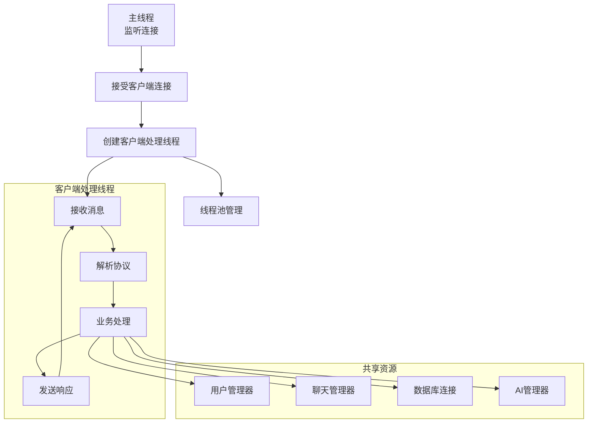
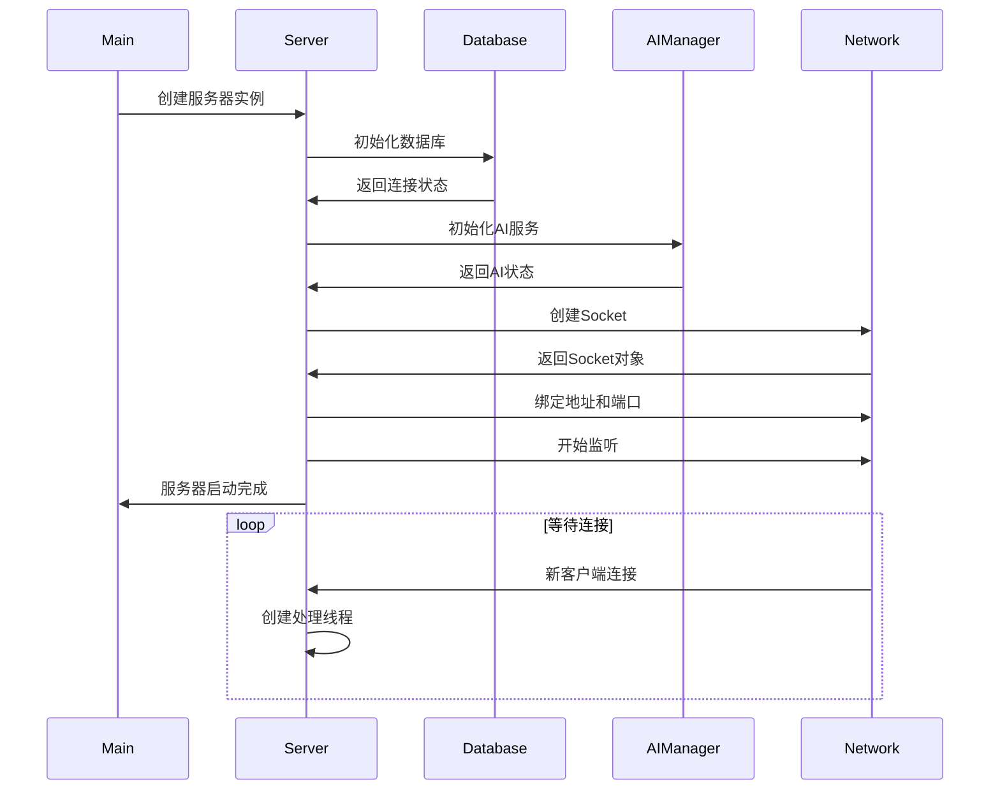

# 服务器核心模块学习 - server/core/server.py

## 📋 模块概述

`server/core/server.py` 是Chat-Room项目的服务器核心，实现了多线程TCP服务器，处理客户端连接、消息路由、协议解析等核心功能。这是整个服务器端的控制中心。

## 🎯 服务器架构设计

### 多线程服务器模型



**设计优势**：
- **并发处理**：每个客户端独立线程，支持多用户同时在线
- **资源共享**：管理器对象在线程间共享，保证数据一致性
- **故障隔离**：单个客户端异常不影响其他客户端
- **可扩展性**：可以轻松增加新的消息处理逻辑

### 核心类设计

```python
class ChatRoomServer:
    """聊天室服务器主类"""
    
    def __init__(self, host: str = DEFAULT_HOST, port: int = DEFAULT_PORT):
        """
        初始化服务器
        
        Args:
            host: 服务器监听地址
            port: 服务器监听端口
        """
        self.host = host
        self.port = port
        self.running = False
        
        # 网络相关
        self.server_socket: Optional[socket.socket] = None
        self.client_sockets: Set[socket.socket] = set()
        self.client_threads: Dict[socket.socket, threading.Thread] = {}
        
        # 业务管理器
        self.user_manager = UserManager()
        self.chat_manager = ChatManager(self.user_manager)
        self.ai_manager = AIManager()
        
        # 日志记录
        self.logger = get_logger("server.core.server")
```

**设计亮点**：
- **依赖注入**：管理器之间通过构造函数注入依赖
- **资源管理**：明确的资源生命周期管理
- **线程安全**：使用线程安全的数据结构
- **日志集成**：完整的日志记录支持

## 🚀 服务器启动流程

### 启动序列图



### 启动方法实现

```python
def start(self):
    """启动服务器"""
    self.logger.info(f"正在启动服务器 {self.host}:{self.port}")
    
    try:
        # 1. 初始化数据库
        self.logger.info("初始化数据库")
        init_database()
        
        # 2. 初始化AI服务
        if self.ai_manager.is_enabled():
            self.logger.info("AI服务已启用")
        else:
            self.logger.warning("AI服务未启用")
        
        # 3. 创建服务器Socket
        self.server_socket = socket.socket(socket.AF_INET, socket.SOCK_STREAM)
        self.server_socket.setsockopt(socket.SOL_SOCKET, socket.SO_REUSEADDR, 1)
        
        # 4. 绑定地址和端口
        self.server_socket.bind((self.host, self.port))
        self.server_socket.listen(MAX_CONNECTIONS)
        
        self.running = True
        self.logger.info(f"✅ 服务器启动成功，监听 {self.host}:{self.port}")
        
        # 5. 主循环：接受客户端连接
        self._accept_connections()
        
    except Exception as e:
        self.logger.critical(f"服务器启动失败: {e}", exc_info=True)
        self.stop()
        raise
```

**启动流程要点**：
- **错误处理**：每个步骤都有异常处理
- **资源初始化**：按依赖顺序初始化各个组件
- **状态管理**：使用`running`标志控制服务器状态
- **日志记录**：详细记录启动过程

## 🔄 客户端连接处理

### 连接接受循环

```python
def _accept_connections(self):
    """接受客户端连接的主循环"""
    while self.running:
        try:
            # 接受新连接
            client_socket, address = self.server_socket.accept()
            
            self.logger.info(f"新客户端连接: {address}")
            log_network_operation("client_connect", 
                                {"ip": address[0], "port": address[1]})
            
            # 添加到客户端集合
            self.client_sockets.add(client_socket)
            
            # 创建处理线程
            client_thread = threading.Thread(
                target=self._handle_client,
                args=(client_socket, address),
                daemon=True  # 守护线程，主程序退出时自动结束
            )
            
            self.client_threads[client_socket] = client_thread
            client_thread.start()
            
        except socket.error as e:
            if self.running:  # 只有在运行状态下才记录错误
                self.logger.error(f"接受连接失败: {e}")
        except Exception as e:
            self.logger.error(f"处理连接时发生未知错误: {e}", exc_info=True)
```

### 客户端处理线程

```python
def _handle_client(self, client_socket: socket.socket, address: tuple):
    """处理单个客户端的消息"""
    client_info = {"ip": address[0], "port": address[1]}
    user_info = None
    
    try:
        # 设置Socket超时
        client_socket.settimeout(CONNECTION_TIMEOUT)
        
        while self.running:
            try:
                # 接收消息
                data = client_socket.recv(BUFFER_SIZE)
                if not data:
                    break  # 客户端断开连接
                
                # 解码消息
                message_str = data.decode('utf-8').strip()
                if not message_str:
                    continue
                
                # 处理可能的多条消息（以换行符分隔）
                for line in message_str.split('\n'):
                    if line.strip():
                        user_info = self._process_message(
                            client_socket, line.strip(), user_info
                        )
                        
            except socket.timeout:
                # 超时检查，发送心跳
                self._send_heartbeat(client_socket)
                
            except socket.error:
                break  # 网络错误，断开连接
                
            except Exception as e:
                self.logger.error(f"处理客户端消息时发生错误: {e}", exc_info=True)
                self.send_error(client_socket, ErrorCode.SERVER_ERROR, "服务器内部错误")
    
    finally:
        # 清理资源
        self._cleanup_client(client_socket, user_info)
```

**处理线程特点**：
- **超时处理**：防止客户端长时间无响应
- **心跳机制**：定期检查连接有效性
- **异常隔离**：单个客户端异常不影响其他客户端
- **资源清理**：确保连接断开时清理所有相关资源

## 📨 消息处理机制

### 消息分发器

```python
def _process_message(self, client_socket: socket.socket, 
                    message_str: str, user_info: dict) -> dict:
    """
    处理客户端消息
    
    Args:
        client_socket: 客户端Socket
        message_str: 消息字符串
        user_info: 用户信息（如果已登录）
        
    Returns:
        更新后的用户信息
    """
    try:
        # 解析消息
        message = parse_message(message_str)
        
        # 记录消息接收
        self.logger.debug(f"收到消息: {message.message_type}")
        
        # 根据消息类型分发处理
        if message.message_type == MessageType.LOGIN_REQUEST.value:
            user_info = self.handle_login_request(client_socket, message)
            
        elif message.message_type == MessageType.REGISTER_REQUEST.value:
            self.handle_register_request(client_socket, message)
            
        elif message.message_type == MessageType.CHAT_MESSAGE.value:
            if user_info:  # 需要登录后才能发送消息
                self.handle_chat_message(client_socket, user_info, message)
            else:
                self.send_error(client_socket, ErrorCode.NOT_AUTHENTICATED, 
                              "请先登录")
        
        # ... 其他消息类型处理
        
        else:
            self.send_error(client_socket, ErrorCode.UNKNOWN_MESSAGE_TYPE,
                          f"未知消息类型: {message.message_type}")
        
        return user_info
        
    except Exception as e:
        self.logger.error(f"消息处理失败: {e}", exc_info=True)
        self.send_error(client_socket, ErrorCode.MESSAGE_PROCESSING_ERROR,
                      "消息处理失败")
        return user_info
```

### 具体消息处理示例

#### 登录请求处理

```python
def handle_login_request(self, client_socket: socket.socket, 
                        message: LoginRequest) -> dict:
    """处理登录请求"""
    try:
        # 验证输入
        if not message.username or not message.password:
            self.send_error(client_socket, ErrorCode.INVALID_INPUT,
                          "用户名和密码不能为空")
            return None
        
        # 用户认证
        user_info = self.user_manager.authenticate_user(
            message.username, message.password
        )
        
        # 用户登录
        self.user_manager.login_user(user_info['id'], client_socket)
        
        # 发送成功响应
        response = LoginResponse(
            success=True,
            user_id=user_info['id'],
            username=user_info['username'],
            message="登录成功"
        )
        self.send_message(client_socket, response)
        
        # 记录登录日志
        self.logger.info(f"用户登录成功: {message.username}")
        log_network_operation("user_login", 
                            {"user_id": user_info['id'], 
                             "username": message.username})
        
        return user_info
        
    except AuthenticationError as e:
        self.send_error(client_socket, e.error_code, e.user_message)
        return None
    except Exception as e:
        self.logger.error(f"登录处理失败: {e}", exc_info=True)
        self.send_error(client_socket, ErrorCode.SERVER_ERROR, "登录失败")
        return None
```

#### 聊天消息处理

```python
def handle_chat_message(self, client_socket: socket.socket,
                       user_info: dict, message: ChatMessage):
    """处理聊天消息"""
    try:
        # 验证消息内容
        if not message.content.strip():
            self.send_error(client_socket, ErrorCode.INVALID_INPUT,
                          "消息内容不能为空")
            return
        
        # 验证聊天组权限
        if not self.chat_manager.can_send_message(
            user_info['user_id'], message.chat_group_id
        ):
            self.send_error(client_socket, ErrorCode.PERMISSION_DENIED,
                          "您没有权限在此聊天组发送消息")
            return
        
        # 发送消息
        chat_message = self.chat_manager.send_message(
            user_info['user_id'], 
            message.chat_group_id, 
            message.content
        )
        
        # 广播消息给聊天组成员
        self.chat_manager.broadcast_message_to_group(chat_message)
        
        # 检查是否需要AI回复
        if self.ai_manager.is_enabled():
            ai_reply = self.ai_manager.process_message(
                user_info['user_id'],
                user_info['username'],
                message.content,
                message.chat_group_id
            )
            
            if ai_reply:
                # 发送AI回复
                ai_message = self.chat_manager.send_message(
                    AI_USER_ID, message.chat_group_id, ai_reply
                )
                self.chat_manager.broadcast_message_to_group(ai_message)
        
    except Exception as e:
        self.logger.error(f"聊天消息处理失败: {e}", exc_info=True)
        self.send_error(client_socket, ErrorCode.SERVER_ERROR, "消息发送失败")
```

## 🔧 工具方法

### 消息发送工具

```python
def send_message(self, client_socket: socket.socket, message: BaseMessage):
    """发送消息给客户端"""
    try:
        message_json = message.to_json() + '\n'
        client_socket.send(message_json.encode('utf-8'))
        
        self.logger.debug(f"发送消息: {message.message_type}")
        
    except socket.error as e:
        self.logger.warning(f"发送消息失败: {e}")
        # 连接可能已断开，移除客户端
        self.remove_client(client_socket)

def send_error(self, client_socket: socket.socket, 
               error_code: ErrorCode, error_message: str):
    """发送错误消息"""
    error_msg = ErrorMessage(
        error_code=error_code.value,
        error_message=error_message
    )
    self.send_message(client_socket, error_msg)
```

### 客户端管理

```python
def remove_client(self, client_socket: socket.socket):
    """移除客户端连接"""
    try:
        # 从用户管理器中断开用户
        self.user_manager.disconnect_user(client_socket)
        
        # 从客户端集合中移除
        self.client_sockets.discard(client_socket)
        
        # 停止处理线程
        if client_socket in self.client_threads:
            thread = self.client_threads.pop(client_socket)
            # 线程会自然结束，因为Socket已关闭
        
        # 关闭Socket
        client_socket.close()
        
        self.logger.info("客户端连接已断开")
        
    except Exception as e:
        self.logger.error(f"移除客户端时发生错误: {e}")

def _cleanup_client(self, client_socket: socket.socket, user_info: dict):
    """清理客户端资源"""
    if user_info:
        self.logger.info(f"用户断开连接: {user_info.get('username', 'Unknown')}")
        log_network_operation("user_disconnect", 
                            {"user_id": user_info.get('user_id')})
    
    self.remove_client(client_socket)
```

## 🛑 服务器关闭

```python
def stop(self):
    """停止服务器"""
    self.logger.info("正在停止服务器")
    
    self.running = False
    
    # 关闭所有客户端连接
    for client_socket in list(self.client_sockets):
        try:
            client_socket.close()
        except:
            pass
    
    # 关闭服务器Socket
    if self.server_socket:
        try:
            self.server_socket.close()
        except:
            pass
    
    # 等待所有线程结束
    for thread in self.client_threads.values():
        if thread.is_alive():
            thread.join(timeout=1.0)  # 最多等待1秒
    
    self.logger.info("服务器已停止")
```

## 💡 学习要点

### 多线程编程

1. **线程安全**：共享资源需要适当的同步机制
2. **资源管理**：及时清理线程和Socket资源
3. **异常处理**：线程中的异常不会传播到主线程
4. **守护线程**：使用daemon线程避免程序无法退出

### 网络编程

1. **Socket生命周期**：创建、绑定、监听、接受、关闭
2. **缓冲区管理**：合理设置缓冲区大小
3. **超时处理**：避免无限等待
4. **错误处理**：网络异常的优雅处理

### 架构设计

1. **单一职责**：每个类和方法都有明确的职责
2. **依赖注入**：通过构造函数注入依赖
3. **错误隔离**：局部错误不影响整体系统
4. **可扩展性**：易于添加新的消息类型和功能

## 🤔 思考题

1. **如何处理大量并发连接？**
   - 连接池管理
   - 异步I/O模型
   - 负载均衡

2. **如何保证消息的可靠传输？**
   - 消息确认机制
   - 重传机制
   - 消息持久化

3. **如何优化服务器性能？**
   - 减少内存拷贝
   - 使用更高效的序列化格式
   - 数据库连接池

---

**下一步**：学习用户管理系统 → [user-manager.md](./user-manager.md)
