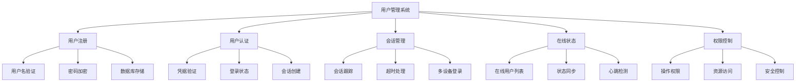
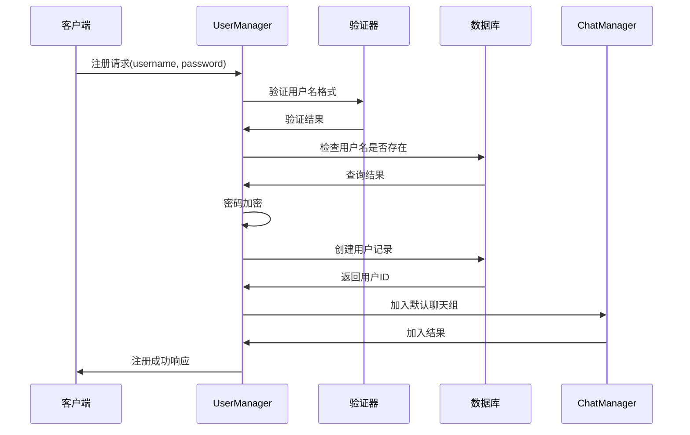

# 用户管理系统学习 - server/core/user_manager.py

## 📋 模块概述

`server/core/user_manager.py` 实现了Chat-Room项目的用户管理系统，负责用户注册、登录、会话管理、在线状态跟踪等核心功能。这是服务器端用户相关操作的统一入口。

## 🎯 用户管理系统设计

### 系统职责



### 核心数据结构

```python
class UserManager:
    """用户管理器"""
    
    def __init__(self):
        """初始化用户管理器"""
        self.db = get_db()
        
        # 在线用户连接映射 {user_id: socket}
        self.online_users: Dict[int, socket.socket] = {}
        
        # 用户会话信息 {user_id: session_info}
        self.user_sessions: Dict[int, Dict] = {}
        
        # Socket到用户的反向映射 {socket: user_id}
        self.socket_to_user: Dict[socket.socket, int] = {}
        
        # 线程锁，保证线程安全
        self._lock = threading.RLock()
```

**设计亮点**：
- **双向映射**：用户ID到Socket和Socket到用户ID的双向查找
- **会话管理**：独立的会话信息存储
- **线程安全**：使用RLock保证多线程环境下的数据一致性
- **数据库集成**：与数据库层紧密集成

## 🔐 用户注册系统

### 注册流程设计



### 注册方法实现

```python
def register_user(self, username: str, password: str) -> int:
    """
    注册新用户
    
    Args:
        username: 用户名
        password: 密码
        
    Returns:
        新用户的ID
        
    Raises:
        UserAlreadyExistsError: 用户名已存在
        InvalidUsernameError: 用户名格式无效
        InvalidPasswordError: 密码格式无效
    """
    with self._lock:
        # 1. 验证用户名格式
        if not validate_username(username):
            raise InvalidUsernameError(username, "用户名格式不符合要求")
        
        # 2. 验证密码强度
        if not validate_password(password):
            raise InvalidPasswordError("密码强度不够")
        
        # 3. 检查用户名是否已存在
        try:
            existing_user = self.db.get_user_by_username(username)
            if existing_user:
                raise UserAlreadyExistsError(username)
        except UserNotFoundError:
            # 用户不存在，可以注册
            pass
        
        # 4. 创建新用户
        user_id = self.db.create_user(username, password)
        
        # 5. 自动加入默认聊天组
        try:
            from shared.constants import DEFAULT_PUBLIC_CHAT
            public_group = self.db.get_chat_group_by_name(DEFAULT_PUBLIC_CHAT)
            self.db.add_user_to_chat_group(public_group['id'], user_id)
        except Exception as e:
            # 加入默认聊天组失败不影响注册
            logger.warning(f"新用户 {username} 加入默认聊天组失败: {e}")
        
        logger.info(f"用户注册成功: {username} (ID: {user_id})")
        return user_id
```

**注册流程要点**：
- **输入验证**：严格验证用户名和密码格式
- **唯一性检查**：确保用户名不重复
- **密码安全**：密码加密存储
- **默认设置**：自动加入公共聊天组
- **异常处理**：详细的错误分类和处理

## 🔑 用户认证系统

### 认证流程

```python
def authenticate_user(self, username: str, password: str) -> Dict:
    """
    用户认证
    
    Args:
        username: 用户名
        password: 密码
        
    Returns:
        用户信息字典
        
    Raises:
        AuthenticationError: 认证失败
    """
    try:
        # 从数据库获取用户信息
        user_info = self.db.authenticate_user(username, password)
        if not user_info:
            raise AuthenticationError("用户名或密码错误")
        
        logger.info(f"用户认证成功: {username}")
        return user_info
        
    except DatabaseError as e:
        logger.error(f"认证过程中数据库错误: {e}")
        raise AuthenticationError("认证服务暂时不可用")
    except Exception as e:
        logger.error(f"认证过程中发生未知错误: {e}")
        raise AuthenticationError("认证失败")
```

### 登录会话管理

```python
def login_user(self, user_id: int, client_socket: socket.socket) -> Dict:
    """
    用户登录，创建会话
    
    Args:
        user_id: 用户ID
        client_socket: 客户端Socket连接
        
    Returns:
        用户信息
    """
    with self._lock:
        # 获取用户信息
        user_info = self.db.get_user_by_id(user_id)
        
        # 处理重复登录
        if user_id in self.online_users:
            old_socket = self.online_users[user_id]
            logger.info(f"用户 {user_info['username']} 重复登录，断开旧连接")
            
            try:
                # 通知旧客户端
                self._send_logout_notification(old_socket, "账号在其他地方登录")
                old_socket.close()
            except:
                pass
            
            # 清理旧连接
            self._cleanup_user_session(user_id)
        
        # 创建新会话
        session_info = {
            'user_id': user_id,
            'username': user_info['username'],
            'login_time': datetime.now(),
            'last_activity': datetime.now(),
            'current_chat_group': None,
            'client_ip': client_socket.getpeername()[0]
        }
        
        # 更新映射关系
        self.online_users[user_id] = client_socket
        self.socket_to_user[client_socket] = user_id
        self.user_sessions[user_id] = session_info
        
        # 更新数据库中的在线状态
        self.db.update_user_status(user_id, True)
        
        logger.info(f"用户登录成功: {user_info['username']} (ID: {user_id})")
        return user_info
```

**会话管理特点**：
- **重复登录处理**：自动断开旧连接
- **会话信息跟踪**：记录登录时间、活动时间等
- **状态同步**：数据库状态与内存状态同步
- **IP记录**：记录客户端IP用于安全审计

## 👥 在线用户管理

### 在线状态跟踪

```python
def get_online_users(self) -> List[Dict]:
    """
    获取在线用户列表
    
    Returns:
        在线用户信息列表
    """
    with self._lock:
        online_users = []
        
        for user_id, socket_obj in self.online_users.items():
            if user_id in self.user_sessions:
                session = self.user_sessions[user_id]
                user_info = {
                    'user_id': user_id,
                    'username': session['username'],
                    'login_time': session['login_time'].isoformat(),
                    'current_chat_group': session.get('current_chat_group'),
                    'is_online': True
                }
                online_users.append(user_info)
        
        return online_users

def is_user_online(self, user_id: int) -> bool:
    """检查用户是否在线"""
    return user_id in self.online_users

def get_user_socket(self, user_id: int) -> Optional[socket.socket]:
    """获取用户的Socket连接"""
    return self.online_users.get(user_id)
```

### 用户活动跟踪

```python
def update_user_activity(self, user_id: int):
    """更新用户最后活动时间"""
    with self._lock:
        if user_id in self.user_sessions:
            self.user_sessions[user_id]['last_activity'] = datetime.now()

def get_inactive_users(self, timeout_minutes: int = 30) -> List[int]:
    """获取不活跃的用户列表"""
    inactive_users = []
    timeout_threshold = datetime.now() - timedelta(minutes=timeout_minutes)
    
    with self._lock:
        for user_id, session in self.user_sessions.items():
            if session['last_activity'] < timeout_threshold:
                inactive_users.append(user_id)
    
    return inactive_users
```

## 🏠 聊天组相关管理

### 当前聊天组管理

```python
def set_user_current_chat(self, user_id: int, chat_group_id: int):
    """设置用户当前所在的聊天组"""
    with self._lock:
        if user_id in self.user_sessions:
            old_group = self.user_sessions[user_id].get('current_chat_group')
            self.user_sessions[user_id]['current_chat_group'] = chat_group_id
            
            logger.debug(f"用户 {user_id} 从聊天组 {old_group} 切换到 {chat_group_id}")

def get_user_current_chat(self, user_id: int) -> Optional[int]:
    """获取用户当前所在的聊天组"""
    with self._lock:
        session = self.user_sessions.get(user_id)
        return session.get('current_chat_group') if session else None

def get_users_in_chat_group(self, chat_group_id: int) -> List[int]:
    """获取当前在指定聊天组中的用户列表"""
    users_in_group = []
    
    with self._lock:
        for user_id, session in self.user_sessions.items():
            if session.get('current_chat_group') == chat_group_id:
                users_in_group.append(user_id)
    
    return users_in_group
```

## 🚪 用户断开连接处理

### 断开连接流程

```python
def disconnect_user(self, client_socket: socket.socket):
    """
    处理用户断开连接
    
    Args:
        client_socket: 客户端Socket
    """
    with self._lock:
        # 获取用户ID
        user_id = self.socket_to_user.get(client_socket)
        if not user_id:
            return  # 未登录的连接
        
        # 获取用户信息
        session = self.user_sessions.get(user_id)
        username = session.get('username', 'Unknown') if session else 'Unknown'
        
        # 清理会话
        self._cleanup_user_session(user_id)
        
        # 更新数据库状态
        try:
            self.db.update_user_status(user_id, False)
        except Exception as e:
            logger.error(f"更新用户离线状态失败: {e}")
        
        logger.info(f"用户断开连接: {username} (ID: {user_id})")

def _cleanup_user_session(self, user_id: int):
    """清理用户会话数据"""
    # 移除在线用户记录
    if user_id in self.online_users:
        socket_obj = self.online_users.pop(user_id)
        
        # 移除反向映射
        if socket_obj in self.socket_to_user:
            del self.socket_to_user[socket_obj]
    
    # 移除会话信息
    if user_id in self.user_sessions:
        del self.user_sessions[user_id]
```

### 批量清理

```python
def cleanup_inactive_users(self):
    """清理不活跃的用户连接"""
    inactive_users = self.get_inactive_users(timeout_minutes=30)
    
    for user_id in inactive_users:
        try:
            socket_obj = self.online_users.get(user_id)
            if socket_obj:
                logger.info(f"清理不活跃用户: {user_id}")
                socket_obj.close()  # 关闭连接会触发断开处理
        except Exception as e:
            logger.error(f"清理不活跃用户 {user_id} 时发生错误: {e}")

def force_logout_user(self, user_id: int, reason: str = "管理员强制下线"):
    """强制用户下线"""
    with self._lock:
        if user_id in self.online_users:
            socket_obj = self.online_users[user_id]
            
            try:
                # 发送下线通知
                self._send_logout_notification(socket_obj, reason)
                socket_obj.close()
            except Exception as e:
                logger.error(f"强制下线用户 {user_id} 时发生错误: {e}")
            
            logger.info(f"管理员强制用户 {user_id} 下线: {reason}")
```

## 📊 统计和监控

### 用户统计

```python
def get_user_statistics(self) -> Dict:
    """获取用户统计信息"""
    with self._lock:
        stats = {
            'total_online_users': len(self.online_users),
            'total_sessions': len(self.user_sessions),
            'users_by_chat_group': {},
            'login_times': []
        }
        
        # 按聊天组统计用户
        for session in self.user_sessions.values():
            chat_group = session.get('current_chat_group', 'none')
            stats['users_by_chat_group'][chat_group] = \
                stats['users_by_chat_group'].get(chat_group, 0) + 1
        
        # 登录时间统计
        for session in self.user_sessions.values():
            stats['login_times'].append(session['login_time'].isoformat())
        
        return stats

def get_user_session_info(self, user_id: int) -> Optional[Dict]:
    """获取用户会话详细信息"""
    with self._lock:
        session = self.user_sessions.get(user_id)
        if session:
            return {
                'user_id': session['user_id'],
                'username': session['username'],
                'login_time': session['login_time'].isoformat(),
                'last_activity': session['last_activity'].isoformat(),
                'current_chat_group': session.get('current_chat_group'),
                'client_ip': session.get('client_ip'),
                'session_duration': str(datetime.now() - session['login_time'])
            }
        return None
```

## 🔒 安全特性

### 密码安全

```python
def change_password(self, user_id: int, old_password: str, new_password: str):
    """修改用户密码"""
    # 验证旧密码
    user_info = self.db.get_user_by_id(user_id)
    if not self.db.verify_password(old_password, user_info['password_hash']):
        raise AuthenticationError("原密码错误")
    
    # 验证新密码强度
    if not validate_password(new_password):
        raise InvalidPasswordError("新密码强度不够")
    
    # 更新密码
    self.db.update_user_password(user_id, new_password)
    
    logger.info(f"用户 {user_id} 修改密码成功")

def reset_password(self, username: str) -> str:
    """重置用户密码（管理员功能）"""
    import secrets
    import string
    
    # 生成随机密码
    alphabet = string.ascii_letters + string.digits
    new_password = ''.join(secrets.choice(alphabet) for _ in range(12))
    
    # 更新密码
    user_info = self.db.get_user_by_username(username)
    self.db.update_user_password(user_info['id'], new_password)
    
    logger.info(f"管理员重置用户 {username} 的密码")
    return new_password
```

## 💡 学习要点

### 线程安全编程

1. **锁的使用**：RLock支持重入，避免死锁
2. **原子操作**：确保数据操作的原子性
3. **资源竞争**：避免多线程访问共享资源的竞争

### 会话管理

1. **会话生命周期**：创建、维护、销毁
2. **状态同步**：内存状态与数据库状态的一致性
3. **超时处理**：自动清理过期会话

### 安全设计

1. **密码安全**：加密存储、强度验证
2. **会话安全**：防止会话劫持
3. **权限控制**：基于用户身份的访问控制

## 🤔 思考题

1. **如何处理大量并发登录？**
   - 连接池限制
   - 登录频率限制
   - 负载均衡

2. **如何实现单点登录(SSO)？**
   - Token机制
   - 中央认证服务
   - 会话共享

3. **如何防止暴力破解？**
   - 登录尝试限制
   - 验证码机制
   - IP黑名单

---

**下一步**：学习聊天管理系统 → [chat-manager.md](./chat-manager.md)
