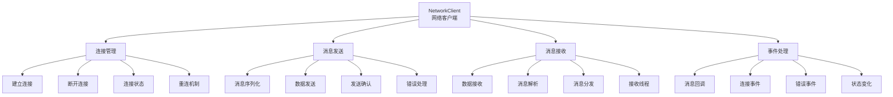

# 客户端核心模块学习 - client/core/client.py

## 📋 模块概述

`client/core/client.py` 实现了Chat-Room项目的网络客户端核心，负责与服务器建立连接、发送和接收消息、处理网络通信等功能。这是客户端与服务器通信的桥梁。

## 🎯 客户端架构设计

### 网络客户端模型



### 核心类设计

```python
class NetworkClient:
    """网络客户端 - 处理与服务器的网络通信"""
    
    def __init__(self, host: str = DEFAULT_HOST, port: int = DEFAULT_PORT):
        """
        初始化网络客户端
        
        Args:
            host: 服务器地址
            port: 服务器端口
        """
        self.host = host
        self.port = port
        self.socket: Optional[socket.socket] = None
        self.connected = False
        self.running = False
        
        # 消息处理回调函数
        self.message_handlers: Dict[str, Callable] = {}
        self.default_message_handler: Optional[Callable] = None
        
        # 接收线程
        self.receive_thread: Optional[threading.Thread] = None
        
        # 日志记录
        self.logger = get_logger("client.core.client")
```

**设计特点**：
- **事件驱动**：基于回调函数的消息处理机制
- **线程分离**：接收消息使用独立线程，避免阻塞主线程
- **状态管理**：清晰的连接状态跟踪
- **错误处理**：完善的网络异常处理机制

## 🔌 连接管理

### 建立连接

```python
def connect(self) -> bool:
    """
    连接到服务器
    
    Returns:
        连接是否成功
    """
    try:
        self.logger.info(f"正在连接服务器 {self.host}:{self.port}")
        
        # 创建Socket
        self.socket = socket.socket(socket.AF_INET, socket.SOCK_STREAM)
        self.socket.settimeout(10)  # 设置连接超时
        
        # 连接服务器
        self.socket.connect((self.host, self.port))
        
        # 更新状态
        self.connected = True
        self.running = True
        
        # 启动接收线程
        self.receive_thread = threading.Thread(
            target=self._receive_messages, 
            daemon=True
        )
        self.receive_thread.start()
        
        self.logger.info("✅ 服务器连接成功")
        return True
        
    except socket.timeout:
        self.logger.error("❌ 连接超时")
        return False
    except socket.error as e:
        self.logger.error(f"❌ 连接失败: {e}")
        return False
    except Exception as e:
        self.logger.error(f"❌ 连接时发生未知错误: {e}")
        return False

def disconnect(self):
    """断开连接"""
    self.logger.info("正在断开服务器连接")
    
    # 停止运行
    self.running = False
    self.connected = False
    
    # 关闭Socket
    if self.socket:
        try:
            self.socket.close()
        except:
            pass
        self.socket = None
    
    # 等待接收线程结束
    if self.receive_thread and self.receive_thread.is_alive():
        self.receive_thread.join(timeout=1.0)
    
    self.logger.info("✅ 已断开服务器连接")

def is_connected(self) -> bool:
    """检查是否已连接"""
    return self.connected and self.socket is not None
```

**连接管理要点**：
- **超时控制**：避免无限等待连接
- **状态同步**：连接状态与实际Socket状态保持一致
- **资源清理**：断开连接时正确清理所有资源
- **线程管理**：正确启动和停止接收线程

### 重连机制

```python
def reconnect(self, max_attempts: int = 3, delay: float = 2.0) -> bool:
    """
    重连服务器
    
    Args:
        max_attempts: 最大重连次数
        delay: 重连间隔（秒）
        
    Returns:
        重连是否成功
    """
    self.logger.info(f"开始重连，最大尝试次数: {max_attempts}")
    
    for attempt in range(1, max_attempts + 1):
        self.logger.info(f"重连尝试 {attempt}/{max_attempts}")
        
        # 先断开现有连接
        self.disconnect()
        
        # 等待一段时间
        if attempt > 1:
            time.sleep(delay)
        
        # 尝试连接
        if self.connect():
            self.logger.info(f"✅ 重连成功（第{attempt}次尝试）")
            return True
        
        self.logger.warning(f"❌ 第{attempt}次重连失败")
    
    self.logger.error("❌ 重连失败，已达到最大尝试次数")
    return False

def _check_connection_health(self):
    """检查连接健康状态"""
    if not self.is_connected():
        return False
    
    try:
        # 发送心跳消息
        heartbeat = HeartbeatMessage()
        return self.send_message(heartbeat)
    except:
        return False
```

## 📤 消息发送

### 基础消息发送

```python
def send_message(self, message: BaseMessage) -> bool:
    """
    发送消息到服务器
    
    Args:
        message: 要发送的消息对象
        
    Returns:
        发送是否成功
    """
    if not self.is_connected():
        self.logger.warning("未连接到服务器，无法发送消息")
        return False
    
    try:
        # 序列化消息
        message_json = message.to_json() + '\n'
        message_bytes = message_json.encode('utf-8')
        
        # 发送数据
        self.socket.send(message_bytes)
        
        self.logger.debug(f"消息发送成功: {message.message_type}")
        return True
        
    except socket.error as e:
        self.logger.error(f"消息发送失败: {e}")
        self.connected = False  # 标记连接已断开
        return False
    except Exception as e:
        self.logger.error(f"消息发送时发生未知错误: {e}")
        return False

def send_raw_data(self, data: bytes) -> bool:
    """
    发送原始数据
    
    Args:
        data: 要发送的字节数据
        
    Returns:
        发送是否成功
    """
    if not self.is_connected():
        return False
    
    try:
        self.socket.send(data)
        return True
    except socket.error:
        self.connected = False
        return False
```

### 特定消息发送方法

```python
def send_login_request(self, username: str, password: str) -> bool:
    """发送登录请求"""
    login_msg = LoginRequest(
        username=username,
        password=password
    )
    return self.send_message(login_msg)

def send_register_request(self, username: str, password: str) -> bool:
    """发送注册请求"""
    register_msg = RegisterRequest(
        username=username,
        password=password
    )
    return self.send_message(register_msg)

def send_chat_message(self, content: str, chat_group_id: int) -> bool:
    """发送聊天消息"""
    chat_msg = ChatMessage(
        content=content,
        chat_group_id=chat_group_id
    )
    return self.send_message(chat_msg)

def send_list_request(self, list_type: str) -> bool:
    """发送列表查询请求"""
    if list_type == "users":
        request = ListUsersRequest()
    elif list_type == "chats":
        request = ListChatsRequest()
    else:
        self.logger.error(f"未知的列表类型: {list_type}")
        return False
    
    return self.send_message(request)
```

## 📥 消息接收

### 接收线程实现

```python
def _receive_messages(self):
    """消息接收线程主循环"""
    self.logger.info("消息接收线程已启动")
    
    buffer = ""  # 消息缓冲区
    
    while self.running and self.connected:
        try:
            # 接收数据
            data = self.socket.recv(BUFFER_SIZE)
            if not data:
                self.logger.info("服务器关闭了连接")
                break
            
            # 解码数据
            try:
                text = data.decode('utf-8')
                buffer += text
            except UnicodeDecodeError as e:
                self.logger.error(f"消息解码失败: {e}")
                continue
            
            # 处理完整的消息（以换行符分隔）
            while '\n' in buffer:
                line, buffer = buffer.split('\n', 1)
                if line.strip():
                    self._handle_received_message(line.strip())
            
        except socket.timeout:
            # 超时是正常的，继续循环
            continue
        except socket.error as e:
            if self.running:  # 只有在运行状态下才记录错误
                self.logger.error(f"接收消息时发生网络错误: {e}")
            break
        except Exception as e:
            self.logger.error(f"接收消息时发生未知错误: {e}")
            break
    
    # 更新连接状态
    self.connected = False
    self.logger.info("消息接收线程已停止")

def _handle_received_message(self, message_str: str):
    """
    处理接收到的消息
    
    Args:
        message_str: 消息字符串
    """
    try:
        # 解析消息
        message = parse_message(message_str)
        
        self.logger.debug(f"收到消息: {message.message_type}")
        
        # 分发消息到处理器
        self._dispatch_message(message)
        
    except Exception as e:
        self.logger.error(f"处理接收消息时发生错误: {e}")

def _dispatch_message(self, message: BaseMessage):
    """
    分发消息到相应的处理器
    
    Args:
        message: 解析后的消息对象
    """
    message_type = message.message_type
    
    # 查找特定的消息处理器
    if message_type in self.message_handlers:
        try:
            self.message_handlers[message_type](message)
        except Exception as e:
            self.logger.error(f"消息处理器执行失败: {e}")
    
    # 调用默认处理器
    elif self.default_message_handler:
        try:
            self.default_message_handler(message)
        except Exception as e:
            self.logger.error(f"默认消息处理器执行失败: {e}")
    
    else:
        self.logger.warning(f"没有找到消息处理器: {message_type}")
```

**接收机制特点**：
- **缓冲处理**：处理TCP流式数据的粘包问题
- **消息分割**：按换行符分割完整消息
- **异常隔离**：单个消息处理失败不影响其他消息
- **编码处理**：正确处理UTF-8编码的中文消息

## 🎯 事件处理系统

### 消息处理器注册

```python
def register_message_handler(self, message_type: str, handler: Callable):
    """
    注册消息处理器
    
    Args:
        message_type: 消息类型
        handler: 处理函数
    """
    self.message_handlers[message_type] = handler
    self.logger.debug(f"注册消息处理器: {message_type}")

def set_default_message_handler(self, handler: Callable):
    """
    设置默认消息处理器
    
    Args:
        handler: 默认处理函数
    """
    self.default_message_handler = handler
    self.logger.debug("设置默认消息处理器")

def unregister_message_handler(self, message_type: str):
    """
    取消注册消息处理器
    
    Args:
        message_type: 消息类型
    """
    if message_type in self.message_handlers:
        del self.message_handlers[message_type]
        self.logger.debug(f"取消注册消息处理器: {message_type}")
```

### 使用示例

```python
# 创建客户端实例
client = NetworkClient("localhost", 8888)

# 注册消息处理器
def handle_login_response(message: LoginResponse):
    if message.success:
        print(f"登录成功: {message.username}")
    else:
        print(f"登录失败: {message.message}")

def handle_chat_message(message: ChatMessage):
    print(f"[{message.sender_username}]: {message.content}")

def handle_error_message(message: ErrorMessage):
    print(f"错误: {message.error_message}")

# 注册处理器
client.register_message_handler(MessageType.LOGIN_RESPONSE.value, handle_login_response)
client.register_message_handler(MessageType.CHAT_MESSAGE.value, handle_chat_message)
client.register_message_handler(MessageType.ERROR_MESSAGE.value, handle_error_message)

# 连接服务器
if client.connect():
    # 发送登录请求
    client.send_login_request("alice", "password123")
    
    # 保持连接
    try:
        while client.is_connected():
            time.sleep(1)
    except KeyboardInterrupt:
        print("用户中断")
    finally:
        client.disconnect()
```

## 📁 文件传输支持

### 文件数据发送

```python
def send_file_data(self, file_path: str, chunk_size: int = 8192) -> bool:
    """
    发送文件数据到服务器
    
    Args:
        file_path: 文件路径
        chunk_size: 分块大小
        
    Returns:
        发送是否成功
    """
    if not self.is_connected():
        return False
    
    try:
        import os
        if not os.path.exists(file_path):
            self.logger.error(f"文件不存在: {file_path}")
            return False
        
        file_size = os.path.getsize(file_path)
        sent_bytes = 0
        
        with open(file_path, 'rb') as f:
            while True:
                data = f.read(chunk_size)
                if not data:
                    break
                
                # 发送数据块
                self.socket.send(data)
                sent_bytes += len(data)
                
                # 可以在这里添加进度回调
                progress = (sent_bytes / file_size) * 100
                self.logger.debug(f"文件发送进度: {progress:.1f}%")
        
        self.logger.info(f"文件发送完成: {file_path}")
        return True
        
    except Exception as e:
        self.logger.error(f"发送文件数据失败: {e}")
        return False

def receive_file_data(self, file_path: str, file_size: int, 
                     chunk_size: int = 8192) -> bool:
    """
    接收文件数据并保存
    
    Args:
        file_path: 保存路径
        file_size: 文件大小
        chunk_size: 分块大小
        
    Returns:
        接收是否成功
    """
    try:
        import os
        
        # 确保目录存在
        os.makedirs(os.path.dirname(file_path), exist_ok=True)
        
        received_bytes = 0
        
        with open(file_path, 'wb') as f:
            while received_bytes < file_size:
                # 计算本次接收的大小
                remaining = file_size - received_bytes
                recv_size = min(chunk_size, remaining)
                
                # 接收数据
                data = self.socket.recv(recv_size)
                if not data:
                    break
                
                f.write(data)
                received_bytes += len(data)
                
                # 进度回调
                progress = (received_bytes / file_size) * 100
                self.logger.debug(f"文件接收进度: {progress:.1f}%")
        
        if received_bytes == file_size:
            self.logger.info(f"文件接收完成: {file_path}")
            return True
        else:
            self.logger.error(f"文件接收不完整: {received_bytes}/{file_size}")
            return False
            
    except Exception as e:
        self.logger.error(f"接收文件数据失败: {e}")
        return False
```

## 🔧 工具方法

### 连接状态检查

```python
def get_connection_info(self) -> Dict:
    """获取连接信息"""
    if not self.socket:
        return {"connected": False}
    
    try:
        local_addr = self.socket.getsockname()
        remote_addr = self.socket.getpeername()
        
        return {
            "connected": self.connected,
            "local_address": f"{local_addr[0]}:{local_addr[1]}",
            "remote_address": f"{remote_addr[0]}:{remote_addr[1]}",
            "socket_timeout": self.socket.gettimeout()
        }
    except:
        return {"connected": False}

def ping_server(self, timeout: float = 5.0) -> bool:
    """
    Ping服务器测试连接
    
    Args:
        timeout: 超时时间
        
    Returns:
        服务器是否响应
    """
    if not self.is_connected():
        return False
    
    try:
        # 保存原始超时设置
        original_timeout = self.socket.gettimeout()
        self.socket.settimeout(timeout)
        
        # 发送心跳消息
        heartbeat = HeartbeatMessage()
        success = self.send_message(heartbeat)
        
        # 恢复原始超时设置
        self.socket.settimeout(original_timeout)
        
        return success
        
    except Exception as e:
        self.logger.error(f"Ping服务器失败: {e}")
        return False
```

## 💡 学习要点

### 网络编程基础

1. **Socket生命周期**：创建、连接、通信、关闭
2. **TCP特性**：面向连接、可靠传输、流式数据
3. **缓冲区管理**：处理数据的接收和发送缓冲
4. **超时处理**：避免无限等待的阻塞

### 多线程编程

1. **线程分离**：UI线程和网络线程分离
2. **线程安全**：共享数据的同步访问
3. **线程生命周期**：正确启动和停止线程
4. **异常处理**：线程中的异常处理

### 事件驱动设计

1. **回调机制**：基于事件的消息处理
2. **消息分发**：根据消息类型分发到不同处理器
3. **解耦设计**：网络层与业务逻辑分离
4. **扩展性**：易于添加新的消息类型

### 错误处理策略

1. **网络异常**：连接断开、超时等网络问题
2. **数据异常**：编码错误、格式错误等
3. **状态管理**：连接状态的正确维护
4. **恢复机制**：自动重连等恢复策略

## 🤔 思考题

1. **如何处理网络延迟和丢包？**
   - 超时重传机制
   - 心跳保活
   - 连接质量监控

2. **如何优化大文件传输？**
   - 分块传输
   - 断点续传
   - 压缩传输

3. **如何实现消息的可靠传输？**
   - 消息确认机制
   - 序列号管理
   - 重传队列

---

**下一步**：学习UI界面设计 → [ui-design.md](./ui-design.md)
