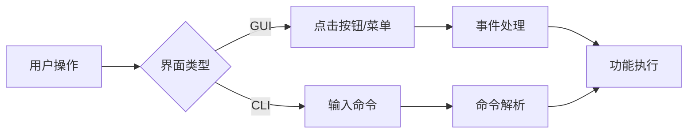
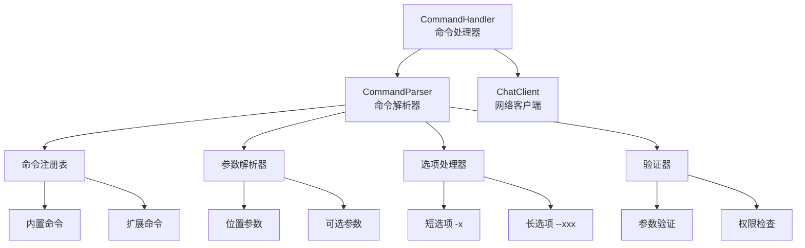
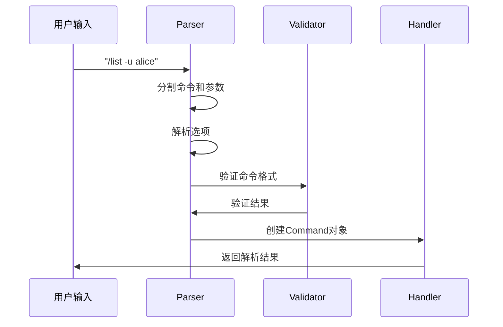

# 命令系统学习 - client/commands/parser.py

## 📋 模块概述

`client/commands/parser.py` 实现了Chat-Room项目的命令解析和处理系统，支持16个斜杠命令，提供参数解析、选项处理、命令验证等功能。这是用户与系统交互的重要接口。

## 🎯 命令系统设计原理

### 为什么需要命令系统？

**传统GUI vs 命令行界面**：


**命令系统的优势**：
- **效率高**：熟练用户可以快速执行操作
- **功能丰富**：支持复杂的参数和选项组合
- **可扩展**：容易添加新命令
- **可脚本化**：支持批量操作和自动化
- **学习成本**：对程序员友好

### 命令设计原则

1. **一致性**：所有命令遵循相同的语法规则
2. **直观性**：命令名称要见名知意
3. **简洁性**：常用命令要简短易记
4. **完整性**：提供完整的帮助信息
5. **容错性**：友好的错误提示和建议

## 🏗️ 命令系统架构

### 系统组件



### 核心数据结构

```python
@dataclass
class Command:
    """命令数据结构"""
    name: str                    # 命令名称
    args: List[str]             # 位置参数列表
    options: Dict[str, Any]     # 选项字典
    raw_input: str              # 原始输入字符串

class CommandParser:
    """命令解析器"""
    
    def __init__(self):
        """初始化命令解析器"""
        self.commands: Dict[str, Dict[str, Any]] = {}
        self._register_builtin_commands()
    
    def register_command(self, name: str, command_info: Dict[str, Any]):
        """注册命令"""
        self.commands[name] = command_info
    
    def parse(self, input_text: str) -> Command:
        """解析用户输入为命令对象"""
        # 解析逻辑实现
        pass
```

## 📝 命令注册系统

### 内置命令注册

```python
def _register_builtin_commands(self):
    """注册内置命令"""
    
    # 帮助命令
    self.register_command("?", {
        "description": "显示所有可用命令",
        "usage": "/?",
        "handler": None,
        "aliases": ["help"]
    })
    
    self.register_command("help", {
        "description": "显示命令帮助信息",
        "usage": "/help [命令名]",
        "handler": None,
        "examples": [
            "/help",           # 显示所有命令
            "/help login",     # 显示login命令帮助
        ]
    })
    
    # 认证命令
    self.register_command("login", {
        "description": "用户登录",
        "usage": "/login",
        "handler": None,
        "requires_auth": False,
        "interactive": True
    })
    
    self.register_command("signin", {
        "description": "用户注册",
        "usage": "/signin",
        "handler": None,
        "requires_auth": False,
        "interactive": True,
        "aliases": ["register"]
    })
    
    # 信息查询命令
    self.register_command("info", {
        "description": "显示当前用户信息",
        "usage": "/info",
        "handler": None,
        "requires_auth": True
    })
    
    self.register_command("list", {
        "description": "列出各种信息",
        "usage": "/list [-u|-s|-c|-g|-f]",
        "options": {
            "-u": "列出在线用户",
            "-s": "显示服务器状态",
            "-c": "列出聊天组",
            "-g": "列出当前聊天组成员",
            "-f": "列出可下载文件"
        },
        "handler": None,
        "requires_auth": True,
        "examples": [
            "/list -u",        # 列出在线用户
            "/list -c",        # 列出聊天组
            "/list -f",        # 列出文件
        ]
    })
```

### 命令元数据设计

```python
# 命令元数据结构
COMMAND_METADATA = {
    "description": str,          # 命令描述
    "usage": str,               # 使用方法
    "options": Dict[str, str],  # 选项说明
    "examples": List[str],      # 使用示例
    "aliases": List[str],       # 命令别名
    "requires_auth": bool,      # 是否需要登录
    "interactive": bool,        # 是否为交互式命令
    "min_args": int,           # 最少参数数量
    "max_args": int,           # 最多参数数量
    "handler": Callable,       # 处理函数
}

# 示例：文件传输命令
self.register_command("send_files", {
    "description": "发送文件到当前聊天组",
    "usage": "/send_files <文件路径1> [文件路径2] ...",
    "examples": [
        "/send_files ./document.pdf",
        "/send_files ./image.jpg ./video.mp4",
        "/send_files ~/Downloads/file.txt"
    ],
    "requires_auth": True,
    "min_args": 1,
    "max_args": 10,  # 限制同时发送的文件数量
    "handler": None
})
```

## 🔍 命令解析引擎

### 解析流程



### 核心解析方法

```python
def parse(self, input_text: str) -> Command:
    """
    解析用户输入为命令对象
    
    Args:
        input_text: 用户输入的命令字符串
        
    Returns:
        解析后的Command对象
        
    Raises:
        CommandParseError: 命令解析失败
    """
    if not input_text.strip():
        raise CommandParseError("命令不能为空")
    
    # 移除开头的斜杠
    if input_text.startswith('/'):
        input_text = input_text[1:]
    
    # 分割命令和参数
    parts = self._split_command_line(input_text)
    if not parts:
        raise CommandParseError("无效的命令格式")
    
    command_name = parts[0].lower()
    remaining_parts = parts[1:]
    
    # 检查命令是否存在
    if command_name not in self.commands:
        # 检查别名
        command_name = self._resolve_alias(command_name)
        if not command_name:
            raise CommandParseError(f"未知命令: {parts[0]}")
    
    # 解析参数和选项
    args, options = self._parse_args_and_options(remaining_parts)
    
    # 创建命令对象
    command = Command(
        name=command_name,
        args=args,
        options=options,
        raw_input=input_text
    )
    
    # 验证命令
    self._validate_command(command)
    
    return command

def _split_command_line(self, input_text: str) -> List[str]:
    """
    分割命令行，支持引号包围的参数
    
    Examples:
        'list -u alice' -> ['list', '-u', 'alice']
        'send_files "my file.txt"' -> ['send_files', 'my file.txt']
    """
    import shlex
    try:
        return shlex.split(input_text)
    except ValueError as e:
        raise CommandParseError(f"命令行解析错误: {e}")

def _parse_args_and_options(self, parts: List[str]) -> Tuple[List[str], Dict[str, Any]]:
    """
    解析参数和选项
    
    Args:
        parts: 命令行部分列表
        
    Returns:
        (位置参数列表, 选项字典)
    """
    args = []
    options = {}
    
    i = 0
    while i < len(parts):
        part = parts[i]
        
        if part.startswith('-'):
            # 处理选项
            if part.startswith('--'):
                # 长选项: --option=value 或 --option value
                option_name = part[2:]
                if '=' in option_name:
                    key, value = option_name.split('=', 1)
                    options[key] = value
                else:
                    # 检查下一个参数是否为值
                    if i + 1 < len(parts) and not parts[i + 1].startswith('-'):
                        options[option_name] = parts[i + 1]
                        i += 1
                    else:
                        options[option_name] = True
            else:
                # 短选项: -o value 或 -o
                option_name = part[1:]
                if i + 1 < len(parts) and not parts[i + 1].startswith('-'):
                    options[option_name] = parts[i + 1]
                    i += 1
                else:
                    options[option_name] = True
        else:
            # 位置参数
            args.append(part)
        
        i += 1
    
    return args, options
```

### 命令验证

```python
def _validate_command(self, command: Command):
    """
    验证命令的有效性
    
    Args:
        command: 要验证的命令对象
        
    Raises:
        CommandValidationError: 验证失败
    """
    command_info = self.commands[command.name]
    
    # 检查参数数量
    min_args = command_info.get("min_args", 0)
    max_args = command_info.get("max_args", float('inf'))
    
    if len(command.args) < min_args:
        raise CommandValidationError(
            f"命令 '{command.name}' 需要至少 {min_args} 个参数，"
            f"但只提供了 {len(command.args)} 个"
        )
    
    if len(command.args) > max_args:
        raise CommandValidationError(
            f"命令 '{command.name}' 最多接受 {max_args} 个参数，"
            f"但提供了 {len(command.args)} 个"
        )
    
    # 检查必需选项
    required_options = command_info.get("required_options", [])
    for option in required_options:
        if option not in command.options:
            raise CommandValidationError(f"缺少必需选项: {option}")
    
    # 检查选项有效性
    valid_options = command_info.get("options", {}).keys()
    if valid_options:
        for option in command.options:
            if option not in valid_options:
                raise CommandValidationError(f"无效选项: -{option}")

def _resolve_alias(self, command_name: str) -> Optional[str]:
    """解析命令别名"""
    for name, info in self.commands.items():
        aliases = info.get("aliases", [])
        if command_name in aliases:
            return name
    return None
```

## 🎯 命令处理器

### 处理器架构

```python
class CommandHandler:
    """命令处理器 - 执行解析后的命令"""
    
    def __init__(self, chat_client):
        """
        初始化命令处理器
        
        Args:
            chat_client: 聊天客户端实例
        """
        self.chat_client = chat_client
        self.parser = CommandParser()
        self.command_handlers: Dict[str, Callable] = {}
        self.logger = get_logger("client.commands")
        self._register_handlers()
    
    def _register_handlers(self):
        """注册命令处理器"""
        self.command_handlers = {
            "?": self.handle_help,
            "help": self.handle_help,
            "login": self.handle_login,
            "signin": self.handle_signin,
            "info": self.handle_info,
            "list": self.handle_list,
            "create_chat": self.handle_create_chat,
            "enter_chat": self.handle_enter_chat,
            "join_chat": self.handle_join_chat,
            "send_files": self.handle_send_files,
            "recv_files": self.handle_recv_files,
            "ai": self.handle_ai,
            "exit": self.handle_exit,
        }
    
    def handle_command(self, command_input: str) -> Tuple[bool, str]:
        """
        处理命令输入
        
        Args:
            command_input: 命令输入字符串
            
        Returns:
            (是否成功, 结果消息)
        """
        try:
            # 解析命令
            command = self.parser.parse(command_input)
            
            # 检查认证要求
            if not self._check_auth_requirement(command):
                return False, "此命令需要先登录"
            
            # 执行命令
            handler = self.command_handlers.get(command.name)
            if handler:
                return handler(command)
            else:
                return False, f"命令 '{command.name}' 暂未实现"
                
        except CommandParseError as e:
            return False, f"命令解析错误: {e}"
        except CommandValidationError as e:
            return False, f"命令验证错误: {e}"
        except Exception as e:
            self.logger.error(f"命令处理异常: {e}")
            return False, f"命令执行失败: {e}"
```

### 具体命令处理示例

#### 帮助命令处理

```python
def handle_help(self, command: Command) -> Tuple[bool, str]:
    """处理帮助命令"""
    if command.args:
        # 显示特定命令的帮助
        command_name = command.args[0].lower()
        return self._show_command_help(command_name)
    else:
        # 显示所有命令的概览
        return self._show_all_commands()

def _show_command_help(self, command_name: str) -> Tuple[bool, str]:
    """显示特定命令的详细帮助"""
    if command_name not in self.parser.commands:
        return False, f"未知命令: {command_name}"
    
    cmd_info = self.parser.commands[command_name]
    help_text = f"\n命令: /{command_name}\n"
    help_text += f"描述: {cmd_info.get('description', '无描述')}\n"
    help_text += f"用法: {cmd_info.get('usage', f'/{command_name}')}\n"
    
    # 显示选项
    options = cmd_info.get('options', {})
    if options:
        help_text += "\n选项:\n"
        for option, desc in options.items():
            help_text += f"  {option}: {desc}\n"
    
    # 显示示例
    examples = cmd_info.get('examples', [])
    if examples:
        help_text += "\n示例:\n"
        for example in examples:
            help_text += f"  {example}\n"
    
    return True, help_text

def _show_all_commands(self) -> Tuple[bool, str]:
    """显示所有命令的概览"""
    help_text = "\n📋 可用命令列表:\n\n"
    
    # 按类别组织命令
    categories = {
        "基础命令": ["?", "help", "info", "exit"],
        "认证命令": ["login", "signin"],
        "信息查询": ["list"],
        "聊天管理": ["create_chat", "join_chat", "enter_chat"],
        "文件传输": ["send_files", "recv_files"],
        "AI功能": ["ai"]
    }
    
    for category, commands in categories.items():
        help_text += f"🔸 {category}:\n"
        for cmd_name in commands:
            if cmd_name in self.parser.commands:
                cmd_info = self.parser.commands[cmd_name]
                desc = cmd_info.get('description', '无描述')
                help_text += f"  /{cmd_name} - {desc}\n"
        help_text += "\n"
    
    help_text += "💡 使用 /help <命令名> 查看具体命令的详细帮助\n"
    help_text += "💡 示例: /help login\n"
    
    return True, help_text
```

#### 列表查询命令处理

```python
@require_args(min_args=0, error_msg="list命令不需要位置参数")
def handle_list(self, command: Command) -> Tuple[bool, str]:
    """处理列表查询命令"""
    if not command.options:
        return False, "请指定查询选项: -u(用户) -c(聊天组) -f(文件) -s(状态) -g(成员)"
    
    # 处理不同的选项
    if "u" in command.options:
        return self._list_users()
    elif "c" in command.options:
        return self._list_chats()
    elif "f" in command.options:
        return self._list_files()
    elif "s" in command.options:
        return self._show_server_status()
    elif "g" in command.options:
        return self._list_group_members()
    else:
        return False, "无效的选项，支持的选项: -u -c -f -s -g"

def _list_users(self) -> Tuple[bool, str]:
    """列出在线用户"""
    request = ListUsersRequest()
    
    if self.chat_client.send_message(request):
        return True, "正在获取用户列表..."
    else:
        return False, "发送用户列表请求失败"

def _list_chats(self) -> Tuple[bool, str]:
    """列出聊天组"""
    request = ListChatsRequest()
    
    if self.chat_client.send_message(request):
        return True, "正在获取聊天组列表..."
    else:
        return False, "发送聊天组列表请求失败"
```

## 🎨 装饰器和工具

### 参数验证装饰器

```python
def require_args(min_args: int = 1, error_msg: str = "请提供必要的参数"):
    """装饰器：要求最少参数数量"""
    def decorator(func: Callable) -> Callable:
        @wraps(func)
        def wrapper(self, command):
            if len(command.args) < min_args:
                return False, error_msg
            return func(self, command)
        return wrapper
    return decorator

def require_login(error_msg: str = "此命令需要先登录"):
    """装饰器：要求用户已登录"""
    def decorator(func: Callable) -> Callable:
        @wraps(func)
        def wrapper(self, command):
            if not self.chat_client.is_logged_in():
                return False, error_msg
            return func(self, command)
        return wrapper
    return decorator

def validate_options(valid_options: List[str]):
    """装饰器：验证选项有效性"""
    def decorator(func: Callable) -> Callable:
        @wraps(func)
        def wrapper(self, command):
            for option in command.options:
                if option not in valid_options:
                    return False, f"无效选项: -{option}，有效选项: {', '.join(valid_options)}"
            return func(self, command)
        return wrapper
    return decorator

# 使用示例
@require_login()
@require_args(min_args=1, error_msg="请提供聊天组名称")
def handle_enter_chat(self, command: Command) -> Tuple[bool, str]:
    """进入聊天组"""
    chat_name = command.args[0]
    # 处理逻辑...
```

### 工具函数

```python
def format_file_size(size_bytes: int) -> str:
    """格式化文件大小"""
    if size_bytes < 1024:
        return f"{size_bytes}B"
    elif size_bytes < 1024 * 1024:
        return f"{size_bytes / 1024:.1f}KB"
    else:
        return f"{size_bytes / (1024 * 1024):.2f}MB"

def validate_file_path(file_path: str) -> bool:
    """验证文件路径"""
    import os
    return os.path.exists(file_path) and os.path.isfile(file_path)

def suggest_similar_commands(input_command: str, available_commands: List[str]) -> List[str]:
    """建议相似的命令"""
    import difflib
    suggestions = difflib.get_close_matches(
        input_command, 
        available_commands, 
        n=3, 
        cutoff=0.6
    )
    return suggestions
```

## 💡 学习要点

### 命令行解析技术

1. **词法分析**：将输入字符串分割为token
2. **语法分析**：识别命令、参数、选项的结构
3. **语义分析**：验证命令的语义正确性
4. **错误处理**：提供友好的错误信息和建议

### 设计模式应用

1. **命令模式**：将请求封装为对象
2. **策略模式**：不同命令使用不同的处理策略
3. **装饰器模式**：为命令处理添加额外功能
4. **工厂模式**：根据输入创建相应的命令对象

### 用户体验设计

1. **一致性**：所有命令遵循相同的语法规则
2. **可发现性**：提供完整的帮助系统
3. **容错性**：智能的错误提示和命令建议
4. **效率性**：支持别名和快捷方式

## 🤔 思考题

1. **如何实现命令的自动补全？**
   - Trie树存储命令
   - 前缀匹配算法
   - 上下文感知补全

2. **如何支持命令的撤销和重做？**
   - 命令历史栈
   - 可逆命令设计
   - 状态快照机制

3. **如何实现命令的批处理？**
   - 脚本解析器
   - 命令队列
   - 事务性执行

---

**下一步**：学习数据库设计 → [../05-database-design/](../05-database-design/)
