# UI界面设计学习 - client/ui/app.py

## 📋 模块概述

`client/ui/app.py` 实现了Chat-Room项目的TUI（Terminal User Interface）界面，基于Textual库构建现代化的终端用户界面。这是用户与聊天室交互的主要入口。

## 🎯 TUI界面设计原理

### 为什么选择TUI？

**TUI的优势**：

```mermaid
graph LR
    A[TUI优势] --> B[跨平台兼容]
    A --> C[资源占用低]
    A --> D[部署简单]
    A --> E[开发效率高]
    
    B --> B1[Windows/Linux/macOS]
    C --> C1[内存占用小]
    C --> C2[CPU使用低]
    D --> D1[无需GUI环境]
    D --> D2[SSH远程访问]
    E --> E1[快速原型开发]
    E --> E2[专注功能实现]
```


**与GUI的对比**：
- **开发复杂度**：TUI < GUI
- **资源消耗**：TUI < GUI  
- **部署要求**：TUI < GUI
- **用户体验**：TUI < GUI（但对开发者友好）

### Textual框架特点

```python
# Textual的核心概念
from textual.app import App
from textual.widgets import Header, Footer, Input, RichLog
from textual.containers import Container, Horizontal

class ChatApp(App):
    """基于Textual的聊天应用"""
    
    # CSS样式文件
    CSS_PATH = "themes/default.css"
    
    # 应用标题
    TITLE = "Chat-Room 聊天室"
    
    # 组件组合
    def compose(self) -> ComposeResult:
        yield Header()
        yield Container(...)
        yield Footer()
```

**Textual特点**：
- **声明式UI**：类似React的组件化设计
- **CSS样式**：支持CSS样式定制
- **响应式布局**：自动适应终端大小
- **事件驱动**：基于事件的交互模型

## 🏗️ 界面架构设计

### 布局结构

```mermaid
graph TD
    A[ChatApp<br/>主应用] --> B[Header<br/>标题栏]
    A --> C[Container<br/>主容器]
    A --> D[Footer<br/>状态栏]
    
    C --> E[chat_area<br/>聊天区域]
    C --> F[status_area<br/>状态区域]
    C --> G[input_area<br/>输入区域]
    
    E --> E1[Label<br/>区域标题]
    E --> E2[RichLog<br/>聊天记录]
    
    F --> F1[Label<br/>区域标题]
    F --> F2[ListView<br/>状态列表]
    
    G --> G1[Label<br/>区域标题]
    G --> G2[Input<br/>消息输入框]
```



### 主应用类设计

```python
class ChatApp(App):
    """Chat-Room TUI主应用"""
    
    CSS_PATH = "themes/default.css"
    TITLE = "Chat-Room 聊天室"
    
    def __init__(self, host: str = DEFAULT_HOST, port: int = DEFAULT_PORT):
        """
        初始化应用
        
        Args:
            host: 服务器地址
            port: 服务器端口
        """
        super().__init__()
        self.host = host
        self.port = port
        
        # 网络客户端
        self.chat_client: Optional[ChatClient] = None
        self.command_handler: Optional[CommandHandler] = None
        
        # UI组件引用
        self.chat_log: Optional[RichLog] = None
        self.message_input: Optional[Input] = None
        self.status_list: Optional[ListView] = None
        
        # 应用状态
        self.is_connected = False
        self.is_logged_in = False
        self.login_mode = False
        self.register_mode = False
        self.login_step = 0
        self.temp_username = ""
        
        # 消息历史
        self.history_messages = []
        self.current_chat_group_id = None
```

**设计特点**：
- **状态管理**：清晰的应用状态跟踪
- **组件引用**：保存UI组件的引用便于操作
- **网络集成**：集成网络客户端和命令处理器
- **模式切换**：支持登录、注册等不同模式

## 🎨 界面布局实现

### 组件组合方法

```python
def compose(self) -> ComposeResult:
    """构建UI布局"""
    yield Header()
    
    # 聊天区域
    with Container(id="chat_area"):
        yield Label("聊天记录", classes="area_title")
        yield RichLog(id="chat_log", highlight=True, markup=True)
    
    # 状态区域
    with Container(id="status_area"):
        yield Label("状态信息", classes="area_title")
        yield ListView(id="status_list")
    
    # 输入区域
    with Container(id="input_area"):
        yield Label("消息输入 (输入 /help 查看命令)", classes="area_title")
        yield Input(
            placeholder="输入消息或命令...",
            id="message_input"
        )
    
    yield Footer()
```

**布局特点**：
- **容器组织**：使用Container组织相关组件
- **ID标识**：为组件设置ID便于查询和操作
- **语义化**：清晰的区域划分和标题
- **交互提示**：提供用户操作提示

### CSS样式定制

```css
/* themes/default.css */

/* 主容器布局 */
#chat_area {
    width: 70%;
    height: 80%;
    border: solid $primary;
    margin: 1;
}

#status_area {
    width: 30%;
    height: 80%;
    border: solid $secondary;
    margin: 1;
}

#input_area {
    width: 100%;
    height: 20%;
    border: solid $accent;
    margin: 1;
}

/* 区域标题样式 */
.area_title {
    background: $primary;
    color: $text;
    text-align: center;
    text-style: bold;
}

/* 聊天记录样式 */
#chat_log {
    scrollbar-background: $surface;
    scrollbar-color: $primary;
    scrollbar-corner-color: $surface;
}

/* 输入框样式 */
#message_input {
    border: solid $accent;
}

#message_input:focus {
    border: solid $warning;
}
```

**样式特点**：
- **响应式布局**：使用百分比宽度适应不同终端大小
- **颜色主题**：使用变量定义颜色方案
- **交互反馈**：焦点状态的视觉反馈
- **滚动条定制**：自定义滚动条样式

## 🔄 事件处理系统

### 应用生命周期

```python
def on_mount(self) -> None:
    """应用挂载时的初始化"""
    # 获取组件引用
    self.chat_log = self.query_one("#chat_log", RichLog)
    self.message_input = self.query_one("#message_input", Input)
    self.status_list = self.query_one("#status_list", ListView)
    
    # 设置焦点到输入框
    self.message_input.focus()
    
    # 显示欢迎信息
    self.add_system_message("欢迎使用Chat-Room聊天室！")
    self.add_system_message("请使用 /login 登录或 /signin 注册")
    
    # 尝试连接服务器
    self.connect_to_server()

def on_ready(self) -> None:
    """应用准备就绪"""
    self.logger.info("TUI应用已启动")
    
    # 更新状态显示
    self.update_status_display()

def on_unmount(self) -> None:
    """应用卸载时的清理"""
    if self.chat_client:
        self.chat_client.disconnect()
    
    self.logger.info("TUI应用已关闭")
```

### 输入事件处理

```python
def on_input_submitted(self, event: Input.Submitted) -> None:
    """处理输入提交事件"""
    if event.input.id != "message_input":
        return
    
    user_input = event.value.strip()
    if not user_input:
        return
    
    # 清空输入框
    self.message_input.value = ""
    
    # 显示用户输入
    self.add_user_input(user_input)
    
    # 处理不同模式的输入
    if self.login_mode:
        self.handle_login_input(user_input)
    elif self.register_mode:
        self.handle_register_input(user_input)
    else:
        self.handle_normal_input(user_input)

def handle_normal_input(self, user_input: str):
    """处理正常模式的输入"""
    if user_input.startswith('/'):
        # 命令处理
        self.handle_command(user_input)
    else:
        # 普通消息
        self.send_chat_message(user_input)

def handle_command(self, command_input: str):
    """处理命令输入"""
    if not self.command_handler:
        self.add_error_message("命令处理器未初始化")
        return
    
    try:
        success, message = self.command_handler.handle_command(command_input)
        if success:
            if message:
                self.add_system_message(message)
        else:
            self.add_error_message(message or "命令执行失败")
    except Exception as e:
        self.add_error_message(f"命令处理错误: {e}")
```

### 键盘事件处理

```python
def on_key(self, event: events.Key) -> None:
    """处理键盘事件"""
    # Ctrl+C 退出应用
    if event.key == "ctrl+c":
        self.exit()
    
    # Ctrl+L 清屏
    elif event.key == "ctrl+l":
        self.clear_chat_log()
    
    # Ctrl+R 重连
    elif event.key == "ctrl+r":
        self.reconnect_to_server()
    
    # F1 显示帮助
    elif event.key == "f1":
        self.show_help()
    
    # ESC 取消当前模式
    elif event.key == "escape":
        self.cancel_current_mode()

def cancel_current_mode(self):
    """取消当前模式"""
    if self.login_mode:
        self.login_mode = False
        self.login_step = 0
        self.temp_username = ""
        self.add_system_message("已取消登录")
    
    elif self.register_mode:
        self.register_mode = False
        self.login_step = 0
        self.temp_username = ""
        self.add_system_message("已取消注册")
    
    # 更新输入提示
    self.update_input_placeholder()
```

## 💬 消息显示系统

### 消息格式化

```python
def add_chat_message(self, message: ChatMessage):
    """添加聊天消息到显示区域"""
    # 格式化时间
    timestamp = datetime.fromtimestamp(message.timestamp)
    time_str = timestamp.strftime(DISPLAY_TIME_FORMAT)
    
    # 格式化发送者
    sender = message.sender_username
    if sender == AI_USERNAME:
        sender_style = "[bold blue]🤖 AI助手[/bold blue]"
    elif sender == self.current_username:
        sender_style = f"[bold green]{sender}[/bold green]"
    else:
        sender_style = f"[bold cyan]{sender}[/bold cyan]"
    
    # 格式化消息内容
    content = self.format_message_content(message.content)
    
    # 构建完整消息
    formatted_message = f"[dim]{time_str}[/dim] {sender_style}: {content}"
    
    # 添加到聊天记录
    self.chat_log.write(formatted_message)
    
    # 自动滚动到底部
    self.chat_log.scroll_end()

def format_message_content(self, content: str) -> str:
    """格式化消息内容"""
    # 处理URL链接
    import re
    url_pattern = r'http[s]?://(?:[a-zA-Z]|[0-9]|[$-_@.&+]|[!*\\(\\),]|(?:%[0-9a-fA-F][0-9a-fA-F]))+'
    content = re.sub(url_pattern, r'[link=\g<0>]\g<0>[/link]', content)
    
    # 处理@用户提及
    mention_pattern = r'@(\w+)'
    content = re.sub(mention_pattern, r'[bold yellow]@\1[/bold yellow]', content)
    
    # 处理表情符号（如果需要）
    # content = self.replace_emoticons(content)
    
    return content

def add_system_message(self, message: str):
    """添加系统消息"""
    timestamp = datetime.now().strftime(DISPLAY_TIME_FORMAT)
    formatted_message = f"[dim]{timestamp}[/dim] [bold yellow]系统[/bold yellow]: {message}"
    self.chat_log.write(formatted_message)
    self.chat_log.scroll_end()

def add_error_message(self, message: str):
    """添加错误消息"""
    timestamp = datetime.now().strftime(DISPLAY_TIME_FORMAT)
    formatted_message = f"[dim]{timestamp}[/dim] [bold red]错误[/bold red]: {message}"
    self.chat_log.write(formatted_message)
    self.chat_log.scroll_end()

def add_user_input(self, user_input: str):
    """显示用户输入（用于登录等敏感信息）"""
    if self.login_mode and self.login_step == 1:
        # 密码输入不显示实际内容
        display_input = "*" * len(user_input)
    else:
        display_input = user_input
    
    timestamp = datetime.now().strftime(DISPLAY_TIME_FORMAT)
    formatted_message = f"[dim]{timestamp}[/dim] [bold green]你[/bold green]: {display_input}"
    self.chat_log.write(formatted_message)
    self.chat_log.scroll_end()
```

### 状态信息显示

```python
def update_status_display(self):
    """更新状态显示区域"""
    # 清空现有状态
    self.status_list.clear()
    
    # 连接状态
    if self.is_connected:
        connection_status = "[green]✅ 已连接[/green]"
    else:
        connection_status = "[red]❌ 未连接[/red]"
    
    self.status_list.append(ListItem(Label(f"连接状态: {connection_status}")))
    
    # 用户状态
    if self.is_logged_in and self.current_username:
        user_status = f"[blue]👤 {self.current_username}[/blue]"
        self.status_list.append(ListItem(Label(f"当前用户: {user_status}")))
    
    # 聊天组状态
    if self.current_chat_group:
        chat_status = f"[cyan]💬 {self.current_chat_group}[/cyan]"
        self.status_list.append(ListItem(Label(f"当前聊天组: {chat_status}")))
    
    # 在线用户数（如果有）
    if hasattr(self, 'online_user_count'):
        self.status_list.append(ListItem(Label(f"在线用户: [yellow]{self.online_user_count}[/yellow]")))
    
    # 添加分隔线
    self.status_list.append(ListItem(Label("─" * 20)))
    
    # 快捷键提示
    shortcuts = [
        "F1: 帮助",
        "Ctrl+L: 清屏",
        "Ctrl+R: 重连",
        "Ctrl+C: 退出",
        "ESC: 取消"
    ]
    
    for shortcut in shortcuts:
        self.status_list.append(ListItem(Label(f"[dim]{shortcut}[/dim]")))

def update_input_placeholder(self):
    """更新输入框提示文本"""
    if self.login_mode:
        if self.login_step == 0:
            placeholder = "请输入用户名..."
        else:
            placeholder = "请输入密码..."
    elif self.register_mode:
        if self.login_step == 0:
            placeholder = "请输入新用户名..."
        else:
            placeholder = "请输入密码..."
    else:
        placeholder = "输入消息或命令..."
    
    self.message_input.placeholder = placeholder
```

## 🔧 网络集成

### 客户端连接管理

```python
def connect_to_server(self):
    """连接到服务器"""
    try:
        self.add_system_message(f"正在连接服务器 {self.host}:{self.port}...")
        
        # 创建网络客户端
        self.chat_client = ChatClient(self.host, self.port)
        
        # 注册消息处理器
        self.setup_message_handlers()
        
        # 连接服务器
        if self.chat_client.connect():
            self.is_connected = True
            self.add_system_message("✅ 服务器连接成功")
            
            # 创建命令处理器
            self.command_handler = CommandHandler(self.chat_client)
            
        else:
            self.add_error_message("❌ 服务器连接失败")
            
    except Exception as e:
        self.add_error_message(f"连接错误: {e}")
    
    finally:
        self.update_status_display()

def setup_message_handlers(self):
    """设置消息处理器"""
    if not self.chat_client:
        return
    
    # 注册各种消息类型的处理器
    self.chat_client.register_message_handler(
        MessageType.LOGIN_RESPONSE.value, 
        self.handle_login_response
    )
    
    self.chat_client.register_message_handler(
        MessageType.CHAT_MESSAGE.value,
        self.handle_chat_message
    )
    
    self.chat_client.register_message_handler(
        MessageType.ERROR_MESSAGE.value,
        self.handle_error_message
    )
    
    # 设置默认处理器
    self.chat_client.set_default_message_handler(self.handle_unknown_message)

def handle_login_response(self, message: LoginResponse):
    """处理登录响应"""
    if message.success:
        self.is_logged_in = True
        self.current_username = message.username
        self.add_system_message(f"✅ 登录成功，欢迎 {message.username}！")
        
        # 退出登录模式
        self.login_mode = False
        self.login_step = 0
        
    else:
        self.add_error_message(f"❌ 登录失败: {message.message}")
        
        # 重置登录状态
        self.login_mode = False
        self.login_step = 0
        self.temp_username = ""
    
    self.update_status_display()
    self.update_input_placeholder()

def handle_chat_message(self, message: ChatMessage):
    """处理聊天消息"""
    self.add_chat_message(message)

def handle_error_message(self, message: ErrorMessage):
    """处理错误消息"""
    self.add_error_message(f"服务器错误: {message.error_message}")
```

## 💡 学习要点

### TUI开发技巧

1. **组件化设计**：将复杂界面拆分为独立组件
2. **状态管理**：清晰的应用状态跟踪和更新
3. **事件驱动**：基于事件的用户交互处理
4. **样式定制**：使用CSS样式提升界面美观度

### Textual框架特性

1. **声明式UI**：类似现代Web框架的组件组合
2. **响应式布局**：自动适应终端大小变化
3. **Rich集成**：强大的文本格式化和样式支持
4. **异步支持**：原生支持异步操作

### 用户体验设计

1. **即时反馈**：用户操作的即时视觉反馈
2. **错误处理**：友好的错误信息显示
3. **快捷键支持**：提高操作效率
4. **状态提示**：清晰的应用状态显示

## 🤔 思考题

1. **如何优化TUI界面的响应性？**
   - 异步消息处理
   - 界面更新优化
   - 减少重绘次数

2. **如何提升TUI的用户体验？**
   - 键盘快捷键
   - 智能补全
   - 上下文帮助

3. **如何处理不同终端的兼容性？**
   - 颜色支持检测
   - 字符编码处理
   - 终端大小适配

---

**下一步**：学习命令系统 → [command-system.md](./command-system.md)
