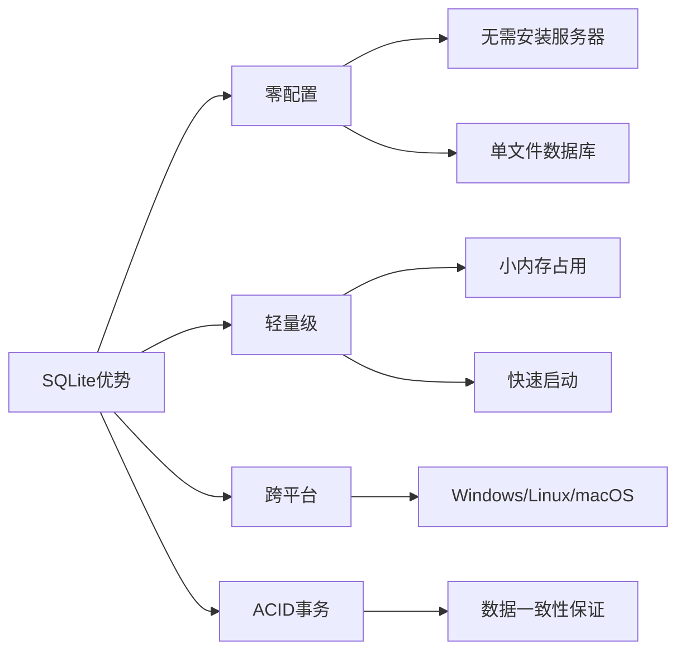
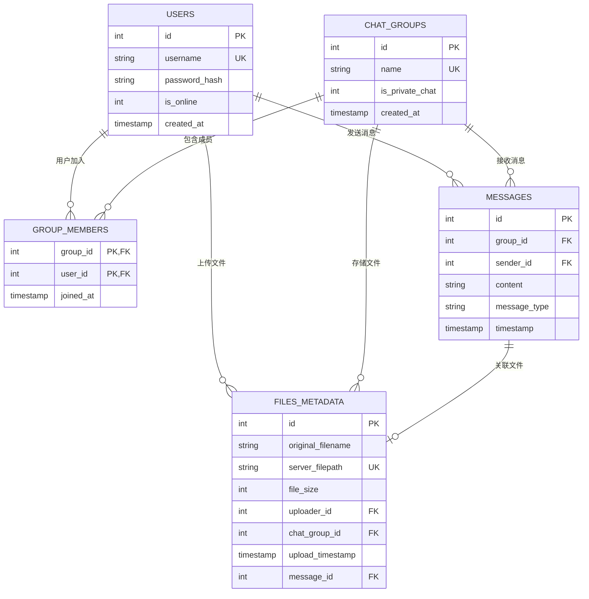

# 数据库模型设计学习 - server/database/models.py

## 📋 模块概述

`server/database/models.py` 定义了Chat-Room项目的数据库模型和操作方法，包括用户、聊天组、消息、文件等核心数据表的结构设计和CRUD操作。这是数据持久化的核心模块。

## 🎯 数据库设计原理

### 为什么选择SQLite？

**SQLite的优势**：


**适用场景**：
- **小到中型应用**：用户数量不超过几千
- **嵌入式应用**：移动应用、桌面应用
- **原型开发**：快速开发和测试
- **学习项目**：简单易用，便于学习

### 关系型数据库设计原则

1. **范式化**：减少数据冗余，提高数据一致性
2. **实体关系**：清晰的实体间关系定义
3. **约束完整性**：主键、外键、唯一性约束
4. **索引优化**：提高查询性能
5. **事务支持**：保证数据操作的原子性

## 🗄️ 数据库表结构设计

### 实体关系图



### 核心数据库管理类

```python
class DatabaseManager:
    """数据库管理器 - 统一的数据库操作接口"""
    
    def __init__(self, db_path: str = "server/data/chatroom.db"):
        """
        初始化数据库管理器
        
        Args:
            db_path: 数据库文件路径
        """
        self.db_path = db_path
        self.logger = get_logger("server.database")
        
        # 确保数据库目录存在
        os.makedirs(os.path.dirname(db_path), exist_ok=True)
        
        # 初始化数据库表结构
        self.init_database()
    
    @contextmanager
    def get_connection(self):
        """
        获取数据库连接的上下文管理器
        
        使用示例:
            with db.get_connection() as conn:
                cursor = conn.cursor()
                cursor.execute("SELECT * FROM users")
        """
        conn = None
        try:
            conn = sqlite3.connect(self.db_path)
            conn.row_factory = sqlite3.Row  # 使结果可以按列名访问
            yield conn
        except Exception as e:
            if conn:
                conn.rollback()
            raise DatabaseError(f"数据库操作失败: {e}")
        finally:
            if conn:
                conn.close()
```

**设计亮点**：
- **上下文管理器**：自动处理连接的打开和关闭
- **行工厂**：使查询结果可以按列名访问
- **异常处理**：统一的数据库异常处理
- **事务支持**：自动回滚失败的事务

## 👤 用户表设计

### 表结构定义

```python
def init_database(self):
    """初始化数据库表结构"""
    with self.get_connection() as conn:
        cursor = conn.cursor()
        
        # 创建用户表
        cursor.execute('''
            CREATE TABLE IF NOT EXISTS users (
                id INTEGER PRIMARY KEY AUTOINCREMENT,
                username TEXT UNIQUE NOT NULL,
                password_hash TEXT NOT NULL,
                is_online INTEGER DEFAULT 0,
                created_at TIMESTAMP DEFAULT CURRENT_TIMESTAMP
            )
        ''')
        
        # 创建用户名索引（提高查询性能）
        cursor.execute('''
            CREATE INDEX IF NOT EXISTS idx_users_username 
            ON users(username)
        ''')
        
        conn.commit()
```

**设计要点**：
- **主键自增**：`id`字段作为主键，自动递增
- **唯一约束**：`username`字段唯一，防止重复用户名
- **密码安全**：存储密码哈希而非明文密码
- **状态跟踪**：`is_online`字段跟踪用户在线状态
- **时间戳**：`created_at`记录用户注册时间

### 用户操作方法

```python
def create_user(self, username: str, password: str) -> int:
    """
    创建新用户
    
    Args:
        username: 用户名
        password: 密码（明文）
        
    Returns:
        新用户的ID
        
    Raises:
        UserAlreadyExistsError: 用户名已存在
        DatabaseError: 数据库操作失败
    """
    # 密码加密
    password_hash = self._hash_password(password)
    
    try:
        with self.get_connection() as conn:
            cursor = conn.cursor()
            cursor.execute(
                "INSERT INTO users (username, password_hash) VALUES (?, ?)",
                (username, password_hash)
            )
            user_id = cursor.lastrowid
            conn.commit()
            
            log_database_operation("INSERT", "users", 
                                 user_id=user_id, username=username)
            return user_id
            
    except sqlite3.IntegrityError as e:
        if "UNIQUE constraint failed" in str(e):
            raise UserAlreadyExistsError(username)
        else:
            raise DatabaseError(f"创建用户失败: {e}")

def authenticate_user(self, username: str, password: str) -> Optional[Dict]:
    """
    用户认证
    
    Args:
        username: 用户名
        password: 密码（明文）
        
    Returns:
        用户信息字典，认证失败返回None
    """
    try:
        with self.get_connection() as conn:
            cursor = conn.cursor()
            cursor.execute(
                "SELECT id, username, password_hash FROM users WHERE username = ?",
                (username,)
            )
            user_row = cursor.fetchone()
            
            if user_row and self._verify_password(password, user_row['password_hash']):
                return {
                    'id': user_row['id'],
                    'username': user_row['username']
                }
            
            return None
            
    except Exception as e:
        raise DatabaseError(f"用户认证失败: {e}")

def _hash_password(self, password: str) -> str:
    """密码哈希"""
    import hashlib
    return hashlib.sha256(password.encode()).hexdigest()

def _verify_password(self, password: str, password_hash: str) -> bool:
    """验证密码"""
    return self._hash_password(password) == password_hash
```

**安全特性**：
- **密码哈希**：使用SHA-256哈希算法
- **SQL注入防护**：使用参数化查询
- **异常处理**：详细的错误分类和处理
- **操作日志**：记录重要的数据库操作

## 💬 聊天组表设计

### 表结构和关系

```python
# 聊天组表
cursor.execute('''
    CREATE TABLE IF NOT EXISTS chat_groups (
        id INTEGER PRIMARY KEY AUTOINCREMENT,
        name TEXT UNIQUE NOT NULL,
        is_private_chat INTEGER DEFAULT 0,
        created_at TIMESTAMP DEFAULT CURRENT_TIMESTAMP
    )
''')

# 聊天组成员关系表
cursor.execute('''
    CREATE TABLE IF NOT EXISTS group_members (
        group_id INTEGER,
        user_id INTEGER,
        joined_at TIMESTAMP DEFAULT CURRENT_TIMESTAMP,
        PRIMARY KEY (group_id, user_id),
        FOREIGN KEY (group_id) REFERENCES chat_groups(id),
        FOREIGN KEY (user_id) REFERENCES users(id)
    )
''')
```

**设计特点**：
- **多对多关系**：用户和聊天组的多对多关系通过中间表实现
- **复合主键**：`group_members`表使用复合主键防止重复加入
- **外键约束**：保证数据引用完整性
- **私聊标识**：`is_private_chat`字段区分群聊和私聊

### 聊天组操作方法

```python
def create_chat_group(self, name: str, is_private_chat: bool = False) -> int:
    """
    创建聊天组
    
    Args:
        name: 聊天组名称
        is_private_chat: 是否为私聊
        
    Returns:
        新聊天组的ID
    """
    try:
        with self.get_connection() as conn:
            cursor = conn.cursor()
            cursor.execute(
                "INSERT INTO chat_groups (name, is_private_chat) VALUES (?, ?)",
                (name, 1 if is_private_chat else 0)
            )
            group_id = cursor.lastrowid
            conn.commit()
            
            log_database_operation("INSERT", "chat_groups",
                                 group_id=group_id, name=name)
            return group_id
            
    except sqlite3.IntegrityError as e:
        if "UNIQUE constraint failed" in str(e):
            raise ChatGroupAlreadyExistsError(name)
        else:
            raise DatabaseError(f"创建聊天组失败: {e}")

def add_user_to_chat_group(self, group_id: int, user_id: int):
    """
    添加用户到聊天组
    
    Args:
        group_id: 聊天组ID
        user_id: 用户ID
    """
    try:
        with self.get_connection() as conn:
            cursor = conn.cursor()
            cursor.execute(
                "INSERT OR IGNORE INTO group_members (group_id, user_id) VALUES (?, ?)",
                (group_id, user_id)
            )
            conn.commit()
            
            log_database_operation("INSERT", "group_members",
                                 group_id=group_id, user_id=user_id)
            
    except Exception as e:
        raise DatabaseError(f"添加用户到聊天组失败: {e}")

def get_chat_group_members(self, group_id: int) -> List[Dict]:
    """
    获取聊天组成员列表
    
    Args:
        group_id: 聊天组ID
        
    Returns:
        成员信息列表
    """
    try:
        with self.get_connection() as conn:
            cursor = conn.cursor()
            cursor.execute('''
                SELECT u.id, u.username, u.is_online, gm.joined_at
                FROM users u
                JOIN group_members gm ON u.id = gm.user_id
                WHERE gm.group_id = ?
                ORDER BY gm.joined_at
            ''', (group_id,))
            
            members = []
            for row in cursor.fetchall():
                members.append({
                    'id': row['id'],
                    'username': row['username'],
                    'is_online': bool(row['is_online']),
                    'joined_at': row['joined_at']
                })
            
            return members
            
    except Exception as e:
        raise DatabaseError(f"获取聊天组成员失败: {e}")
```

## 📨 消息表设计

### 表结构定义

```python
# 消息表
cursor.execute('''
    CREATE TABLE IF NOT EXISTS messages (
        id INTEGER PRIMARY KEY AUTOINCREMENT,
        group_id INTEGER,
        sender_id INTEGER,
        content TEXT,
        message_type TEXT DEFAULT 'text',
        timestamp TIMESTAMP DEFAULT CURRENT_TIMESTAMP,
        FOREIGN KEY (group_id) REFERENCES chat_groups(id),
        FOREIGN KEY (sender_id) REFERENCES users(id)
    )
''')

# 消息查询优化索引
cursor.execute('''
    CREATE INDEX IF NOT EXISTS idx_messages_group_time 
    ON messages(group_id, timestamp DESC)
''')

cursor.execute('''
    CREATE INDEX IF NOT EXISTS idx_messages_sender 
    ON messages(sender_id)
''')
```

**索引设计**：
- **复合索引**：`(group_id, timestamp DESC)`支持按聊天组和时间查询
- **单列索引**：`sender_id`支持按发送者查询
- **降序索引**：`timestamp DESC`优化最新消息查询

### 消息操作方法

```python
def save_message(self, group_id: int, sender_id: int, content: str, 
                message_type: str = "text") -> int:
    """
    保存消息到数据库
    
    Args:
        group_id: 聊天组ID
        sender_id: 发送者ID
        content: 消息内容
        message_type: 消息类型
        
    Returns:
        消息ID
    """
    try:
        with self.get_connection() as conn:
            cursor = conn.cursor()
            cursor.execute('''
                INSERT INTO messages (group_id, sender_id, content, message_type)
                VALUES (?, ?, ?, ?)
            ''', (group_id, sender_id, content, message_type))
            
            message_id = cursor.lastrowid
            conn.commit()
            
            log_database_operation("INSERT", "messages",
                                 message_id=message_id,
                                 group_id=group_id,
                                 sender_id=sender_id)
            return message_id
            
    except Exception as e:
        raise DatabaseError(f"保存消息失败: {e}")

def get_chat_history(self, group_id: int, limit: int = 50, 
                    before_message_id: int = None) -> List[Dict]:
    """
    获取聊天历史记录
    
    Args:
        group_id: 聊天组ID
        limit: 消息数量限制
        before_message_id: 获取此消息ID之前的消息（分页）
        
    Returns:
        消息列表
    """
    try:
        with self.get_connection() as conn:
            cursor = conn.cursor()
            
            # 构建查询SQL
            sql = '''
                SELECT m.id, m.content, m.message_type, m.timestamp,
                       u.username as sender_username, u.id as sender_id,
                       cg.name as group_name
                FROM messages m
                JOIN users u ON m.sender_id = u.id
                JOIN chat_groups cg ON m.group_id = cg.id
                WHERE m.group_id = ?
            '''
            
            params = [group_id]
            
            # 添加分页条件
            if before_message_id:
                sql += " AND m.id < ?"
                params.append(before_message_id)
            
            sql += " ORDER BY m.timestamp DESC LIMIT ?"
            params.append(limit)
            
            cursor.execute(sql, params)
            
            messages = []
            for row in cursor.fetchall():
                messages.append({
                    'id': row['id'],
                    'content': row['content'],
                    'message_type': row['message_type'],
                    'timestamp': row['timestamp'],
                    'sender_id': row['sender_id'],
                    'sender_username': row['sender_username'],
                    'group_id': group_id,
                    'group_name': row['group_name']
                })
            
            # 反转列表，使最新消息在最后
            return list(reversed(messages))
            
    except Exception as e:
        raise DatabaseError(f"获取聊天历史失败: {e}")
```

## 📁 文件元数据表设计

### 表结构定义

```python
# 文件元数据表
cursor.execute('''
    CREATE TABLE IF NOT EXISTS files_metadata (
        id INTEGER PRIMARY KEY AUTOINCREMENT,
        original_filename TEXT NOT NULL,
        server_filepath TEXT NOT NULL UNIQUE,
        file_size INTEGER NOT NULL,
        uploader_id INTEGER,
        chat_group_id INTEGER,
        upload_timestamp TIMESTAMP DEFAULT CURRENT_TIMESTAMP,
        message_id INTEGER,
        FOREIGN KEY (uploader_id) REFERENCES users(id),
        FOREIGN KEY (chat_group_id) REFERENCES chat_groups(id),
        FOREIGN KEY (message_id) REFERENCES messages(id)
    )
''')
```

**设计特点**：
- **文件路径唯一**：`server_filepath`唯一约束防止文件冲突
- **关联消息**：`message_id`将文件与消息关联
- **元数据完整**：记录原始文件名、大小、上传者等信息
- **聊天组关联**：文件属于特定聊天组

### 文件操作方法

```python
def save_file_metadata(self, original_filename: str, server_filepath: str,
                      file_size: int, uploader_id: int, chat_group_id: int,
                      message_id: int = None) -> int:
    """
    保存文件元数据
    
    Args:
        original_filename: 原始文件名
        server_filepath: 服务器存储路径
        file_size: 文件大小
        uploader_id: 上传者ID
        chat_group_id: 聊天组ID
        message_id: 关联的消息ID
        
    Returns:
        文件元数据ID
    """
    try:
        with self.get_connection() as conn:
            cursor = conn.cursor()
            cursor.execute('''
                INSERT INTO files_metadata 
                (original_filename, server_filepath, file_size, 
                 uploader_id, chat_group_id, message_id)
                VALUES (?, ?, ?, ?, ?, ?)
            ''', (original_filename, server_filepath, file_size,
                  uploader_id, chat_group_id, message_id))
            
            file_id = cursor.lastrowid
            conn.commit()
            
            log_database_operation("INSERT", "files_metadata",
                                 file_id=file_id,
                                 filename=original_filename,
                                 uploader_id=uploader_id)
            return file_id
            
    except Exception as e:
        raise DatabaseError(f"保存文件元数据失败: {e}")

def get_chat_group_files(self, chat_group_id: int) -> List[Dict]:
    """
    获取聊天组的文件列表
    
    Args:
        chat_group_id: 聊天组ID
        
    Returns:
        文件信息列表
    """
    try:
        with self.get_connection() as conn:
            cursor = conn.cursor()
            cursor.execute('''
                SELECT fm.id, fm.original_filename, fm.file_size,
                       fm.upload_timestamp, u.username as uploader_username
                FROM files_metadata fm
                JOIN users u ON fm.uploader_id = u.id
                WHERE fm.chat_group_id = ?
                ORDER BY fm.upload_timestamp DESC
            ''', (chat_group_id,))
            
            files = []
            for row in cursor.fetchall():
                files.append({
                    'id': row['id'],
                    'original_filename': row['original_filename'],
                    'file_size': row['file_size'],
                    'upload_timestamp': row['upload_timestamp'],
                    'uploader_username': row['uploader_username']
                })
            
            return files
            
    except Exception as e:
        raise DatabaseError(f"获取聊天组文件列表失败: {e}")
```

## 🔧 完整CRUD操作详解

### 用户管理完整CRUD

#### 创建用户 (Create)

```python
def create_user(self, username: str, password: str) -> int:
    """
    创建新用户 - 完整实现

    Args:
        username: 用户名
        password: 明文密码

    Returns:
        新用户的ID

    Raises:
        DatabaseError: 用户名已存在或其他数据库错误
    """
    # 1. 输入验证
    if not username or not username.strip():
        raise DatabaseError("用户名不能为空")

    if len(username) < 3 or len(username) > 20:
        raise DatabaseError("用户名长度必须在3-20个字符之间")

    if not password or len(password) < 6:
        raise DatabaseError("密码长度不能少于6个字符")

    # 2. 密码加密
    password_hash = self.hash_password(password)

    try:
        with self.get_connection() as conn:
            cursor = conn.cursor()

            # 3. 检查用户名是否已存在
            cursor.execute("SELECT id FROM users WHERE username = ?", (username,))
            if cursor.fetchone():
                raise DatabaseError(f"用户名 '{username}' 已存在")

            # 4. 插入新用户
            cursor.execute('''
                INSERT INTO users (username, password_hash, is_online, is_banned)
                VALUES (?, ?, 0, 0)
            ''', (username, password_hash))

            user_id = cursor.lastrowid

            # 5. 自动加入默认聊天组
            try:
                public_group = self.get_chat_group_by_name(DEFAULT_PUBLIC_CHAT)
                cursor.execute('''
                    INSERT INTO group_members (group_id, user_id)
                    VALUES (?, ?)
                ''', (public_group['id'], user_id))
            except Exception as e:
                self.logger.warning(f"新用户加入默认聊天组失败: {e}")

            # 6. 提交事务
            conn.commit()

            # 7. 记录日志
            self.logger.info("创建新用户", user_id=user_id, username=username)
            log_database_operation("CREATE", "users", user_id=user_id, username=username)

            return user_id

    except sqlite3.IntegrityError as e:
        if "UNIQUE constraint failed" in str(e):
            raise DatabaseError(f"用户名 '{username}' 已存在")
        else:
            raise DatabaseError(f"数据库完整性错误: {e}")
    except Exception as e:
        raise DatabaseError(f"创建用户失败: {e}")

@staticmethod
def hash_password(password: str) -> str:
    """密码哈希处理"""
    import hashlib
    return hashlib.sha256(password.encode()).hexdigest()
```

#### 读取用户 (Read)

```python
def get_user_by_id(self, user_id: int) -> Dict[str, Any]:
    """
    根据ID获取用户信息

    Args:
        user_id: 用户ID

    Returns:
        用户信息字典

    Raises:
        UserNotFoundError: 用户不存在
    """
    try:
        with self.get_connection() as conn:
            cursor = conn.cursor()
            cursor.execute('''
                SELECT id, username, is_online, is_banned, created_at
                FROM users
                WHERE id = ?
            ''', (user_id,))

            row = cursor.fetchone()
            if row:
                return {
                    'id': row['id'],
                    'username': row['username'],
                    'is_online': bool(row['is_online']),
                    'is_banned': bool(row['is_banned']),
                    'created_at': row['created_at']
                }
            else:
                raise UserNotFoundError(f"用户ID {user_id} 不存在")

    except Exception as e:
        if isinstance(e, UserNotFoundError):
            raise
        raise DatabaseError(f"获取用户信息失败: {e}")

def get_user_by_username(self, username: str) -> Dict[str, Any]:
    """根据用户名获取用户信息"""
    try:
        with self.get_connection() as conn:
            cursor = conn.cursor()
            cursor.execute('''
                SELECT id, username, is_online, is_banned, created_at
                FROM users
                WHERE username = ?
            ''', (username,))

            row = cursor.fetchone()
            if row:
                return dict(row)
            else:
                raise UserNotFoundError(f"用户名 '{username}' 不存在")

    except Exception as e:
        if isinstance(e, UserNotFoundError):
            raise
        raise DatabaseError(f"获取用户信息失败: {e}")

def get_all_users(self, include_banned: bool = False) -> List[Dict[str, Any]]:
    """
    获取所有用户列表

    Args:
        include_banned: 是否包含被禁用户

    Returns:
        用户信息列表
    """
    try:
        with self.get_connection() as conn:
            cursor = conn.cursor()

            sql = '''
                SELECT id, username, is_online, is_banned, created_at
                FROM users
            '''

            if not include_banned:
                sql += " WHERE is_banned = 0"

            sql += " ORDER BY created_at DESC"

            cursor.execute(sql)

            users = []
            for row in cursor.fetchall():
                users.append({
                    'id': row['id'],
                    'username': row['username'],
                    'is_online': bool(row['is_online']),
                    'is_banned': bool(row['is_banned']),
                    'created_at': row['created_at']
                })

            return users

    except Exception as e:
        raise DatabaseError(f"获取用户列表失败: {e}")
```

#### 更新用户 (Update)

```python
def update_user_status(self, user_id: int, is_online: bool):
    """更新用户在线状态"""
    try:
        with self.get_connection() as conn:
            cursor = conn.cursor()
            cursor.execute('''
                UPDATE users
                SET is_online = ?
                WHERE id = ?
            ''', (int(is_online), user_id))

            if cursor.rowcount == 0:
                raise UserNotFoundError(f"用户ID {user_id} 不存在")

            conn.commit()

            # 记录日志
            status = "在线" if is_online else "离线"
            self.logger.debug(f"用户状态更新: {user_id} -> {status}")

    except Exception as e:
        if isinstance(e, UserNotFoundError):
            raise
        raise DatabaseError(f"更新用户状态失败: {e}")

def update_user_info(self, user_id: int, username: str = None, password: str = None):
    """
    更新用户信息（管理员操作）

    Args:
        user_id: 用户ID
        username: 新用户名（可选）
        password: 新密码（可选）
    """
    if not username and not password:
        raise DatabaseError("至少需要提供一个要更新的字段")

    try:
        with self.get_connection() as conn:
            cursor = conn.cursor()

            # 检查用户是否存在
            cursor.execute("SELECT id FROM users WHERE id = ?", (user_id,))
            if not cursor.fetchone():
                raise UserNotFoundError(f"用户ID {user_id} 不存在")

            # 更新用户名
            if username:
                # 检查新用户名是否已被使用
                cursor.execute("SELECT id FROM users WHERE username = ? AND id != ?",
                             (username, user_id))
                if cursor.fetchone():
                    raise DatabaseError(f"用户名 '{username}' 已被使用")

                cursor.execute("UPDATE users SET username = ? WHERE id = ?",
                             (username, user_id))

            # 更新密码
            if password:
                password_hash = self.hash_password(password)
                cursor.execute("UPDATE users SET password_hash = ? WHERE id = ?",
                             (password_hash, user_id))

            conn.commit()

            # 记录日志
            self.logger.info("用户信息更新", user_id=user_id, username=username)
            log_database_operation("UPDATE", "users", user_id=user_id, username=username)

    except Exception as e:
        if isinstance(e, (UserNotFoundError, DatabaseError)):
            raise
        raise DatabaseError(f"更新用户信息失败: {e}")

def ban_user(self, user_id: int):
    """禁用用户"""
    try:
        with self.get_connection() as conn:
            cursor = conn.cursor()
            cursor.execute("UPDATE users SET is_banned = 1 WHERE id = ?", (user_id,))

            if cursor.rowcount == 0:
                raise UserNotFoundError(f"用户ID {user_id} 不存在")

            conn.commit()

            # 记录日志
            self.logger.info("用户被禁用", user_id=user_id)
            log_database_operation("BAN", "users", user_id=user_id)

    except Exception as e:
        if isinstance(e, UserNotFoundError):
            raise
        raise DatabaseError(f"禁用用户失败: {e}")

def free_user(self, user_id: int):
    """解禁用户"""
    try:
        with self.get_connection() as conn:
            cursor = conn.cursor()
            cursor.execute("UPDATE users SET is_banned = 0 WHERE id = ?", (user_id,))

            if cursor.rowcount == 0:
                raise UserNotFoundError(f"用户ID {user_id} 不存在")

            conn.commit()

            # 记录日志
            self.logger.info("用户解除禁用", user_id=user_id)
            log_database_operation("free", "users", user_id=user_id)

    except Exception as e:
        if isinstance(e, UserNotFoundError):
            raise
        raise DatabaseError(f"解禁用户失败: {e}")
```

#### 删除用户 (Delete)

```python
def delete_user(self, user_id: int):
    """
    删除用户（管理员操作）
    注意：这是物理删除，会同时删除用户的所有相关数据

    Args:
        user_id: 用户ID
    """
    try:
        with self.get_connection() as conn:
            cursor = conn.cursor()

            # 检查用户是否存在
            cursor.execute("SELECT username FROM users WHERE id = ?", (user_id,))
            user_row = cursor.fetchone()
            if not user_row:
                raise UserNotFoundError(f"用户ID {user_id} 不存在")

            username = user_row['username']

            # 开始事务删除（SQLite自动事务）

            # 1. 删除用户的聊天组成员关系
            cursor.execute("DELETE FROM group_members WHERE user_id = ?", (user_id,))

            # 2. 删除用户发送的消息（可选：保留消息但标记发送者为已删除）
            cursor.execute("DELETE FROM messages WHERE sender_id = ?", (user_id,))

            # 3. 删除用户上传的文件元数据
            cursor.execute("SELECT server_filepath FROM files_metadata WHERE uploader_id = ?",
                         (user_id,))
            file_paths = [row['server_filepath'] for row in cursor.fetchall()]

            cursor.execute("DELETE FROM files_metadata WHERE uploader_id = ?", (user_id,))

            # 4. 删除用户记录
            cursor.execute("DELETE FROM users WHERE id = ?", (user_id,))

            # 提交事务
            conn.commit()

            # 5. 删除物理文件
            import os
            for file_path in file_paths:
                try:
                    if os.path.exists(file_path):
                        os.remove(file_path)
                except Exception as e:
                    self.logger.warning(f"删除文件失败: {file_path}, 错误: {e}")

            # 记录日志
            self.logger.info("用户被删除", user_id=user_id, username=username)
            log_database_operation("DELETE", "users", user_id=user_id, username=username)

    except Exception as e:
        if isinstance(e, UserNotFoundError):
            raise
        raise DatabaseError(f"删除用户失败: {e}")
```

### 聊天组管理完整CRUD

#### 创建聊天组 (Create)

```python
def create_chat_group(self, name: str, is_private_chat: bool = False) -> int:
    """
    创建聊天组

    Args:
        name: 聊天组名称
        is_private_chat: 是否为私聊

    Returns:
        新聊天组的ID
    """
    # 输入验证
    if not name or not name.strip():
        raise DatabaseError("聊天组名称不能为空")

    if len(name) > 50:
        raise DatabaseError("聊天组名称不能超过50个字符")

    try:
        with self.get_connection() as conn:
            cursor = conn.cursor()

            # 检查名称是否已存在
            cursor.execute("SELECT id FROM chat_groups WHERE name = ?", (name,))
            if cursor.fetchone():
                raise DatabaseError(f"聊天组名称 '{name}' 已存在")

            # 创建聊天组
            cursor.execute('''
                INSERT INTO chat_groups (name, is_private_chat, is_banned)
                VALUES (?, ?, 0)
            ''', (name, int(is_private_chat)))

            group_id = cursor.lastrowid
            conn.commit()

            # 记录日志
            self.logger.info("创建聊天组", group_id=group_id, name=name)
            log_database_operation("CREATE", "chat_groups", group_id=group_id, name=name)

            return group_id

    except Exception as e:
        if "已存在" in str(e):
            raise
        raise DatabaseError(f"创建聊天组失败: {e}")
```

#### 读取聊天组 (Read)

```python
def get_chat_group_by_id(self, group_id: int) -> Dict[str, Any]:
    """根据ID获取聊天组信息"""
    try:
        with self.get_connection() as conn:
            cursor = conn.cursor()
            cursor.execute('''
                SELECT id, name, is_private_chat, is_banned, created_at
                FROM chat_groups
                WHERE id = ?
            ''', (group_id,))

            row = cursor.fetchone()
            if row:
                return {
                    'id': row['id'],
                    'name': row['name'],
                    'is_private_chat': bool(row['is_private_chat']),
                    'is_banned': bool(row['is_banned']),
                    'created_at': row['created_at']
                }
            else:
                raise ChatGroupNotFoundError(f"聊天组ID {group_id} 不存在")

    except Exception as e:
        if isinstance(e, ChatGroupNotFoundError):
            raise
        raise DatabaseError(f"获取聊天组信息失败: {e}")

def get_user_chat_groups(self, user_id: int) -> List[Dict[str, Any]]:
    """获取用户参与的聊天组列表"""
    try:
        with self.get_connection() as conn:
            cursor = conn.cursor()
            cursor.execute('''
                SELECT cg.id, cg.name, cg.is_private_chat, cg.is_banned, cg.created_at,
                       gm.joined_at,
                       (SELECT COUNT(*) FROM group_members gm2 WHERE gm2.group_id = cg.id) as member_count
                FROM chat_groups cg
                JOIN group_members gm ON cg.id = gm.group_id
                WHERE gm.user_id = ?
                ORDER BY gm.joined_at DESC
            ''', (user_id,))

            groups = []
            for row in cursor.fetchall():
                groups.append({
                    'id': row['id'],
                    'name': row['name'],
                    'is_private_chat': bool(row['is_private_chat']),
                    'is_banned': bool(row['is_banned']),
                    'created_at': row['created_at'],
                    'joined_at': row['joined_at'],
                    'member_count': row['member_count']
                })

            return groups

    except Exception as e:
        raise DatabaseError(f"获取用户聊天组列表失败: {e}")
```

#### 更新聊天组 (Update)

```python
def update_chat_group_info(self, group_id: int, name: str = None):
    """更新聊天组信息"""
    if not name:
        raise DatabaseError("至少需要提供一个要更新的字段")

    try:
        with self.get_connection() as conn:
            cursor = conn.cursor()

            # 检查聊天组是否存在
            cursor.execute("SELECT name FROM chat_groups WHERE id = ?", (group_id,))
            if not cursor.fetchone():
                raise ChatGroupNotFoundError(f"聊天组ID {group_id} 不存在")

            # 检查新名称是否已被使用
            if name:
                cursor.execute("SELECT id FROM chat_groups WHERE name = ? AND id != ?",
                             (name, group_id))
                if cursor.fetchone():
                    raise DatabaseError(f"聊天组名称 '{name}' 已被使用")

                cursor.execute("UPDATE chat_groups SET name = ? WHERE id = ?",
                             (name, group_id))

            conn.commit()

            # 记录日志
            self.logger.info("聊天组信息更新", group_id=group_id, name=name)
            log_database_operation("UPDATE", "chat_groups", group_id=group_id, name=name)

    except Exception as e:
        if isinstance(e, (ChatGroupNotFoundError, DatabaseError)):
            raise
        raise DatabaseError(f"更新聊天组信息失败: {e}")

def ban_chat_group(self, group_id: int):
    """禁言聊天组"""
    try:
        with self.get_connection() as conn:
            cursor = conn.cursor()
            cursor.execute("UPDATE chat_groups SET is_banned = 1 WHERE id = ?", (group_id,))

            if cursor.rowcount == 0:
                raise ChatGroupNotFoundError(f"聊天组ID {group_id} 不存在")

            conn.commit()

            # 记录日志
            self.logger.info("聊天组被禁言", group_id=group_id)
            log_database_operation("BAN", "chat_groups", group_id=group_id)

    except Exception as e:
        if isinstance(e, ChatGroupNotFoundError):
            raise
        raise DatabaseError(f"禁言聊天组失败: {e}")
```

#### 删除聊天组 (Delete)

```python
def delete_chat_group(self, group_id: int):
    """删除聊天组（管理员操作）"""
    try:
        with self.get_connection() as conn:
            cursor = conn.cursor()

            # 检查聊天组是否存在
            cursor.execute("SELECT name FROM chat_groups WHERE id = ?", (group_id,))
            group_row = cursor.fetchone()
            if not group_row:
                raise ChatGroupNotFoundError(f"聊天组ID {group_id} 不存在")

            group_name = group_row['name']

            # 获取要删除的文件路径
            cursor.execute("SELECT server_filepath FROM files_metadata WHERE chat_group_id = ?",
                         (group_id,))
            file_paths = [row['server_filepath'] for row in cursor.fetchall()]

            # 开始事务删除
            # 1. 删除聊天组成员关系
            cursor.execute("DELETE FROM group_members WHERE group_id = ?", (group_id,))

            # 2. 删除聊天组消息
            cursor.execute("DELETE FROM messages WHERE group_id = ?", (group_id,))

            # 3. 删除文件元数据
            cursor.execute("DELETE FROM files_metadata WHERE chat_group_id = ?", (group_id,))

            # 4. 删除聊天组记录
            cursor.execute("DELETE FROM chat_groups WHERE id = ?", (group_id,))

            conn.commit()

            # 5. 删除物理文件
            import os
            for file_path in file_paths:
                try:
                    if os.path.exists(file_path):
                        os.remove(file_path)
                except Exception as e:
                    self.logger.warning(f"删除文件失败: {file_path}, 错误: {e}")

            # 记录日志
            self.logger.info("聊天组被删除", group_id=group_id, name=group_name)
            log_database_operation("DELETE", "chat_groups", group_id=group_id, name=group_name)

    except Exception as e:
        if isinstance(e, ChatGroupNotFoundError):
            raise
        raise DatabaseError(f"删除聊天组失败: {e}")
```

### 消息管理完整CRUD

#### 创建消息 (Create)

```python
def save_message(self, group_id: int, sender_id: int, content: str,
                message_type: str = 'text') -> int:
    """
    保存消息到数据库

    Args:
        group_id: 聊天组ID
        sender_id: 发送者ID
        content: 消息内容
        message_type: 消息类型

    Returns:
        消息ID
    """
    # 输入验证
    if not content or not content.strip():
        raise DatabaseError("消息内容不能为空")

    if len(content) > 2000:
        raise DatabaseError("消息内容不能超过2000个字符")

    try:
        with self.get_connection() as conn:
            cursor = conn.cursor()

            # 验证发送者和聊天组是否存在
            cursor.execute("SELECT id FROM users WHERE id = ?", (sender_id,))
            if not cursor.fetchone():
                raise UserNotFoundError(f"发送者ID {sender_id} 不存在")

            cursor.execute("SELECT id FROM chat_groups WHERE id = ?", (group_id,))
            if not cursor.fetchone():
                raise ChatGroupNotFoundError(f"聊天组ID {group_id} 不存在")

            # 保存消息
            cursor.execute('''
                INSERT INTO messages (group_id, sender_id, content, message_type)
                VALUES (?, ?, ?, ?)
            ''', (group_id, sender_id, content, message_type))

            message_id = cursor.lastrowid
            conn.commit()

            # 记录日志
            self.logger.debug("保存消息", message_id=message_id,
                            group_id=group_id, sender_id=sender_id)

            return message_id

    except Exception as e:
        if isinstance(e, (UserNotFoundError, ChatGroupNotFoundError)):
            raise
        raise DatabaseError(f"保存消息失败: {e}")
```

#### 读取消息 (Read)

```python
def get_chat_history(self, group_id: int, limit: int = 50,
                    before_message_id: int = None) -> List[Dict[str, Any]]:
    """
    获取聊天历史记录（支持分页）

    Args:
        group_id: 聊天组ID
        limit: 消息数量限制
        before_message_id: 获取此消息ID之前的消息（分页）

    Returns:
        消息列表
    """
    try:
        with self.get_connection() as conn:
            cursor = conn.cursor()

            # 构建查询SQL
            sql = '''
                SELECT m.id, m.content, m.message_type, m.timestamp,
                       u.id as sender_id, u.username as sender_username
                FROM messages m
                JOIN users u ON m.sender_id = u.id
                WHERE m.group_id = ?
            '''

            params = [group_id]

            # 添加分页条件
            if before_message_id:
                sql += " AND m.id < ?"
                params.append(before_message_id)

            sql += " ORDER BY m.timestamp DESC LIMIT ?"
            params.append(limit)

            cursor.execute(sql, params)

            messages = []
            for row in cursor.fetchall():
                messages.append({
                    'id': row['id'],
                    'content': row['content'],
                    'message_type': row['message_type'],
                    'timestamp': row['timestamp'],
                    'sender_id': row['sender_id'],
                    'sender_username': row['sender_username'],
                    'group_id': group_id
                })

            # 反转列表，使最新消息在最后
            return list(reversed(messages))

    except Exception as e:
        raise DatabaseError(f"获取聊天历史失败: {e}")

def get_message_by_id(self, message_id: int) -> Dict[str, Any]:
    """根据ID获取单条消息"""
    try:
        with self.get_connection() as conn:
            cursor = conn.cursor()
            cursor.execute('''
                SELECT m.id, m.content, m.message_type, m.timestamp, m.group_id,
                       u.id as sender_id, u.username as sender_username,
                       cg.name as group_name
                FROM messages m
                JOIN users u ON m.sender_id = u.id
                JOIN chat_groups cg ON m.group_id = cg.id
                WHERE m.id = ?
            ''', (message_id,))

            row = cursor.fetchone()
            if row:
                return dict(row)
            else:
                raise DatabaseError(f"消息ID {message_id} 不存在")

    except Exception as e:
        if "不存在" in str(e):
            raise
        raise DatabaseError(f"获取消息失败: {e}")
```

## 🔧 高级数据库技术

### 事务处理最佳实践

```python
def transfer_user_between_groups(self, user_id: int, from_group_id: int, to_group_id: int):
    """
    事务示例：将用户从一个聊天组转移到另一个聊天组
    展示完整的事务处理和错误恢复
    """
    try:
        with self.get_connection() as conn:
            cursor = conn.cursor()

            # 开始事务（SQLite默认自动开始）

            # 1. 验证所有相关实体存在
            cursor.execute("SELECT username FROM users WHERE id = ?", (user_id,))
            user_row = cursor.fetchone()
            if not user_row:
                raise UserNotFoundError(f"用户ID {user_id} 不存在")

            cursor.execute("SELECT name FROM chat_groups WHERE id = ?", (from_group_id,))
            if not cursor.fetchone():
                raise ChatGroupNotFoundError(f"源聊天组ID {from_group_id} 不存在")

            cursor.execute("SELECT name FROM chat_groups WHERE id = ?", (to_group_id,))
            if not cursor.fetchone():
                raise ChatGroupNotFoundError(f"目标聊天组ID {to_group_id} 不存在")

            # 2. 检查用户是否在源聊天组中
            cursor.execute('''
                SELECT 1 FROM group_members
                WHERE group_id = ? AND user_id = ?
            ''', (from_group_id, user_id))
            if not cursor.fetchone():
                raise DatabaseError("用户不在源聊天组中")

            # 3. 从源聊天组移除用户
            cursor.execute('''
                DELETE FROM group_members
                WHERE group_id = ? AND user_id = ?
            ''', (from_group_id, user_id))

            # 4. 添加用户到目标聊天组（如果不存在）
            cursor.execute('''
                INSERT OR IGNORE INTO group_members (group_id, user_id)
                VALUES (?, ?)
            ''', (to_group_id, user_id))

            # 5. 记录系统消息
            cursor.execute('''
                INSERT INTO messages (group_id, sender_id, content, message_type)
                VALUES (?, ?, ?, ?)
            ''', (to_group_id, user_id, f"用户 {user_row['username']} 加入了聊天组", "system"))

            # 6. 提交事务
            conn.commit()

            # 7. 记录操作日志
            self.logger.info("用户转移聊天组",
                           user_id=user_id,
                           from_group=from_group_id,
                           to_group=to_group_id)
            log_database_operation("TRANSFER", "group_members",
                                 user_id=user_id,
                                 from_group=from_group_id,
                                 to_group=to_group_id)

    except Exception as e:
        # 事务会自动回滚
        self.logger.error(f"用户转移失败: {e}")
        if isinstance(e, (UserNotFoundError, ChatGroupNotFoundError, DatabaseError)):
            raise
        raise DatabaseError(f"用户转移失败: {e}")

def batch_create_users(self, users_data: List[Dict[str, str]]) -> List[int]:
    """
    批量创建用户（事务处理）

    Args:
        users_data: 用户数据列表，每个元素包含username和password

    Returns:
        创建的用户ID列表
    """
    if not users_data:
        return []

    user_ids = []

    try:
        with self.get_connection() as conn:
            cursor = conn.cursor()

            # 开始批量操作
            for user_data in users_data:
                username = user_data.get('username')
                password = user_data.get('password')

                if not username or not password:
                    raise DatabaseError(f"用户数据不完整: {user_data}")

                # 检查用户名是否已存在
                cursor.execute("SELECT id FROM users WHERE username = ?", (username,))
                if cursor.fetchone():
                    raise DatabaseError(f"用户名 '{username}' 已存在")

                # 创建用户
                password_hash = self.hash_password(password)
                cursor.execute('''
                    INSERT INTO users (username, password_hash, is_online, is_banned)
                    VALUES (?, ?, 0, 0)
                ''', (username, password_hash))

                user_ids.append(cursor.lastrowid)

            # 批量加入默认聊天组
            try:
                public_group = self.get_chat_group_by_name(DEFAULT_PUBLIC_CHAT)
                for user_id in user_ids:
                    cursor.execute('''
                        INSERT INTO group_members (group_id, user_id)
                        VALUES (?, ?)
                    ''', (public_group['id'], user_id))
            except Exception as e:
                self.logger.warning(f"批量加入默认聊天组失败: {e}")

            # 提交所有操作
            conn.commit()

            # 记录日志
            self.logger.info(f"批量创建用户成功", count=len(user_ids))
            log_database_operation("BATCH_CREATE", "users", count=len(user_ids))

            return user_ids

    except Exception as e:
        # 事务自动回滚，所有操作都会被撤销
        self.logger.error(f"批量创建用户失败: {e}")
        if isinstance(e, DatabaseError):
            raise
        raise DatabaseError(f"批量创建用户失败: {e}")
```

### 数据库性能优化

```python
def optimize_database(self):
    """数据库性能优化操作"""
    try:
        with self.get_connection() as conn:
            cursor = conn.cursor()

            # 1. 分析表统计信息
            cursor.execute("ANALYZE")

            # 2. 重建索引
            cursor.execute("REINDEX")

            # 3. 清理数据库碎片
            cursor.execute("VACUUM")

            conn.commit()

            self.logger.info("数据库优化完成")

    except Exception as e:
        raise DatabaseError(f"数据库优化失败: {e}")

def get_database_statistics(self) -> Dict[str, Any]:
    """获取数据库统计信息"""
    try:
        with self.get_connection() as conn:
            cursor = conn.cursor()

            stats = {}

            # 获取各表的记录数
            tables = ['users', 'chat_groups', 'group_members', 'messages', 'files_metadata']
            for table in tables:
                cursor.execute(f"SELECT COUNT(*) as count FROM {table}")
                stats[f"{table}_count"] = cursor.fetchone()['count']

            # 获取数据库文件大小
            cursor.execute("PRAGMA page_count")
            page_count = cursor.fetchone()[0]
            cursor.execute("PRAGMA page_size")
            page_size = cursor.fetchone()[0]
            stats['database_size_bytes'] = page_count * page_size

            # 获取索引信息
            cursor.execute("PRAGMA index_list('users')")
            stats['user_indexes'] = [dict(row) for row in cursor.fetchall()]

            return stats

    except Exception as e:
        raise DatabaseError(f"获取数据库统计失败: {e}")
```

## 💡 学习要点

### 数据库设计原则

1. **CRUD完整性**：每个实体都要有完整的增删改查操作
2. **事务一致性**：相关操作要在同一事务中完成
3. **数据验证**：在数据库层和应用层都要进行验证
4. **错误处理**：详细的错误分类和处理机制
5. **日志记录**：重要操作都要有日志记录

### SQLite高级特性

1. **事务控制**：BEGIN、COMMIT、ROLLBACK的正确使用
2. **约束处理**：UNIQUE、FOREIGN KEY、CHECK约束
3. **索引优化**：复合索引、部分索引的使用
4. **性能调优**：ANALYZE、VACUUM、REINDEX操作

### 最佳实践

1. **参数化查询**：防止SQL注入攻击
2. **连接管理**：使用上下文管理器管理连接
3. **批量操作**：减少数据库连接次数
4. **错误恢复**：完善的异常处理和事务回滚

## 🤔 思考题

1. **如何设计支持消息编辑和删除？**
   - 软删除标记（is_deleted字段）
   - 版本历史记录（message_history表）
   - 权限验证（只能编辑自己的消息）

2. **如何优化大量历史消息的查询？**
   - 分表策略（按时间分表）
   - 归档机制（旧消息移到归档表）
   - 缓存层（Redis缓存热点数据）

3. **如何实现数据库的高可用？**
   - 主从复制（SQLite不直接支持，需要应用层实现）
   - 读写分离（读操作分散到多个副本）
   - 故障转移（自动切换到备用数据库）

---

**下一步**：学习网络编程基础 → [../06-network-programming/](../06-network-programming/)
