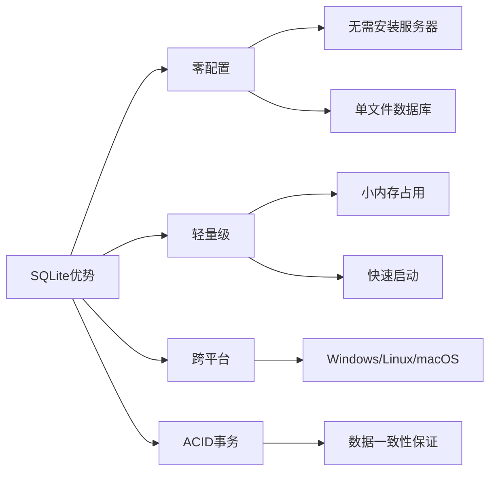
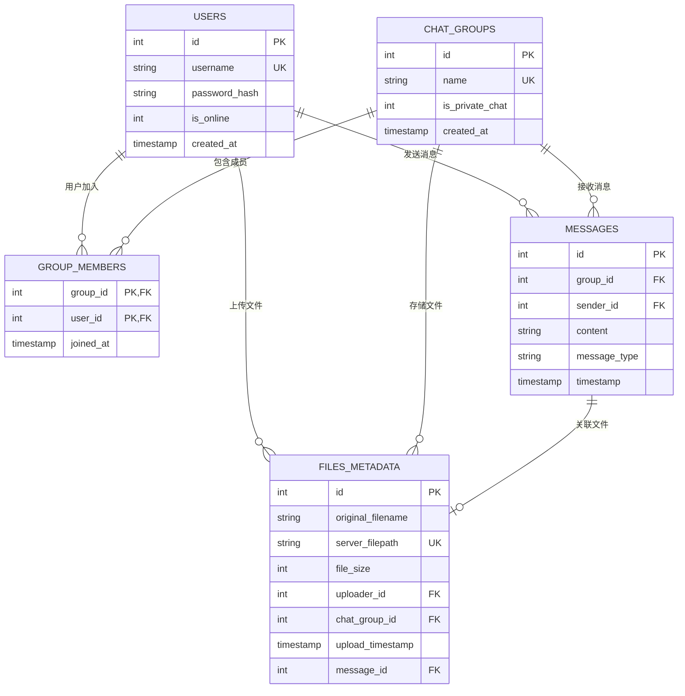

# 数据库模型设计学习 - server/database/models.py

## 📋 模块概述

`server/database/models.py` 定义了Chat-Room项目的数据库模型和操作方法，包括用户、聊天组、消息、文件等核心数据表的结构设计和CRUD操作。这是数据持久化的核心模块。

## 🎯 数据库设计原理

### 为什么选择SQLite？

**SQLite的优势**：


**适用场景**：
- **小到中型应用**：用户数量不超过几千
- **嵌入式应用**：移动应用、桌面应用
- **原型开发**：快速开发和测试
- **学习项目**：简单易用，便于学习

### 关系型数据库设计原则

1. **范式化**：减少数据冗余，提高数据一致性
2. **实体关系**：清晰的实体间关系定义
3. **约束完整性**：主键、外键、唯一性约束
4. **索引优化**：提高查询性能
5. **事务支持**：保证数据操作的原子性

## 🗄️ 数据库表结构设计

### 实体关系图



### 核心数据库管理类

```python
class DatabaseManager:
    """数据库管理器 - 统一的数据库操作接口"""
    
    def __init__(self, db_path: str = "server/data/chatroom.db"):
        """
        初始化数据库管理器
        
        Args:
            db_path: 数据库文件路径
        """
        self.db_path = db_path
        self.logger = get_logger("server.database")
        
        # 确保数据库目录存在
        os.makedirs(os.path.dirname(db_path), exist_ok=True)
        
        # 初始化数据库表结构
        self.init_database()
    
    @contextmanager
    def get_connection(self):
        """
        获取数据库连接的上下文管理器
        
        使用示例:
            with db.get_connection() as conn:
                cursor = conn.cursor()
                cursor.execute("SELECT * FROM users")
        """
        conn = None
        try:
            conn = sqlite3.connect(self.db_path)
            conn.row_factory = sqlite3.Row  # 使结果可以按列名访问
            yield conn
        except Exception as e:
            if conn:
                conn.rollback()
            raise DatabaseError(f"数据库操作失败: {e}")
        finally:
            if conn:
                conn.close()
```

**设计亮点**：
- **上下文管理器**：自动处理连接的打开和关闭
- **行工厂**：使查询结果可以按列名访问
- **异常处理**：统一的数据库异常处理
- **事务支持**：自动回滚失败的事务

## 👤 用户表设计

### 表结构定义

```python
def init_database(self):
    """初始化数据库表结构"""
    with self.get_connection() as conn:
        cursor = conn.cursor()
        
        # 创建用户表
        cursor.execute('''
            CREATE TABLE IF NOT EXISTS users (
                id INTEGER PRIMARY KEY AUTOINCREMENT,
                username TEXT UNIQUE NOT NULL,
                password_hash TEXT NOT NULL,
                is_online INTEGER DEFAULT 0,
                created_at TIMESTAMP DEFAULT CURRENT_TIMESTAMP
            )
        ''')
        
        # 创建用户名索引（提高查询性能）
        cursor.execute('''
            CREATE INDEX IF NOT EXISTS idx_users_username 
            ON users(username)
        ''')
        
        conn.commit()
```

**设计要点**：
- **主键自增**：`id`字段作为主键，自动递增
- **唯一约束**：`username`字段唯一，防止重复用户名
- **密码安全**：存储密码哈希而非明文密码
- **状态跟踪**：`is_online`字段跟踪用户在线状态
- **时间戳**：`created_at`记录用户注册时间

### 用户操作方法

```python
def create_user(self, username: str, password: str) -> int:
    """
    创建新用户
    
    Args:
        username: 用户名
        password: 密码（明文）
        
    Returns:
        新用户的ID
        
    Raises:
        UserAlreadyExistsError: 用户名已存在
        DatabaseError: 数据库操作失败
    """
    # 密码加密
    password_hash = self._hash_password(password)
    
    try:
        with self.get_connection() as conn:
            cursor = conn.cursor()
            cursor.execute(
                "INSERT INTO users (username, password_hash) VALUES (?, ?)",
                (username, password_hash)
            )
            user_id = cursor.lastrowid
            conn.commit()
            
            log_database_operation("INSERT", "users", 
                                 user_id=user_id, username=username)
            return user_id
            
    except sqlite3.IntegrityError as e:
        if "UNIQUE constraint failed" in str(e):
            raise UserAlreadyExistsError(username)
        else:
            raise DatabaseError(f"创建用户失败: {e}")

def authenticate_user(self, username: str, password: str) -> Optional[Dict]:
    """
    用户认证
    
    Args:
        username: 用户名
        password: 密码（明文）
        
    Returns:
        用户信息字典，认证失败返回None
    """
    try:
        with self.get_connection() as conn:
            cursor = conn.cursor()
            cursor.execute(
                "SELECT id, username, password_hash FROM users WHERE username = ?",
                (username,)
            )
            user_row = cursor.fetchone()
            
            if user_row and self._verify_password(password, user_row['password_hash']):
                return {
                    'id': user_row['id'],
                    'username': user_row['username']
                }
            
            return None
            
    except Exception as e:
        raise DatabaseError(f"用户认证失败: {e}")

def _hash_password(self, password: str) -> str:
    """密码哈希"""
    import hashlib
    return hashlib.sha256(password.encode()).hexdigest()

def _verify_password(self, password: str, password_hash: str) -> bool:
    """验证密码"""
    return self._hash_password(password) == password_hash
```

**安全特性**：
- **密码哈希**：使用SHA-256哈希算法
- **SQL注入防护**：使用参数化查询
- **异常处理**：详细的错误分类和处理
- **操作日志**：记录重要的数据库操作

## 💬 聊天组表设计

### 表结构和关系

```python
# 聊天组表
cursor.execute('''
    CREATE TABLE IF NOT EXISTS chat_groups (
        id INTEGER PRIMARY KEY AUTOINCREMENT,
        name TEXT UNIQUE NOT NULL,
        is_private_chat INTEGER DEFAULT 0,
        created_at TIMESTAMP DEFAULT CURRENT_TIMESTAMP
    )
''')

# 聊天组成员关系表
cursor.execute('''
    CREATE TABLE IF NOT EXISTS group_members (
        group_id INTEGER,
        user_id INTEGER,
        joined_at TIMESTAMP DEFAULT CURRENT_TIMESTAMP,
        PRIMARY KEY (group_id, user_id),
        FOREIGN KEY (group_id) REFERENCES chat_groups(id),
        FOREIGN KEY (user_id) REFERENCES users(id)
    )
''')
```

**设计特点**：
- **多对多关系**：用户和聊天组的多对多关系通过中间表实现
- **复合主键**：`group_members`表使用复合主键防止重复加入
- **外键约束**：保证数据引用完整性
- **私聊标识**：`is_private_chat`字段区分群聊和私聊

### 聊天组操作方法

```python
def create_chat_group(self, name: str, is_private_chat: bool = False) -> int:
    """
    创建聊天组
    
    Args:
        name: 聊天组名称
        is_private_chat: 是否为私聊
        
    Returns:
        新聊天组的ID
    """
    try:
        with self.get_connection() as conn:
            cursor = conn.cursor()
            cursor.execute(
                "INSERT INTO chat_groups (name, is_private_chat) VALUES (?, ?)",
                (name, 1 if is_private_chat else 0)
            )
            group_id = cursor.lastrowid
            conn.commit()
            
            log_database_operation("INSERT", "chat_groups",
                                 group_id=group_id, name=name)
            return group_id
            
    except sqlite3.IntegrityError as e:
        if "UNIQUE constraint failed" in str(e):
            raise ChatGroupAlreadyExistsError(name)
        else:
            raise DatabaseError(f"创建聊天组失败: {e}")

def add_user_to_chat_group(self, group_id: int, user_id: int):
    """
    添加用户到聊天组
    
    Args:
        group_id: 聊天组ID
        user_id: 用户ID
    """
    try:
        with self.get_connection() as conn:
            cursor = conn.cursor()
            cursor.execute(
                "INSERT OR IGNORE INTO group_members (group_id, user_id) VALUES (?, ?)",
                (group_id, user_id)
            )
            conn.commit()
            
            log_database_operation("INSERT", "group_members",
                                 group_id=group_id, user_id=user_id)
            
    except Exception as e:
        raise DatabaseError(f"添加用户到聊天组失败: {e}")

def get_chat_group_members(self, group_id: int) -> List[Dict]:
    """
    获取聊天组成员列表
    
    Args:
        group_id: 聊天组ID
        
    Returns:
        成员信息列表
    """
    try:
        with self.get_connection() as conn:
            cursor = conn.cursor()
            cursor.execute('''
                SELECT u.id, u.username, u.is_online, gm.joined_at
                FROM users u
                JOIN group_members gm ON u.id = gm.user_id
                WHERE gm.group_id = ?
                ORDER BY gm.joined_at
            ''', (group_id,))
            
            members = []
            for row in cursor.fetchall():
                members.append({
                    'id': row['id'],
                    'username': row['username'],
                    'is_online': bool(row['is_online']),
                    'joined_at': row['joined_at']
                })
            
            return members
            
    except Exception as e:
        raise DatabaseError(f"获取聊天组成员失败: {e}")
```

## 📨 消息表设计

### 表结构定义

```python
# 消息表
cursor.execute('''
    CREATE TABLE IF NOT EXISTS messages (
        id INTEGER PRIMARY KEY AUTOINCREMENT,
        group_id INTEGER,
        sender_id INTEGER,
        content TEXT,
        message_type TEXT DEFAULT 'text',
        timestamp TIMESTAMP DEFAULT CURRENT_TIMESTAMP,
        FOREIGN KEY (group_id) REFERENCES chat_groups(id),
        FOREIGN KEY (sender_id) REFERENCES users(id)
    )
''')

# 消息查询优化索引
cursor.execute('''
    CREATE INDEX IF NOT EXISTS idx_messages_group_time 
    ON messages(group_id, timestamp DESC)
''')

cursor.execute('''
    CREATE INDEX IF NOT EXISTS idx_messages_sender 
    ON messages(sender_id)
''')
```

**索引设计**：
- **复合索引**：`(group_id, timestamp DESC)`支持按聊天组和时间查询
- **单列索引**：`sender_id`支持按发送者查询
- **降序索引**：`timestamp DESC`优化最新消息查询

### 消息操作方法

```python
def save_message(self, group_id: int, sender_id: int, content: str, 
                message_type: str = "text") -> int:
    """
    保存消息到数据库
    
    Args:
        group_id: 聊天组ID
        sender_id: 发送者ID
        content: 消息内容
        message_type: 消息类型
        
    Returns:
        消息ID
    """
    try:
        with self.get_connection() as conn:
            cursor = conn.cursor()
            cursor.execute('''
                INSERT INTO messages (group_id, sender_id, content, message_type)
                VALUES (?, ?, ?, ?)
            ''', (group_id, sender_id, content, message_type))
            
            message_id = cursor.lastrowid
            conn.commit()
            
            log_database_operation("INSERT", "messages",
                                 message_id=message_id,
                                 group_id=group_id,
                                 sender_id=sender_id)
            return message_id
            
    except Exception as e:
        raise DatabaseError(f"保存消息失败: {e}")

def get_chat_history(self, group_id: int, limit: int = 50, 
                    before_message_id: int = None) -> List[Dict]:
    """
    获取聊天历史记录
    
    Args:
        group_id: 聊天组ID
        limit: 消息数量限制
        before_message_id: 获取此消息ID之前的消息（分页）
        
    Returns:
        消息列表
    """
    try:
        with self.get_connection() as conn:
            cursor = conn.cursor()
            
            # 构建查询SQL
            sql = '''
                SELECT m.id, m.content, m.message_type, m.timestamp,
                       u.username as sender_username, u.id as sender_id,
                       cg.name as group_name
                FROM messages m
                JOIN users u ON m.sender_id = u.id
                JOIN chat_groups cg ON m.group_id = cg.id
                WHERE m.group_id = ?
            '''
            
            params = [group_id]
            
            # 添加分页条件
            if before_message_id:
                sql += " AND m.id < ?"
                params.append(before_message_id)
            
            sql += " ORDER BY m.timestamp DESC LIMIT ?"
            params.append(limit)
            
            cursor.execute(sql, params)
            
            messages = []
            for row in cursor.fetchall():
                messages.append({
                    'id': row['id'],
                    'content': row['content'],
                    'message_type': row['message_type'],
                    'timestamp': row['timestamp'],
                    'sender_id': row['sender_id'],
                    'sender_username': row['sender_username'],
                    'group_id': group_id,
                    'group_name': row['group_name']
                })
            
            # 反转列表，使最新消息在最后
            return list(reversed(messages))
            
    except Exception as e:
        raise DatabaseError(f"获取聊天历史失败: {e}")
```

## 📁 文件元数据表设计

### 表结构定义

```python
# 文件元数据表
cursor.execute('''
    CREATE TABLE IF NOT EXISTS files_metadata (
        id INTEGER PRIMARY KEY AUTOINCREMENT,
        original_filename TEXT NOT NULL,
        server_filepath TEXT NOT NULL UNIQUE,
        file_size INTEGER NOT NULL,
        uploader_id INTEGER,
        chat_group_id INTEGER,
        upload_timestamp TIMESTAMP DEFAULT CURRENT_TIMESTAMP,
        message_id INTEGER,
        FOREIGN KEY (uploader_id) REFERENCES users(id),
        FOREIGN KEY (chat_group_id) REFERENCES chat_groups(id),
        FOREIGN KEY (message_id) REFERENCES messages(id)
    )
''')
```

**设计特点**：
- **文件路径唯一**：`server_filepath`唯一约束防止文件冲突
- **关联消息**：`message_id`将文件与消息关联
- **元数据完整**：记录原始文件名、大小、上传者等信息
- **聊天组关联**：文件属于特定聊天组

### 文件操作方法

```python
def save_file_metadata(self, original_filename: str, server_filepath: str,
                      file_size: int, uploader_id: int, chat_group_id: int,
                      message_id: int = None) -> int:
    """
    保存文件元数据
    
    Args:
        original_filename: 原始文件名
        server_filepath: 服务器存储路径
        file_size: 文件大小
        uploader_id: 上传者ID
        chat_group_id: 聊天组ID
        message_id: 关联的消息ID
        
    Returns:
        文件元数据ID
    """
    try:
        with self.get_connection() as conn:
            cursor = conn.cursor()
            cursor.execute('''
                INSERT INTO files_metadata 
                (original_filename, server_filepath, file_size, 
                 uploader_id, chat_group_id, message_id)
                VALUES (?, ?, ?, ?, ?, ?)
            ''', (original_filename, server_filepath, file_size,
                  uploader_id, chat_group_id, message_id))
            
            file_id = cursor.lastrowid
            conn.commit()
            
            log_database_operation("INSERT", "files_metadata",
                                 file_id=file_id,
                                 filename=original_filename,
                                 uploader_id=uploader_id)
            return file_id
            
    except Exception as e:
        raise DatabaseError(f"保存文件元数据失败: {e}")

def get_chat_group_files(self, chat_group_id: int) -> List[Dict]:
    """
    获取聊天组的文件列表
    
    Args:
        chat_group_id: 聊天组ID
        
    Returns:
        文件信息列表
    """
    try:
        with self.get_connection() as conn:
            cursor = conn.cursor()
            cursor.execute('''
                SELECT fm.id, fm.original_filename, fm.file_size,
                       fm.upload_timestamp, u.username as uploader_username
                FROM files_metadata fm
                JOIN users u ON fm.uploader_id = u.id
                WHERE fm.chat_group_id = ?
                ORDER BY fm.upload_timestamp DESC
            ''', (chat_group_id,))
            
            files = []
            for row in cursor.fetchall():
                files.append({
                    'id': row['id'],
                    'original_filename': row['original_filename'],
                    'file_size': row['file_size'],
                    'upload_timestamp': row['upload_timestamp'],
                    'uploader_username': row['uploader_username']
                })
            
            return files
            
    except Exception as e:
        raise DatabaseError(f"获取聊天组文件列表失败: {e}")
```

## 🔧 数据库优化技术

### 查询优化

```python
def get_user_chat_groups_optimized(self, user_id: int) -> List[Dict]:
    """
    优化的用户聊天组查询
    使用子查询获取最新消息，减少数据传输
    """
    try:
        with self.get_connection() as conn:
            cursor = conn.cursor()
            cursor.execute('''
                SELECT cg.id, cg.name, cg.is_private_chat, cg.created_at,
                       (SELECT COUNT(*) FROM group_members gm2 
                        WHERE gm2.group_id = cg.id) as member_count,
                       (SELECT m.content FROM messages m 
                        WHERE m.group_id = cg.id 
                        ORDER BY m.timestamp DESC LIMIT 1) as latest_message,
                       (SELECT m.timestamp FROM messages m 
                        WHERE m.group_id = cg.id 
                        ORDER BY m.timestamp DESC LIMIT 1) as latest_message_time
                FROM chat_groups cg
                JOIN group_members gm ON cg.id = gm.group_id
                WHERE gm.user_id = ?
                ORDER BY latest_message_time DESC NULLS LAST
            ''', (user_id,))
            
            # 处理查询结果...
            
    except Exception as e:
        raise DatabaseError(f"获取用户聊天组失败: {e}")

def cleanup_old_messages(self, days_to_keep: int = 30):
    """
    清理旧消息（数据库维护）
    
    Args:
        days_to_keep: 保留天数
    """
    try:
        with self.get_connection() as conn:
            cursor = conn.cursor()
            cursor.execute('''
                DELETE FROM messages 
                WHERE timestamp < datetime('now', '-{} days')
            '''.format(days_to_keep))
            
            deleted_count = cursor.rowcount
            conn.commit()
            
            self.logger.info(f"清理了 {deleted_count} 条旧消息")
            
    except Exception as e:
        raise DatabaseError(f"清理旧消息失败: {e}")
```

### 事务处理

```python
def transfer_user_to_group(self, user_id: int, from_group_id: int, to_group_id: int):
    """
    事务示例：将用户从一个聊天组转移到另一个聊天组
    """
    try:
        with self.get_connection() as conn:
            cursor = conn.cursor()
            
            # 开始事务（SQLite默认自动开始）
            
            # 从原聊天组移除
            cursor.execute(
                "DELETE FROM group_members WHERE group_id = ? AND user_id = ?",
                (from_group_id, user_id)
            )
            
            # 添加到新聊天组
            cursor.execute(
                "INSERT INTO group_members (group_id, user_id) VALUES (?, ?)",
                (to_group_id, user_id)
            )
            
            # 记录转移消息
            cursor.execute('''
                INSERT INTO messages (group_id, sender_id, content, message_type)
                VALUES (?, ?, ?, ?)
            ''', (to_group_id, user_id, "用户加入了聊天组", "system"))
            
            # 提交事务
            conn.commit()
            
            log_database_operation("TRANSFER", "group_members",
                                 user_id=user_id,
                                 from_group=from_group_id,
                                 to_group=to_group_id)
            
    except Exception as e:
        # 事务会自动回滚
        raise DatabaseError(f"用户转移失败: {e}")
```

## 💡 学习要点

### 数据库设计原则

1. **范式化设计**：减少数据冗余，提高一致性
2. **实体关系**：正确建模实体间的关系
3. **约束完整性**：使用主键、外键、唯一约束
4. **索引优化**：为常用查询创建合适的索引

### SQLite特性

1. **ACID事务**：原子性、一致性、隔离性、持久性
2. **类型亲和性**：灵活的数据类型系统
3. **全文搜索**：FTS扩展支持全文搜索
4. **JSON支持**：JSON1扩展支持JSON数据

### 性能优化

1. **查询优化**：使用EXPLAIN QUERY PLAN分析查询
2. **索引策略**：为WHERE、ORDER BY、JOIN创建索引
3. **批量操作**：使用事务批量插入数据
4. **连接池**：复用数据库连接

### 安全考虑

1. **SQL注入防护**：使用参数化查询
2. **密码安全**：哈希存储密码
3. **权限控制**：基于用户角色的访问控制
4. **数据备份**：定期备份重要数据

## 🤔 思考题

1. **如何设计支持消息编辑和删除？**
   - 软删除标记
   - 版本历史记录
   - 权限验证

2. **如何优化大量历史消息的查询？**
   - 分表策略
   - 归档机制
   - 缓存层

3. **如何实现数据库的高可用？**
   - 主从复制
   - 读写分离
   - 故障转移

---

**下一步**：学习网络编程基础 → [../06-network-programming/](../06-network-programming/)
