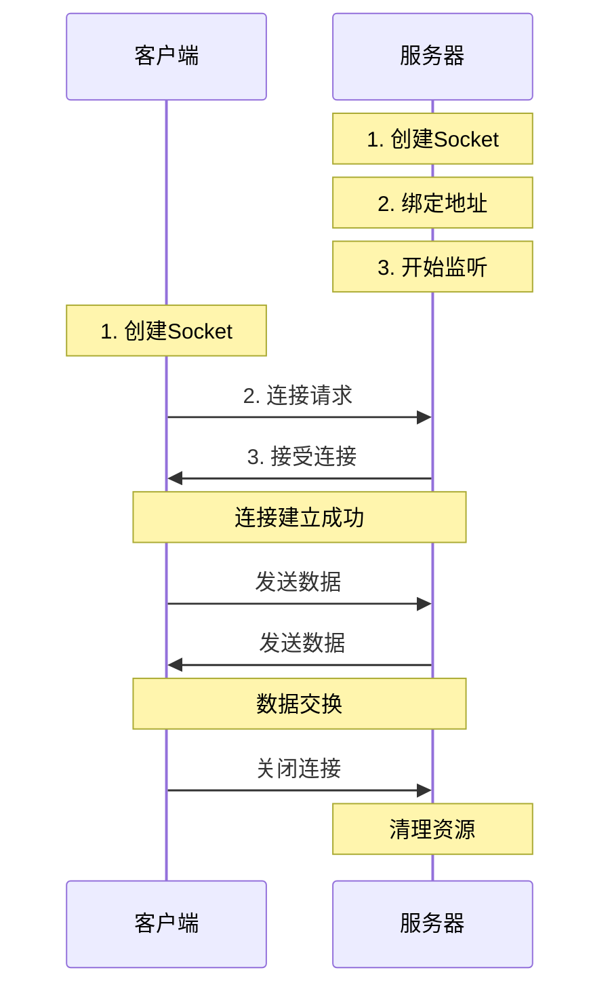

# Socket编程基础学习

## 📋 模块概述

Socket编程是Chat-Room项目的网络通信基础，本文档详细介绍TCP Socket编程的核心概念、实现原理和最佳实践，帮助初学者深入理解网络编程。

## 🎯 Socket编程基础概念

### 什么是Socket？

**Socket定义**：
Socket（套接字）是网络通信的端点，是应用程序与网络协议栈之间的接口。可以把Socket想象成电话系统中的电话机，通过它可以与远程的另一个"电话机"进行通信。


**Socket类型**：
- **TCP Socket**：面向连接，可靠传输（Chat-Room使用）
- **UDP Socket**：无连接，快速传输
- **Unix Socket**：本地进程间通信

### TCP vs UDP对比

| 特性 | TCP | UDP |
|------|-----|-----|
| 连接性 | 面向连接 | 无连接 |
| 可靠性 | 可靠传输 | 不可靠传输 |
| 速度 | 较慢 | 较快 |
| 数据完整性 | 保证 | 不保证 |
| 适用场景 | 聊天、文件传输 | 游戏、视频流 |

## 🏗️ TCP Socket编程模型

### 客户端-服务器模型



### Python Socket API

#### 服务器端基础代码

```python
import socket
import threading

def create_server(host='localhost', port=8888):
    """创建TCP服务器的基础示例"""
    
    # 1. 创建Socket对象
    server_socket = socket.socket(socket.AF_INET, socket.SOCK_STREAM)
    
    # 2. 设置Socket选项（可选）
    server_socket.setsockopt(socket.SOL_SOCKET, socket.SO_REUSEADDR, 1)
    
    # 3. 绑定地址和端口
    server_socket.bind((host, port))
    
    # 4. 开始监听连接
    server_socket.listen(5)  # 最多5个等待连接
    
    print(f"服务器启动，监听 {host}:{port}")
    
    try:
        while True:
            # 5. 接受客户端连接
            client_socket, client_address = server_socket.accept()
            print(f"新客户端连接: {client_address}")
            
            # 6. 为每个客户端创建处理线程
            client_thread = threading.Thread(
                target=handle_client,
                args=(client_socket, client_address)
            )
            client_thread.daemon = True
            client_thread.start()
            
    except KeyboardInterrupt:
        print("服务器关闭")
    finally:
        server_socket.close()

def handle_client(client_socket, client_address):
    """处理单个客户端连接"""
    try:
        while True:
            # 接收数据
            data = client_socket.recv(1024)
            if not data:
                break  # 客户端断开连接
            
            # 处理数据
            message = data.decode('utf-8')
            print(f"收到来自 {client_address} 的消息: {message}")
            
            # 发送响应
            response = f"服务器收到: {message}"
            client_socket.send(response.encode('utf-8'))
            
    except Exception as e:
        print(f"处理客户端 {client_address} 时发生错误: {e}")
    finally:
        client_socket.close()
        print(f"客户端 {client_address} 断开连接")
```

#### 客户端基础代码

```python
def create_client(host='localhost', port=8888):
    """创建TCP客户端的基础示例"""
    
    # 1. 创建Socket对象
    client_socket = socket.socket(socket.AF_INET, socket.SOCK_STREAM)
    
    try:
        # 2. 连接服务器
        client_socket.connect((host, port))
        print(f"已连接到服务器 {host}:{port}")
        
        # 3. 发送和接收数据
        while True:
            # 发送消息
            message = input("请输入消息 (输入'quit'退出): ")
            if message.lower() == 'quit':
                break
            
            client_socket.send(message.encode('utf-8'))
            
            # 接收响应
            response = client_socket.recv(1024)
            print(f"服务器响应: {response.decode('utf-8')}")
            
    except Exception as e:
        print(f"客户端错误: {e}")
    finally:
        # 4. 关闭连接
        client_socket.close()
        print("连接已关闭")
```

## 🔧 Socket编程核心概念

### 地址族和Socket类型

```python
# 地址族 (Address Family)
socket.AF_INET      # IPv4
socket.AF_INET6     # IPv6
socket.AF_UNIX      # Unix域套接字

# Socket类型
socket.SOCK_STREAM  # TCP
socket.SOCK_DGRAM   # UDP

# 创建不同类型的Socket
tcp_socket = socket.socket(socket.AF_INET, socket.SOCK_STREAM)
udp_socket = socket.socket(socket.AF_INET, socket.SOCK_DGRAM)
```

### Socket选项设置

```python
# 常用Socket选项
server_socket = socket.socket(socket.AF_INET, socket.SOCK_STREAM)

# 1. 地址重用（避免"Address already in use"错误）
server_socket.setsockopt(socket.SOL_SOCKET, socket.SO_REUSEADDR, 1)

# 2. 设置超时时间
server_socket.settimeout(30.0)  # 30秒超时

# 3. 设置缓冲区大小
server_socket.setsockopt(socket.SOL_SOCKET, socket.SO_RCVBUF, 8192)  # 接收缓冲区
server_socket.setsockopt(socket.SOL_SOCKET, socket.SO_SNDBUF, 8192)  # 发送缓冲区

# 4. 禁用Nagle算法（减少延迟）
server_socket.setsockopt(socket.IPPROTO_TCP, socket.TCP_NODELAY, 1)
```

### 数据发送和接收

```python
def safe_send(sock, data):
    """安全发送数据，处理部分发送的情况"""
    total_sent = 0
    data_length = len(data)
    
    while total_sent < data_length:
        try:
            sent = sock.send(data[total_sent:])
            if sent == 0:
                raise RuntimeError("Socket连接断开")
            total_sent += sent
        except socket.error as e:
            raise RuntimeError(f"发送数据失败: {e}")

def safe_recv(sock, length):
    """安全接收指定长度的数据"""
    data = b''
    while len(data) < length:
        try:
            chunk = sock.recv(length - len(data))
            if not chunk:
                raise RuntimeError("Socket连接断开")
            data += chunk
        except socket.error as e:
            raise RuntimeError(f"接收数据失败: {e}")
    
    return data

def recv_message(sock):
    """接收完整消息（带长度前缀）"""
    # 先接收4字节的消息长度
    length_data = safe_recv(sock, 4)
    message_length = int.from_bytes(length_data, byteorder='big')
    
    # 再接收指定长度的消息内容
    message_data = safe_recv(sock, message_length)
    return message_data.decode('utf-8')

def send_message(sock, message):
    """发送完整消息（带长度前缀）"""
    message_data = message.encode('utf-8')
    message_length = len(message_data)
    
    # 发送长度前缀（4字节）
    length_data = message_length.to_bytes(4, byteorder='big')
    safe_send(sock, length_data)
    
    # 发送消息内容
    safe_send(sock, message_data)
```

## 🚀 Chat-Room中的Socket应用

### 服务器端实现要点

```python
class ChatRoomServer:
    """Chat-Room服务器Socket实现要点"""
    
    def __init__(self, host='localhost', port=8888):
        self.host = host
        self.port = port
        self.server_socket = None
        self.client_sockets = set()
        self.running = False
    
    def start(self):
        """启动服务器"""
        # 创建和配置Socket
        self.server_socket = socket.socket(socket.AF_INET, socket.SOCK_STREAM)
        self.server_socket.setsockopt(socket.SOL_SOCKET, socket.SO_REUSEADDR, 1)
        
        # 绑定和监听
        self.server_socket.bind((self.host, self.port))
        self.server_socket.listen(100)  # 支持更多并发连接
        
        self.running = True
        print(f"✅ 服务器启动成功，监听 {self.host}:{self.port}")
        
        # 主循环接受连接
        self._accept_connections()
    
    def _accept_connections(self):
        """接受客户端连接的主循环"""
        while self.running:
            try:
                client_socket, address = self.server_socket.accept()
                
                # 设置客户端Socket选项
                client_socket.settimeout(300)  # 5分钟超时
                
                # 添加到客户端集合
                self.client_sockets.add(client_socket)
                
                # 创建处理线程
                client_thread = threading.Thread(
                    target=self._handle_client,
                    args=(client_socket, address),
                    daemon=True
                )
                client_thread.start()
                
                print(f"新客户端连接: {address}")
                
            except socket.error as e:
                if self.running:
                    print(f"接受连接失败: {e}")
    
    def _handle_client(self, client_socket, address):
        """处理客户端消息"""
        buffer = ""  # 消息缓冲区
        
        try:
            while self.running:
                # 接收数据
                data = client_socket.recv(4096)
                if not data:
                    break
                
                # 解码并添加到缓冲区
                buffer += data.decode('utf-8')
                
                # 处理完整的消息（以换行符分隔）
                while '\n' in buffer:
                    line, buffer = buffer.split('\n', 1)
                    if line.strip():
                        self._process_message(client_socket, line.strip())
                        
        except socket.timeout:
            print(f"客户端 {address} 超时")
        except socket.error as e:
            print(f"客户端 {address} 网络错误: {e}")
        finally:
            self._cleanup_client(client_socket, address)
    
    def _cleanup_client(self, client_socket, address):
        """清理客户端资源"""
        self.client_sockets.discard(client_socket)
        try:
            client_socket.close()
        except:
            pass
        print(f"客户端 {address} 断开连接")
```

### 客户端实现要点

```python
class NetworkClient:
    """Chat-Room客户端Socket实现要点"""
    
    def __init__(self, host='localhost', port=8888):
        self.host = host
        self.port = port
        self.socket = None
        self.connected = False
        self.receive_thread = None
    
    def connect(self):
        """连接服务器"""
        try:
            # 创建Socket
            self.socket = socket.socket(socket.AF_INET, socket.SOCK_STREAM)
            
            # 设置超时
            self.socket.settimeout(10)
            
            # 连接服务器
            self.socket.connect((self.host, self.port))
            
            # 连接成功后移除超时限制
            self.socket.settimeout(None)
            
            self.connected = True
            
            # 启动接收线程
            self.receive_thread = threading.Thread(
                target=self._receive_messages,
                daemon=True
            )
            self.receive_thread.start()
            
            print(f"✅ 连接服务器成功: {self.host}:{self.port}")
            return True
            
        except socket.timeout:
            print("❌ 连接超时")
            return False
        except socket.error as e:
            print(f"❌ 连接失败: {e}")
            return False
    
    def _receive_messages(self):
        """接收消息线程"""
        buffer = ""
        
        while self.connected:
            try:
                data = self.socket.recv(4096)
                if not data:
                    break
                
                buffer += data.decode('utf-8')
                
                # 处理完整消息
                while '\n' in buffer:
                    line, buffer = buffer.split('\n', 1)
                    if line.strip():
                        self._handle_message(line.strip())
                        
            except socket.error:
                break
        
        self.connected = False
        print("接收线程结束")
    
    def send_message(self, message):
        """发送消息"""
        if not self.connected:
            return False
        
        try:
            message_data = (message + '\n').encode('utf-8')
            self.socket.send(message_data)
            return True
        except socket.error:
            self.connected = False
            return False
```

## 🔍 Socket编程常见问题

### 1. 粘包和拆包问题

**问题描述**：TCP是流式协议，发送的多个消息可能被合并，或者一个消息被分割。

**解决方案**：
```python
# 方案1：使用分隔符
def send_with_delimiter(sock, message):
    """使用换行符作为消息分隔符"""
    data = (message + '\n').encode('utf-8')
    sock.send(data)

# 方案2：使用长度前缀
def send_with_length_prefix(sock, message):
    """使用4字节长度前缀"""
    data = message.encode('utf-8')
    length = len(data).to_bytes(4, byteorder='big')
    sock.send(length + data)

# 方案3：使用固定长度消息
def send_fixed_length(sock, message, length=1024):
    """发送固定长度消息"""
    data = message.encode('utf-8')
    if len(data) > length:
        raise ValueError("消息过长")
    data = data.ljust(length, b'\0')  # 填充到固定长度
    sock.send(data)
```

### 2. 连接断开检测

```python
def is_socket_connected(sock):
    """检测Socket是否仍然连接"""
    try:
        # 发送0字节数据
        sock.send(b'')
        return True
    except socket.error:
        return False

def heartbeat_check(sock):
    """心跳检测"""
    try:
        # 发送心跳消息
        sock.send(b'PING\n')
        
        # 设置短暂超时等待响应
        sock.settimeout(5)
        response = sock.recv(1024)
        sock.settimeout(None)
        
        return response == b'PONG\n'
    except socket.error:
        return False
```

### 3. 优雅关闭连接

```python
def graceful_shutdown(sock):
    """优雅关闭Socket连接"""
    try:
        # 1. 关闭写入端
        sock.shutdown(socket.SHUT_WR)
        
        # 2. 读取剩余数据直到对方关闭
        while True:
            data = sock.recv(1024)
            if not data:
                break
                
    except socket.error:
        pass
    finally:
        # 3. 关闭Socket
        sock.close()
```

## 💡 Socket编程最佳实践

### 1. 错误处理

```python
def robust_socket_operation(sock, operation):
    """健壮的Socket操作"""
    max_retries = 3
    retry_delay = 1
    
    for attempt in range(max_retries):
        try:
            return operation(sock)
        except socket.timeout:
            print(f"操作超时，重试 {attempt + 1}/{max_retries}")
            if attempt < max_retries - 1:
                time.sleep(retry_delay)
                retry_delay *= 2  # 指数退避
        except socket.error as e:
            if e.errno == errno.ECONNRESET:
                print("连接被重置")
                break
            elif e.errno == errno.EPIPE:
                print("管道断开")
                break
            else:
                print(f"Socket错误: {e}")
                break
    
    raise RuntimeError("Socket操作失败")
```

### 2. 资源管理

```python
class SocketManager:
    """Socket资源管理器"""
    
    def __init__(self):
        self.sockets = set()
    
    def create_socket(self):
        """创建并管理Socket"""
        sock = socket.socket(socket.AF_INET, socket.SOCK_STREAM)
        self.sockets.add(sock)
        return sock
    
    def close_socket(self, sock):
        """关闭单个Socket"""
        if sock in self.sockets:
            try:
                sock.close()
            except:
                pass
            self.sockets.remove(sock)
    
    def close_all(self):
        """关闭所有Socket"""
        for sock in list(self.sockets):
            self.close_socket(sock)
    
    def __enter__(self):
        return self
    
    def __exit__(self, exc_type, exc_val, exc_tb):
        self.close_all()

# 使用示例
with SocketManager() as manager:
    server_sock = manager.create_socket()
    # 使用Socket...
    # 自动清理资源
```

### 3. 性能优化

```python
def optimize_socket_performance(sock):
    """优化Socket性能"""
    # 1. 禁用Nagle算法（减少延迟）
    sock.setsockopt(socket.IPPROTO_TCP, socket.TCP_NODELAY, 1)
    
    # 2. 设置合适的缓冲区大小
    sock.setsockopt(socket.SOL_SOCKET, socket.SO_RCVBUF, 65536)
    sock.setsockopt(socket.SOL_SOCKET, socket.SO_SNDBUF, 65536)
    
    # 3. 启用TCP快速打开（Linux）
    try:
        sock.setsockopt(socket.IPPROTO_TCP, socket.TCP_FASTOPEN, 1)
    except:
        pass  # 不是所有系统都支持
    
    # 4. 设置Keep-Alive
    sock.setsockopt(socket.SOL_SOCKET, socket.SO_KEEPALIVE, 1)
```

## 🤔 思考题

1. **如何处理大量并发连接？**
   - 使用select/poll/epoll
   - 异步I/O模型
   - 连接池管理

2. **如何保证消息的可靠传输？**
   - 应用层确认机制
   - 消息序列号
   - 重传机制

3. **如何优化网络性能？**
   - 减少系统调用次数
   - 批量发送数据
   - 使用零拷贝技术

---

**下一步**：学习协议设计 → [protocol-design.md](./protocol-design.md)
