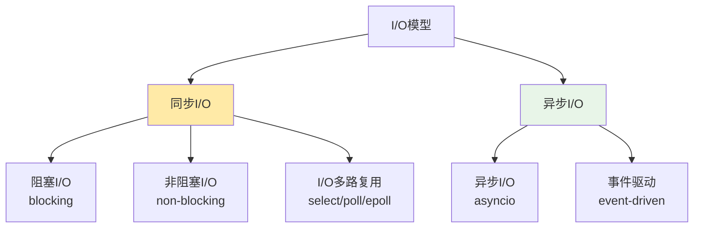

# Socket编程进阶技术学习

## 📋 模块概述

本文档深入探讨Chat-Room项目中使用的高级Socket编程技术，包括异步I/O、性能优化、连接管理、错误处理等企业级网络编程实践。

## 🎯 高级Socket编程概念

### 同步 vs 异步 I/O模型



**Chat-Room的选择**：
- **当前实现**：多线程 + 阻塞I/O（简单可靠）
- **进阶方案**：asyncio + 异步I/O（高性能）
- **企业方案**：epoll + 事件循环（最高性能）

## 🚀 异步Socket编程

### asyncio基础实现

```python
import asyncio
import json
from typing import Dict, Set
from shared.messages import parse_message, BaseMessage

class AsyncChatServer:
    """异步聊天服务器"""
    
    def __init__(self, host: str = 'localhost', port: int = 8888):
        self.host = host
        self.port = port
        self.clients: Dict[asyncio.StreamWriter, dict] = {}
        self.running = False
        
    async def start(self):
        """启动异步服务器"""
        self.running = True
        
        # 创建服务器
        server = await asyncio.start_server(
            self.handle_client,
            self.host,
            self.port
        )
        
        addr = server.sockets[0].getsockname()
        print(f"异步服务器启动: {addr}")
        
        # 启动后台任务
        asyncio.create_task(self.heartbeat_task())
        asyncio.create_task(self.cleanup_task())
        
        # 运行服务器
        async with server:
            await server.serve_forever()
    
    async def handle_client(self, reader: asyncio.StreamReader, 
                           writer: asyncio.StreamWriter):
        """处理客户端连接"""
        addr = writer.get_extra_info('peername')
        print(f"新客户端连接: {addr}")
        
        # 注册客户端
        self.clients[writer] = {
            'address': addr,
            'user_id': None,
            'username': None,
            'last_ping': asyncio.get_event_loop().time()
        }
        
        try:
            # 消息处理循环
            while self.running:
                # 异步读取消息
                data = await asyncio.wait_for(
                    reader.readline(), 
                    timeout=30.0  # 30秒超时
                )
                
                if not data:
                    break  # 客户端断开连接
                
                # 解析和处理消息
                try:
                    message_str = data.decode('utf-8').strip()
                    if message_str:
                        await self.process_message(writer, message_str)
                except Exception as e:
                    print(f"处理消息错误: {e}")
                    await self.send_error(writer, str(e))
                    
        except asyncio.TimeoutError:
            print(f"客户端 {addr} 超时")
        except Exception as e:
            print(f"客户端 {addr} 错误: {e}")
        finally:
            # 清理客户端
            await self.cleanup_client(writer)
    
    async def process_message(self, writer: asyncio.StreamWriter, message_str: str):
        """异步处理消息"""
        try:
            message = parse_message(message_str)
            
            # 更新客户端活动时间
            if writer in self.clients:
                self.clients[writer]['last_ping'] = asyncio.get_event_loop().time()
            
            # 根据消息类型处理
            if message.message_type == "login_request":
                await self.handle_login(writer, message)
            elif message.message_type == "chat_message":
                await self.handle_chat_message(writer, message)
            elif message.message_type == "heartbeat":
                await self.handle_heartbeat(writer)
            else:
                await self.send_error(writer, f"未知消息类型: {message.message_type}")
                
        except Exception as e:
            await self.send_error(writer, f"消息处理失败: {e}")
    
    async def send_message(self, writer: asyncio.StreamWriter, message: BaseMessage):
        """异步发送消息"""
        try:
            json_str = message.to_json() + '\n'
            writer.write(json_str.encode('utf-8'))
            await writer.drain()  # 确保数据发送完成
        except Exception as e:
            print(f"发送消息失败: {e}")
            await self.cleanup_client(writer)
    
    async def broadcast_message(self, message: BaseMessage, exclude_writer=None):
        """异步广播消息"""
        tasks = []
        
        for writer, client_info in self.clients.items():
            if writer != exclude_writer and client_info.get('user_id'):
                # 创建发送任务
                task = asyncio.create_task(self.send_message(writer, message))
                tasks.append(task)
        
        # 并发发送所有消息
        if tasks:
            await asyncio.gather(*tasks, return_exceptions=True)
    
    async def heartbeat_task(self):
        """心跳检测任务"""
        while self.running:
            current_time = asyncio.get_event_loop().time()
            timeout_clients = []
            
            # 检查超时客户端
            for writer, client_info in self.clients.items():
                if current_time - client_info['last_ping'] > 60:  # 60秒超时
                    timeout_clients.append(writer)
            
            # 清理超时客户端
            for writer in timeout_clients:
                await self.cleanup_client(writer)
            
            # 等待下次检查
            await asyncio.sleep(30)
    
    async def cleanup_task(self):
        """定期清理任务"""
        while self.running:
            # 清理断开的连接
            disconnected = []
            for writer in self.clients:
                if writer.is_closing():
                    disconnected.append(writer)
            
            for writer in disconnected:
                await self.cleanup_client(writer)
            
            await asyncio.sleep(10)
    
    async def cleanup_client(self, writer: asyncio.StreamWriter):
        """清理客户端连接"""
        if writer in self.clients:
            client_info = self.clients.pop(writer)
            print(f"客户端断开: {client_info['address']}")
        
        if not writer.is_closing():
            writer.close()
            await writer.wait_closed()
```

**异步编程优势**：
- **高并发**：单线程处理大量连接
- **低资源消耗**：避免线程切换开销
- **响应性好**：非阻塞I/O操作
- **易于扩展**：支持数万并发连接

### 异步客户端实现

```python
class AsyncChatClient:
    """异步聊天客户端"""
    
    def __init__(self, host: str = 'localhost', port: int = 8888):
        self.host = host
        self.port = port
        self.reader = None
        self.writer = None
        self.connected = False
        self.message_handlers = {}
    
    async def connect(self) -> bool:
        """异步连接服务器"""
        try:
            self.reader, self.writer = await asyncio.open_connection(
                self.host, self.port
            )
            self.connected = True
            
            # 启动消息接收任务
            asyncio.create_task(self.receive_messages())
            
            print(f"连接服务器成功: {self.host}:{self.port}")
            return True
            
        except Exception as e:
            print(f"连接失败: {e}")
            return False
    
    async def send_message(self, message: BaseMessage) -> bool:
        """异步发送消息"""
        if not self.connected:
            return False
        
        try:
            json_str = message.to_json() + '\n'
            self.writer.write(json_str.encode('utf-8'))
            await self.writer.drain()
            return True
        except Exception as e:
            print(f"发送消息失败: {e}")
            self.connected = False
            return False
    
    async def receive_messages(self):
        """异步接收消息"""
        while self.connected:
            try:
                data = await self.reader.readline()
                if not data:
                    break
                
                message_str = data.decode('utf-8').strip()
                if message_str:
                    await self.handle_message(message_str)
                    
            except Exception as e:
                print(f"接收消息错误: {e}")
                break
        
        self.connected = False
    
    async def handle_message(self, message_str: str):
        """异步处理接收到的消息"""
        try:
            message = parse_message(message_str)
            
            # 查找消息处理器
            handler = self.message_handlers.get(message.message_type)
            if handler:
                if asyncio.iscoroutinefunction(handler):
                    await handler(message)
                else:
                    handler(message)
            else:
                print(f"未处理的消息类型: {message.message_type}")
                
        except Exception as e:
            print(f"处理消息失败: {e}")
    
    def register_handler(self, message_type: str, handler):
        """注册消息处理器"""
        self.message_handlers[message_type] = handler
    
    async def disconnect(self):
        """异步断开连接"""
        self.connected = False
        if self.writer:
            self.writer.close()
            await self.writer.wait_closed()
```

## ⚡ 性能优化技术

### 连接池管理

```python
class ConnectionPool:
    """连接池管理器"""
    
    def __init__(self, max_connections: int = 1000):
        self.max_connections = max_connections
        self.active_connections: Set[asyncio.StreamWriter] = set()
        self.connection_semaphore = asyncio.Semaphore(max_connections)
        self.stats = {
            'total_connections': 0,
            'active_connections': 0,
            'rejected_connections': 0
        }
    
    async def acquire_connection(self, writer: asyncio.StreamWriter) -> bool:
        """获取连接"""
        try:
            # 尝试获取连接许可
            await asyncio.wait_for(
                self.connection_semaphore.acquire(),
                timeout=5.0  # 5秒超时
            )
            
            self.active_connections.add(writer)
            self.stats['total_connections'] += 1
            self.stats['active_connections'] = len(self.active_connections)
            
            return True
            
        except asyncio.TimeoutError:
            self.stats['rejected_connections'] += 1
            return False
    
    async def release_connection(self, writer: asyncio.StreamWriter):
        """释放连接"""
        if writer in self.active_connections:
            self.active_connections.remove(writer)
            self.connection_semaphore.release()
            self.stats['active_connections'] = len(self.active_connections)
    
    def get_stats(self) -> dict:
        """获取连接池统计"""
        return self.stats.copy()
```

### 消息缓冲和批处理

```python
class MessageBuffer:
    """消息缓冲器 - 批量处理消息提高性能"""
    
    def __init__(self, buffer_size: int = 100, flush_interval: float = 0.1):
        self.buffer_size = buffer_size
        self.flush_interval = flush_interval
        self.message_buffer: List[BaseMessage] = []
        self.last_flush = asyncio.get_event_loop().time()
        self.lock = asyncio.Lock()
    
    async def add_message(self, message: BaseMessage):
        """添加消息到缓冲区"""
        async with self.lock:
            self.message_buffer.append(message)
            
            # 检查是否需要刷新
            current_time = asyncio.get_event_loop().time()
            should_flush = (
                len(self.message_buffer) >= self.buffer_size or
                current_time - self.last_flush >= self.flush_interval
            )
            
            if should_flush:
                await self.flush_buffer()
    
    async def flush_buffer(self):
        """刷新缓冲区"""
        if not self.message_buffer:
            return
        
        # 获取要处理的消息
        messages = self.message_buffer.copy()
        self.message_buffer.clear()
        self.last_flush = asyncio.get_event_loop().time()
        
        # 批量处理消息
        await self.process_batch(messages)
    
    async def process_batch(self, messages: List[BaseMessage]):
        """批量处理消息"""
        # 按类型分组消息
        message_groups = {}
        for message in messages:
            msg_type = message.message_type
            if msg_type not in message_groups:
                message_groups[msg_type] = []
            message_groups[msg_type].append(message)
        
        # 并发处理不同类型的消息
        tasks = []
        for msg_type, msg_list in message_groups.items():
            task = asyncio.create_task(self.process_message_group(msg_type, msg_list))
            tasks.append(task)
        
        await asyncio.gather(*tasks, return_exceptions=True)
    
    async def process_message_group(self, message_type: str, messages: List[BaseMessage]):
        """处理同类型消息组"""
        if message_type == "chat_message":
            await self.batch_save_chat_messages(messages)
        elif message_type == "user_status_update":
            await self.batch_update_user_status(messages)
        # 添加更多批处理逻辑
    
    async def batch_save_chat_messages(self, messages: List[BaseMessage]):
        """批量保存聊天消息"""
        # 数据库批量插入
        values = []
        for msg in messages:
            values.append((
                msg.chat_group_id,
                msg.sender_id,
                msg.content,
                msg.message_type
            ))
        
        # 执行批量插入（伪代码）
        await self.database.batch_insert_messages(values)
```

### 内存优化

```python
class MemoryOptimizedServer:
    """内存优化的服务器"""
    
    def __init__(self):
        self.message_cache = {}
        self.cache_size_limit = 10000  # 缓存消息数量限制
        self.cache_ttl = 3600  # 缓存TTL（秒）
        
        # 使用弱引用避免内存泄漏
        import weakref
        self.client_refs = weakref.WeakSet()
    
    async def cache_message(self, group_id: int, message: BaseMessage):
        """缓存消息"""
        if group_id not in self.message_cache:
            self.message_cache[group_id] = []
        
        # 添加时间戳
        cached_message = {
            'message': message,
            'timestamp': asyncio.get_event_loop().time()
        }
        
        self.message_cache[group_id].append(cached_message)
        
        # 限制缓存大小
        if len(self.message_cache[group_id]) > self.cache_size_limit:
            self.message_cache[group_id] = self.message_cache[group_id][-self.cache_size_limit:]
    
    async def get_cached_messages(self, group_id: int, limit: int = 50) -> List[BaseMessage]:
        """获取缓存的消息"""
        if group_id not in self.message_cache:
            return []
        
        current_time = asyncio.get_event_loop().time()
        valid_messages = []
        
        for cached_msg in self.message_cache[group_id]:
            # 检查TTL
            if current_time - cached_msg['timestamp'] <= self.cache_ttl:
                valid_messages.append(cached_msg['message'])
        
        # 更新缓存，移除过期消息
        self.message_cache[group_id] = [
            cached_msg for cached_msg in self.message_cache[group_id]
            if current_time - cached_msg['timestamp'] <= self.cache_ttl
        ]
        
        return valid_messages[-limit:]
    
    async def cleanup_memory(self):
        """定期内存清理"""
        while True:
            current_time = asyncio.get_event_loop().time()
            
            # 清理过期缓存
            for group_id in list(self.message_cache.keys()):
                self.message_cache[group_id] = [
                    cached_msg for cached_msg in self.message_cache[group_id]
                    if current_time - cached_msg['timestamp'] <= self.cache_ttl
                ]
                
                # 删除空的缓存组
                if not self.message_cache[group_id]:
                    del self.message_cache[group_id]
            
            # 强制垃圾回收
            import gc
            gc.collect()
            
            await asyncio.sleep(300)  # 5分钟清理一次
```

## 🛡️ 高级错误处理

### 断线重连机制

```python
class ResilientClient:
    """具有断线重连功能的客户端"""
    
    def __init__(self, host: str, port: int):
        self.host = host
        self.port = port
        self.max_retries = 5
        self.retry_delay = 1.0
        self.backoff_factor = 2.0
        self.connected = False
        self.reconnect_task = None
    
    async def connect_with_retry(self) -> bool:
        """带重试的连接"""
        for attempt in range(self.max_retries):
            try:
                await self.connect()
                self.connected = True
                print(f"连接成功（第{attempt + 1}次尝试）")
                return True
                
            except Exception as e:
                print(f"连接失败（第{attempt + 1}次尝试）: {e}")
                
                if attempt < self.max_retries - 1:
                    delay = self.retry_delay * (self.backoff_factor ** attempt)
                    print(f"等待 {delay:.1f} 秒后重试...")
                    await asyncio.sleep(delay)
        
        print("连接失败，已达到最大重试次数")
        return False
    
    async def start_auto_reconnect(self):
        """启动自动重连"""
        if self.reconnect_task:
            return
        
        self.reconnect_task = asyncio.create_task(self._auto_reconnect_loop())
    
    async def _auto_reconnect_loop(self):
        """自动重连循环"""
        while True:
            if not self.connected:
                print("检测到连接断开，尝试重连...")
                success = await self.connect_with_retry()
                
                if success:
                    # 重连成功后的恢复操作
                    await self.on_reconnected()
            
            await asyncio.sleep(10)  # 每10秒检查一次
    
    async def on_reconnected(self):
        """重连成功后的恢复操作"""
        # 重新登录
        if hasattr(self, 'username') and hasattr(self, 'password'):
            await self.login(self.username, self.password)
        
        # 重新加入聊天组
        if hasattr(self, 'current_chat_group'):
            await self.join_chat_group(self.current_chat_group)
        
        print("连接恢复完成")
```

### 流量控制

```python
class FlowController:
    """流量控制器"""
    
    def __init__(self, rate_limit: int = 100, time_window: int = 60):
        self.rate_limit = rate_limit  # 每分钟最大请求数
        self.time_window = time_window
        self.request_times = {}
    
    async def check_rate_limit(self, client_id: str) -> bool:
        """检查速率限制"""
        current_time = asyncio.get_event_loop().time()
        
        if client_id not in self.request_times:
            self.request_times[client_id] = []
        
        # 清理过期记录
        cutoff_time = current_time - self.time_window
        self.request_times[client_id] = [
            req_time for req_time in self.request_times[client_id]
            if req_time > cutoff_time
        ]
        
        # 检查是否超过限制
        if len(self.request_times[client_id]) >= self.rate_limit:
            return False
        
        # 记录当前请求
        self.request_times[client_id].append(current_time)
        return True
    
    async def apply_backpressure(self, client_writer: asyncio.StreamWriter):
        """应用背压"""
        # 暂停接收数据
        transport = client_writer.transport
        if transport:
            transport.pause_reading()
            
            # 等待一段时间后恢复
            await asyncio.sleep(1.0)
            transport.resume_reading()
```

## 💡 学习要点

### 异步编程模式

1. **事件循环**：理解asyncio的事件循环机制
2. **协程函数**：async/await语法的正确使用
3. **并发控制**：使用信号量、锁等同步原语
4. **任务管理**：create_task、gather等任务管理方法

### 性能优化策略

1. **连接复用**：减少连接建立和销毁开销
2. **批量处理**：合并多个操作减少系统调用
3. **内存管理**：避免内存泄漏和过度使用
4. **缓存策略**：合理使用缓存提高响应速度

### 可靠性设计

1. **错误恢复**：自动重连和状态恢复
2. **流量控制**：防止系统过载
3. **资源限制**：连接数、内存使用等限制
4. **监控告警**：实时监控系统状态

## 🤔 思考题

1. **如何设计支持百万级并发的聊天服务器？**
   - 使用epoll/kqueue等高效I/O多路复用
   - 实现负载均衡和水平扩展
   - 优化内存使用和垃圾回收

2. **如何保证消息的可靠传输？**
   - 实现消息确认机制
   - 使用消息队列缓冲
   - 设计重传和去重逻辑

3. **如何优化网络延迟？**
   - 使用TCP_NODELAY禁用Nagle算法
   - 实现消息合并和批量发送
   - 优化序列化和反序列化

---

**下一步**：学习设计模式应用 → [design-patterns.md](./design-patterns.md)
