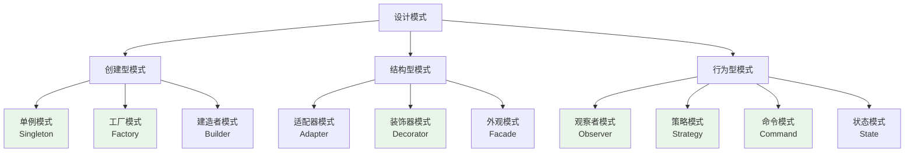

# 设计模式在Chat-Room项目中的应用

## 📋 模块概述

设计模式是软件工程中解决常见问题的可复用解决方案。Chat-Room项目中应用了多种经典设计模式，本文档详细分析这些模式的实现和应用场景。

## 🎯 设计模式分类

### GoF设计模式在项目中的应用



## 🏭 创建型模式

### 1. 单例模式 (Singleton)

**应用场景**：数据库连接管理、日志管理器、配置管理器

```python
class DatabaseManager:
    """数据库管理器 - 单例模式实现"""
    
    _instance = None
    _lock = threading.Lock()
    
    def __new__(cls, *args, **kwargs):
        """线程安全的单例实现"""
        if cls._instance is None:
            with cls._lock:
                # 双重检查锁定
                if cls._instance is None:
                    cls._instance = super().__new__(cls)
        return cls._instance
    
    def __init__(self, db_path: str = None):
        """初始化（只执行一次）"""
        if hasattr(self, '_initialized'):
            return
        
        self.db_path = db_path or "server/data/chatroom.db"
        self._connection_pool = {}
        self._initialized = True
    
    @classmethod
    def get_instance(cls, db_path: str = None):
        """获取单例实例"""
        if cls._instance is None:
            cls._instance = cls(db_path)
        return cls._instance

# 使用示例
db1 = DatabaseManager.get_instance()
db2 = DatabaseManager.get_instance()
assert db1 is db2  # 确保是同一个实例
```

**Python式单例实现**：
```python
class LoggerManager:
    """使用装饰器实现的单例"""
    
    def __init__(self):
        self.loggers = {}
    
    def get_logger(self, name: str):
        if name not in self.loggers:
            self.loggers[name] = self._create_logger(name)
        return self.loggers[name]

# 使用模块级变量实现单例
_logger_manager = LoggerManager()

def get_logger(name: str):
    """获取日志器（模块级单例）"""
    return _logger_manager.get_logger(name)
```

### 2. 工厂模式 (Factory)

**应用场景**：消息对象创建、客户端类型创建

```python
class MessageFactory:
    """消息工厂 - 根据类型创建不同的消息对象"""
    
    # 注册消息类型
    _message_classes = {
        'login_request': LoginRequest,
        'login_response': LoginResponse,
        'chat_message': ChatMessage,
        'error_message': ErrorMessage,
        'file_message': FileMessage,
        'admin_command': AdminCommand,
    }
    
    @classmethod
    def create_message(cls, message_type: str, **kwargs) -> BaseMessage:
        """
        创建消息对象
        
        Args:
            message_type: 消息类型
            **kwargs: 消息参数
            
        Returns:
            消息对象实例
        """
        if message_type not in cls._message_classes:
            raise ValueError(f"未知消息类型: {message_type}")
        
        message_class = cls._message_classes[message_type]
        return message_class(**kwargs)
    
    @classmethod
    def register_message_type(cls, message_type: str, message_class):
        """注册新的消息类型"""
        cls._message_classes[message_type] = message_class
    
    @classmethod
    def parse_from_json(cls, json_str: str) -> BaseMessage:
        """从JSON字符串解析消息"""
        try:
            data = json.loads(json_str)
            message_type = data.get('message_type')
            
            if not message_type:
                raise ValueError("消息缺少message_type字段")
            
            return cls.create_message(message_type, **data)
            
        except json.JSONDecodeError as e:
            raise ValueError(f"JSON解析失败: {e}")

# 使用示例
def parse_message(message_str: str) -> BaseMessage:
    """解析消息字符串"""
    return MessageFactory.parse_from_json(message_str)

# 创建特定类型的消息
login_msg = MessageFactory.create_message(
    'login_request',
    username='alice',
    password='password123'
)
```

**抽象工厂模式**：
```python
class ClientFactory:
    """客户端工厂 - 创建不同类型的客户端"""
    
    @staticmethod
    def create_client(client_type: str, **kwargs):
        """创建客户端实例"""
        if client_type == 'tui':
            from client.ui.app import ChatApp
            return ChatApp(**kwargs)
        elif client_type == 'simple':
            from client.simple_client import SimpleClient
            return SimpleClient(**kwargs)
        elif client_type == 'test':
            from test.test_client import TestClient
            return TestClient(**kwargs)
        else:
            raise ValueError(f"未知客户端类型: {client_type}")

# 使用示例
tui_client = ClientFactory.create_client('tui', host='localhost', port=8888)
simple_client = ClientFactory.create_client('simple', host='localhost', port=8888)
```

## 🔧 结构型模式

### 1. 装饰器模式 (Decorator)

**应用场景**：日志记录、性能监控、权限检查、错误处理

```python
def log_performance(func_name: str = None):
    """性能监控装饰器"""
    def decorator(func):
        @wraps(func)
        def wrapper(*args, **kwargs):
            name = func_name or func.__name__
            start_time = time.time()
            
            try:
                result = func(*args, **kwargs)
                duration = time.time() - start_time
                
                logger.debug(f"函数执行完成: {name}", 
                           duration=duration, status="success")
                return result
                
            except Exception as e:
                duration = time.time() - start_time
                logger.error(f"函数执行失败: {name}", 
                           duration=duration, status="error", error=str(e))
                raise
                
        return wrapper
    return decorator

def require_authentication(func):
    """认证检查装饰器"""
    @wraps(func)
    def wrapper(self, *args, **kwargs):
        if not hasattr(self, 'user_info') or not self.user_info:
            raise AuthenticationError("需要先登录")
        return func(self, *args, **kwargs)
    return wrapper

def admin_required(func):
    """管理员权限检查装饰器"""
    @wraps(func)
    def wrapper(self, *args, **kwargs):
        if not hasattr(self, 'user_info') or not self.user_info:
            raise AuthenticationError("需要先登录")
        
        if self.user_info.get('user_id') != ADMIN_USER_ID:
            raise PermissionDeniedError("需要管理员权限")
        
        return func(self, *args, **kwargs)
    return wrapper

# 使用示例
class ChatManager:
    @log_performance("发送消息")
    @require_authentication
    def send_message(self, content: str, group_id: int):
        """发送消息"""
        # 消息发送逻辑
        pass
    
    @log_performance("管理员操作")
    @admin_required
    def ban_user(self, user_id: int):
        """禁用用户"""
        # 禁用用户逻辑
        pass
```

**类装饰器实现**：
```python
class RetryDecorator:
    """重试装饰器类"""
    
    def __init__(self, max_retries: int = 3, delay: float = 1.0):
        self.max_retries = max_retries
        self.delay = delay
    
    def __call__(self, func):
        @wraps(func)
        def wrapper(*args, **kwargs):
            last_exception = None
            
            for attempt in range(self.max_retries + 1):
                try:
                    return func(*args, **kwargs)
                except Exception as e:
                    last_exception = e
                    if attempt < self.max_retries:
                        logger.warning(f"函数 {func.__name__} 第{attempt + 1}次尝试失败: {e}")
                        time.sleep(self.delay * (2 ** attempt))  # 指数退避
                    else:
                        logger.error(f"函数 {func.__name__} 重试{self.max_retries}次后仍然失败")
            
            raise last_exception
        return wrapper

# 使用示例
@RetryDecorator(max_retries=3, delay=1.0)
def connect_to_database(self):
    """连接数据库（带重试）"""
    # 数据库连接逻辑
    pass
```

### 2. 适配器模式 (Adapter)

**应用场景**：不同客户端接口适配、第三方库接口适配

```python
class AIServiceAdapter:
    """AI服务适配器 - 适配不同的AI服务提供商"""
    
    def __init__(self, ai_service):
        self.ai_service = ai_service
    
    def generate_response(self, message: str, context: List[str] = None) -> str:
        """统一的响应生成接口"""
        if hasattr(self.ai_service, 'chat_completion'):
            # 智谱AI接口
            return self._adapt_zhipu_ai(message, context)
        elif hasattr(self.ai_service, 'complete'):
            # OpenAI接口
            return self._adapt_openai(message, context)
        else:
            raise ValueError("不支持的AI服务类型")
    
    def _adapt_zhipu_ai(self, message: str, context: List[str]) -> str:
        """适配智谱AI接口"""
        messages = []
        if context:
            for ctx in context:
                messages.append({"role": "user", "content": ctx})
        messages.append({"role": "user", "content": message})
        
        response = self.ai_service.chat_completion(messages)
        return response.choices[0].message.content
    
    def _adapt_openai(self, message: str, context: List[str]) -> str:
        """适配OpenAI接口"""
        prompt = ""
        if context:
            prompt = "\n".join(context) + "\n"
        prompt += message
        
        response = self.ai_service.complete(prompt)
        return response.choices[0].text

# 使用示例
zhipu_service = ZhipuAI(api_key="your_key")
ai_adapter = AIServiceAdapter(zhipu_service)
response = ai_adapter.generate_response("你好", ["这是上下文"])
```

## 🎭 行为型模式

### 1. 观察者模式 (Observer)

**应用场景**：消息广播、状态变化通知、事件处理

```python
class EventManager:
    """事件管理器 - 观察者模式实现"""
    
    def __init__(self):
        self._observers: Dict[str, List[Callable]] = {}
    
    def subscribe(self, event_type: str, callback: Callable):
        """订阅事件"""
        if event_type not in self._observers:
            self._observers[event_type] = []
        self._observers[event_type].append(callback)
    
    def unsubscribe(self, event_type: str, callback: Callable):
        """取消订阅"""
        if event_type in self._observers:
            self._observers[event_type].remove(callback)
    
    def notify(self, event_type: str, event_data: Any = None):
        """通知所有观察者"""
        if event_type in self._observers:
            for callback in self._observers[event_type]:
                try:
                    callback(event_data)
                except Exception as e:
                    logger.error(f"事件处理器执行失败: {e}")

# 全局事件管理器
event_manager = EventManager()

class ChatServer:
    """聊天服务器 - 事件发布者"""
    
    def __init__(self):
        self.event_manager = event_manager
    
    def handle_user_login(self, user_info: dict):
        """处理用户登录"""
        # 登录逻辑
        self.authenticate_user(user_info)
        
        # 发布用户登录事件
        self.event_manager.notify('user_login', user_info)
    
    def handle_message_sent(self, message: ChatMessage):
        """处理消息发送"""
        # 保存消息
        self.save_message(message)
        
        # 发布消息发送事件
        self.event_manager.notify('message_sent', message)

class UserStatusTracker:
    """用户状态跟踪器 - 观察者"""
    
    def __init__(self):
        event_manager.subscribe('user_login', self.on_user_login)
        event_manager.subscribe('user_logout', self.on_user_logout)
    
    def on_user_login(self, user_info: dict):
        """用户登录事件处理"""
        logger.info(f"用户上线: {user_info['username']}")
        self.update_user_status(user_info['user_id'], True)
    
    def on_user_logout(self, user_info: dict):
        """用户登出事件处理"""
        logger.info(f"用户下线: {user_info['username']}")
        self.update_user_status(user_info['user_id'], False)

class MessageBroadcaster:
    """消息广播器 - 观察者"""
    
    def __init__(self, user_manager):
        self.user_manager = user_manager
        event_manager.subscribe('message_sent', self.on_message_sent)
    
    def on_message_sent(self, message: ChatMessage):
        """消息发送事件处理"""
        # 广播消息给聊天组成员
        self.broadcast_to_group(message)
```

### 2. 策略模式 (Strategy)

**应用场景**：消息处理策略、认证策略、文件存储策略

```python
class MessageProcessingStrategy:
    """消息处理策略接口"""
    
    def process(self, message: BaseMessage, context: dict) -> bool:
        """处理消息"""
        raise NotImplementedError

class TextMessageStrategy(MessageProcessingStrategy):
    """文本消息处理策略"""
    
    def process(self, message: ChatMessage, context: dict) -> bool:
        # 文本消息处理逻辑
        self.validate_text_content(message.content)
        self.save_to_database(message)
        self.broadcast_to_group(message, context)
        return True
    
    def validate_text_content(self, content: str):
        """验证文本内容"""
        if len(content) > 2000:
            raise ValidationError("消息内容过长")
        
        # 敏感词过滤
        if self.contains_sensitive_words(content):
            raise ValidationError("消息包含敏感词")

class FileMessageStrategy(MessageProcessingStrategy):
    """文件消息处理策略"""
    
    def process(self, message: FileMessage, context: dict) -> bool:
        # 文件消息处理逻辑
        self.validate_file(message)
        self.save_file_metadata(message)
        self.notify_file_upload(message, context)
        return True
    
    def validate_file(self, message: FileMessage):
        """验证文件"""
        if message.file_size > 50 * 1024 * 1024:  # 50MB
            raise ValidationError("文件大小超过限制")
        
        allowed_types = ['.txt', '.jpg', '.png', '.pdf', '.doc']
        if not any(message.filename.endswith(ext) for ext in allowed_types):
            raise ValidationError("不支持的文件类型")

class AdminCommandStrategy(MessageProcessingStrategy):
    """管理员命令处理策略"""
    
    def process(self, message: AdminCommand, context: dict) -> bool:
        # 管理员命令处理逻辑
        self.validate_admin_permission(context)
        self.execute_admin_command(message)
        self.log_admin_operation(message, context)
        return True

class MessageProcessor:
    """消息处理器 - 策略模式上下文"""
    
    def __init__(self):
        self.strategies = {
            'chat_message': TextMessageStrategy(),
            'file_message': FileMessageStrategy(),
            'admin_command': AdminCommandStrategy(),
        }
    
    def process_message(self, message: BaseMessage, context: dict) -> bool:
        """处理消息"""
        strategy = self.strategies.get(message.message_type)
        if not strategy:
            raise ValueError(f"不支持的消息类型: {message.message_type}")
        
        return strategy.process(message, context)
    
    def register_strategy(self, message_type: str, strategy: MessageProcessingStrategy):
        """注册新的处理策略"""
        self.strategies[message_type] = strategy
```

### 3. 命令模式 (Command)

**应用场景**：管理员命令、撤销操作、批量操作

```python
class Command:
    """命令接口"""
    
    def execute(self) -> bool:
        """执行命令"""
        raise NotImplementedError
    
    def undo(self) -> bool:
        """撤销命令"""
        raise NotImplementedError
    
    def get_description(self) -> str:
        """获取命令描述"""
        raise NotImplementedError

class BanUserCommand(Command):
    """禁用用户命令"""
    
    def __init__(self, user_manager, user_id: int):
        self.user_manager = user_manager
        self.user_id = user_id
        self.was_banned = False
    
    def execute(self) -> bool:
        """执行禁用"""
        try:
            user_info = self.user_manager.get_user_by_id(self.user_id)
            self.was_banned = user_info.get('is_banned', False)
            
            if not self.was_banned:
                self.user_manager.ban_user(self.user_id)
                logger.info(f"用户被禁用: {self.user_id}")
                return True
            return False
        except Exception as e:
            logger.error(f"禁用用户失败: {e}")
            return False
    
    def undo(self) -> bool:
        """撤销禁用"""
        try:
            if not self.was_banned:
                self.user_manager.unban_user(self.user_id)
                logger.info(f"用户禁用被撤销: {self.user_id}")
                return True
            return False
        except Exception as e:
            logger.error(f"撤销禁用失败: {e}")
            return False
    
    def get_description(self) -> str:
        return f"禁用用户 {self.user_id}"

class DeleteChatGroupCommand(Command):
    """删除聊天组命令"""
    
    def __init__(self, chat_manager, group_id: int):
        self.chat_manager = chat_manager
        self.group_id = group_id
        self.backup_data = None
    
    def execute(self) -> bool:
        """执行删除"""
        try:
            # 备份数据用于撤销
            self.backup_data = self.chat_manager.backup_chat_group(self.group_id)
            self.chat_manager.delete_chat_group(self.group_id)
            logger.info(f"聊天组被删除: {self.group_id}")
            return True
        except Exception as e:
            logger.error(f"删除聊天组失败: {e}")
            return False
    
    def undo(self) -> bool:
        """撤销删除"""
        try:
            if self.backup_data:
                self.chat_manager.restore_chat_group(self.backup_data)
                logger.info(f"聊天组删除被撤销: {self.group_id}")
                return True
            return False
        except Exception as e:
            logger.error(f"撤销删除失败: {e}")
            return False
    
    def get_description(self) -> str:
        return f"删除聊天组 {self.group_id}"

class CommandInvoker:
    """命令调用器"""
    
    def __init__(self):
        self.command_history: List[Command] = []
        self.current_position = -1
    
    def execute_command(self, command: Command) -> bool:
        """执行命令"""
        success = command.execute()
        if success:
            # 清除当前位置之后的历史
            self.command_history = self.command_history[:self.current_position + 1]
            # 添加新命令
            self.command_history.append(command)
            self.current_position += 1
            
            logger.info(f"命令执行成功: {command.get_description()}")
        return success
    
    def undo_last_command(self) -> bool:
        """撤销最后一个命令"""
        if self.current_position >= 0:
            command = self.command_history[self.current_position]
            success = command.undo()
            if success:
                self.current_position -= 1
                logger.info(f"命令撤销成功: {command.get_description()}")
            return success
        return False
    
    def redo_command(self) -> bool:
        """重做命令"""
        if self.current_position < len(self.command_history) - 1:
            self.current_position += 1
            command = self.command_history[self.current_position]
            success = command.execute()
            if success:
                logger.info(f"命令重做成功: {command.get_description()}")
            else:
                self.current_position -= 1
            return success
        return False
    
    def get_command_history(self) -> List[str]:
        """获取命令历史"""
        return [cmd.get_description() for cmd in self.command_history]

# 使用示例
class AdminManager:
    def __init__(self):
        self.command_invoker = CommandInvoker()
    
    def ban_user(self, user_id: int) -> bool:
        """禁用用户"""
        command = BanUserCommand(self.user_manager, user_id)
        return self.command_invoker.execute_command(command)
    
    def undo_last_operation(self) -> bool:
        """撤销最后一个操作"""
        return self.command_invoker.undo_last_command()
```

## 💡 学习要点

### 设计模式的价值

1. **代码复用**：提供经过验证的解决方案
2. **可维护性**：清晰的结构和职责分离
3. **可扩展性**：易于添加新功能和修改现有功能
4. **团队协作**：统一的设计语言和思维模式

### 模式选择原则

1. **问题导向**：根据实际问题选择合适的模式
2. **简单优先**：不要过度设计，保持简单
3. **组合使用**：多个模式可以组合使用
4. **演进式设计**：随着需求变化逐步引入模式

### Python特色实现

1. **装饰器**：Python原生支持装饰器模式
2. **鸭子类型**：利用动态类型简化接口设计
3. **元类**：高级模式可以使用元类实现
4. **上下文管理器**：资源管理的Python式实现

## 🤔 思考题

1. **如何避免设计模式的滥用？**
   - 遵循YAGNI原则（You Aren't Gonna Need It）
   - 重构时引入模式而非预先设计
   - 关注问题本质而非模式本身

2. **如何在团队中推广设计模式？**
   - 代码审查中讨论模式应用
   - 编写模式应用文档和示例
   - 渐进式引入，从简单模式开始

3. **如何评估模式应用的效果？**
   - 代码可读性和可维护性
   - 功能扩展的便利性
   - 团队开发效率

---

**下一步**：学习测试策略 → [testing.md](./testing.md)
