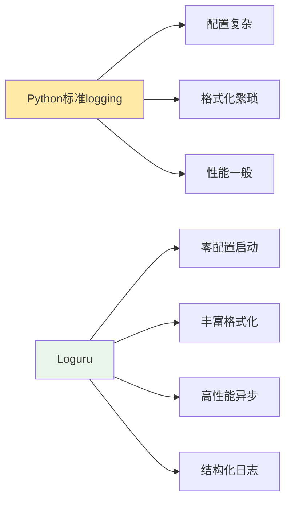
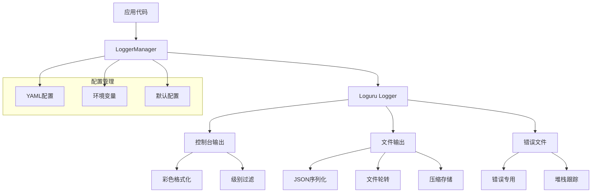

# 高级日志系统学习 - shared/logger.py

## 📋 模块概述

Chat-Room项目采用了基于Loguru的高级日志系统，提供了结构化日志、多级别输出、文件轮转、性能监控等企业级功能。本文档深入解析现代Python应用的日志系统设计与实现。

## 🎯 为什么选择Loguru？

### 传统logging vs Loguru对比



**Loguru的优势**：
- **简单易用**：无需复杂配置，开箱即用
- **性能优异**：异步写入，不阻塞主线程
- **功能丰富**：自动轮转、压缩、序列化
- **格式灵活**：支持彩色输出、自定义格式
- **结构化日志**：原生支持JSON格式

## 🏗️ 日志系统架构设计

### 整体架构



### 核心类设计

```python
class LoggerManager:
    """日志管理器 - 统一管理所有日志配置"""
    
    def __init__(self):
        """初始化日志管理器"""
        self.initialized = False
        self.component = "server"
        self.config = {}
        
        # 默认配置
        self.default_config = {
            'level': 'INFO',
            'file_enabled': True,
            'console_enabled': True,
            'file_max_size': 10485760,  # 10MB
            'file_backup_count': 5,
            'compression': 'gz',
            'serialize': True,
            'enqueue': True  # 异步写入
        }
    
    def initialize(self, config: Dict[str, Any], component: str = "server"):
        """
        初始化日志系统
        
        Args:
            config: 日志配置字典
            component: 组件名称（server/client）
        """
        if self.initialized:
            return
        
        self.component = component
        self.config = {**self.default_config, **config}
        
        # 移除默认的logger配置
        logger.remove()
        
        # 创建日志目录
        log_dir = Path("logs") / component
        log_dir.mkdir(parents=True, exist_ok=True)
        
        # 配置控制台日志
        self._setup_console_logging()
        
        # 配置文件日志
        self._setup_file_logging(log_dir)
        
        self.initialized = True
        logger.info(f"日志系统初始化完成: {component}")
```

**设计特点**：
- **单例模式**：全局唯一的日志管理器
- **配置驱动**：通过配置文件控制所有行为
- **组件隔离**：不同组件使用独立的日志目录
- **延迟初始化**：避免重复初始化

## 🎨 日志格式化系统

### 控制台日志格式

```python
def _setup_console_logging(self):
    """配置控制台日志输出"""
    if not self.config.get('console_enabled', True):
        return
    
    level = self.config.get('level', 'INFO')
    
    # 彩色格式化模板
    console_format = (
        "<green>{time:YYYY-MM-DD HH:mm:ss}</green> | "
        "<level>{level: <8}</level> | "
        "<cyan>{name}</cyan>:<cyan>{function}</cyan>:<cyan>{line}</cyan> | "
        "<level>{message}</level>"
    )
    
    logger.add(
        sys.stdout,
        level=level,
        format=console_format,
        colorize=True,
        filter=self._console_filter,
        enqueue=self.config.get('enqueue', True)
    )

def _console_filter(self, record):
    """控制台日志过滤器"""
    # 过滤掉过于频繁的调试信息
    if record["level"].name == "DEBUG":
        # 只显示重要的调试信息
        return any(keyword in record["message"] for keyword in [
            "用户登录", "消息发送", "文件上传", "AI响应"
        ])
    
    # 过滤掉数据库操作的详细日志
    if "database" in record.get("extra", {}):
        return record["level"].name != "DEBUG"
    
    return True
```

**格式化特点**：
- **彩色输出**：不同级别使用不同颜色
- **详细信息**：包含时间、级别、位置、消息
- **智能过滤**：避免控制台信息过载
- **性能优化**：异步输出不阻塞主线程

### 文件日志格式

```python
def _setup_file_logging(self, log_dir: Path):
    """配置文件日志输出"""
    if not self.config.get('file_enabled', True):
        return
    
    level = self.config.get('level', 'INFO')
    file_max_size = self.config.get('file_max_size', 10485760)
    file_backup_count = self.config.get('file_backup_count', 5)
    
    # 主日志文件 - 结构化JSON格式
    main_log_file = log_dir / f"{self.component}.log"
    logger.add(
        str(main_log_file),
        level=level,
        format=self._create_json_formatter(),
        rotation=file_max_size,
        retention=file_backup_count,
        compression="gz",
        serialize=True,  # JSON序列化
        enqueue=True,    # 异步写入
        encoding='utf-8'
    )
    
    # 错误日志单独记录
    error_log_file = log_dir / f"{self.component}_error.log"
    logger.add(
        str(error_log_file),
        level="ERROR",
        format=self._create_error_formatter(),
        rotation=file_max_size,
        retention=file_backup_count,
        compression="gz",
        serialize=True,
        enqueue=True,
        encoding='utf-8'
    )

def _create_json_formatter(self):
    """创建JSON格式化器"""
    def formatter(record):
        """自定义JSON格式化"""
        # 基础字段
        log_entry = {
            "timestamp": record["time"].isoformat(),
            "level": record["level"].name,
            "logger": record["name"],
            "message": record["message"],
            "module": record["module"],
            "function": record["function"],
            "line": record["line"]
        }
        
        # 添加额外字段
        extra = record.get("extra", {})
        for key, value in extra.items():
            if key not in log_entry:
                log_entry[key] = value
        
        # 添加异常信息
        if record["exception"]:
            log_entry["exception"] = {
                "type": record["exception"].type.__name__,
                "value": str(record["exception"].value),
                "traceback": record["exception"].traceback
            }
        
        return json.dumps(log_entry, ensure_ascii=False, default=str)
    
    return formatter
```

**文件日志特点**：
- **JSON格式**：结构化存储，便于分析
- **自动轮转**：文件大小达到限制时自动轮转
- **压缩存储**：旧日志文件自动压缩节省空间
- **错误分离**：错误日志单独存储便于排查

## 📊 专用日志记录器

### 数据库操作日志

```python
def log_database_operation(operation: str, table: str, **kwargs):
    """
    记录数据库操作日志
    
    Args:
        operation: 操作类型 (SELECT, INSERT, UPDATE, DELETE)
        table: 表名
        **kwargs: 额外的上下文信息
    """
    logger.debug(
        f"数据库操作: {operation} - {table}",
        database=True,
        operation=operation,
        table=table,
        **kwargs
    )

# 使用示例
def create_user(self, username: str, password: str) -> int:
    """创建用户"""
    try:
        # 数据库操作
        user_id = self._insert_user(username, password)
        
        # 记录成功日志
        log_database_operation(
            "INSERT", "users",
            user_id=user_id,
            username=username,
            status="success"
        )
        
        return user_id
        
    except Exception as e:
        # 记录失败日志
        log_database_operation(
            "INSERT", "users",
            username=username,
            status="error",
            error=str(e)
        )
        raise
```

### AI操作日志

```python
def log_ai_operation(operation: str, model: str, **kwargs):
    """
    记录AI操作日志
    
    Args:
        operation: 操作类型 (generate_reply, process_message)
        model: AI模型名称
        **kwargs: 额外信息（如响应时间、token数量等）
    """
    logger.info(
        f"AI操作: {operation} using {model}",
        ai=True,
        operation=operation,
        model=model,
        **kwargs
    )

# 使用示例
def process_ai_request(self, user_message: str) -> str:
    """处理AI请求"""
    start_time = time.time()
    
    try:
        # AI处理
        response = self.ai_client.generate_response(user_message)
        
        # 计算响应时间
        response_time = time.time() - start_time
        
        # 记录成功日志
        log_ai_operation(
            "generate_reply", "glm-4-flash",
            response_time=response_time,
            input_length=len(user_message),
            output_length=len(response),
            status="success"
        )
        
        return response
        
    except Exception as e:
        # 记录失败日志
        log_ai_operation(
            "generate_reply", "glm-4-flash",
            response_time=time.time() - start_time,
            input_length=len(user_message),
            status="error",
            error=str(e)
        )
        raise
```

### 网络操作日志

```python
def log_network_operation(operation: str, client_info: dict = None, **kwargs):
    """
    记录网络操作日志
    
    Args:
        operation: 操作类型 (connect, disconnect, send_message)
        client_info: 客户端信息 (IP, port, user_id)
        **kwargs: 额外信息
    """
    logger.info(
        f"网络操作: {operation}",
        network=True,
        operation=operation,
        client_info=client_info or {},
        **kwargs
    )

# 使用示例
def handle_client_connection(self, client_socket, address):
    """处理客户端连接"""
    client_info = {"ip": address[0], "port": address[1]}
    
    # 记录连接日志
    log_network_operation("client_connect", client_info)
    
    try:
        # 处理客户端消息
        while True:
            message = self.receive_message(client_socket)
            if not message:
                break
            
            # 记录消息接收日志
            log_network_operation(
                "message_received",
                client_info,
                message_type=message.message_type,
                message_size=len(str(message))
            )
            
            self.process_message(client_socket, message)
            
    except Exception as e:
        # 记录错误日志
        log_network_operation(
            "client_error",
            client_info,
            error=str(e)
        )
    finally:
        # 记录断开连接日志
        log_network_operation("client_disconnect", client_info)
```

## 🎭 高级日志功能

### 性能监控装饰器

```python
def log_performance(event_type: str = None, log_args: bool = False, 
                   log_result: bool = False):
    """
    性能监控装饰器
    
    Args:
        event_type: 事件类型，默认使用函数名
        log_args: 是否记录函数参数
        log_result: 是否记录函数返回值
    """
    def decorator(func):
        @wraps(func)
        def wrapper(*args, **kwargs):
            func_name = func.__name__
            event = event_type or func_name
            
            # 记录函数开始
            log_data = {"function": func_name}
            if log_args:
                log_data["args"] = str(args)
                log_data["kwargs"] = str(kwargs)
            
            logger.debug(f"函数调用开始: {func_name}", **log_data)
            
            try:
                # 执行函数
                start_time = datetime.now()
                result = func(*args, **kwargs)
                end_time = datetime.now()
                duration = (end_time - start_time).total_seconds()
                
                # 记录成功日志
                success_data = {
                    "function": func_name,
                    "duration": duration,
                    "status": "success"
                }
                if log_result:
                    success_data["result"] = str(result)
                
                logger.debug(f"函数调用成功: {func_name}", **success_data)
                return result
                
            except Exception as e:
                # 记录失败日志
                error_data = {
                    "function": func_name,
                    "duration": (datetime.now() - start_time).total_seconds(),
                    "status": "error",
                    "error": str(e)
                }
                
                logger.error(f"函数调用失败: {func_name}", **error_data)
                raise
                
        return wrapper
    return decorator

# 使用示例
@log_performance("user_authentication", log_args=True)
def authenticate_user(self, username: str, password: str):
    """用户认证"""
    # 认证逻辑
    pass

@log_performance("message_processing")
def process_chat_message(self, message):
    """处理聊天消息"""
    # 消息处理逻辑
    pass
```

### 安全事件日志

```python
def log_security_event(event_type: str, **kwargs):
    """
    记录安全事件日志
    
    Args:
        event_type: 安全事件类型
        **kwargs: 事件详细信息
    """
    logger.warning(
        f"安全事件: {event_type}",
        security=True,
        event_type=event_type,
        timestamp=datetime.now().isoformat(),
        **kwargs
    )

# 使用示例
def handle_login_attempt(self, username: str, password: str, client_ip: str):
    """处理登录尝试"""
    try:
        user = self.authenticate_user(username, password)
        
        # 记录成功登录
        log_security_event(
            "login_success",
            username=username,
            client_ip=client_ip,
            user_id=user['id']
        )
        
        return user
        
    except AuthenticationError:
        # 记录失败登录
        log_security_event(
            "login_failed",
            username=username,
            client_ip=client_ip,
            reason="invalid_credentials"
        )
        raise

def handle_admin_operation(self, admin_id: int, operation: str, target: str):
    """处理管理员操作"""
    # 记录管理员操作
    log_security_event(
        "admin_operation",
        admin_id=admin_id,
        operation=operation,
        target=target
    )
    
    # 执行操作
    self.execute_admin_operation(operation, target)
```

### 错误聚合和告警

```python
class ErrorAggregator:
    """错误聚合器 - 统计和分析错误模式"""
    
    def __init__(self):
        self.error_counts = {}
        self.error_threshold = 10  # 错误阈值
        self.time_window = 300     # 时间窗口（秒）
    
    def record_error(self, error_type: str, error_message: str):
        """记录错误"""
        current_time = time.time()
        
        if error_type not in self.error_counts:
            self.error_counts[error_type] = []
        
        # 添加错误记录
        self.error_counts[error_type].append({
            "timestamp": current_time,
            "message": error_message
        })
        
        # 清理过期记录
        self._cleanup_old_errors(error_type, current_time)
        
        # 检查是否需要告警
        if len(self.error_counts[error_type]) >= self.error_threshold:
            self._trigger_alert(error_type)
    
    def _cleanup_old_errors(self, error_type: str, current_time: float):
        """清理过期的错误记录"""
        cutoff_time = current_time - self.time_window
        self.error_counts[error_type] = [
            error for error in self.error_counts[error_type]
            if error["timestamp"] > cutoff_time
        ]
    
    def _trigger_alert(self, error_type: str):
        """触发告警"""
        logger.critical(
            f"错误频率告警: {error_type}",
            alert=True,
            error_type=error_type,
            count=len(self.error_counts[error_type]),
            time_window=self.time_window
        )

# 全局错误聚合器
error_aggregator = ErrorAggregator()

def log_error_with_aggregation(error_type: str, error_message: str):
    """记录错误并进行聚合分析"""
    logger.error(error_message, error_type=error_type)
    error_aggregator.record_error(error_type, error_message)
```

## 💡 学习要点

### 现代日志系统设计

1. **结构化日志**：使用JSON格式便于分析和查询
2. **异步写入**：避免日志记录阻塞主线程
3. **智能过滤**：根据环境和需求过滤日志内容
4. **性能监控**：集成性能指标收集
5. **安全审计**：记录安全相关事件

### Loguru高级特性

1. **零配置**：开箱即用，无需复杂配置
2. **自动轮转**：文件大小和时间双重轮转策略
3. **压缩存储**：自动压缩旧日志文件
4. **异常捕获**：自动记录异常堆栈信息
5. **上下文绑定**：为日志记录绑定上下文信息

### 企业级日志实践

1. **分级存储**：不同级别的日志使用不同存储策略
2. **集中收集**：使用ELK Stack等工具集中收集日志
3. **实时监控**：基于日志的实时告警和监控
4. **合规要求**：满足安全和合规的日志保留要求

## 🤔 思考题

1. **如何设计分布式系统的日志追踪？**
   - 使用TraceID关联分布式调用
   - 实现请求链路追踪
   - 集中化日志收集和分析

2. **如何平衡日志详细程度和性能？**
   - 动态调整日志级别
   - 异步日志写入
   - 智能采样策略

3. **如何实现日志的安全和隐私保护？**
   - 敏感信息脱敏
   - 日志访问权限控制
   - 加密存储重要日志

---

**下一步**：学习Socket编程进阶 → [advanced-socket.md](./advanced-socket.md)
