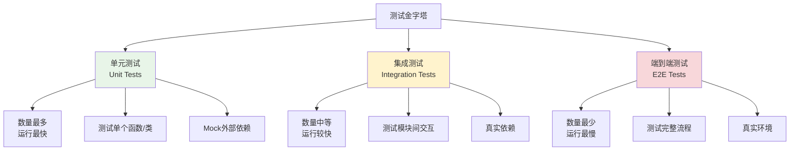

# 测试策略与实践学习

## 📋 模块概述

测试是软件开发的重要环节，Chat-Room项目采用了多层次的测试策略，包括单元测试、集成测试、功能测试和性能测试。本文档详细介绍现代Python项目的测试最佳实践。

## 🎯 测试金字塔

### 测试层次结构



**测试比例建议**：
- **单元测试**：70% - 快速反馈，高覆盖率
- **集成测试**：20% - 验证模块协作
- **端到端测试**：10% - 验证用户场景

## 🧪 单元测试实践

### pytest基础配置

```python
# conftest.py - pytest配置文件
import pytest
import tempfile
import os
from unittest.mock import Mock, patch
from server.database.models import DatabaseManager
from shared.logger import get_logger

@pytest.fixture(scope="session")
def test_database():
    """测试数据库fixture"""
    # 创建临时数据库文件
    with tempfile.NamedTemporaryFile(delete=False, suffix='.db') as tmp_file:
        test_db_path = tmp_file.name
    
    # 初始化测试数据库
    db = DatabaseManager(test_db_path)
    db.init_database()
    
    yield db
    
    # 清理
    os.unlink(test_db_path)

@pytest.fixture
def mock_logger():
    """Mock日志器fixture"""
    with patch('shared.logger.get_logger') as mock_get_logger:
        mock_logger = Mock()
        mock_get_logger.return_value = mock_logger
        yield mock_logger

@pytest.fixture
def sample_user_data():
    """示例用户数据fixture"""
    return {
        'username': 'test_user',
        'password': 'test_password123',
        'user_id': 1
    }

@pytest.fixture
def sample_chat_message():
    """示例聊天消息fixture"""
    from shared.messages import ChatMessage
    return ChatMessage(
        sender_id=1,
        sender_username='test_user',
        chat_group_id=1,
        chat_group_name='test_group',
        content='Hello, World!',
        timestamp=1234567890.0
    )
```

### 数据库操作单元测试

```python
# test/test_database.py
import pytest
from server.database.models import DatabaseManager
from shared.exceptions import UserAlreadyExistsError, UserNotFoundError

class TestUserOperations:
    """用户操作测试类"""
    
    def test_create_user_success(self, test_database, sample_user_data):
        """测试成功创建用户"""
        db = test_database
        
        # 执行创建用户
        user_id = db.create_user(
            sample_user_data['username'],
            sample_user_data['password']
        )
        
        # 验证结果
        assert user_id is not None
        assert isinstance(user_id, int)
        assert user_id > 0
        
        # 验证用户确实被创建
        user_info = db.get_user_by_id(user_id)
        assert user_info['username'] == sample_user_data['username']
        assert user_info['is_online'] is False
        assert user_info['is_banned'] is False
    
    def test_create_user_duplicate_username(self, test_database, sample_user_data):
        """测试创建重复用户名的用户"""
        db = test_database
        
        # 先创建一个用户
        db.create_user(sample_user_data['username'], sample_user_data['password'])
        
        # 尝试创建同名用户，应该抛出异常
        with pytest.raises(UserAlreadyExistsError):
            db.create_user(sample_user_data['username'], 'different_password')
    
    def test_create_user_invalid_input(self, test_database):
        """测试无效输入创建用户"""
        db = test_database
        
        # 测试空用户名
        with pytest.raises(ValueError):
            db.create_user('', 'password123')
        
        # 测试空密码
        with pytest.raises(ValueError):
            db.create_user('testuser', '')
        
        # 测试用户名过短
        with pytest.raises(ValueError):
            db.create_user('ab', 'password123')
        
        # 测试密码过短
        with pytest.raises(ValueError):
            db.create_user('testuser', '123')
    
    def test_authenticate_user_success(self, test_database, sample_user_data):
        """测试成功认证用户"""
        db = test_database
        
        # 创建用户
        user_id = db.create_user(
            sample_user_data['username'],
            sample_user_data['password']
        )
        
        # 认证用户
        auth_result = db.authenticate_user(
            sample_user_data['username'],
            sample_user_data['password']
        )
        
        # 验证认证结果
        assert auth_result is not None
        assert auth_result['id'] == user_id
        assert auth_result['username'] == sample_user_data['username']
    
    def test_authenticate_user_wrong_password(self, test_database, sample_user_data):
        """测试错误密码认证"""
        db = test_database
        
        # 创建用户
        db.create_user(sample_user_data['username'], sample_user_data['password'])
        
        # 使用错误密码认证
        auth_result = db.authenticate_user(
            sample_user_data['username'],
            'wrong_password'
        )
        
        # 应该返回None
        assert auth_result is None
    
    def test_get_user_by_id_not_found(self, test_database):
        """测试获取不存在的用户"""
        db = test_database
        
        with pytest.raises(UserNotFoundError):
            db.get_user_by_id(99999)
    
    @pytest.mark.parametrize("is_online,expected", [
        (True, True),
        (False, False),
    ])
    def test_update_user_status(self, test_database, sample_user_data, is_online, expected):
        """测试更新用户状态（参数化测试）"""
        db = test_database
        
        # 创建用户
        user_id = db.create_user(
            sample_user_data['username'],
            sample_user_data['password']
        )
        
        # 更新状态
        db.update_user_status(user_id, is_online)
        
        # 验证状态
        user_info = db.get_user_by_id(user_id)
        assert user_info['is_online'] == expected
```

### 消息处理单元测试

```python
# test/test_message_processing.py
import pytest
from unittest.mock import Mock, patch, MagicMock
from server.core.chat_manager import ChatManager
from shared.messages import ChatMessage
from shared.exceptions import PermissionDeniedError

class TestChatManager:
    """聊天管理器测试类"""
    
    @pytest.fixture
    def mock_user_manager(self):
        """Mock用户管理器"""
        mock_manager = Mock()
        mock_manager.is_user_online.return_value = True
        mock_manager.get_user_socket.return_value = Mock()
        return mock_manager
    
    @pytest.fixture
    def chat_manager(self, mock_user_manager):
        """聊天管理器实例"""
        with patch('server.core.chat_manager.get_db') as mock_get_db:
            mock_db = Mock()
            mock_get_db.return_value = mock_db
            
            manager = ChatManager(mock_user_manager)
            manager.db = mock_db
            return manager
    
    def test_send_message_success(self, chat_manager, sample_chat_message):
        """测试成功发送消息"""
        # 设置Mock返回值
        chat_manager.db.get_user_by_id.return_value = {'username': 'test_user'}
        chat_manager.db.get_chat_group_by_id.return_value = {'name': 'test_group'}
        chat_manager.db.save_message.return_value = 123
        chat_manager.db.is_user_in_chat_group.return_value = True
        
        # 执行发送消息
        result = chat_manager.send_message(
            sender_id=1,
            group_id=1,
            content="Hello, World!"
        )
        
        # 验证结果
        assert result is not None
        assert result.message_id == 123
        assert result.content == "Hello, World!"
        
        # 验证数据库调用
        chat_manager.db.save_message.assert_called_once()
    
    def test_send_message_permission_denied(self, chat_manager):
        """测试无权限发送消息"""
        # 设置用户不在聊天组中
        chat_manager.db.is_user_in_chat_group.return_value = False
        
        # 尝试发送消息，应该抛出权限异常
        with pytest.raises(PermissionDeniedError):
            chat_manager.send_message(
                sender_id=1,
                group_id=1,
                content="Hello, World!"
            )
    
    def test_broadcast_message_to_group(self, chat_manager, sample_chat_message):
        """测试消息广播"""
        # 设置Mock数据
        mock_members = [
            {'id': 1, 'username': 'user1'},
            {'id': 2, 'username': 'user2'},
            {'id': 3, 'username': 'user3'}
        ]
        chat_manager.db.get_chat_group_members.return_value = mock_members
        
        # 设置用户管理器Mock
        chat_manager.user_manager.is_user_online.side_effect = [True, False, True]
        chat_manager.user_manager.get_user_current_chat.return_value = 1
        
        mock_socket1 = Mock()
        mock_socket3 = Mock()
        chat_manager.user_manager.get_user_socket.side_effect = [mock_socket1, None, mock_socket3]
        
        # 执行广播
        chat_manager.broadcast_message_to_group(sample_chat_message)
        
        # 验证Socket发送调用
        mock_socket1.send.assert_called_once()
        mock_socket3.send.assert_called_once()
```

## 🔗 集成测试实践

### 服务器-数据库集成测试

```python
# test/test_integration.py
import pytest
import threading
import time
import socket
from server.core.server import ChatRoomServer
from client.core.client import NetworkClient
from shared.messages import LoginRequest, ChatMessage

class TestServerIntegration:
    """服务器集成测试"""
    
    @pytest.fixture(scope="class")
    def test_server(self, test_database):
        """测试服务器fixture"""
        server = ChatRoomServer(host='localhost', port=0)  # 使用随机端口
        server.db = test_database
        
        # 在后台线程启动服务器
        server_thread = threading.Thread(target=server.start, daemon=True)
        server_thread.start()
        
        # 等待服务器启动
        time.sleep(0.5)
        
        # 获取实际端口
        actual_port = server.server_socket.getsockname()[1]
        server.actual_port = actual_port
        
        yield server
        
        # 清理
        server.stop()
    
    def test_client_server_communication(self, test_server, sample_user_data):
        """测试客户端-服务器通信"""
        # 创建测试用户
        test_server.db.create_user(
            sample_user_data['username'],
            sample_user_data['password']
        )
        
        # 创建客户端
        client = NetworkClient('localhost', test_server.actual_port)
        
        try:
            # 连接服务器
            assert client.connect() is True
            
            # 发送登录请求
            login_request = LoginRequest(
                username=sample_user_data['username'],
                password=sample_user_data['password']
            )
            
            response_received = threading.Event()
            login_response = None
            
            def handle_login_response(message):
                nonlocal login_response
                login_response = message
                response_received.set()
            
            client.register_message_handler('login_response', handle_login_response)
            
            # 发送登录请求
            client.send_message(login_request)
            
            # 等待响应
            assert response_received.wait(timeout=5.0)
            assert login_response is not None
            assert login_response.success is True
            
        finally:
            client.disconnect()
    
    def test_multiple_clients_chat(self, test_server):
        """测试多客户端聊天"""
        # 创建测试用户
        user1_data = {'username': 'user1', 'password': 'pass1'}
        user2_data = {'username': 'user2', 'password': 'pass2'}
        
        test_server.db.create_user(user1_data['username'], user1_data['password'])
        test_server.db.create_user(user2_data['username'], user2_data['password'])
        
        # 创建两个客户端
        client1 = NetworkClient('localhost', test_server.actual_port)
        client2 = NetworkClient('localhost', test_server.actual_port)
        
        try:
            # 连接并登录
            assert client1.connect() is True
            assert client2.connect() is True
            
            # 登录用户1
            login1 = LoginRequest(**user1_data)
            client1.send_message(login1)
            
            # 登录用户2
            login2 = LoginRequest(**user2_data)
            client2.send_message(login2)
            
            time.sleep(0.5)  # 等待登录完成
            
            # 用户1发送消息
            chat_msg = ChatMessage(
                content="Hello from user1",
                chat_group_id=1  # 默认公共聊天组
            )
            
            message_received = threading.Event()
            received_message = None
            
            def handle_chat_message(message):
                nonlocal received_message
                received_message = message
                message_received.set()
            
            client2.register_message_handler('chat_message', handle_chat_message)
            
            # 发送消息
            client1.send_message(chat_msg)
            
            # 验证用户2收到消息
            assert message_received.wait(timeout=5.0)
            assert received_message is not None
            assert received_message.content == "Hello from user1"
            
        finally:
            client1.disconnect()
            client2.disconnect()
```

## 🎭 Mock和Stub技术

### AI服务Mock

```python
# test/test_ai_integration.py
import pytest
from unittest.mock import Mock, patch, MagicMock
from server.ai.ai_manager import AIManager

class TestAIIntegration:
    """AI集成测试"""
    
    @pytest.fixture
    def mock_zhipu_client(self):
        """Mock智谱AI客户端"""
        mock_client = Mock()
        
        # 模拟成功响应
        mock_response = Mock()
        mock_response.choices = [Mock()]
        mock_response.choices[0].message.content = "这是AI的回复"
        mock_response.usage.prompt_tokens = 10
        mock_response.usage.completion_tokens = 5
        mock_response.usage.total_tokens = 15
        
        mock_client.chat.completions.create.return_value = mock_response
        return mock_client
    
    @patch('server.ai.ai_manager.ZhipuAI')
    def test_ai_manager_initialization(self, mock_zhipu_class, mock_zhipu_client):
        """测试AI管理器初始化"""
        mock_zhipu_class.return_value = mock_zhipu_client
        mock_zhipu_client.chat.completions.create.return_value = Mock()
        
        # 创建AI管理器
        ai_manager = AIManager(api_key="test_key")
        
        # 验证初始化
        assert ai_manager.enabled is True
        mock_zhipu_class.assert_called_once_with(api_key="test_key")
    
    def test_process_message_success(self, mock_zhipu_client):
        """测试成功处理AI消息"""
        with patch('server.ai.ai_manager.ZhipuAI', return_value=mock_zhipu_client):
            ai_manager = AIManager(api_key="test_key")
            
            # 处理消息
            response = ai_manager.process_message(
                user_id=1,
                username="test_user",
                message_content="你好",
                chat_group_id=1
            )
            
            # 验证响应
            assert response == "这是AI的回复"
            
            # 验证API调用
            mock_zhipu_client.chat.completions.create.assert_called_once()
    
    def test_process_message_api_error(self, mock_zhipu_client):
        """测试AI API错误处理"""
        # 模拟API错误
        mock_zhipu_client.chat.completions.create.side_effect = Exception("API Error")
        
        with patch('server.ai.ai_manager.ZhipuAI', return_value=mock_zhipu_client):
            ai_manager = AIManager(api_key="test_key")
            
            # 处理消息
            response = ai_manager.process_message(
                user_id=1,
                username="test_user",
                message_content="你好",
                chat_group_id=1
            )
            
            # 应该返回错误消息
            assert "无法回复" in response
```

## 📊 性能测试

### 并发连接测试

```python
# test/test_performance.py
import pytest
import threading
import time
import statistics
from concurrent.futures import ThreadPoolExecutor, as_completed
from client.core.client import NetworkClient

class TestPerformance:
    """性能测试类"""
    
    @pytest.mark.performance
    def test_concurrent_connections(self, test_server):
        """测试并发连接性能"""
        num_clients = 50
        connection_times = []
        
        def create_connection():
            """创建单个连接并测量时间"""
            start_time = time.time()
            client = NetworkClient('localhost', test_server.actual_port)
            
            try:
                success = client.connect()
                end_time = time.time()
                
                if success:
                    connection_times.append(end_time - start_time)
                    return True
                return False
            finally:
                client.disconnect()
        
        # 并发创建连接
        with ThreadPoolExecutor(max_workers=num_clients) as executor:
            futures = [executor.submit(create_connection) for _ in range(num_clients)]
            
            successful_connections = 0
            for future in as_completed(futures):
                if future.result():
                    successful_connections += 1
        
        # 验证性能指标
        assert successful_connections >= num_clients * 0.9  # 至少90%成功
        
        if connection_times:
            avg_time = statistics.mean(connection_times)
            max_time = max(connection_times)
            
            print(f"平均连接时间: {avg_time:.3f}s")
            print(f"最大连接时间: {max_time:.3f}s")
            print(f"成功连接数: {successful_connections}/{num_clients}")
            
            # 性能断言
            assert avg_time < 1.0  # 平均连接时间小于1秒
            assert max_time < 5.0  # 最大连接时间小于5秒
    
    @pytest.mark.performance
    def test_message_throughput(self, test_server):
        """测试消息吞吐量"""
        num_messages = 1000
        num_clients = 10
        
        # 创建测试用户
        for i in range(num_clients):
            test_server.db.create_user(f'user{i}', f'pass{i}')
        
        def send_messages(client_id):
            """单个客户端发送消息"""
            client = NetworkClient('localhost', test_server.actual_port)
            
            try:
                client.connect()
                
                # 登录
                login_request = LoginRequest(
                    username=f'user{client_id}',
                    password=f'pass{client_id}'
                )
                client.send_message(login_request)
                time.sleep(0.1)  # 等待登录完成
                
                # 发送消息
                start_time = time.time()
                for i in range(num_messages // num_clients):
                    chat_msg = ChatMessage(
                        content=f"Message {i} from client {client_id}",
                        chat_group_id=1
                    )
                    client.send_message(chat_msg)
                
                end_time = time.time()
                return end_time - start_time
                
            finally:
                client.disconnect()
        
        # 并发发送消息
        with ThreadPoolExecutor(max_workers=num_clients) as executor:
            futures = [executor.submit(send_messages, i) for i in range(num_clients)]
            
            total_time = max(future.result() for future in as_completed(futures))
        
        # 计算吞吐量
        throughput = num_messages / total_time
        print(f"消息吞吐量: {throughput:.2f} 消息/秒")
        
        # 性能断言
        assert throughput > 100  # 至少100消息/秒
```

## 🎯 测试覆盖率

### 覆盖率配置

```python
# pytest.ini
[tool:pytest]
testpaths = test
python_files = test_*.py
python_classes = Test*
python_functions = test_*
addopts = 
    --cov=server
    --cov=client
    --cov=shared
    --cov-report=html
    --cov-report=term-missing
    --cov-fail-under=80
markers =
    unit: 单元测试
    integration: 集成测试
    performance: 性能测试
    slow: 慢速测试
```

### 覆盖率分析

```bash
# 运行测试并生成覆盖率报告
pytest --cov=server --cov=client --cov=shared --cov-report=html

# 只运行单元测试
pytest -m unit

# 排除慢速测试
pytest -m "not slow"

# 运行特定模块测试
pytest test/test_database.py -v
```

## 💡 学习要点

### 测试设计原则

1. **FIRST原则**：Fast(快速)、Independent(独立)、Repeatable(可重复)、Self-Validating(自验证)、Timely(及时)
2. **AAA模式**：Arrange(准备)、Act(执行)、Assert(断言)
3. **单一职责**：每个测试只验证一个功能点
4. **可读性**：测试代码要清晰易懂

### Mock使用技巧

1. **隔离依赖**：Mock外部依赖，专注测试目标
2. **行为验证**：验证方法调用和参数
3. **状态验证**：验证对象状态变化
4. **边界测试**：测试异常情况和边界条件

### 测试策略

1. **测试驱动开发(TDD)**：先写测试，再写实现
2. **行为驱动开发(BDD)**：从用户行为角度设计测试
3. **持续集成**：自动化测试执行
4. **测试左移**：在开发早期引入测试

## 🤔 思考题

1. **如何平衡测试覆盖率和开发效率？**
   - 关注核心业务逻辑的测试
   - 使用风险驱动的测试策略
   - 自动化重复性测试

2. **如何测试异步和并发代码？**
   - 使用pytest-asyncio插件
   - Mock时间相关的操作
   - 控制并发执行顺序

3. **如何维护测试代码的质量？**
   - 重构测试代码
   - 共享测试工具和fixture
   - 定期审查测试用例

---

**下一步**：学习TUI界面高级特性 → [ui-advanced.md](./ui-advanced.md)
