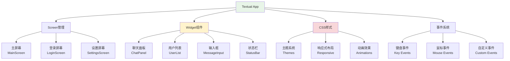

# TUI界面高级特性学习

## 📋 模块概述

Chat-Room项目使用Textual框架构建了现代化的终端用户界面(TUI)。本文档深入探讨TUI开发的高级技术，包括组件化设计、主题系统、响应式布局、动画效果等。

## 🎯 Textual框架核心概念

### TUI架构设计



**核心特性**：
- **组件化**：可复用的Widget组件
- **响应式**：自适应终端大小
- **主题化**：CSS样式系统
- **事件驱动**：异步事件处理

## 🎨 高级组件开发

### 自定义聊天消息组件

```python
from textual.widget import Widget
from textual.reactive import reactive
from textual.message import Message
from textual.containers import Horizontal, Vertical
from textual.widgets import Static, Label
from rich.text import Text
from rich.console import Console
from datetime import datetime

class ChatMessage(Widget):
    """聊天消息组件"""
    
    DEFAULT_CSS = """
    ChatMessage {
        height: auto;
        margin: 0 1;
        padding: 1;
        border: solid $primary;
        border-title-align: left;
    }
    
    ChatMessage.own-message {
        border: solid $success;
        text-align: right;
    }
    
    ChatMessage.system-message {
        border: solid $warning;
        text-style: italic;
    }
    
    ChatMessage .message-header {
        height: 1;
        color: $text-muted;
    }
    
    ChatMessage .message-content {
        height: auto;
        color: $text;
        padding: 0 1;
    }
    
    ChatMessage .message-time {
        height: 1;
        text-align: right;
        color: $text-disabled;
    }
    """
    
    # 响应式属性
    message_data = reactive(None)
    is_own_message = reactive(False)
    is_system_message = reactive(False)
    
    def __init__(self, message_data: dict, current_user_id: int = None, **kwargs):
        super().__init__(**kwargs)
        self.message_data = message_data
        self.current_user_id = current_user_id
        
        # 判断消息类型
        self.is_own_message = (
            current_user_id and 
            message_data.get('sender_id') == current_user_id
        )
        self.is_system_message = message_data.get('message_type') == 'system'
    
    def compose(self):
        """组合子组件"""
        message = self.message_data
        
        # 消息头部（发送者和时间）
        if not self.is_system_message:
            sender_name = message.get('sender_username', 'Unknown')
            timestamp = message.get('timestamp', time.time())
            time_str = datetime.fromtimestamp(timestamp).strftime('%H:%M:%S')
            
            header_text = f"{sender_name} • {time_str}"
            if self.is_own_message:
                header_text = f"{time_str} • {sender_name}"
            
            yield Static(header_text, classes="message-header")
        
        # 消息内容
        content = message.get('content', '')
        
        # 处理特殊消息类型
        if message.get('message_type') == 'file':
            content = f"📎 {message.get('filename', '文件')}"
        elif message.get('message_type') == 'ai':
            content = f"🤖 {content}"
        
        yield Static(content, classes="message-content")
    
    def on_mount(self):
        """组件挂载时设置样式"""
        if self.is_own_message:
            self.add_class("own-message")
        elif self.is_system_message:
            self.add_class("system-message")
    
    def watch_message_data(self, new_data):
        """监听消息数据变化"""
        if new_data:
            self.refresh(recompose=True)

class ChatPanel(Widget):
    """聊天面板组件"""
    
    DEFAULT_CSS = """
    ChatPanel {
        height: 1fr;
        border: solid $primary;
        border-title-align: center;
    }
    
    ChatPanel > Vertical {
        height: 1fr;
    }
    
    ChatPanel .messages-container {
        height: 1fr;
        overflow-y: auto;
        padding: 1;
    }
    
    ChatPanel .loading-indicator {
        height: 3;
        text-align: center;
        color: $text-muted;
    }
    """
    
    # 响应式属性
    messages = reactive([])
    current_chat_group = reactive("")
    is_loading = reactive(False)
    
    def __init__(self, **kwargs):
        super().__init__(**kwargs)
        self.current_user_id = None
        self.auto_scroll = True
    
    def compose(self):
        """组合聊天面板"""
        with Vertical():
            # 加载指示器
            if self.is_loading:
                yield Static("正在加载消息...", classes="loading-indicator")
            
            # 消息容器
            with Vertical(classes="messages-container") as container:
                self.messages_container = container
                for message in self.messages:
                    yield ChatMessage(
                        message_data=message,
                        current_user_id=self.current_user_id
                    )
    
    def add_message(self, message_data: dict):
        """添加新消息"""
        self.messages = [*self.messages, message_data]
        
        # 自动滚动到底部
        if self.auto_scroll:
            self.call_after_refresh(self.scroll_to_bottom)
    
    def clear_messages(self):
        """清空消息"""
        self.messages = []
    
    def scroll_to_bottom(self):
        """滚动到底部"""
        if hasattr(self, 'messages_container'):
            self.messages_container.scroll_end()
    
    def watch_messages(self, new_messages):
        """监听消息列表变化"""
        self.refresh(recompose=True)
    
    def watch_current_chat_group(self, new_group):
        """监听当前聊天组变化"""
        if new_group:
            self.border_title = f"聊天组: {new_group}"
        else:
            self.border_title = "聊天面板"
```

### 高级输入组件

```python
class AdvancedMessageInput(Widget):
    """高级消息输入组件"""
    
    DEFAULT_CSS = """
    AdvancedMessageInput {
        height: auto;
        min-height: 3;
        max-height: 10;
        border: solid $primary;
        border-title-align: left;
    }
    
    AdvancedMessageInput Input {
        height: 1fr;
        border: none;
    }
    
    AdvancedMessageInput .input-toolbar {
        height: 1;
        background: $surface;
        color: $text-muted;
    }
    
    AdvancedMessageInput .char-counter {
        text-align: right;
        color: $text-disabled;
    }
    
    AdvancedMessageInput .char-counter.warning {
        color: $warning;
    }
    
    AdvancedMessageInput .char-counter.error {
        color: $error;
    }
    """
    
    # 响应式属性
    current_text = reactive("")
    char_limit = reactive(2000)
    is_multiline = reactive(False)
    placeholder = reactive("输入消息...")
    
    class MessageSubmitted(Message):
        """消息提交事件"""
        def __init__(self, content: str):
            super().__init__()
            self.content = content
    
    def __init__(self, **kwargs):
        super().__init__(**kwargs)
        self.command_history = []
        self.history_index = -1
    
    def compose(self):
        """组合输入组件"""
        from textual.widgets import Input
        
        # 主输入框
        yield Input(
            placeholder=self.placeholder,
            id="message_input"
        )
        
        # 工具栏
        with Horizontal(classes="input-toolbar"):
            yield Static("Ctrl+Enter发送 | ↑↓历史记录", id="help_text")
            yield Static("", classes="char-counter", id="char_counter")
    
    def on_mount(self):
        """组件挂载"""
        self.border_title = "消息输入"
        input_widget = self.query_one("#message_input", Input)
        input_widget.focus()
    
    def on_input_changed(self, event):
        """输入内容变化"""
        self.current_text = event.value
        self.update_char_counter()
    
    def update_char_counter(self):
        """更新字符计数器"""
        char_count = len(self.current_text)
        remaining = self.char_limit - char_count
        
        counter = self.query_one("#char_counter", Static)
        counter.update(f"{char_count}/{self.char_limit}")
        
        # 更新样式
        counter.remove_class("warning", "error")
        if remaining < 100:
            counter.add_class("warning")
        if remaining < 0:
            counter.add_class("error")
    
    def on_key(self, event):
        """键盘事件处理"""
        if event.key == "ctrl+enter":
            self.submit_message()
            event.prevent_default()
        elif event.key == "up":
            self.navigate_history(-1)
            event.prevent_default()
        elif event.key == "down":
            self.navigate_history(1)
            event.prevent_default()
        elif event.key == "tab":
            self.handle_tab_completion()
            event.prevent_default()
    
    def submit_message(self):
        """提交消息"""
        content = self.current_text.strip()
        if not content:
            return
        
        if len(content) > self.char_limit:
            self.notify("消息长度超过限制", severity="error")
            return
        
        # 添加到历史记录
        if content not in self.command_history:
            self.command_history.append(content)
            # 限制历史记录数量
            if len(self.command_history) > 100:
                self.command_history.pop(0)
        
        self.history_index = len(self.command_history)
        
        # 发送消息事件
        self.post_message(self.MessageSubmitted(content))
        
        # 清空输入框
        input_widget = self.query_one("#message_input", Input)
        input_widget.value = ""
        self.current_text = ""
    
    def navigate_history(self, direction: int):
        """导航历史记录"""
        if not self.command_history:
            return
        
        self.history_index += direction
        self.history_index = max(0, min(self.history_index, len(self.command_history)))
        
        if self.history_index < len(self.command_history):
            content = self.command_history[self.history_index]
            input_widget = self.query_one("#message_input", Input)
            input_widget.value = content
            self.current_text = content
    
    def handle_tab_completion(self):
        """处理Tab自动补全"""
        # 实现用户名自动补全
        current_word = self.get_current_word()
        if current_word.startswith('@'):
            # 获取用户列表进行补全
            self.complete_username(current_word[1:])
    
    def get_current_word(self) -> str:
        """获取当前光标位置的单词"""
        # 简化实现，实际需要获取光标位置
        words = self.current_text.split()
        return words[-1] if words else ""
    
    def complete_username(self, partial_name: str):
        """用户名自动补全"""
        # 这里需要从应用获取用户列表
        # 简化实现
        pass
```

## 🎭 主题系统设计

### 动态主题切换

```python
class ThemeManager:
    """主题管理器"""
    
    THEMES = {
        "default": {
            "name": "默认主题",
            "css": """
            App {
                background: $surface;
                color: $text;
            }
            
            .primary {
                background: $primary;
                color: $text-on-primary;
            }
            
            .success {
                background: $success;
                color: $text-on-success;
            }
            
            .warning {
                background: $warning;
                color: $text-on-warning;
            }
            
            .error {
                background: $error;
                color: $text-on-error;
            }
            """
        },
        
        "dark": {
            "name": "暗黑主题",
            "css": """
            App {
                background: #1a1a1a;
                color: #ffffff;
            }
            
            Widget {
                background: #2d2d2d;
                color: #ffffff;
            }
            
            Input {
                background: #3d3d3d;
                color: #ffffff;
                border: solid #555555;
            }
            
            Button {
                background: #4a4a4a;
                color: #ffffff;
                border: solid #666666;
            }
            
            Button:hover {
                background: #5a5a5a;
            }
            
            .primary {
                background: #0066cc;
                color: #ffffff;
            }
            
            .success {
                background: #28a745;
                color: #ffffff;
            }
            
            .warning {
                background: #ffc107;
                color: #000000;
            }
            
            .error {
                background: #dc3545;
                color: #ffffff;
            }
            """
        },
        
        "light": {
            "name": "明亮主题",
            "css": """
            App {
                background: #ffffff;
                color: #333333;
            }
            
            Widget {
                background: #f8f9fa;
                color: #333333;
            }
            
            Input {
                background: #ffffff;
                color: #333333;
                border: solid #dee2e6;
            }
            
            Button {
                background: #e9ecef;
                color: #333333;
                border: solid #ced4da;
            }
            
            Button:hover {
                background: #f8f9fa;
            }
            
            .primary {
                background: #007bff;
                color: #ffffff;
            }
            
            .success {
                background: #28a745;
                color: #ffffff;
            }
            
            .warning {
                background: #ffc107;
                color: #000000;
            }
            
            .error {
                background: #dc3545;
                color: #ffffff;
            }
            """
        },
        
        "cyberpunk": {
            "name": "赛博朋克",
            "css": """
            App {
                background: #0a0a0a;
                color: #00ff41;
            }
            
            Widget {
                background: #1a1a1a;
                color: #00ff41;
                border: solid #00ff41;
            }
            
            Input {
                background: #000000;
                color: #00ff41;
                border: solid #ff0080;
            }
            
            Button {
                background: #1a1a1a;
                color: #00ff41;
                border: solid #00ff41;
            }
            
            Button:hover {
                background: #00ff41;
                color: #000000;
            }
            
            .primary {
                background: #ff0080;
                color: #000000;
            }
            
            .success {
                background: #00ff41;
                color: #000000;
            }
            
            .warning {
                background: #ffff00;
                color: #000000;
            }
            
            .error {
                background: #ff0040;
                color: #ffffff;
            }
            """
        }
    }
    
    def __init__(self, app):
        self.app = app
        self.current_theme = "default"
    
    def apply_theme(self, theme_name: str):
        """应用主题"""
        if theme_name not in self.THEMES:
            raise ValueError(f"未知主题: {theme_name}")
        
        theme = self.THEMES[theme_name]
        
        # 应用CSS
        self.app.stylesheet.clear()
        self.app.stylesheet.add_source(theme["css"])
        
        self.current_theme = theme_name
        
        # 刷新界面
        self.app.refresh()
    
    def get_available_themes(self) -> list:
        """获取可用主题列表"""
        return [
            {"id": theme_id, "name": theme_data["name"]}
            for theme_id, theme_data in self.THEMES.items()
        ]
    
    def get_current_theme(self) -> str:
        """获取当前主题"""
        return self.current_theme

class ThemeSelector(Widget):
    """主题选择器组件"""
    
    DEFAULT_CSS = """
    ThemeSelector {
        height: auto;
        border: solid $primary;
        border-title-align: center;
    }
    
    ThemeSelector Button {
        width: 1fr;
        margin: 0 1;
    }
    
    ThemeSelector Button.active {
        background: $primary;
        color: $text-on-primary;
    }
    """
    
    def __init__(self, theme_manager: ThemeManager, **kwargs):
        super().__init__(**kwargs)
        self.theme_manager = theme_manager
        self.border_title = "主题选择"
    
    def compose(self):
        """组合主题选择器"""
        from textual.widgets import Button
        from textual.containers import Horizontal
        
        with Horizontal():
            for theme in self.theme_manager.get_available_themes():
                button = Button(
                    theme["name"],
                    id=f"theme_{theme['id']}"
                )
                
                # 标记当前主题
                if theme["id"] == self.theme_manager.get_current_theme():
                    button.add_class("active")
                
                yield button
    
    def on_button_pressed(self, event):
        """按钮点击事件"""
        button_id = event.button.id
        if button_id.startswith("theme_"):
            theme_id = button_id[6:]  # 移除"theme_"前缀
            
            # 应用主题
            self.theme_manager.apply_theme(theme_id)
            
            # 更新按钮状态
            self.update_button_states(theme_id)
    
    def update_button_states(self, active_theme: str):
        """更新按钮状态"""
        for button in self.query(Button):
            button.remove_class("active")
            if button.id == f"theme_{active_theme}":
                button.add_class("active")
```

## 🎬 动画和过渡效果

### 消息动画

```python
class AnimatedChatMessage(ChatMessage):
    """带动画的聊天消息"""
    
    DEFAULT_CSS = """
    AnimatedChatMessage {
        height: auto;
        margin: 0 1;
        padding: 1;
        border: solid $primary;
        opacity: 0;
        offset-x: 10;
    }
    
    AnimatedChatMessage.fade-in {
        opacity: 1;
        offset-x: 0;
        transition: opacity 300ms ease-out, offset-x 300ms ease-out;
    }
    
    AnimatedChatMessage.slide-in-left {
        offset-x: -20;
        opacity: 0;
    }
    
    AnimatedChatMessage.slide-in-left.active {
        offset-x: 0;
        opacity: 1;
        transition: offset-x 400ms ease-out, opacity 400ms ease-out;
    }
    
    AnimatedChatMessage.slide-in-right {
        offset-x: 20;
        opacity: 0;
    }
    
    AnimatedChatMessage.slide-in-right.active {
        offset-x: 0;
        opacity: 1;
        transition: offset-x 400ms ease-out, opacity 400ms ease-out;
    }
    """
    
    def on_mount(self):
        """组件挂载时播放动画"""
        super().on_mount()
        
        # 根据消息类型选择动画
        if self.is_own_message:
            self.add_class("slide-in-right")
        else:
            self.add_class("slide-in-left")
        
        # 延迟添加active类触发动画
        self.set_timer(0.1, self.start_animation)
    
    def start_animation(self):
        """开始动画"""
        self.add_class("active")

class LoadingSpinner(Widget):
    """加载动画组件"""
    
    DEFAULT_CSS = """
    LoadingSpinner {
        height: 3;
        text-align: center;
        color: $primary;
    }
    
    LoadingSpinner .spinner {
        height: 1;
    }
    """
    
    SPINNER_FRAMES = ["⠋", "⠙", "⠹", "⠸", "⠼", "⠴", "⠦", "⠧", "⠇", "⠏"]
    
    def __init__(self, message: str = "加载中...", **kwargs):
        super().__init__(**kwargs)
        self.message = message
        self.frame_index = 0
        self.timer = None
    
    def compose(self):
        """组合加载动画"""
        yield Static("", classes="spinner", id="spinner")
        yield Static(self.message, id="message")
    
    def on_mount(self):
        """开始动画"""
        self.start_animation()
    
    def start_animation(self):
        """开始旋转动画"""
        self.timer = self.set_interval(0.1, self.update_frame)
    
    def stop_animation(self):
        """停止动画"""
        if self.timer:
            self.timer.stop()
            self.timer = None
    
    def update_frame(self):
        """更新动画帧"""
        spinner = self.query_one("#spinner", Static)
        spinner.update(self.SPINNER_FRAMES[self.frame_index])
        self.frame_index = (self.frame_index + 1) % len(self.SPINNER_FRAMES)
    
    def on_unmount(self):
        """组件卸载时停止动画"""
        self.stop_animation()
```

## 📱 响应式设计

### 自适应布局

```python
class ResponsiveChatLayout(Widget):
    """响应式聊天布局"""
    
    DEFAULT_CSS = """
    ResponsiveChatLayout {
        height: 1fr;
    }
    
    /* 大屏幕布局 */
    ResponsiveChatLayout.large {
        layout: horizontal;
    }
    
    ResponsiveChatLayout.large .sidebar {
        width: 25%;
        min-width: 20;
        max-width: 40;
    }
    
    ResponsiveChatLayout.large .main-content {
        width: 1fr;
    }
    
    /* 中等屏幕布局 */
    ResponsiveChatLayout.medium {
        layout: horizontal;
    }
    
    ResponsiveChatLayout.medium .sidebar {
        width: 30%;
        min-width: 15;
        max-width: 30;
    }
    
    ResponsiveChatLayout.medium .main-content {
        width: 1fr;
    }
    
    /* 小屏幕布局 */
    ResponsiveChatLayout.small {
        layout: vertical;
    }
    
    ResponsiveChatLayout.small .sidebar {
        height: 30%;
        width: 1fr;
    }
    
    ResponsiveChatLayout.small .main-content {
        height: 1fr;
        width: 1fr;
    }
    """
    
    def __init__(self, **kwargs):
        super().__init__(**kwargs)
        self.current_size_class = "large"
    
    def compose(self):
        """组合响应式布局"""
        from textual.containers import Horizontal, Vertical
        
        # 侧边栏
        with Vertical(classes="sidebar"):
            yield UserList()
            yield ChatGroupList()
        
        # 主内容区
        with Vertical(classes="main-content"):
            yield ChatPanel()
            yield AdvancedMessageInput()
    
    def on_resize(self, event):
        """窗口大小变化事件"""
        width = event.size.width
        height = event.size.height
        
        # 根据尺寸确定布局类别
        if width >= 120:
            size_class = "large"
        elif width >= 80:
            size_class = "medium"
        else:
            size_class = "small"
        
        # 更新布局
        if size_class != self.current_size_class:
            self.remove_class(self.current_size_class)
            self.add_class(size_class)
            self.current_size_class = size_class
    
    def on_mount(self):
        """组件挂载时设置初始布局"""
        self.add_class(self.current_size_class)
```

## 💡 学习要点

### TUI开发最佳实践

1. **组件化设计**：创建可复用的Widget组件
2. **响应式布局**：适应不同终端尺寸
3. **性能优化**：避免频繁重绘和重新组合
4. **用户体验**：提供直观的交互和反馈
5. **可访问性**：支持键盘导航和屏幕阅读器

### Textual框架特性

1. **CSS样式系统**：类似Web开发的样式定义
2. **响应式属性**：自动更新UI的数据绑定
3. **事件系统**：异步事件处理机制
4. **动画支持**：CSS过渡和动画效果
5. **Rich集成**：丰富的文本渲染能力

### 高级技术

1. **自定义组件**：继承Widget创建专用组件
2. **主题系统**：动态切换界面主题
3. **动画效果**：提升用户体验的视觉效果
4. **状态管理**：复杂应用的状态同步
5. **性能监控**：监控和优化渲染性能

## 🤔 思考题

1. **如何优化TUI应用的性能？**
   - 减少不必要的重绘
   - 使用虚拟滚动处理大量数据
   - 合理使用缓存和懒加载

2. **如何设计可访问的TUI界面？**
   - 提供完整的键盘导航
   - 使用语义化的组件结构
   - 支持屏幕阅读器

3. **如何在TUI中实现复杂的交互？**
   - 使用模态对话框
   - 实现拖拽和调整大小
   - 支持多选和批量操作

---

**总结**：高级功能模块学习完成！这些文档涵盖了现代Python应用开发的核心技术栈。
