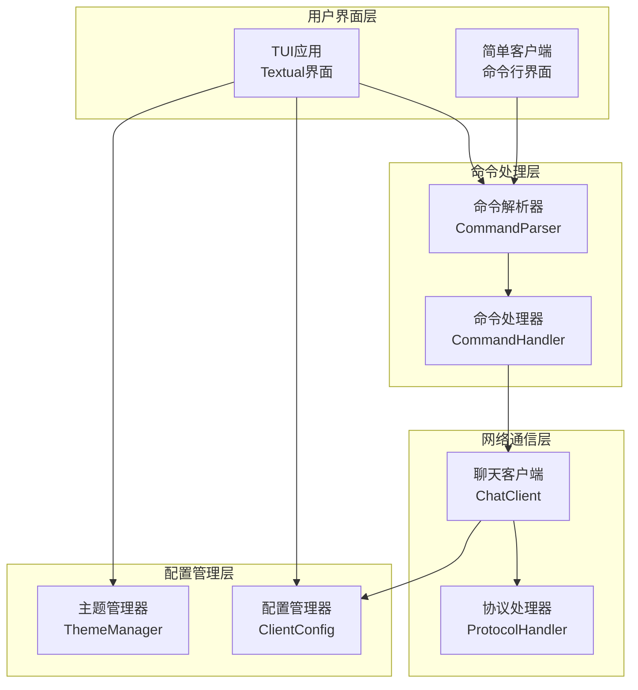
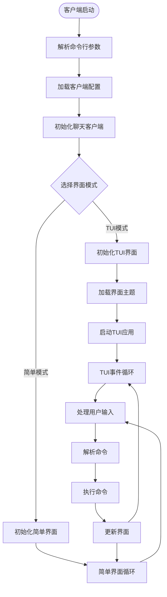
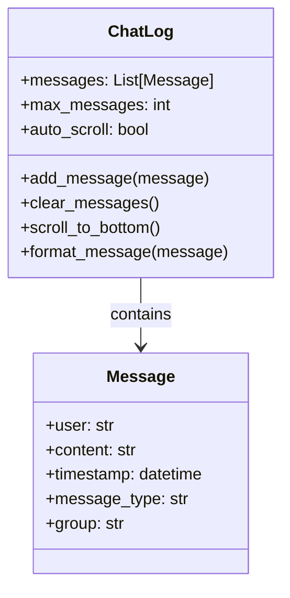
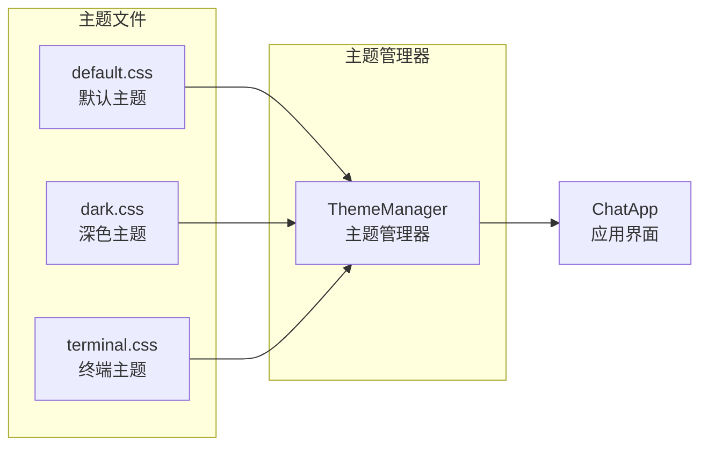
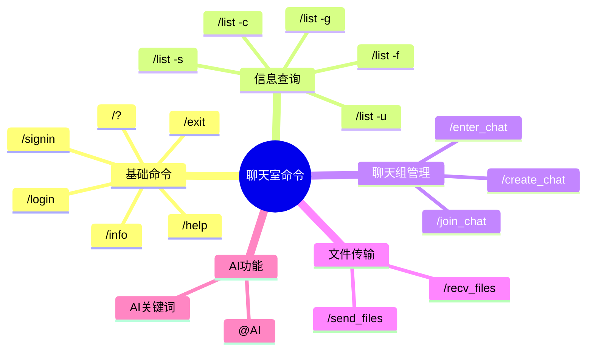
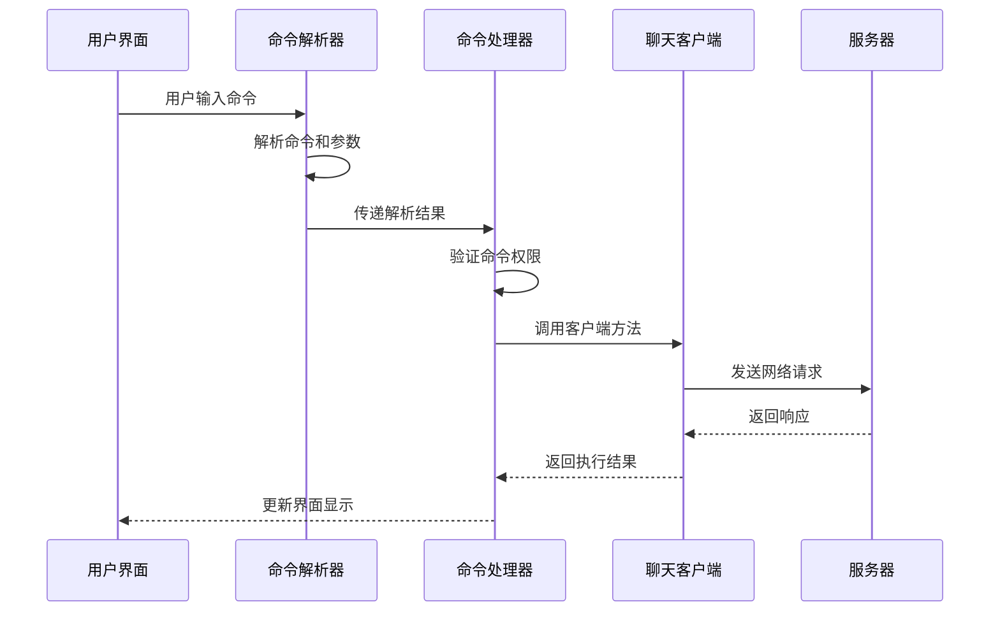
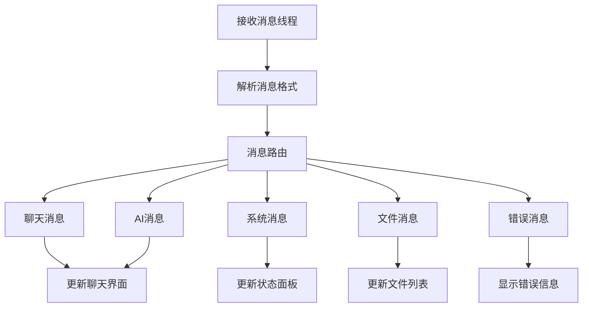

# Chat-Room 客户端文档

## 📋 概述

Chat-Room客户端提供了现代化的TUI界面和简单的命令行界面，支持实时聊天、文件传输、AI对话等功能。客户端采用模块化设计，界面与业务逻辑分离，易于扩展和维护。

## 🏗️ 客户端架构

### 架构组件图



### 客户端启动流程



## 🖥️ TUI界面模块

### 主应用类 (client/ui/app.py)

```python
class ChatApp(App):
    """Chat-Room TUI主应用"""
    
    CSS_PATH = "themes/default.css"
    TITLE = "Chat-Room 聊天室"
    
    def compose(self) -> ComposeResult:
        """构建界面布局"""
        yield Header()
        with Horizontal():
            yield ChatLog(id="chat_log")
            yield StatusPanel(id="status_panel")
        yield InputBox(id="input_box")
        yield Footer()
```

### 界面组件

#### 1. 聊天日志组件 (client/ui/components/chat_log.py)



**主要功能**:
- 显示聊天消息历史
- 自动滚动到最新消息
- 支持消息格式化和高亮
- 支持不同消息类型显示

#### 2. 状态面板组件 (client/ui/components/status_panel.py)

```python
class StatusPanel(Widget):
    """状态面板组件"""
    
    def __init__(self):
        super().__init__()
        self.current_user = None
        self.current_group = None
        self.online_users = []
        self.connection_status = "未连接"
    
    def update_user_info(self, user_info: dict):
        """更新用户信息"""
        
    def update_group_info(self, group_info: dict):
        """更新聊天组信息"""
        
    def update_online_users(self, users: List[dict]):
        """更新在线用户列表"""
```

#### 3. 输入框组件 (client/ui/components/input_box.py)

```python
class InputBox(Widget):
    """输入框组件"""
    
    def __init__(self):
        super().__init__()
        self.command_history = []
        self.history_index = 0
        self.auto_complete = True
    
    def on_key(self, event: events.Key) -> None:
        """处理按键事件"""
        
    def handle_enter(self):
        """处理回车键"""
        
    def handle_tab(self):
        """处理Tab键自动补全"""
```

### 主题系统

#### 主题配置 (client/ui/themes/)



**主题特性**:
- 支持多种预设主题
- 动态切换主题
- 自定义颜色方案
- 响应式布局

## 🔧 命令处理模块

### 命令解析器 (client/commands/parser.py)

```python
class CommandParser:
    """命令解析器"""
    
    def __init__(self):
        self.commands = self._load_commands()
        self.aliases = self._load_aliases()
    
    def parse(self, input_text: str) -> Command:
        """解析用户输入"""
        
    def get_suggestions(self, partial_input: str) -> List[str]:
        """获取命令建议"""
        
    def validate_command(self, command: Command) -> Tuple[bool, str]:
        """验证命令参数"""
```

### 支持的命令



### 命令执行流程



## 🌐 网络通信模块

### 聊天客户端 (client/core/client.py)

```python
class ChatClient:
    """聊天客户端核心类"""
    
    def __init__(self, host: str, port: int):
        self.host = host
        self.port = port
        self.socket = None
        self.connected = False
        self.user_info = None
        self.message_handlers = {}
    
    def connect(self) -> bool:
        """连接到服务器"""
        
    def disconnect(self) -> None:
        """断开服务器连接"""
        
    def send_message(self, message_type: str, data: dict) -> bool:
        """发送消息到服务器"""
        
    def receive_messages(self) -> None:
        """接收服务器消息（后台线程）"""
```

### 消息处理机制



### 协议处理器 (client/core/protocol.py)

```python
class ProtocolHandler:
    """协议处理器"""
    
    def encode_message(self, message_type: str, data: dict) -> bytes:
        """编码消息为网络传输格式"""
        
    def decode_message(self, raw_data: bytes) -> dict:
        """解码网络消息"""
        
    def validate_message(self, message: dict) -> bool:
        """验证消息格式"""
```

## ⚙️ 配置管理

### 客户端配置 (config/client_config.yaml)

```yaml
# 客户端基础配置
client:
  default_host: "localhost"
  default_port: 8888
  auto_connect: false
  reconnect_attempts: 3
  reconnect_delay: 5

# 界面配置
ui:
  mode: "tui"  # tui 或 simple
  theme: "default"  # default, dark, terminal
  auto_scroll: true
  max_chat_history: 1000
  show_timestamps: true
  show_user_status: true

# 文件传输配置
file_transfer:
  download_dir: "client/Downloads"
  auto_create_dirs: true
  confirm_downloads: true
  max_concurrent_downloads: 3

# 快捷键配置
keybindings:
  send_message: "enter"
  new_line: "shift+enter"
  command_history_up: "up"
  command_history_down: "down"
  auto_complete: "tab"
  quit: "ctrl+c"

# 日志配置
logging:
  level: "INFO"
  file: "logs/client/client.log"
  max_size: 5242880  # 5MB
  backup_count: 3
```

### 配置管理器 (client/config/client_config.py)

```python
class ClientConfig:
    """客户端配置管理器"""
    
    def __init__(self, config_path: str = "config/client_config.yaml"):
        self.config_path = config_path
        self.config = self._load_config()
    
    def get(self, key: str, default=None):
        """获取配置值"""
        
    def set(self, key: str, value):
        """设置配置值"""
        
    def save(self):
        """保存配置到文件"""
```

## 🚀 启动和使用

### 启动客户端

```bash
# TUI模式（默认）
python -m client.main

# 简单命令行模式
python -m client.main --mode simple

# 连接到指定服务器
python -m client.main --host 192.168.1.100 --port 9999

# 使用指定配置文件
python -m client.main --config config/my_client.yaml
```

### 命令行参数

- `--host`: 服务器地址（默认: localhost）
- `--port`: 服务器端口（默认: 8888）
- `--mode`: 界面模式（tui/simple，默认: tui）
- `--theme`: 界面主题（default/dark/terminal）
- `--config`: 配置文件路径

### 使用示例

#### 基本聊天流程
```
1. 启动客户端: python -m client.main
2. 注册用户: /signin
3. 登录系统: /login
4. 查看帮助: /?
5. 开始聊天: 直接输入消息
6. 退出系统: /exit
```

#### 文件传输
```
# 发送文件
/send_files document.pdf image.jpg

# 查看文件列表
/recv_files -l

# 下载文件
/recv_files -n document.pdf
```

#### AI对话
```
# 群聊中@AI
@AI 你好，请介绍一下Python

# 使用AI关键词
AI能帮我写个函数吗？

# 私聊AI
/enter_chat private_with_ai
你好，这是私聊消息
```

这个客户端文档提供了完整的客户端架构、界面组件、命令系统和使用指南，帮助用户理解和使用Chat-Room客户端。
