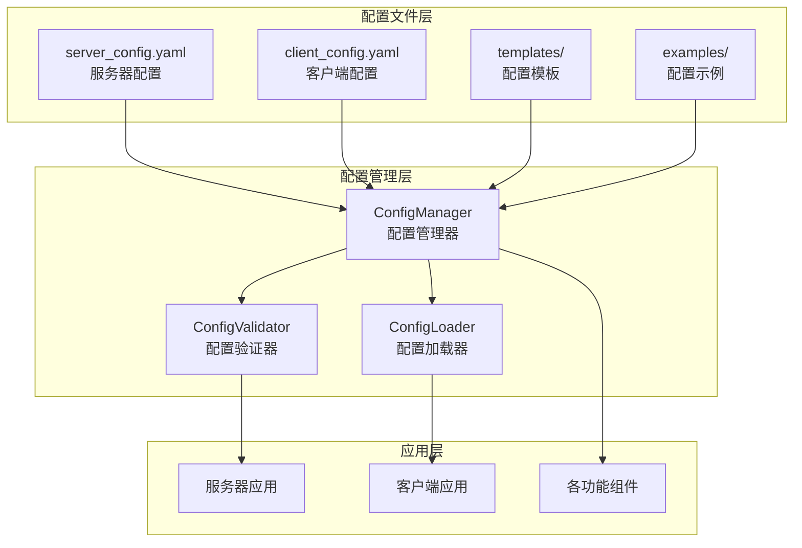
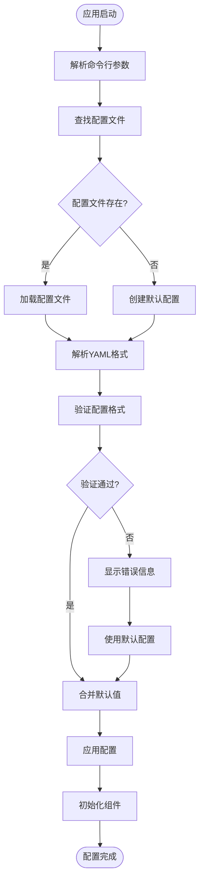

# Chat-Room 配置管理文档

## 📋 概述

Chat-Room采用YAML格式的配置文件系统，提供灵活的参数配置和管理。系统支持服务器端和客户端独立配置，包含网络设置、功能开关、安全参数、性能调优等各个方面的配置选项。

## 🏗️ 配置系统架构

### 配置管理架构图



### 配置加载流程



## ⚙️ 服务器配置

### 完整服务器配置 (config/server_config.yaml)

```yaml
# Chat-Room 服务器配置文件
# 版本: 1.0

# 服务器基础配置
server:
  host: "localhost"
  port: 8888
  max_connections: 100
  timeout: 30
  debug: false
  bind_all_interfaces: false

# 数据库配置
database:
  path: "server/data/chatroom.db"
  backup_enabled: true
  backup_interval: 3600  # 1小时
  backup_retention: 168  # 7天
  max_backup_files: 10
  connection_pool_size: 10
  query_timeout: 30

# 用户管理配置
user_management:
  registration_enabled: true
  min_username_length: 3
  max_username_length: 20
  min_password_length: 6
  max_password_length: 50
  session_timeout: 3600  # 1小时
  max_login_attempts: 5
  lockout_duration: 300  # 5分钟
  password_hash_rounds: 12

# 聊天功能配置
chat:
  max_message_length: 2000
  max_chat_history: 1000
  message_batch_size: 50
  default_group_name: "公频"
  auto_join_default_group: true
  max_groups_per_user: 50
  max_members_per_group: 100

# 文件传输配置
file_transfer:
  enabled: true
  max_file_size: 10485760  # 10MB
  chunk_size: 8192  # 8KB
  upload_dir: "server/data/files/uploads"
  temp_dir: "server/data/files/temp"
  allowed_types:
    - ".txt"
    - ".pdf"
    - ".doc"
    - ".docx"
    - ".jpg"
    - ".jpeg"
    - ".png"
    - ".zip"
  blocked_types:
    - ".exe"
    - ".bat"
    - ".cmd"
  max_files_per_user: 100
  max_files_per_group: 1000
  auto_cleanup: true
  cleanup_interval: 3600

# AI功能配置
ai:
  enabled: false
  api_key: ""
  model: "glm-4-flash"
  base_url: "https://open.bigmodel.cn/api/paas/v4/"
  max_tokens: 1000
  temperature: 0.7
  top_p: 0.9
  context_window: 10
  response_timeout: 30
  max_retries: 3
  triggers:
    at_patterns: ["@AI", "@ai"]
    keywords: ["AI", "ai", "人工智能"]
  private_chat:
    enabled: true
    group_name_pattern: "private_with_ai"
  rate_limit:
    requests_per_minute: 60
    requests_per_hour: 1000

# 安全配置
security:
  enable_rate_limiting: true
  max_requests_per_minute: 100
  max_requests_per_hour: 1000
  enable_ip_whitelist: false
  ip_whitelist: []
  enable_ip_blacklist: true
  ip_blacklist: []
  enable_content_filter: true
  blocked_keywords: []
  max_message_rate: 10  # 每分钟最大消息数

# 性能配置
performance:
  enable_compression: true
  compression_level: 6
  enable_caching: true
  cache_size: 1000
  cache_ttl: 300  # 5分钟
  worker_threads: 4
  max_queue_size: 1000

# 日志配置
logging:
  level: "INFO"
  file: "logs/server/server.log"
  max_size: 10485760  # 10MB
  backup_count: 5
  format: "%(asctime)s - %(name)s - %(levelname)s - %(message)s"
  categories:
    database:
      level: "INFO"
      file: "logs/server/database.log"
    ai:
      level: "INFO"
      file: "logs/server/ai.log"
    performance:
      level: "WARNING"
      file: "logs/server/performance.log"
    security:
      level: "WARNING"
      file: "logs/server/security.log"

# 监控配置
monitoring:
  enabled: true
  metrics_interval: 60  # 1分钟
  health_check_interval: 30  # 30秒
  alert_thresholds:
    cpu_usage: 80
    memory_usage: 80
    disk_usage: 90
    connection_count: 90
  webhook_url: ""

# 备份配置
backup:
  enabled: true
  schedule: "0 2 * * *"  # 每天凌晨2点
  retention_days: 30
  compress: true
  remote_backup:
    enabled: false
    type: "s3"  # s3, ftp, sftp
    config: {}
```

## 💻 客户端配置

### 完整客户端配置 (config/client_config.yaml)

```yaml
# Chat-Room 客户端配置文件
# 版本: 1.0

# 客户端基础配置
client:
  default_host: "localhost"
  default_port: 8888
  auto_connect: false
  reconnect_enabled: true
  reconnect_attempts: 3
  reconnect_delay: 5
  connection_timeout: 10
  heartbeat_interval: 30

# 用户界面配置
ui:
  mode: "tui"  # tui 或 simple
  theme: "default"  # default, dark, terminal
  language: "zh_CN"
  auto_scroll: true
  max_chat_history: 1000
  show_timestamps: true
  show_user_status: true
  show_typing_indicator: true
  animation_enabled: true
  sound_enabled: false

# TUI界面特定配置
tui:
  refresh_rate: 10  # FPS
  mouse_support: true
  focus_follows_mouse: false
  show_borders: true
  show_title: true
  show_footer: true
  layout:
    chat_area_ratio: 0.7
    status_area_ratio: 0.3
    input_area_height: 3

# 主题配置
themes:
  default:
    primary_color: "#0066cc"
    secondary_color: "#666666"
    background_color: "#ffffff"
    text_color: "#000000"
    accent_color: "#ff6600"
  dark:
    primary_color: "#4da6ff"
    secondary_color: "#cccccc"
    background_color: "#1a1a1a"
    text_color: "#ffffff"
    accent_color: "#ff8533"
  terminal:
    primary_color: "#00ff00"
    secondary_color: "#808080"
    background_color: "#000000"
    text_color: "#00ff00"
    accent_color: "#ffff00"

# 文件传输配置
file_transfer:
  download_dir: "client/Downloads"
  auto_create_dirs: true
  overwrite_existing: false
  confirm_downloads: true
  confirm_large_files: true
  large_file_threshold: 5242880  # 5MB
  max_concurrent_downloads: 3
  resume_downloads: true
  show_progress: true
  progress_update_interval: 1

# 快捷键配置
keybindings:
  send_message: "enter"
  new_line: "shift+enter"
  command_history_up: "up"
  command_history_down: "down"
  auto_complete: "tab"
  clear_input: "ctrl+u"
  quit: "ctrl+c"
  scroll_up: "page_up"
  scroll_down: "page_down"
  switch_theme: "f2"
  toggle_status: "f3"

# 通知配置
notifications:
  enabled: true
  sound_enabled: false
  desktop_notifications: true
  mention_notifications: true
  private_message_notifications: true
  file_transfer_notifications: true
  system_notifications: false

# 自动化配置
automation:
  auto_save_chat_history: true
  auto_save_interval: 300  # 5分钟
  auto_backup_settings: true
  auto_update_check: true
  auto_reconnect: true

# 隐私配置
privacy:
  save_chat_history: true
  encrypt_local_data: false
  clear_history_on_exit: false
  anonymous_mode: false
  hide_typing_status: false

# 性能配置
performance:
  message_buffer_size: 1000
  render_optimization: true
  lazy_loading: true
  cache_avatars: true
  compress_images: true
  max_memory_usage: 100  # MB

# 日志配置
logging:
  level: "INFO"
  file: "logs/client/client.log"
  max_size: 5242880  # 5MB
  backup_count: 3
  console_output: false
  debug_mode: false

# 插件配置
plugins:
  enabled: false
  plugin_dir: "client/plugins"
  auto_load: []
  disabled: []

# 实验性功能
experimental:
  enable_beta_features: false
  features: []
```

## 🔧 配置管理器实现

### 配置管理器 (shared/config_manager.py)

```python
class ConfigManager:
    """统一配置管理器"""
    
    def __init__(self, config_path: str, schema_path: str = None):
        self.config_path = config_path
        self.schema_path = schema_path
        self.config = {}
        self.defaults = {}
        self.watchers = []
        self.last_modified = 0
        
        self.load_config()
    
    def load_config(self) -> bool:
        """加载配置文件"""
        try:
            # 检查文件是否存在
            if not os.path.exists(self.config_path):
                self._create_default_config()
            
            # 加载YAML配置
            with open(self.config_path, 'r', encoding='utf-8') as f:
                self.config = yaml.safe_load(f) or {}
            
            # 验证配置
            if self.schema_path:
                self._validate_config()
            
            # 合并默认值
            self._merge_defaults()
            
            # 更新修改时间
            self.last_modified = os.path.getmtime(self.config_path)
            
            return True
            
        except Exception as e:
            logger.error(f"配置加载失败: {e}")
            self._use_defaults()
            return False
    
    def get(self, key: str, default=None):
        """获取配置值（支持点号分隔的嵌套键）"""
        keys = key.split('.')
        value = self.config
        
        try:
            for k in keys:
                value = value[k]
            return value
        except (KeyError, TypeError):
            return default
    
    def set(self, key: str, value):
        """设置配置值"""
        keys = key.split('.')
        config = self.config
        
        # 创建嵌套字典结构
        for k in keys[:-1]:
            if k not in config:
                config[k] = {}
            config = config[k]
        
        # 设置值
        config[keys[-1]] = value
        
        # 通知监听器
        self._notify_watchers(key, value)
    
    def save(self) -> bool:
        """保存配置到文件"""
        try:
            # 创建备份
            if os.path.exists(self.config_path):
                backup_path = f"{self.config_path}.backup"
                shutil.copy2(self.config_path, backup_path)
            
            # 保存配置
            with open(self.config_path, 'w', encoding='utf-8') as f:
                yaml.dump(self.config, f, default_flow_style=False, 
                         allow_unicode=True, indent=2)
            
            return True
            
        except Exception as e:
            logger.error(f"配置保存失败: {e}")
            return False
    
    def watch(self, callback):
        """监听配置变化"""
        self.watchers.append(callback)
    
    def reload_if_changed(self) -> bool:
        """如果文件已修改则重新加载"""
        if not os.path.exists(self.config_path):
            return False
        
        current_modified = os.path.getmtime(self.config_path)
        if current_modified > self.last_modified:
            return self.load_config()
        
        return False
```

### 配置验证器 (shared/config_validator.py)

```python
class ConfigValidator:
    """配置验证器"""
    
    def __init__(self, schema: dict):
        self.schema = schema
    
    def validate(self, config: dict) -> Tuple[bool, List[str]]:
        """验证配置"""
        errors = []
        
        try:
            # 使用jsonschema验证
            from jsonschema import validate, ValidationError
            validate(instance=config, schema=self.schema)
            return True, []
            
        except ValidationError as e:
            errors.append(f"配置验证失败: {e.message}")
            return False, errors
        except Exception as e:
            errors.append(f"配置验证异常: {e}")
            return False, errors
    
    def validate_server_config(self, config: dict) -> Tuple[bool, List[str]]:
        """验证服务器配置"""
        errors = []
        
        # 验证端口范围
        port = config.get('server', {}).get('port', 8888)
        if not (1024 <= port <= 65535):
            errors.append("服务器端口必须在1024-65535范围内")
        
        # 验证文件大小限制
        max_file_size = config.get('file_transfer', {}).get('max_file_size', 0)
        if max_file_size > 100 * 1024 * 1024:  # 100MB
            errors.append("文件大小限制不能超过100MB")
        
        # 验证AI配置
        ai_config = config.get('ai', {})
        if ai_config.get('enabled', False) and not ai_config.get('api_key'):
            errors.append("AI功能已启用但未配置API密钥")
        
        return len(errors) == 0, errors
```

## 🛠️ 配置工具

### 配置生成工具 (tools/config_generator.py)

```python
class ConfigGenerator:
    """配置文件生成工具"""
    
    def generate_server_config(self, output_path: str, **kwargs):
        """生成服务器配置文件"""
        config = {
            'server': {
                'host': kwargs.get('host', 'localhost'),
                'port': kwargs.get('port', 8888),
                'debug': kwargs.get('debug', False)
            },
            'database': {
                'path': kwargs.get('db_path', 'server/data/chatroom.db')
            },
            'ai': {
                'enabled': kwargs.get('ai_enabled', False),
                'api_key': kwargs.get('ai_api_key', '')
            }
        }
        
        self._save_config(config, output_path)
    
    def generate_client_config(self, output_path: str, **kwargs):
        """生成客户端配置文件"""
        config = {
            'client': {
                'default_host': kwargs.get('host', 'localhost'),
                'default_port': kwargs.get('port', 8888)
            },
            'ui': {
                'theme': kwargs.get('theme', 'default'),
                'mode': kwargs.get('mode', 'tui')
            }
        }
        
        self._save_config(config, output_path)
```

### 配置迁移工具 (tools/config_migrator.py)

```python
class ConfigMigrator:
    """配置迁移工具"""
    
    def migrate_from_env(self, output_path: str):
        """从环境变量迁移配置"""
        config = {}
        
        # 服务器配置
        if os.getenv('CHATROOM_HOST'):
            config.setdefault('server', {})['host'] = os.getenv('CHATROOM_HOST')
        
        if os.getenv('CHATROOM_PORT'):
            config.setdefault('server', {})['port'] = int(os.getenv('CHATROOM_PORT'))
        
        # AI配置
        if os.getenv('ZHIPU_AI_API_KEY'):
            config.setdefault('ai', {})['api_key'] = os.getenv('ZHIPU_AI_API_KEY')
            config.setdefault('ai', {})['enabled'] = True
        
        self._save_config(config, output_path)
        print(f"配置已从环境变量迁移到: {output_path}")
```

## 📚 配置使用指南

### 初始化配置

```bash
# 生成默认配置文件
python tools/config_generator.py --server
python tools/config_generator.py --client

# 从环境变量迁移
python tools/config_migrator.py --from-env

# 验证配置文件
python tools/config_validator.py config/server_config.yaml
```

### 常用配置场景

#### 开发环境配置
```yaml
server:
  debug: true
  host: "localhost"
  port: 8888

logging:
  level: "DEBUG"
  console_output: true
```

#### 生产环境配置
```yaml
server:
  debug: false
  host: "0.0.0.0"
  port: 8888
  max_connections: 1000

security:
  enable_rate_limiting: true
  enable_ip_blacklist: true

monitoring:
  enabled: true
  webhook_url: "https://your-monitoring-webhook"
```

#### AI功能配置
```yaml
ai:
  enabled: true
  api_key: "your-zhipu-ai-api-key"
  model: "glm-4-flash"
  max_tokens: 1000
  temperature: 0.7
```

这个配置管理文档提供了完整的配置系统架构、配置文件格式、管理工具和使用指南，帮助开发者理解和管理Chat-Room的配置系统。
