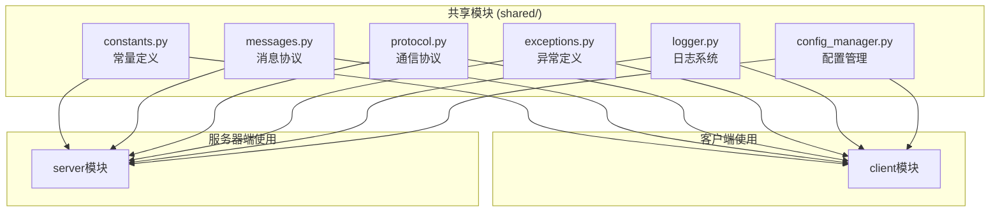
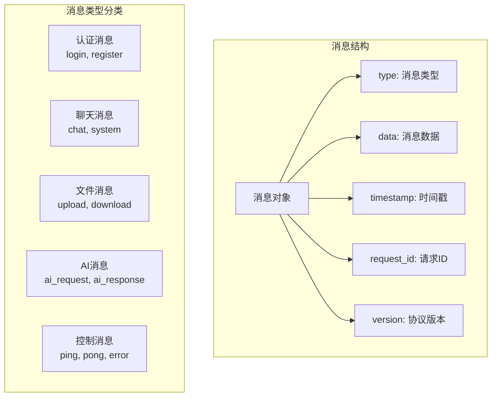
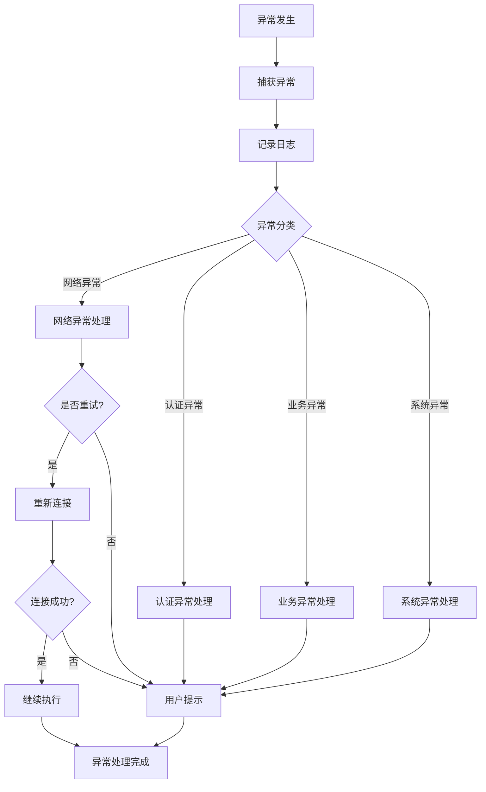
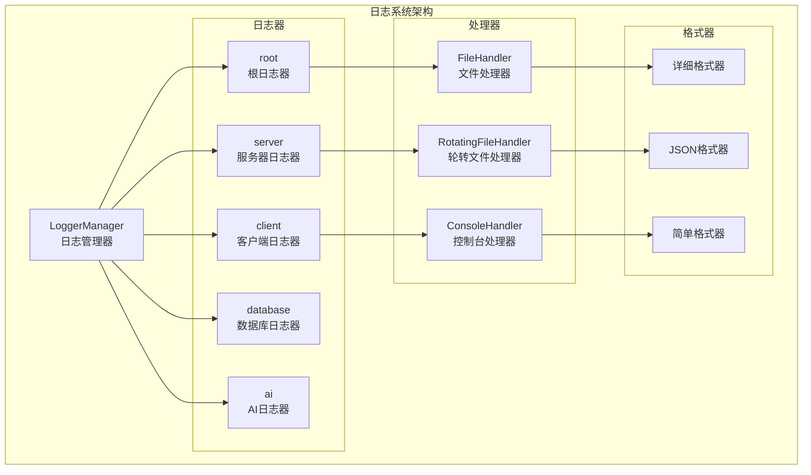
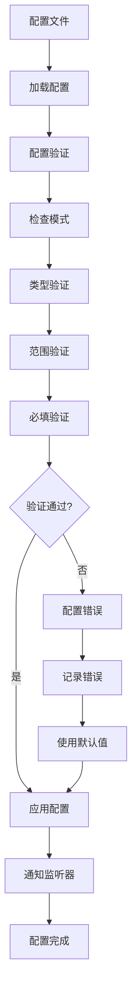

# Chat-Room 共享模块文档

## 📋 概述

共享模块(shared/)包含了客户端和服务器端共同使用的代码，包括通信协议、常量定义、异常处理、日志系统等。这些模块确保了系统的一致性和可维护性。

## 🏗️ 模块架构

### 共享模块组织结构



## 📡 通信协议模块

### 协议定义 (shared/protocol.py)

```python
class MessageProtocol:
    """消息协议处理器"""
    
    VERSION = "1.0"
    ENCODING = "utf-8"
    MAX_MESSAGE_SIZE = 1024 * 1024  # 1MB
    
    @staticmethod
    def encode_message(message_type: str, data: dict, request_id: str = None) -> bytes:
        """编码消息为网络传输格式"""
        
    @staticmethod
    def decode_message(raw_data: bytes) -> dict:
        """解码网络消息"""
        
    @staticmethod
    def validate_message(message: dict) -> bool:
        """验证消息格式"""
```

### 消息格式标准



### 消息类型定义 (shared/messages.py)

```python
class MessageType:
    """消息类型常量"""
    
    # 认证相关
    LOGIN_REQUEST = "login_request"
    LOGIN_RESPONSE = "login_response"
    REGISTER_REQUEST = "register_request"
    REGISTER_RESPONSE = "register_response"
    LOGOUT_REQUEST = "logout_request"
    
    # 聊天相关
    CHAT_MESSAGE = "chat_message"
    SYSTEM_MESSAGE = "system_message"
    USER_JOINED = "user_joined"
    USER_LEFT = "user_left"
    
    # 聊天组相关
    CREATE_GROUP_REQUEST = "create_group_request"
    CREATE_GROUP_RESPONSE = "create_group_response"
    JOIN_GROUP_REQUEST = "join_group_request"
    JOIN_GROUP_RESPONSE = "join_group_response"
    
    # 文件传输相关
    FILE_UPLOAD_REQUEST = "file_upload_request"
    FILE_UPLOAD_RESPONSE = "file_upload_response"
    FILE_DOWNLOAD_REQUEST = "file_download_request"
    FILE_DOWNLOAD_RESPONSE = "file_download_response"
    FILE_LIST_REQUEST = "file_list_request"
    FILE_LIST_RESPONSE = "file_list_response"
    
    # AI相关
    AI_REQUEST = "ai_request"
    AI_RESPONSE = "ai_response"
    
    # 控制相关
    PING = "ping"
    PONG = "pong"
    ERROR = "error"
    HEARTBEAT = "heartbeat"

class Message:
    """消息数据结构"""
    
    def __init__(self, message_type: str, data: dict = None, request_id: str = None):
        self.type = message_type
        self.data = data or {}
        self.timestamp = datetime.now().isoformat()
        self.request_id = request_id or self._generate_id()
        self.version = MessageProtocol.VERSION
    
    def to_dict(self) -> dict:
        """转换为字典格式"""
        
    @classmethod
    def from_dict(cls, data: dict) -> 'Message':
        """从字典创建消息对象"""
        
    def _generate_id(self) -> str:
        """生成唯一请求ID"""
```

## 🔧 常量定义模块

### 系统常量 (shared/constants.py)

```python
# 网络配置常量
DEFAULT_HOST = "localhost"
DEFAULT_PORT = 8888
MAX_CONNECTIONS = 100
SOCKET_TIMEOUT = 30
BUFFER_SIZE = 4096

# 用户相关常量
MIN_USERNAME_LENGTH = 3
MAX_USERNAME_LENGTH = 20
MIN_PASSWORD_LENGTH = 6
MAX_PASSWORD_LENGTH = 50
SESSION_TIMEOUT = 3600  # 1小时

# 聊天组相关常量
MAX_GROUP_NAME_LENGTH = 50
MAX_GROUP_MEMBERS = 100
DEFAULT_GROUP_NAME = "公频"

# 文件传输常量
MAX_FILE_SIZE = 10 * 1024 * 1024  # 10MB
ALLOWED_FILE_TYPES = [
    ".txt", ".pdf", ".doc", ".docx", ".xls", ".xlsx",
    ".jpg", ".jpeg", ".png", ".gif", ".bmp",
    ".zip", ".rar", ".7z", ".tar", ".gz"
]
UPLOAD_CHUNK_SIZE = 8192
DOWNLOAD_TIMEOUT = 60

# AI相关常量
AI_USER_ID = -1
AI_USERNAME = "AI助手"
AI_MAX_CONTEXT_LENGTH = 10
AI_RESPONSE_TIMEOUT = 30

# 消息相关常量
MAX_MESSAGE_LENGTH = 2000
MAX_CHAT_HISTORY = 1000
MESSAGE_BATCH_SIZE = 50

# 状态常量
class UserStatus:
    ONLINE = "online"
    OFFLINE = "offline"
    AWAY = "away"
    BUSY = "busy"

class GroupType:
    PUBLIC = "public"
    PRIVATE = "private"

class MessageStatus:
    SENT = "sent"
    DELIVERED = "delivered"
    READ = "read"
    FAILED = "failed"
```

### 配置路径常量

```python
# 配置文件路径
SERVER_CONFIG_PATH = "config/server_config.yaml"
CLIENT_CONFIG_PATH = "config/client_config.yaml"

# 数据存储路径
DATABASE_PATH = "server/data/chatroom.db"
LOG_DIR = "logs"
UPLOAD_DIR = "server/data/files/uploads"
DOWNLOAD_DIR = "client/Downloads"

# 主题文件路径
THEME_DIR = "client/ui/themes"
DEFAULT_THEME = "default.css"
```

## ❌ 异常处理模块

### 异常类定义 (shared/exceptions.py)

```python
class ChatRoomException(Exception):
    """Chat-Room基础异常类"""
    
    def __init__(self, message: str, error_code: int = None):
        super().__init__(message)
        self.message = message
        self.error_code = error_code
        self.timestamp = datetime.now()

class NetworkException(ChatRoomException):
    """网络相关异常"""
    pass

class AuthenticationException(ChatRoomException):
    """认证相关异常"""
    pass

class UserException(ChatRoomException):
    """用户相关异常"""
    pass

class ChatGroupException(ChatRoomException):
    """聊天组相关异常"""
    pass

class FileTransferException(ChatRoomException):
    """文件传输相关异常"""
    pass

class AIException(ChatRoomException):
    """AI功能相关异常"""
    pass

class DatabaseException(ChatRoomException):
    """数据库相关异常"""
    pass

class ConfigurationException(ChatRoomException):
    """配置相关异常"""
    pass
```

### 异常处理流程



## 📝 日志系统模块

### 日志管理器 (shared/logger.py)

```python
class LoggerManager:
    """日志管理器"""
    
    def __init__(self):
        self.loggers = {}
        self.config = None
    
    def init_logger(self, config: dict, component: str = "default"):
        """初始化日志系统"""
        
    def get_logger(self, name: str) -> logging.Logger:
        """获取指定名称的日志器"""
        
    def setup_file_handler(self, logger: logging.Logger, config: dict):
        """设置文件日志处理器"""
        
    def setup_console_handler(self, logger: logging.Logger, config: dict):
        """设置控制台日志处理器"""
```

### 日志配置结构



### 日志级别和分类

```python
class LogLevel:
    """日志级别常量"""
    DEBUG = "DEBUG"
    INFO = "INFO"
    WARNING = "WARNING"
    ERROR = "ERROR"
    CRITICAL = "CRITICAL"

class LogCategory:
    """日志分类常量"""
    NETWORK = "network"
    DATABASE = "database"
    AUTH = "auth"
    CHAT = "chat"
    FILE = "file"
    AI = "ai"
    PERFORMANCE = "performance"
    SECURITY = "security"
```

## ⚙️ 配置管理模块

### 配置管理器 (shared/config_manager.py)

```python
class ConfigManager:
    """统一配置管理器"""
    
    def __init__(self, config_path: str):
        self.config_path = config_path
        self.config = {}
        self.watchers = []
    
    def load_config(self) -> dict:
        """加载配置文件"""
        
    def get(self, key: str, default=None):
        """获取配置值（支持点号分隔的嵌套键）"""
        
    def set(self, key: str, value):
        """设置配置值"""
        
    def save(self):
        """保存配置到文件"""
        
    def watch(self, callback):
        """监听配置变化"""
        
    def validate_config(self, schema: dict) -> bool:
        """验证配置格式"""
```

### 配置验证模式



## 🔒 安全工具模块

### 数据验证工具

```python
class Validator:
    """数据验证工具类"""
    
    @staticmethod
    def validate_username(username: str) -> Tuple[bool, str]:
        """验证用户名格式"""
        
    @staticmethod
    def validate_password(password: str) -> Tuple[bool, str]:
        """验证密码强度"""
        
    @staticmethod
    def validate_filename(filename: str) -> Tuple[bool, str]:
        """验证文件名安全性"""
        
    @staticmethod
    def sanitize_input(text: str) -> str:
        """清理用户输入"""
        
    @staticmethod
    def validate_file_type(filename: str) -> bool:
        """验证文件类型"""
```

### 加密工具

```python
class CryptoUtils:
    """加密工具类"""
    
    @staticmethod
    def hash_password(password: str) -> str:
        """密码哈希"""
        
    @staticmethod
    def verify_password(password: str, hashed: str) -> bool:
        """验证密码"""
        
    @staticmethod
    def generate_token(length: int = 32) -> str:
        """生成随机令牌"""
        
    @staticmethod
    def encrypt_data(data: str, key: str) -> str:
        """数据加密"""
        
    @staticmethod
    def decrypt_data(encrypted_data: str, key: str) -> str:
        """数据解密"""
```

## 🧪 测试工具模块

### 测试辅助工具

```python
class TestUtils:
    """测试辅助工具"""
    
    @staticmethod
    def create_test_message(message_type: str, data: dict = None) -> Message:
        """创建测试消息"""
        
    @staticmethod
    def create_test_user(username: str = "test_user") -> dict:
        """创建测试用户"""
        
    @staticmethod
    def create_test_group(name: str = "test_group") -> dict:
        """创建测试聊天组"""
        
    @staticmethod
    def mock_socket_connection():
        """模拟Socket连接"""
        
    @staticmethod
    def generate_test_file(size: int = 1024) -> bytes:
        """生成测试文件数据"""
```

这个共享模块文档详细说明了Chat-Room项目中所有共享组件的设计和实现，确保了客户端和服务器端的一致性和可维护性。
