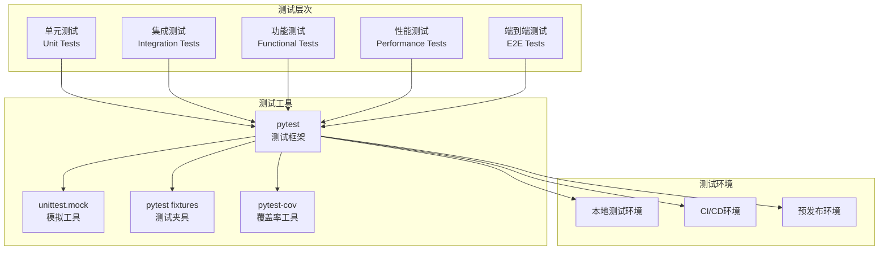
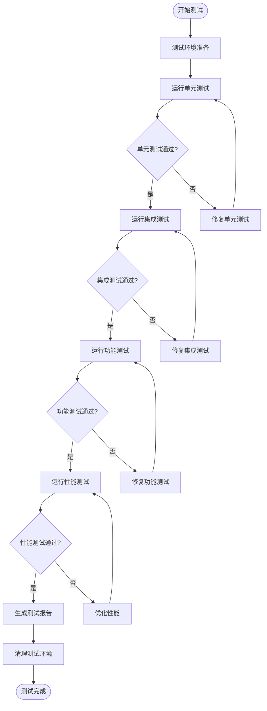

# Chat-Room 测试文档

## 📋 概述

Chat-Room项目采用全面的测试策略，包括单元测试、集成测试、功能测试和性能测试。测试框架基于pytest，提供自动化测试、持续集成和测试覆盖率分析等功能。

## 🏗️ 测试架构

### 测试架构图



### 测试执行流程



## 🧪 单元测试

### 测试目录结构

```
test/
├── unit/                   # 单元测试
│   ├── server/            # 服务器端单元测试
│   │   ├── test_user_manager.py
│   │   ├── test_chat_manager.py
│   │   ├── test_file_handler.py
│   │   └── test_ai_handler.py
│   ├── client/            # 客户端单元测试
│   │   ├── test_chat_client.py
│   │   ├── test_command_parser.py
│   │   └── test_ui_components.py
│   └── shared/            # 共享模块单元测试
│       ├── test_protocol.py
│       ├── test_messages.py
│       └── test_config_manager.py
├── integration/           # 集成测试
│   ├── test_client_server.py
│   ├── test_database_integration.py
│   └── test_ai_integration.py
├── functional/            # 功能测试
│   ├── test_user_registration.py
│   ├── test_chat_functionality.py
│   └── test_file_transfer.py
├── performance/           # 性能测试
│   ├── test_concurrent_users.py
│   ├── test_message_throughput.py
│   └── test_file_transfer_speed.py
├── fixtures/              # 测试夹具
│   ├── database_fixtures.py
│   ├── user_fixtures.py
│   └── message_fixtures.py
└── utils/                 # 测试工具
    ├── test_helpers.py
    ├── mock_server.py
    └── test_data_generator.py
```

### 单元测试示例

#### 用户管理器测试 (test/unit/server/test_user_manager.py)

```python
import pytest
from unittest.mock import Mock, patch
from server.core.user_manager import UserManager
from shared.exceptions import UserException

class TestUserManager:
    """用户管理器单元测试"""
    
    @pytest.fixture
    def user_manager(self):
        """用户管理器测试夹具"""
        with patch('server.database.connection.DatabaseManager'):
            return UserManager()
    
    @pytest.fixture
    def mock_db(self, user_manager):
        """模拟数据库"""
        return user_manager.db
    
    def test_register_user_success(self, user_manager, mock_db):
        """测试用户注册成功"""
        # 准备测试数据
        username = "testuser"
        password = "password123"
        
        # 模拟数据库返回
        mock_db.get_user_by_username.return_value = None
        mock_db.create_user.return_value = True
        
        # 执行测试
        success, message = user_manager.register_user(username, password)
        
        # 验证结果
        assert success is True
        assert "注册成功" in message
        mock_db.create_user.assert_called_once()
    
    def test_register_user_duplicate_username(self, user_manager, mock_db):
        """测试重复用户名注册"""
        # 准备测试数据
        username = "existinguser"
        password = "password123"
        
        # 模拟数据库返回已存在用户
        mock_db.get_user_by_username.return_value = {"id": 1, "username": username}
        
        # 执行测试
        success, message = user_manager.register_user(username, password)
        
        # 验证结果
        assert success is False
        assert "用户名已存在" in message
        mock_db.create_user.assert_not_called()
    
    def test_login_user_success(self, user_manager, mock_db):
        """测试用户登录成功"""
        # 准备测试数据
        username = "testuser"
        password = "password123"
        hashed_password = "$2b$12$hashedpassword"
        
        # 模拟数据库返回
        mock_db.get_user_by_username.return_value = {
            "id": 1,
            "username": username,
            "password_hash": hashed_password
        }
        
        # 模拟密码验证
        with patch('bcrypt.checkpw', return_value=True):
            success, message, user_info = user_manager.login_user(username, password)
        
        # 验证结果
        assert success is True
        assert user_info is not None
        assert user_info["username"] == username
    
    def test_login_user_invalid_password(self, user_manager, mock_db):
        """测试无效密码登录"""
        # 准备测试数据
        username = "testuser"
        password = "wrongpassword"
        hashed_password = "$2b$12$hashedpassword"
        
        # 模拟数据库返回
        mock_db.get_user_by_username.return_value = {
            "id": 1,
            "username": username,
            "password_hash": hashed_password
        }
        
        # 模拟密码验证失败
        with patch('bcrypt.checkpw', return_value=False):
            success, message, user_info = user_manager.login_user(username, password)
        
        # 验证结果
        assert success is False
        assert "密码错误" in message
        assert user_info is None
    
    @pytest.mark.parametrize("username,expected", [
        ("ab", False),  # 太短
        ("validuser", True),  # 有效
        ("a" * 25, False),  # 太长
        ("user@name", False),  # 包含非法字符
    ])
    def test_validate_username(self, user_manager, username, expected):
        """测试用户名验证"""
        is_valid, _ = user_manager._validate_username(username)
        assert is_valid == expected
```

#### 聊天客户端测试 (test/unit/client/test_chat_client.py)

```python
import pytest
from unittest.mock import Mock, patch, MagicMock
from client.core.client import ChatClient
from shared.exceptions import NetworkException

class TestChatClient:
    """聊天客户端单元测试"""
    
    @pytest.fixture
    def chat_client(self):
        """聊天客户端测试夹具"""
        return ChatClient("localhost", 8888)
    
    @pytest.fixture
    def mock_socket(self):
        """模拟Socket"""
        with patch('socket.socket') as mock:
            yield mock.return_value
    
    def test_connect_success(self, chat_client, mock_socket):
        """测试连接成功"""
        # 模拟连接成功
        mock_socket.connect.return_value = None
        
        # 执行测试
        result = chat_client.connect()
        
        # 验证结果
        assert result is True
        assert chat_client.connected is True
        mock_socket.connect.assert_called_once_with(("localhost", 8888))
    
    def test_connect_failure(self, chat_client, mock_socket):
        """测试连接失败"""
        # 模拟连接失败
        mock_socket.connect.side_effect = ConnectionRefusedError("Connection refused")
        
        # 执行测试
        result = chat_client.connect()
        
        # 验证结果
        assert result is False
        assert chat_client.connected is False
    
    def test_send_message_success(self, chat_client, mock_socket):
        """测试发送消息成功"""
        # 准备测试环境
        chat_client.connected = True
        chat_client.socket = mock_socket
        
        # 执行测试
        result = chat_client.send_message("chat_message", {"content": "Hello"})
        
        # 验证结果
        assert result is True
        mock_socket.send.assert_called_once()
    
    def test_send_message_not_connected(self, chat_client):
        """测试未连接时发送消息"""
        # 执行测试
        result = chat_client.send_message("chat_message", {"content": "Hello"})
        
        # 验证结果
        assert result is False
```

## 🔗 集成测试

### 客户端-服务器集成测试 (test/integration/test_client_server.py)

```python
import pytest
import threading
import time
from server.core.server import ChatRoomServer
from client.core.client import ChatClient

class TestClientServerIntegration:
    """客户端-服务器集成测试"""
    
    @pytest.fixture(scope="class")
    def test_server(self):
        """测试服务器夹具"""
        server = ChatRoomServer("localhost", 8889)
        server_thread = threading.Thread(target=server.start)
        server_thread.daemon = True
        server_thread.start()
        
        # 等待服务器启动
        time.sleep(1)
        
        yield server
        
        # 清理
        server.stop()
    
    @pytest.fixture
    def test_client(self, test_server):
        """测试客户端夹具"""
        client = ChatClient("localhost", 8889)
        yield client
        client.disconnect()
    
    def test_client_server_connection(self, test_client):
        """测试客户端服务器连接"""
        # 连接服务器
        success = test_client.connect()
        assert success is True
        
        # 验证连接状态
        assert test_client.connected is True
    
    def test_user_registration_and_login(self, test_client):
        """测试用户注册和登录流程"""
        # 连接服务器
        test_client.connect()
        
        # 注册用户
        success, message = test_client.register_user("testuser", "password123")
        assert success is True
        
        # 登录用户
        success, message = test_client.login("testuser", "password123")
        assert success is True
    
    def test_chat_message_flow(self, test_client):
        """测试聊天消息流程"""
        # 连接并登录
        test_client.connect()
        test_client.register_user("chatuser", "password123")
        test_client.login("chatuser", "password123")
        
        # 发送聊天消息
        success = test_client.send_chat_message("Hello, World!")
        assert success is True
```

## 🎯 功能测试

### 文件传输功能测试 (test/functional/test_file_transfer.py)

```python
import pytest
import os
import tempfile
from test.utils.test_helpers import create_test_file, start_test_server

class TestFileTransferFunctionality:
    """文件传输功能测试"""
    
    @pytest.fixture(scope="class")
    def test_environment(self):
        """测试环境夹具"""
        server = start_test_server()
        yield server
        server.cleanup()
    
    def test_file_upload_download_cycle(self, test_environment):
        """测试完整的文件上传下载周期"""
        # 创建测试文件
        test_file_path = create_test_file("test_document.txt", "Hello, World!")
        
        # 连接并登录
        client = test_environment.create_client()
        client.connect()
        client.register_user("fileuser", "password123")
        client.login("fileuser", "password123")
        
        # 上传文件
        success, message = client.upload_file(test_file_path)
        assert success is True
        
        # 列出文件
        success, message, files = client.list_files()
        assert success is True
        assert len(files) > 0
        
        # 下载文件
        file_id = files[0]['file_id']
        success, message = client.download_file(file_id)
        assert success is True
        
        # 验证下载的文件
        downloaded_path = f"client/Downloads/fileuser/test_document.txt"
        assert os.path.exists(downloaded_path)
        
        with open(downloaded_path, 'r') as f:
            content = f.read()
        assert content == "Hello, World!"
        
        # 清理
        os.remove(test_file_path)
        os.remove(downloaded_path)
```

## ⚡ 性能测试

### 并发用户测试 (test/performance/test_concurrent_users.py)

```python
import pytest
import threading
import time
from concurrent.futures import ThreadPoolExecutor
from test.utils.test_helpers import start_test_server, create_test_client

class TestConcurrentUsers:
    """并发用户性能测试"""
    
    @pytest.fixture(scope="class")
    def performance_server(self):
        """性能测试服务器"""
        server = start_test_server(port=8890)
        yield server
        server.cleanup()
    
    def test_concurrent_connections(self, performance_server):
        """测试并发连接"""
        num_clients = 50
        connection_results = []
        
        def connect_client(client_id):
            """客户端连接函数"""
            client = create_test_client(port=8890)
            success = client.connect()
            connection_results.append(success)
            if success:
                client.disconnect()
            return success
        
        # 并发连接测试
        start_time = time.time()
        with ThreadPoolExecutor(max_workers=num_clients) as executor:
            futures = [executor.submit(connect_client, i) for i in range(num_clients)]
            results = [future.result() for future in futures]
        end_time = time.time()
        
        # 验证结果
        success_count = sum(results)
        success_rate = success_count / num_clients
        connection_time = end_time - start_time
        
        assert success_rate >= 0.95  # 95%成功率
        assert connection_time < 10  # 10秒内完成
        
        print(f"并发连接测试: {success_count}/{num_clients} 成功, 耗时: {connection_time:.2f}秒")
    
    def test_message_throughput(self, performance_server):
        """测试消息吞吐量"""
        num_messages = 1000
        num_clients = 10
        
        def send_messages(client_id):
            """发送消息函数"""
            client = create_test_client(port=8890)
            client.connect()
            client.register_user(f"user{client_id}", "password123")
            client.login(f"user{client_id}", "password123")
            
            messages_sent = 0
            for i in range(num_messages // num_clients):
                success = client.send_chat_message(f"Message {i} from user {client_id}")
                if success:
                    messages_sent += 1
            
            client.disconnect()
            return messages_sent
        
        # 消息吞吐量测试
        start_time = time.time()
        with ThreadPoolExecutor(max_workers=num_clients) as executor:
            futures = [executor.submit(send_messages, i) for i in range(num_clients)]
            results = [future.result() for future in futures]
        end_time = time.time()
        
        # 计算结果
        total_sent = sum(results)
        test_duration = end_time - start_time
        throughput = total_sent / test_duration
        
        assert throughput >= 100  # 每秒至少100条消息
        
        print(f"消息吞吐量测试: {total_sent}条消息, 耗时: {test_duration:.2f}秒, 吞吐量: {throughput:.2f}msg/s")
```

## 🔧 测试工具和夹具

### 测试夹具 (test/fixtures/database_fixtures.py)

```python
import pytest
import tempfile
import os
from server.database.connection import DatabaseManager

@pytest.fixture
def temp_database():
    """临时数据库夹具"""
    # 创建临时数据库文件
    db_fd, db_path = tempfile.mkstemp(suffix='.db')
    os.close(db_fd)
    
    # 初始化数据库
    db_manager = DatabaseManager(db_path)
    db_manager.init_database()
    
    yield db_manager
    
    # 清理
    os.unlink(db_path)

@pytest.fixture
def sample_users():
    """示例用户数据"""
    return [
        {"username": "alice", "password": "password123"},
        {"username": "bob", "password": "password456"},
        {"username": "charlie", "password": "password789"}
    ]

@pytest.fixture
def sample_messages():
    """示例消息数据"""
    return [
        {"content": "Hello, everyone!", "user_id": 1, "group_id": 1},
        {"content": "How are you?", "user_id": 2, "group_id": 1},
        {"content": "I'm fine, thanks!", "user_id": 3, "group_id": 1}
    ]
```

### 测试辅助工具 (test/utils/test_helpers.py)

```python
import tempfile
import os
import threading
import time
from server.core.server import ChatRoomServer
from client.core.client import ChatClient

def create_test_file(filename: str, content: str) -> str:
    """创建测试文件"""
    temp_dir = tempfile.gettempdir()
    file_path = os.path.join(temp_dir, filename)
    
    with open(file_path, 'w', encoding='utf-8') as f:
        f.write(content)
    
    return file_path

def start_test_server(host: str = "localhost", port: int = 8889) -> ChatRoomServer:
    """启动测试服务器"""
    server = ChatRoomServer(host, port)
    server_thread = threading.Thread(target=server.start)
    server_thread.daemon = True
    server_thread.start()
    
    # 等待服务器启动
    time.sleep(1)
    
    return server

def create_test_client(host: str = "localhost", port: int = 8889) -> ChatClient:
    """创建测试客户端"""
    return ChatClient(host, port)

class TestDataGenerator:
    """测试数据生成器"""
    
    @staticmethod
    def generate_users(count: int) -> list:
        """生成测试用户"""
        return [
            {
                "username": f"user{i}",
                "password": f"password{i}",
                "email": f"user{i}@test.com"
            }
            for i in range(count)
        ]
    
    @staticmethod
    def generate_messages(count: int, user_ids: list, group_id: int) -> list:
        """生成测试消息"""
        import random
        return [
            {
                "content": f"Test message {i}",
                "user_id": random.choice(user_ids),
                "group_id": group_id
            }
            for i in range(count)
        ]
```

## 🚀 运行测试

### 测试命令

```bash
# 运行所有测试
pytest

# 运行特定类型的测试
pytest test/unit/                    # 单元测试
pytest test/integration/             # 集成测试
pytest test/functional/              # 功能测试
pytest test/performance/             # 性能测试

# 运行特定模块测试
pytest test/unit/server/test_user_manager.py

# 运行特定测试函数
pytest test/unit/server/test_user_manager.py::TestUserManager::test_register_user_success

# 生成覆盖率报告
pytest --cov=server --cov=client --cov=shared --cov-report=html

# 并行运行测试
pytest -n auto

# 详细输出
pytest -v

# 只运行失败的测试
pytest --lf

# 运行性能测试（需要特殊标记）
pytest -m performance
```

### 持续集成配置 (.github/workflows/test.yml)

```yaml
name: Tests

on: [push, pull_request]

jobs:
  test:
    runs-on: ubuntu-latest
    strategy:
      matrix:
        python-version: [3.8, 3.9, 3.10, 3.11]
    
    steps:
    - uses: actions/checkout@v3
    
    - name: Set up Python ${{ matrix.python-version }}
      uses: actions/setup-python@v3
      with:
        python-version: ${{ matrix.python-version }}
    
    - name: Install dependencies
      run: |
        python -m pip install --upgrade pip
        pip install -r requirements.txt
        pip install pytest pytest-cov pytest-xdist
    
    - name: Run tests
      run: |
        pytest --cov=server --cov=client --cov=shared --cov-report=xml
    
    - name: Upload coverage to Codecov
      uses: codecov/codecov-action@v3
      with:
        file: ./coverage.xml
```

这个测试文档提供了完整的测试策略、测试架构、测试用例和运行指南，帮助开发者理解和执行Chat-Room项目的测试工作。
