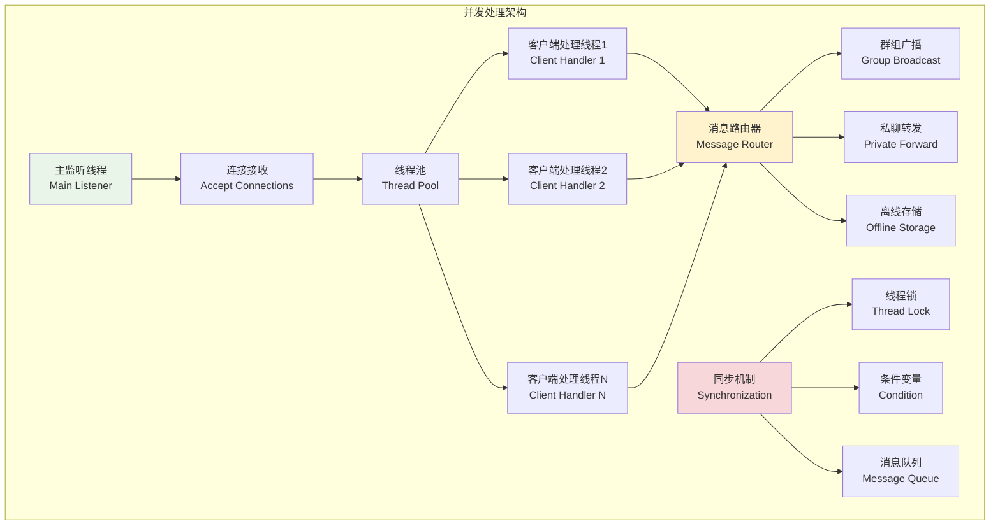
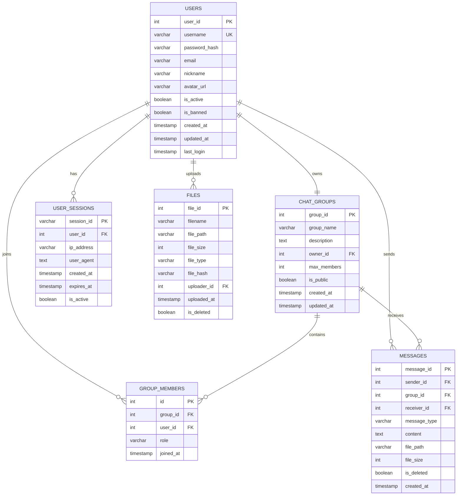
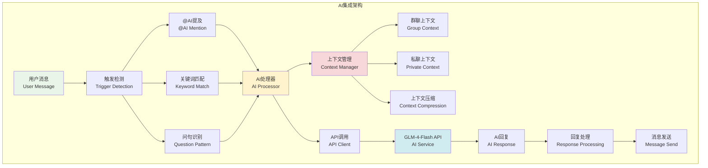
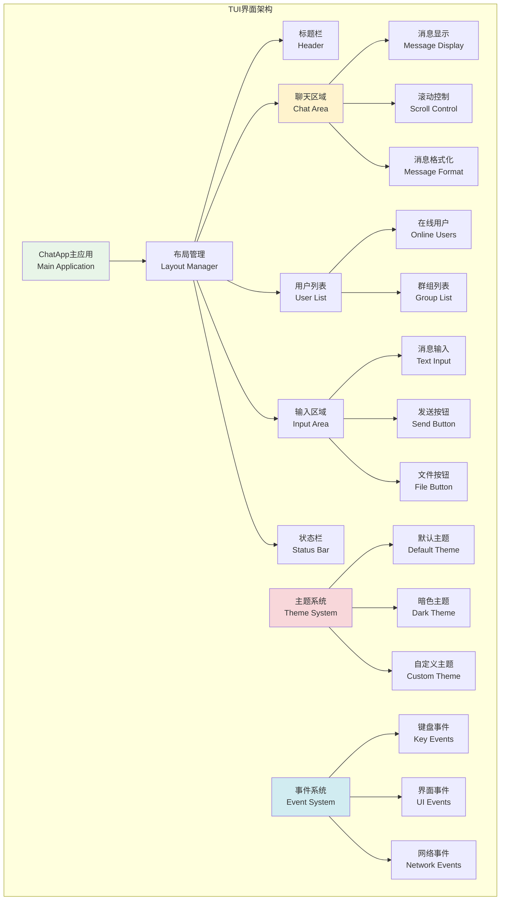
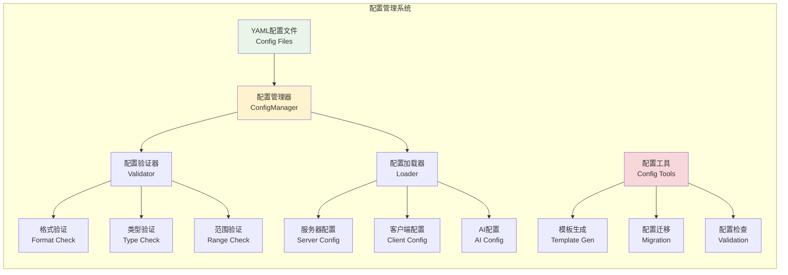

# 第一章 绪论

## 1.1 项目背景摘要

随着互联网技术的快速发展，实时通信技术已成为现代信息社会的重要基础设施。在计算机网络课程的教学实践中，设计并实现一个完整的网络聊天系统能够有效地将理论知识与实际应用相结合，使学生深入理解TCP/IP协议栈、Socket编程以及客户端-服务器架构等核心概念。

本项目Chat-Room聊天室系统基于这一学习需要而设计开发。该系统不仅实现了基础的实时通信功能，还集成了智能AI助手、现代化TUI界面和配置驱动架构等高级特性。通过这一综合性项目的实施，学生能够在实践中掌握网络编程的核心技术，理解并发处理、消息路由、数据持久化等关键概念，并获得完整的网络编程、软件工程开发经验。

## 1.2 项目创新点与技术特色

该项目的创新之处在于将传统网络编程技术与现代软件工程实践深度融合，形成了一套完整的技术解决方案：

**通信协议设计创新**
系统构建了基于JSON的统一消息协议，实现了消息类型标准化、数据序列化优化和完善的错误处理机制，确保了客户端与服务器间的高效可靠通信。

**数据库架构设计**
采用完整的关系模型设计，通过用户表、消息表、群组表等核心实体的关联结构，结合事务管理和参数化查询技术，实现了数据的一致性存储和高效查询。

**智能AI集成技术**
通过智谱GLM-4-Flash API的深度整合，建立了上下文感知的对话管理机制，支持群聊和私聊场景下的智能交互，为传统聊天系统注入了人工智能元素。

**设计模式实践应用**
系统架构中贯穿了多种设计模式的实践：
- **观察者模式**：实现高效的消息广播机制
- **策略模式**：处理不同类型的客户端请求
- **工厂模式**：统一管理数据库连接
- **单例模式**：确保配置管理的一致性

这种理论与实践相结合的技术整合，不仅提升了系统的工程质量和可维护性，也为学生提供了完整的软件开发方法论学习体验，实现了教学目标与技术创新的有机统一。

## 1.3 项目目标与需求分析

本项目旨在设计并实现一个基于TCP/IP协议的多用户网络聊天室系统，该系统具备实时消息通信、用户管理、文件传输等核心功能，并在架构设计上体现良好的扩展性和稳定性。

**核心功能需求：**
- 建立稳定可靠的TCP Socket通信机制，支持多达100个客户端的并发连接
- 实现完整的用户身份认证体系，支持用户注册、登录以及会话管理
- 有效简洁的命令系统，便于用户使用程序的各个功能
- 提供灵活的消息通信机制，支持群组聊天和点对点私人对话
- 建立可靠的数据持久化方案，确保聊天历史的完整保存和高效查询
- 集成基于GLM-4-Flash API的人工智能助手功能，实现自然语言交互
- 支持文件传输功能，实现用户之间的文件共享

**技术架构需求：**
系统采用严格的模块化设计原则，将服务器端、客户端以及共享组件进行清晰分离。服务器端采用多线程并发处理模型，主线程负责监听客户端连接请求，为每个连接的客户端创建独立的处理线程。客户端设计了两种交互模式：简单命令行模式适合快速测试和调试，基于Textual框架的图形化文本界面模式则提供更加直观友好的操作体验。

系统设计统一的消息协议格式，基于JSON数据结构实现消息的序列化和反序列化，确保不同客户端之间能够进行有效的信息交换。同时建立完善的错误处理机制和日志记录系统，能够在出现异常情况时为用户提供清晰反馈信息。

## 1.4 相关技术概述

本项目的技术实现涉及计算机网络通信、并发编程、数据库设计、人工智能集成以及现代化用户界面开发等多个技术领域，体现了当代软件系统的综合性和复杂性。

### 1.4.1 网络通信技术

系统基于TCP/IP协议栈构建网络通信层。在应用层设计了基于JSON格式的消息协议，传输层采用TCP协议确保消息的可靠传输和有序性。核心的Socket编程技术实现如下：

```python
# 服务器端Socket创建和监听
def start_server(self, host: str, port: int):
    self.server_socket = socket.socket(socket.AF_INET, socket.SOCK_STREAM)
    self.server_socket.setsockopt(socket.SOL_SOCKET, socket.SO_REUSEADDR, 1)
    self.server_socket.bind((host, port))
    self.server_socket.listen(5)
```

### 1.4.2 多线程并发处理技术

采用多线程并发处理模型支持多用户同时访问，主线程负责监听客户端连接，每个客户端连接由独立线程处理，确保系统的并发处理能力。系统设计了完整的消息路由机制，实现了群组消息广播、私聊消息转发和离线消息存储等功能。



系统通过线程安全的数据结构和锁机制保证数据一致性，同时实现了优雅的并发控制：

```python
# 多线程客户端处理示例
def handle_client(self, client_socket, client_address):
    """处理单个客户端连接的线程函数"""
    connection_id = f"{client_address[0]}:{client_address[1]}"
    
    try:
        while self.running:
            message_data = self.receive_message(client_socket)
            if not message_data:
                break
            self.process_message(client_socket, message_data)
    finally:
        self.cleanup_client_connection(client_socket, connection_id)
```


### 1.4.3 数据库技术

选择SQLite作为轻量级数据库解决方案，设计了用户表、聊天组表、消息表等核心数据结构。数据库操作采用参数化查询防止SQL注入，通过事务机制保证数据一致性。

```sql
-- 核心数据表结构设计
CREATE TABLE users (
    id INTEGER PRIMARY KEY AUTOINCREMENT,
    username TEXT UNIQUE NOT NULL,
    password_hash TEXT NOT NULL,
    created_at TIMESTAMP DEFAULT CURRENT_TIMESTAMP,
    is_online BOOLEAN DEFAULT 0
);

CREATE TABLE messages (
    id INTEGER PRIMARY KEY AUTOINCREMENT,
    group_id INTEGER,
    sender_id INTEGER,
    content TEXT NOT NULL,
    created_at TIMESTAMP DEFAULT CURRENT_TIMESTAMP,
    FOREIGN KEY (sender_id) REFERENCES users (id)
);
```



### 1.4.4 人工智能集成技术

集成智谱AI的GLM-4-Flash大语言模型API，通过HTTP协议与AI服务交互。系统实现了智能的上下文管理机制，能够维护群聊和私聊的对话历史，提供连贯的对话体验。AI集成采用异步处理模式避免阻塞，支持多种触发方式和智能的消息路由。



系统设计了智能的上下文管理策略，包括上下文长度限制、相关性评分、自动清理等功能：

```python
# AI助手集成实现
class AIManager:
    def __init__(self, api_key: str, model: str = "glm-4-flash"):
        self.api_key = api_key
        self.model = model
        self.context_manager = ContextManager()
    
    async def process_message(self, user_id: int, username: str, 
                            message_content: str, chat_group_id: int = None) -> Optional[str]:
        """处理AI消息请求"""
        try:
            # 获取上下文
            context_id = str(chat_group_id) if chat_group_id else str(user_id)
            context_messages = self.context_manager.get_context(context_id, is_group_chat)
            
            # 调用AI API
            ai_reply = await self.zhipu_client.chat_completion(context_messages)
            
            # 更新上下文
            if ai_reply:
                self.context_manager.add_message(context_id, "assistant", ai_reply)
                return ai_reply
                
        except Exception as e:
            return "抱歉，AI助手暂时无法提供服务。"
```

### 1.4.5 现代化用户界面技术

使用Textual框架构建现代化的文本用户界面，提供丰富的UI组件和响应式布局。系统设计了两种客户端模式：简单命令行模式用于测试调试，TUI模式提供友好的日常使用界面。界面系统支持主题切换、键盘导航、自适应布局等现代化特性。



TUI界面实现示例：

```python
# Textual TUI界面实现示例
class ChatRoomApp(App):
    """Chat-Room TUI主应用"""
    
    def compose(self) -> ComposeResult:
        """构建UI布局"""
        yield Header()
        with Horizontal():
            yield ChatList(id="chat_list")
            with Vertical():
                yield MessageView(id="message_view")
                yield MessageInput(id="message_input")
        yield Footer()
    
    def on_mount(self) -> None:
        """应用启动时的初始化"""
        self.query_one("#message_input").focus()
```

【图表占位符：TUI界面布局设计图】

### 1.4.6 智能配置管理技术

系统设计了基于YAML的配置管理架构，实现了配置与代码的完全分离。配置管理器支持配置验证、热重载、模板导出等高级功能，为不同部署环境提供了灵活的配置方案。



## 1.5 开发环境与工具

### 1.5.1 开发环境配置

**系统要求：**
- 操作系统：Linux、Windows 10/11、macOS（跨平台支持）
- Python版本：3.8或更高版本
- 内存：至少4GB RAM，推荐8GB以上
- 网络：支持TCP/IP网络连接

**核心依赖：**
- SQLite：数据存储（Python内置）
- socket模块：网络通信（Python标准库）
- threading模块：多线程支持（Python标准库）
- logging模块：日志系统（Python标准库）

### 1.5.2 第三方依赖库

```python
# requirements.txt - 主要依赖配置
textual>=0.28.0              # TUI框架
rich>=13.0.0                 # 富文本显示
requests>=2.28.0             # HTTP请求库
zhipuai>=1.0.0               # 智谱AI SDK
pyyaml>=6.0                  # YAML配置文件支持

# 开发工具
pytest>=7.0.0               # 单元测试框架
black>=22.0.0               # 代码格式化
flake8>=4.0.0               # 代码静态检查
```

### 1.5.3 项目构建和部署

**项目目录结构：**
```
Chat-Room/
├── client/          # 客户端模块
├── server/          # 服务器模块  
├── shared/          # 共享组件
├── config/          # 配置文件
├── docs/            # 项目文档
├── test/            # 测试代码
└── main.py          # 统一入口
```

**运行命令：**
```bash
# 安装依赖
pip install -r requirements.txt

# 启动服务器
python main.py server --host localhost --port 8888

# 启动客户端
python main.py client --mode tui  # TUI模式
python main.py client --mode simple  # 简单模式
```

### 1.5.4 开发规范

- **编码规范**：遵循PEP 8 Python编码标准
- **版本控制**：Git + GitHub，采用功能分支开发模式
- **代码质量**：Black格式化 + Flake8静态检查
- **测试框架**：pytest单元测试 + 集成测试

## 1.6 报告结构说明

本报告采用递进式结构，从理论基础到实际实现，从系统设计到功能验证，系统性地展示Chat-Room项目的设计思想和实现过程。

**报告组织安排：**

- **第2章 网络通信基础理论**：深入阐述TCP/IP协议栈、Socket编程原理、客户端-服务器架构等计算机网络核心概念，为系统设计提供理论支撑。

- **第3章 系统设计**：详细介绍系统总体架构、通信协议设计、数据库设计等关键设计决策，体现工程设计思维。

- **第4-5章 核心实现**：分别从服务器端和客户端角度展示核心功能实现，重点结合代码展示网络编程技术的具体应用。

- **第6章 高级功能实现**：介绍文件传输、AI集成、管理员系统等创新功能的设计和实现。

- **第7章 功能展示**：通过实际运行截图和操作演示，验证系统功能的正确性和完整性。

- **第8-9章 总结与展望**：分析项目的技术亮点和创新点，总结开发经验，展望未来发展方向。

通过本章的介绍，我们明确了Chat-Room项目的开发背景、技术选型和实现目标。接下来将深入探讨网络通信的基础理论，为理解整个系统的设计和实现建立理论基础。

【图表占位符：项目开发时间线和里程碑图】
