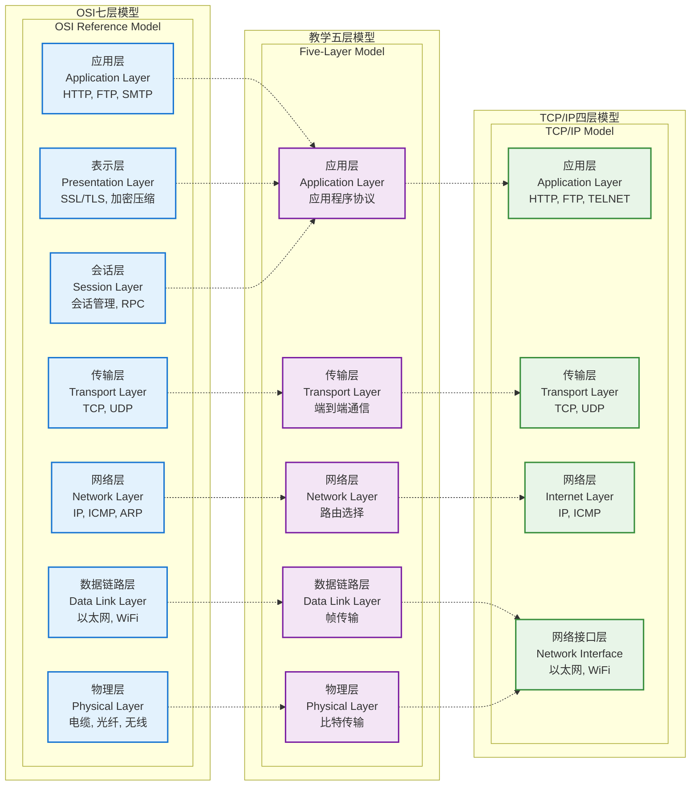

# 第二章 网络通信基础理论

## 2.1 计算机网络基本概念

计算机网络是指将地理位置不同的具有独立功能的多台计算机及其外部设备，通过通信线路连接起来，在网络操作系统、网络管理软件及网络通信协议的管理和协调下，实现资源共享和信息传递的计算机系统。在Chat-Room项目中，网络通信是实现多用户实时聊天的核心技术基础。

### 2.1.1 网络通信模型

现代网络通信主要基于OSI七层模型和TCP/IP四层模型，在计算机网络课程中我们学习的是五层模型，在本项目采用TCP/IP模型，该模型简化了网络通信的复杂性，将网络功能划分为四个层次：



**三种网络模型对比表：**

| 层次 | OSI七层模型 | 教学五层模型 | TCP/IP四层模型 | Chat-Room中的应用 |
|------|-------------|--------------|----------------|-------------------|
| 7 | 应用层 | 应用层 | 应用层 | 聊天协议、JSON消息格式 |
| 6 | 表示层 | ↑ | ↑ | UTF-8编码、数据压缩 |
| 5 | 会话层 | ↑ | ↑ | 用户会话管理 |
| 4 | 传输层 | 传输层 | 传输层 | TCP连接管理 |
| 3 | 网络层 | 网络层 | 网络层 | IP路由 |
| 2 | 数据链路层 | 数据链路层 | 网络接口层 | 以太网帧 |
| 1 | 物理层 | 物理层 | ↑ | 网线、WiFi信号 |

**模型特点对比：**

- **OSI七层模型**：理论完整，层次分明，但过于复杂，实际应用较少
- **教学五层模型**：简化了OSI模型，保留核心概念，便于教学理解
- **TCP/IP四层模型**：实用性强，是互联网的实际标准


**TCP/IP四层模型在Chat-Room中的具体应用：**

- **应用层**：实现Chat-Room的核心业务逻辑，包括消息格式定义、用户界面交互
- **传输层**：使用TCP协议确保聊天消息的可靠传输和正确顺序
- **网络层**：负责数据包在网络中的路由，由操作系统网络栈自动处理
- **网络接口层**：处理底层物理网络的数据传输，支持多种网络介质


### 2.1.2 网络通信基本要素

网络通信的实现需要三个基本要素：通信协议、传输介质和网络设备。在Chat-Room项目中，通信协议采用TCP/IP协议族，传输介质通常为以太网或无线网络，网络设备包括交换机、路由器等。更重要的是，应用层需要定义自己的通信协议来描述消息格式和交互规则。

## 2.2 TCP/IP协议栈分析

TCP/IP协议栈是现代互联网的核心技术基础，为Chat-Room项目的网络通信提供了可靠的理论支撑。深入理解TCP/IP协议栈的工作原理，对于设计高效稳定的网络聊天系统具有重要意义。

### 2.2.1 TCP协议核心特性

TCP（传输控制协议）是一种面向连接的、可靠的传输层协议。选择TCP作为本项目中的传输协议，主要基于以下技术考量：


**TCP协议特性与Chat-Room需求匹配表：**

| TCP核心特性 | 技术实现机制 | Chat-Room应用场景 |
|-------------|--------------|-------------------|
| 面向连接 | 三次握手建立连接<br/>四次挥手关闭连接 | 用户登录建立会话<br/>用户退出清理会话 | 
| 可靠传输 | 序列号、确认应答<br/>超时重传机制 | 聊天消息准确送达<br/>网络异常自动恢复 |
| 有序传输 | TCP报文段排序<br/>缓冲区管理 | 对话消息按时间顺序<br/>群聊消息逻辑连贯 |
| 流量控制 | 滑动窗口机制<br/>接收窗口通告 | 防止消息发送过快<br/>保护客户端处理能力 | 
| 拥塞控制 | 慢启动、拥塞避免<br/>快重传、快恢复 | 适应网络环境变化<br/>提升整体传输效率 |


### 2.2.2 TCP连接管理机制

TCP连接的建立和关闭过程体现了协议设计的精妙之处。三次握手确保了连接的可靠建立，四次挥手保证了连接的优雅关闭。


**TCP连接建立 (三次握手)**

**TCP连接释放 (四次挥手)**


### 2.2.3 IP协议与路由机制

IP协议负责数据包的路由和转发，为TCP提供了网络层的传输服务。在本项目中，虽然不直接操作IP层，但理解IP协议的工作原理有助于优化网络性能和解决连接问题。

## 2.3 Socket编程原理

Socket编程是实现网络通信的核心技术，它为应用程序提供了访问传输层协议的编程接口。在本项目中，Socket编程技术直接决定了系统的网络通信能力和性能表现。

### 2.3.1 Socket通信模型

Socket通信模型基于客户端-服务器架构，通过Socket API实现网络数据的发送和接收。Socket本质上是网络通信的端点，可以将其理解为应用程序与网络协议栈之间的接口。

**Socket使用基本流程：**

Socket编程的基本流程可以分为服务器端和客户端两个方面：

**服务器端流程：**
1. **创建Socket**：使用`socket()`函数创建一个Socket对象，指定地址族（如IPv4）和协议类型（如TCP）
2. **绑定地址**：使用`bind()`函数将Socket绑定到特定的IP地址和端口号上
3. **开始监听**：使用`listen()`函数使Socket进入监听状态，准备接受客户端连接
4. **接受连接**：使用`accept()`函数等待并接受客户端的连接请求，返回新的Socket用于与该客户端通信
5. **数据通信**：使用`recv()`和`send()`函数进行数据的接收和发送
6. **关闭连接**：通信结束后使用`close()`函数关闭Socket连接

**客户端流程：**
1. **创建Socket**：同样使用`socket()`函数创建Socket对象
2. **连接服务器**：使用`connect()`函数主动连接到服务器的指定地址和端口
3. **数据通信**：连接建立后，使用`send()`和`recv()`函数与服务器进行数据交换
4. **关闭连接**：通信完成后使用`close()`函数关闭连接

这个流程体现了Socket编程的核心特点：服务器端被动等待连接，客户端主动发起连接，建立连接后双方可以进行双向数据传输。在Chat-Room项目中，这个基本流程是实现多用户实时通信的技术基础。下面用代码的示例来演示Socket的基本使用

```python
# Socket通信模型基础实现
import socket

def create_tcp_socket():
    """创建TCP Socket的基本流程"""
    # 创建Socket对象
    # AF_INET: IPv4地址族
    # SOCK_STREAM: TCP协议类型
    sock = socket.socket(socket.AF_INET, socket.SOCK_STREAM)
    
    # 设置Socket选项
    sock.setsockopt(socket.SOL_SOCKET, socket.SO_REUSEADDR, 1)
    
    return sock

def server_socket_workflow():
    """服务器端Socket工作流程"""
    server_socket = create_tcp_socket()
    
    # 1. 绑定地址和端口
    server_socket.bind(('localhost', 8888))
    
    # 2. 开始监听连接
    server_socket.listen(5)  # 最大等待连接数
    
    # 3. 接受客户端连接
    client_socket, client_address = server_socket.accept()
    
    # 4. 数据通信
    data = client_socket.recv(1024)
    client_socket.send(b'Hello Client')
    
    # 5. 关闭连接
    client_socket.close()
    server_socket.close()
```


### 2.3.2 Socket API基础

Socket API提供了丰富的函数接口，支持不同层次的网络编程需求。在本项目中，主要使用以下核心API：

**Socket API核心函数列表：**

| API函数 | 功能描述 | Chat-Room中的应用 | 参数说明 |
|---------|----------|-------------------|----------|
| `socket.socket()` | 创建Socket对象 | 建立客户端和服务器通信端点 | `AF_INET`(IPv4), `SOCK_STREAM`(TCP) |
| `socket.bind()` | 绑定地址和端口 | 服务器绑定监听地址 | `(host, port)` 元组 |
| `socket.listen()` | 开始监听连接 | 服务器等待客户端连接 | `backlog` 最大等待连接数 |
| `socket.accept()` | 接受客户端连接 | 为每个用户建立通信连接 | 返回 `(client_socket, address)` |
| `socket.connect()` | 连接到服务器 | 客户端连接聊天服务器 | `(host, port)` 服务器地址 |
| `socket.send()` | 发送数据 | 传输聊天消息 | `bytes` 类型数据 |
| `socket.recv()` | 接收数据 | 接收聊天消息 | `bufsize` 缓冲区大小 |
| `socket.close()` | 关闭连接 | 用户退出时清理连接 | 无参数 |

**Socket配置选项：**

- **`SO_REUSEADDR`**：允许地址重用，避免"地址已被使用"错误
- **`SO_KEEPALIVE`**：启用TCP保活机制，检测失效连接
- **`settimeout()`**：设置Socket操作超时时间，防止无限等待

**数据传输模式：**

- **阻塞模式**：默认模式，API调用会等待操作完成
- **非阻塞模式**：通过`setblocking(False)`设置，适合高并发场景
- **超时控制**：通过`settimeout()`设置，平衡响应性和可靠性


**API使用流程对比：**

| 操作阶段 | 服务器端API调用 | 客户端API调用 |
|----------|----------------|---------------|
| 初始化 | `socket()` → `bind()` → `listen()` | `socket()` |
| 连接建立 | `accept()` (等待连接) | `connect()` (主动连接) |
| 数据传输 | `recv()` / `send()` | `send()` / `recv()` |
| 连接关闭 | `shutdown()` → `close()` | `shutdown()` → `close()` |

## 2.4 客户端-服务器架构设计

客户端-服务器（C/S）架构是Chat-Room项目采用的核心架构模式。这种架构将应用功能合理分配给客户端和服务器，实现了良好的功能分离和负载分担。

### 2.4.1 C/S架构优势分析

C/S架构在聊天应用中具有显著优势，特别适合Chat-Room这类需要集中管理用户状态和消息路由的应用场景。


### 2.4.2 多线程并发处理模型

为了支持多用户同时在线聊天，Chat-Room服务器采用多线程并发处理模型。这种模型能够有效处理多个客户端的并发连接和消息处理需求。


### 2.4.3 连接管理策略

有效的连接管理是确保Chat-Room系统稳定运行的关键。系统需要处理连接建立、维护、异常检测和优雅关闭等各个环节。


通过本章对网络通信基础理论的系统阐述，我们建立了Chat-Room项目网络编程的理论基础。深入理解TCP/IP协议栈、Socket编程原理和C/S架构设计，为后续章节的系统设计和具体实现提供了坚实的理论支撑。在下一章中，我们将基于这些理论基础，详细介绍Chat-Room系统的整体设计方案。
