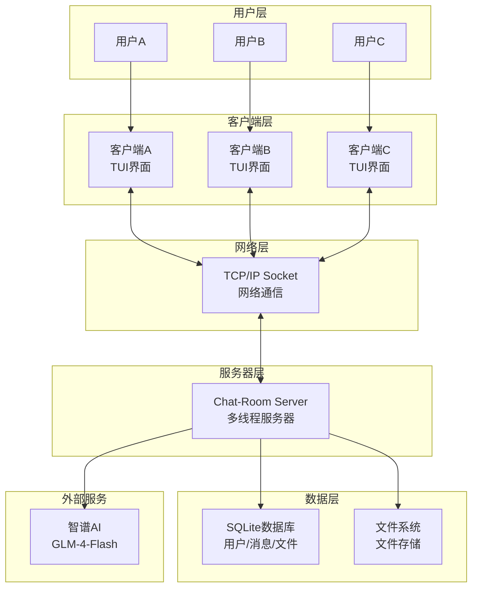
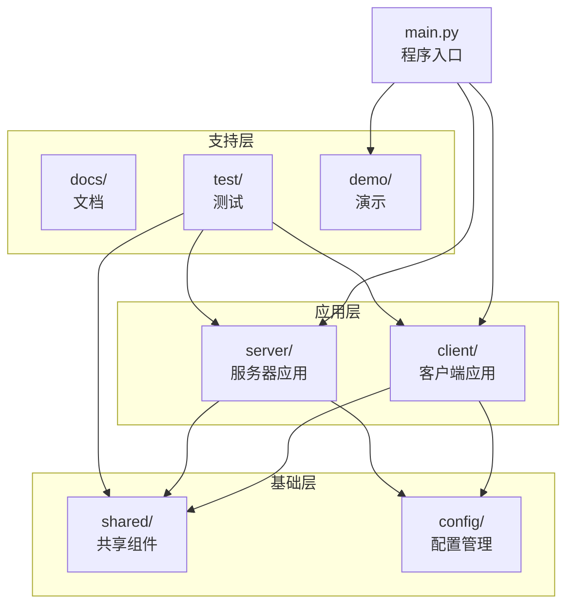
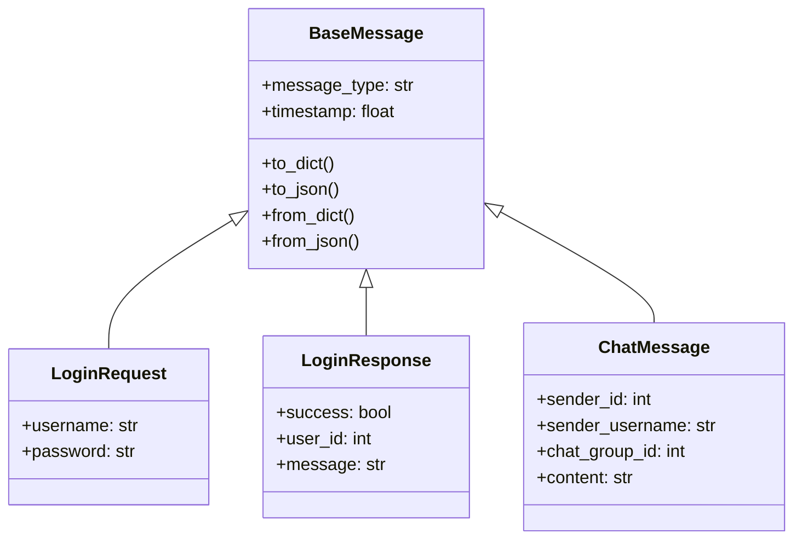
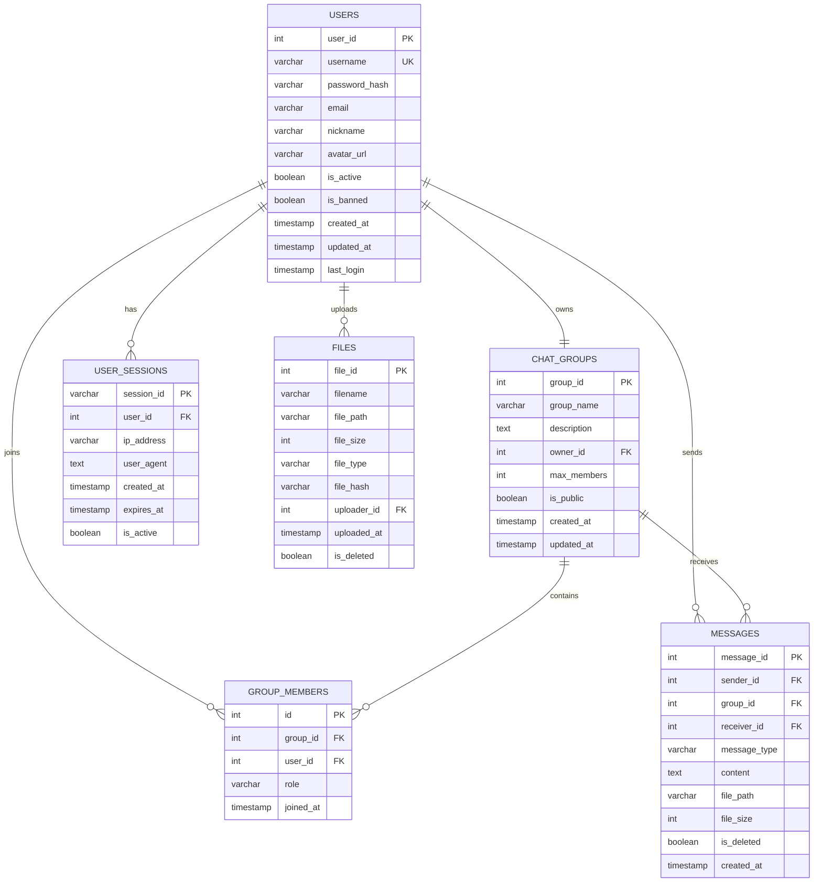
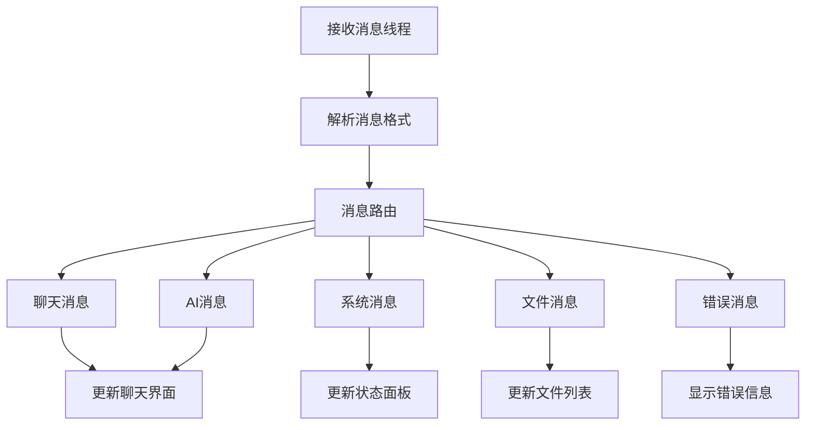

# 第三章 Chat-Room系统设计

## 3.1 系统整体架构设计

### 3.1.1 架构模式选择

Chat-Room系统采用经典的客户端-服务器（C/S）架构模式，这一选择基于实际需求和技术考量。

**设计动机分析**：

聊天室应用的核心特征是多用户实时交互，需要一个中心化的协调者来维护全局状态。如果采用P2P架构，状态同步机制复杂，容易产生一致性问题。中心化的服务器能够作为权威节点，统一维护用户状态、消息历史和群组信息。

现代聊天应用集成了消息持久化、文件传输、AI助手等高级功能，服务器端的集中实现保证了功能的统一性和可靠性。即时通讯系统面临多重安全挑战，中心化架构将安全策略集中处理，提供了统一的安全审计和监控能力。

**C/S架构的技术优势**：

业务逻辑集中化避免了逻辑分散导致的维护困难，修改服务器端code即可让所有客户端受益。服务器端集中处理为性能优化提供更大空间，可以实施负载均衡、查询优化、智能缓存等策略。集中式服务器作为单一真相源能够从根本上消除数据不一致问题。

```python
# 项目架构体现在目录结构中：
Chat-Room/
├── client/          # 客户端模块 - 用户交互层
├── server/          # 服务器模块 - 业务逻辑层
├── shared/          # 共享模块 - 通用组件层
└── config/          # 配置文件 - 配置管理层
```

系统采用分层架构设计，各层职责清晰：

- **用户层**：提供图形化界面和命令行界面
- **客户端层**：处理用户交互，管理客户端状态
- **网络层**：基于TCP/IP协议的Socket通信
- **服务器层**：业务逻辑处理，多线程并发管理
- **数据层**：SQLite数据库存储和文件系统管理



### 3.1.2 模块化设计原则与系统解耦

项目严格遵循模块化设计原则，将复杂系统分解为功能明确、职责单一的独立模块。

**模块化设计的价值**：

通过明确的模块边界和职责划分，将复杂的即时通讯系统分解为多个相对简单、可独立维护的模块。每个模块遵循高内聚、低耦合原则，模块内部组件围绕共同目标协作，模块间依赖关系简单明确。

`shared`模块作为公共基础设施，为`client`和`server`模块提供通用的消息协议、配置管理和工具函数。依赖注入模式通过将`DatabaseManager`注入到各个业务管理器中，实现了数据访问层与业务逻辑层的完全分离。



```python
# shared/messages.py - 消息协议模块的核心设计
@dataclass
class BaseMessage:
    """基础消息类 - 提供统一的消息接口和行为"""
    message_type: str
    timestamp: float = None
    
    def __post_init__(self):
        """消息创建后的初始化处理"""
        if self.timestamp is None:
            self.timestamp = time.time()
    
    def to_dict(self) -> Dict[str, Any]:
        """序列化为字典格式，支持JSON传输"""
        return asdict(self)
    
    def to_json(self) -> str:
        """序列化为JSON字符串，用于网络传输"""
        return json.dumps(self.to_dict(), ensure_ascii=False)
    
    @classmethod
    def from_dict(cls, data: Dict[str, Any]):
        """从字典数据反序列化，支持协议解析"""
        return cls(**data)
```

这个基类通过继承机制提供统一的接口，通过多态性支持不同消息类型的个性化处理。`__post_init__`方法确保每条消息都有准确的时间戳，序列化和反序列化方法的统一实现保证了网络传输时的格式一致性。


## 3.2 通信协议设计

### 3.2.1 JSON消息协议设计原理

系统采用JSON格式作为消息协议，这一选择体现了对开发效率和维护便利性的重视。

**协议选择的设计动机**：

JSON格式具有人机可读性，极大简化了开发调试过程；跨语言特性为系统扩展提供了强大的基础；自描述特性使得协议具有良好的向前兼容性。虽然JSON相比二进制协议在传输效率上存在劣势，但在聊天应用场景下，JSON带来的开发效率提升和维护便利性远超传输开销。

TCP作为流式协议，数据包边界不明确，容易出现粘包和拆包问题。系统通过在每条消息前添加4字节长度前缀的方式解决了这一问题，确保接收方能够准确解析消息边界。

```python
# shared/messages.py - 消息传输格式
class MessageProtocol:
    @classmethod
    def pack_message(cls, message: BaseMessage) -> bytes:
        """打包消息（添加长度前缀）"""
        json_str = message.to_json()
        data = json_str.encode('utf-8')
        length = len(data)
        # 4字节长度前缀 + JSON数据
        return length.to_bytes(4, byteorder='big') + data
```

【图表占位符：JSON消息协议结构图】

### 3.2.2 消息类型体系化设计

系统构建了完整的消息类型分类体系，遵循功能导向原则进行系统性分类。

**消息分类的设计理念**：

认证类消息处理用户身份验证和会话管理；通信类消息涵盖群聊和私聊场景的消息传递；文件类消息专门处理文件传输相关操作；AI类消息支持智能助手交互；系统类消息负责连接维护和异常处理。这种分类方式实现了职责分离和功能内聚，每种消息类型都有明确的业务职责。

系统采用基类BaseMessage定义通用属性和接口，各具体消息类型继承并扩展其功能。这种设计提供了统一的消息处理接口，简化了消息路由和分发逻辑，同时为消息验证、序列化、持久化等功能提供了统一的处理方式。

```python
# shared/messages.py - 消息类型定义
class MessageType(Enum):
    # 认证相关消息
    LOGIN_REQUEST = "login_request"
    LOGIN_RESPONSE = "login_response"
    
    # 聊天通信消息
    CHAT_MESSAGE = "chat_message"
    PRIVATE_MESSAGE = "private_message"
    
    # 文件传输消息
    FILE_UPLOAD = "file_upload"
    FILE_DOWNLOAD = "file_download"
    
    # AI交互消息
    AI_REQUEST = "ai_request"
    AI_RESPONSE = "ai_response"

    ...
```



### 3.2.3 协议扩展性与向前兼容设计

协议的扩展性设计关系到系统的可维护性和未来发展空间。

每条消息包含版本号字段，客户端和服务器在建立连接时协商使用的协议版本。新版本协议通过添加可选字段的方式实现功能扩展，确保向前兼容性。JSON格式的动态特性为协议扩展提供了天然优势，新增字段采用可选设计原则，旧版本客户端会忽略不认识的字段。

协议设计充分考虑了异常情况的处理，当遇到无法识别的消息类型或格式错误时，系统会返回标准化的错误消息，客户端可以根据错误信息进行相应的处理，确保了系统的鲁棒性。

**继承体系的设计优势**：
通过BaseMessage基类统一消息结构，各具体消息类型继承并扩展特定字段，这种设计实现了代码复用、类型安全和协议一致性的多重目标。

```python
# shared/constants.py - 消息类型常量
class MessageType:
    LOGIN_REQUEST = "login_request"
    LOGIN_RESPONSE = "login_response"
    CHAT_MESSAGE = "chat_message"
    FILE_UPLOAD_REQUEST = "file_upload_request"
    AI_TRIGGER = "ai_trigger"
    SYSTEM_MESSAGE = "system_message"
```

具体消息类型实现体现了面向对象的继承特性：

```python
@dataclass
class LoginRequest(BaseMessage):
    """登录请求消息"""
    message_type: str = MessageType.LOGIN_REQUEST
    username: str = ""
    password: str = ""

@dataclass
class ChatMessage(BaseMessage):
    """聊天消息"""
    message_type: str = MessageType.CHAT_MESSAGE
    content: str = ""
    sender_id: Optional[int] = None
    group_id: Optional[int] = None
```

**表3-1 主要消息类型及其用途**

| 消息类型 | 功能描述 | 发送方向 | 关键字段 |
|---------|---------|---------|---------|
| LOGIN_REQUEST | 用户登录请求 | C→S | username, password |
| CHAT_MESSAGE | 聊天消息传输 | C↔S | content, group_id |
| FILE_UPLOAD_REQUEST | 文件上传请求 | C→S | filename, file_size |
| AI_TRIGGER | AI助手触发 | C→S | trigger_text |

### 3.2.3 协议扩展性与向前兼容设计

协议的扩展性设计是长期可维护软件系统的关键特征，Chat-Room协议在这方面体现了前瞻性考虑：

**版本管理策略**：
- **向后兼容原则**：新版本协议必须能够处理旧版本客户端的消息，通过可选字段和默认值实现平滑升级
- **渐进式演化**：支持协议功能的逐步增强，避免大规模重构导致的系统中断
- **版本协商机制**：客户端和服务器可以协商使用的协议版本，确保功能匹配

**扩展机制设计**：
- **字段扩展**：使用可选字段支持新功能添加，老版本客户端忽略未知字段
- **类型扩展**：消息类型枚举支持动态添加，通过类型注册机制实现插件化功能
- **错误处理标准化**：统一的错误消息格式便于调试、监控和用户反馈

## 3.3 数据库设计

### 3.3.1 数据库选型与实体关系设计

**SQLite选型的设计动机**：

SQLite作为嵌入式数据库的选择基于多重考量。从部署复杂度角度，SQLite无需独立的数据库服务器进程，极大简化了系统的安装和维护工作。SQLite完整支持ACID事务特性，能够确保并发操作下的数据一致性。其单文件数据库设计使得备份、迁移和版本控制变得简便，Python对SQLite的原生支持消除了额外的驱动程序依赖。

**实体关系设计**：

数据库设计遵循第三范式（3NF）规范化原则，平衡了数据一致性和查询效率。用户实体作为系统核心，与其他业务实体建立明确的关联关系。群组实体支持多群组聊天需求，消息实体通过外键关联，能够追溯到发送者和所属群组，为消息历史查询和系统审计提供完整的数据支撑。



### 3.3.2 表结构设计与规范化考虑

数据库表结构设计体现了关系型数据库设计的最佳实践。

#### 用户表（users）设计

```sql
CREATE TABLE IF NOT EXISTS users (
    id INTEGER PRIMARY KEY AUTOINCREMENT,
    username TEXT UNIQUE NOT NULL,
    password_hash TEXT NOT NULL,
    is_online INTEGER DEFAULT 0,
    is_banned INTEGER DEFAULT 0,
    created_at TIMESTAMP DEFAULT CURRENT_TIMESTAMP
);
```

用户表设计体现了多个重要的设计原则。主键采用自增整数策略，具有更好的存储效率和索引性能。用户名字段的UNIQUE约束确保了业务唯一性，并自动创建了隐式索引。密码字段采用哈希存储策略，体现了信息安全的基本要求。

#### 消息表（messages）设计

```sql
CREATE TABLE IF NOT EXISTS messages (
    id INTEGER PRIMARY KEY AUTOINCREMENT,
    group_id INTEGER,
    sender_id INTEGER,
    content TEXT,
    message_type TEXT DEFAULT 'text',
    timestamp TIMESTAMP DEFAULT CURRENT_TIMESTAMP,
    FOREIGN KEY (group_id) REFERENCES chat_groups(id),
    FOREIGN KEY (sender_id) REFERENCES users(id)
);
```

消息表设计体现了对聊天应用核心需求的理解。外键约束确保了数据引用的完整性，消息类型字段支持多种消息类型的扩展，时间戳字段作为消息排序的关键依据。

### 3.3.3 数据持久化策略

#### 聊天组表（chat_groups）业务建模
聊天组表的设计体现了对群组聊天场景的深入理解：

```sql
CREATE TABLE IF NOT EXISTS chat_groups (
    id INTEGER PRIMARY KEY AUTOINCREMENT,
    name TEXT UNIQUE NOT NULL,
    is_private_chat INTEGER DEFAULT 0,
    is_banned INTEGER DEFAULT 0,
    created_at TIMESTAMP DEFAULT CURRENT_TIMESTAMP
);
```

**业务逻辑考虑**：
- **群组类型区分**：is_private_chat字段区分群组聊天和私聊，支持不同的业务逻辑处理
- **管理功能支持**：is_banned字段允许管理员禁用特定群组，实现内容管理
- **可扩展性设计**：表结构为未来添加群组描述、创建者、成员限制等功能预留了空间

#### 消息表（messages）核心设计
消息表是聊天系统的核心数据存储，其设计直接影响系统的性能和功能：

```sql
CREATE TABLE IF NOT EXISTS messages (
    id INTEGER PRIMARY KEY AUTOINCREMENT,
    group_id INTEGER,
    sender_id INTEGER,
    content TEXT,
    message_type TEXT DEFAULT 'text',
    timestamp TIMESTAMP DEFAULT CURRENT_TIMESTAMP,
    FOREIGN KEY (group_id) REFERENCES chat_groups(id),
    FOREIGN KEY (sender_id) REFERENCES users(id)
);
```

**关键设计决策**：
- **外键关联**：通过外键确保数据引用完整性，每条消息都能准确追溯到发送者和群组
- **消息类型扩展**：message_type字段支持文本、图片、文件、系统消息等多种类型，为功能扩展提供基础
- **时间序列设计**：timestamp字段不仅记录发送时间，还作为消息排序的关键字段，确保消息顺序的正确性
- **内容存储策略**：content字段采用TEXT类型，支持长消息存储，同时考虑了emoji和多语言字符支持

#### 文件元数据表（files_metadata）存储策略
文件传输功能的数据设计体现了对大文件处理和存储管理的深入考虑：

```sql
CREATE TABLE IF NOT EXISTS files_metadata (
    id INTEGER PRIMARY KEY AUTOINCREMENT,
    original_filename TEXT NOT NULL,
    server_filepath TEXT NOT NULL UNIQUE,
    file_size INTEGER NOT NULL,
    uploader_id INTEGER,
    chat_group_id INTEGER,
    upload_timestamp TIMESTAMP DEFAULT CURRENT_TIMESTAMP,
    FOREIGN KEY (uploader_id) REFERENCES users(id),
    FOREIGN KEY (chat_group_id) REFERENCES chat_groups(id)
);
```

**存储策略设计**：
- **文件名分离策略**：original_filename保存用户原始文件名，server_filepath存储服务器实际路径，避免文件名冲突和安全风险
- **完整性校验**：file_size字段支持文件传输完整性验证，确保文件数据正确性
- **权限控制基础**：通过uploader_id和chat_group_id关联，支持文件访问权限控制
- **存储优化考虑**：server_filepath的UNIQUE约束防止重复存储相同文件，节约存储空间


## 3.4 服务端多线程架构设计

### 3.4.1 并发模型选择与设计理念

服务端采用多线程并发模型，这一选择基于聊天应用的特定需求和技术分析。

**并发模型的技术优势**：

聊天应用主要处理网络通信和数据库操作，CPU计算量相对较小，多线程能够有效利用I/O等待时间实现并行处理。每个用户连接具有相对独立的状态和处理逻辑，线程间的数据共享需求较少，降低了同步复杂性。即时通讯对消息传输延迟敏感，多线程模型能够为每个连接提供专用的处理资源。相比异步编程模型，多线程的开发和调试相对简单。

多线程模型还提供了天然的故障隔离特性，当某个用户连接出现异常时，对应的处理线程可以独立处理异常情况，而不会影响其他用户连接的正常工作。

### 3.4.2 多线程处理机制与连接管理

每个客户端连接独享一个处理线程，实现真正的并发处理。系统通过clients字典维护所有活跃连接的状态信息，支持广播消息和用户管理功能。完整的异常处理结构确保异常情况下的资源清理，从连接建立到关闭的生命周期管理防止了资源泄漏。


### 3.4.3 多线程处理机制与连接管理

每个客户端连接独享一个处理线程，实现真正的并发处理：

```python
def handle_client(self, client_socket: socket.socket, client_address: tuple):
    """处理单个客户端连接"""
    client_id = f"{client_address[0]}:{client_address[1]}"
    self.clients[client_id] = {
        'socket': client_socket,
        'address': client_address,
        'user_id': None,
        'username': None
    }
    
    try:
        while self.running:
            # 接收并处理客户端消息
            message = self._receive_message(client_socket)
            if message:
                self._process_message(client_id, message)
    except Exception as e:
        self.logger.error(f"客户端处理异常: {e}")
    finally:
        self._cleanup_client(client_id)
```

**线程管理策略分析**：
- **连接状态跟踪**：clients字典维护所有活跃连接的状态信息，支持广播消息和用户管理
- **异常处理机制**：完整的try-except-finally结构确保异常情况下的资源清理
- **生命周期管理**：从连接建立到关闭的完整生命周期管理，防止资源泄漏
- **优雅关闭支持**：通过self.running标志支持服务器的优雅关闭

**表3-2 服务器组件及其职责**

| 组件名称 | 主要职责 | 关键方法 |
|---------|---------|---------|
| UserManager | 用户认证与管理 | login_user(), register_user() |
| ChatManager | 聊天消息处理 | send_message(), get_chat_history() |
| FileHandler | 文件传输管理 | upload_file(), download_file() |
| AIManager | AI助手集成 | process_ai_request() |

## 3.5 客户端架构设计

### 3.5.1 分层架构与关注点分离

客户端采用分层架构设计，实现了界面逻辑与网络通信的有效分离：

**分层设计的核心理念**：
1. **表示层（UI层）**：负责用户界面显示和交互，支持GUI和CLI两种模式
2. **业务逻辑层**：处理客户端业务逻辑，如消息格式化、文件传输管理等
3. **网络通信层**：管理与服务器的Socket连接，处理消息的发送和接收
4. **数据管理层**：本地数据缓存和配置管理

**架构优势分析**：
- **界面无关性**：核心业务逻辑与具体UI实现解耦，支持多种界面模式
- **网络透明性**：上层组件无需关心网络协议细节，简化了开发复杂度
- **可测试性**：各层独立，便于单元测试和集成测试
- **可扩展性**：新功能可以在不影响其他层的情况下添加

```python
# client/core/client.py - 客户端核心架构
class ChatClient:
    def __init__(self, host: str, port: int):
        self.host = host
        self.port = port
        self.socket = None
        self.connected = False
        self.running = False
        
        # 消息处理回调
        self.message_callbacks = {}
        
        # 启动接收线程
        self.receive_thread = None
```

### 3.5.2 事件驱动机制与异步处理

客户端采用事件驱动模型处理网络消息，这一设计体现了现代GUI应用的最佳实践：

**事件驱动设计的必要性**：

在即时通讯应用中，客户端需要同时处理用户输入和服务器消息，传统的同步处理模式会导致界面阻塞。事件驱动模型通过回调机制实现了真正的异步处理，确保用户界面的响应性。这种设计的优势在于消息处理逻辑与消息接收逻辑分离，提高了代码的可维护性；新的消息类型可以通过注册回调函数轻松添加，无需修改核心接收逻辑；单个回调函数的异常不会影响其他消息的处理，实现了良好的错误隔离；多个回调可以并行执行，提高消息处理效率。

```python
def register_callback(self, message_type: str, callback):
    """注册消息处理回调函数"""
    if message_type not in self.message_callbacks:
        self.message_callbacks[message_type] = []
    self.message_callbacks[message_type].append(callback)

def _handle_message(self, message_data: dict):
    """处理接收到的消息"""
    message_type = message_data.get('message_type')
    if message_type in self.message_callbacks:
        for callback in self.message_callbacks[message_type]:
            try:
                callback(message_data)
            except Exception as e:
                self.logger.error(f"回调处理异常: {e}")
```



## 3.6 错误处理与容错设计

### 3.6.1 分层异常处理策略

系统采用分层异常处理策略，建立了从底层网络错误到上层业务逻辑错误的完整处理体系：

**异常分类的设计思路**：
1. **按错误来源分类**：网络通信错误、数据库操作错误、业务逻辑错误等
2. **按处理策略分类**：可恢复错误、不可恢复错误、需要用户干预的错误
3. **按影响范围分类**：系统级错误、会话级错误、操作级错误

自定义异常体系通过异常类型快速定位问题根源，相同类型的错误采用统一的处理策略，详细的错误信息便于开发和维护阶段的问题诊断。

```python
# shared/exceptions.py - 自定义异常类
class NetworkError(Exception):
    """网络通信异常"""
    pass

class DatabaseError(Exception):
    """数据库操作异常"""
    pass

class AuthenticationError(Exception):
    """用户认证异常"""
    pass
```

### 3.6.2 网络通信容错机制

网络通信的容错设计是聊天系统稳定性的关键保障：

**容错策略的多层设计**：

网络通信的容错设计是聊天系统稳定性的关键保障。连接层容错通过检测连接断开，支持自动重连机制；协议层容错实现消息格式验证，处理不完整或损坏的数据包；应用层容错确保业务逻辑异常不影响网络连接的正常维护。

系统的异常恢复机制包括实时监控网络连接状态，及时发现异常；在网络不稳定时，优先保证核心功能的可用性；向用户提供清晰的错误信息和处理建议，提升用户体验。

```python
def send_message(self, message: BaseMessage) -> bool:
    """发送消息到服务器"""
    try:
        if not self.connected:
            raise NetworkError("未连接到服务器")
        
        # 打包并发送消息
        packed_data = MessageProtocol.pack_message(message)
        self.socket.sendall(packed_data)
        return True
        
    except socket.error as e:
        self.logger.error(f"发送消息失败: {e}")
        self._handle_disconnect()
        return False
    except Exception as e:
        self.logger.error(f"发送消息异常: {e}")
        return False
```

## 3.7 安全性设计

### 3.7.1 多层次安全防护体系

Chat-Room系统采用深度防御的安全理念，建立了全方位的安全保护。系统面临的安全威胁主要包括认证安全威胁（密码泄露、暴力破解、会话劫持等）、数据安全威胁（SQL注入、数据篡改、隐私泄露等）、系统安全威胁（拒绝服务攻击、权限提升、恶意代码注入等）。

系统采用分层防护策略，访问控制层负责用户认证、会话管理、权限验证；数据保护层实现密码哈希、参数化查询、输入验证；网络安全层提供连接验证、消息完整性检查；应用安全层进行业务逻辑验证、敏感操作记录，构建了全方位的安全防护体系。

### 3.7.2 密码安全与认证机制

系统采用现代密码学实践确保用户认证安全：

```python
# server/utils/auth.py - 认证工具
def hash_password(password: str) -> str:
    """对密码进行哈希处理"""
    return hashlib.sha256(password.encode()).hexdigest()

def verify_password(password: str, password_hash: str) -> bool:
    """验证密码"""
    return hash_password(password) == password_hash
```

**密码安全设计原则**：

系统采用现代密码学实践确保用户认证安全。密码安全设计遵循**不可逆性**原则，采用SHA-256单向哈希算法确保密码不可逆推；保证**唯一性**，相同密码产生相同哈希值，但不同密码产生不同哈希值；具备**抗碰撞性**，极难找到两个不同输入产生相同哈希值；确保存储安全，数据库中永远不存储明文密码，只存储哈希值。

系统的认证流程在服务器端验证用户名和密码哈希的匹配性，维护用户登录状态，支持会话超时和强制下线，每个操作都进行权限检查，防止越权访问。

### 3.7.3 数据安全与输入验证

**SQL注入防护**：

系统采用参数化查询防止SQL注入攻击，所有数据库操作都使用参数绑定。SQL语句和参数数据完全分离，杜绝恶意SQL注入；严格的参数类型验证防止类型混淆攻击；对用户输入进行严格验证和清理，移除潜在危险字符。

系统的输入验证策略采用白名单验证，只允许符合预期格式的输入通过；对输入数据长度进行合理限制，防止缓冲区溢出；正确处理特殊字符，防止脚本注入攻击，确保系统的数据安全。

### 3.7.3 权限控制设计

实现了基于角色的权限控制：

```python
def check_user_permission(self, user_id: int, action: str) -> bool:
    """检查用户权限"""
    user = self.get_user_by_id(user_id)
    if not user or user.get('is_banned'):
        return False
    
    # 检查特定权限
    if action == 'send_message':
        return not user.get('is_banned')
    elif action == 'admin_operation':
        return user.get('is_admin', False)
    
    return True
```

**表3-3 系统安全措施总结**

| 安全层面 | 具体措施 | 实现方式 |
|---------|---------|---------|
| 认证安全 | 密码哈希存储 | SHA256哈希算法 |
| 传输安全 | 数据格式验证 | JSON Schema验证 |
| 存储安全 | 参数化查询 | SQLite参数绑定 |
| 访问控制 | 权限检查 | 基于用户状态判断 |

## 3.8 本章小结

本章详细介绍了Chat-Room系统的设计架构，涵盖了系统的核心设计理念和技术实现方案。系统采用C/S架构模式，实现了分层设计和模块化组织，为复杂的即时通讯功能提供了坚实的架构基础。基于JSON的消息协议设计支持多种消息类型和协议扩展，确保了系统的可扩展性和维护性。规范化的关系型数据库结构支持完整的CRUD操作，为数据的可靠存储和高效访问提供了保障。

服务端采用多线程并发架构，通过组件化设计管理各项功能，实现了高效的并发处理能力。客户端采用事件驱动机制，实现了界面和网络逻辑的有效分离，提供了良好的用户体验。系统的多层次安全防护措施确保了数据传输和存储的安全性，为用户提供了可信赖的聊天环境。

系统设计充分体现了软件工程的设计原则，通过合理的架构设计和技术选型，为后续的具体实现奠定了坚实的基础。下一章将详细介绍服务器端的具体实现。
