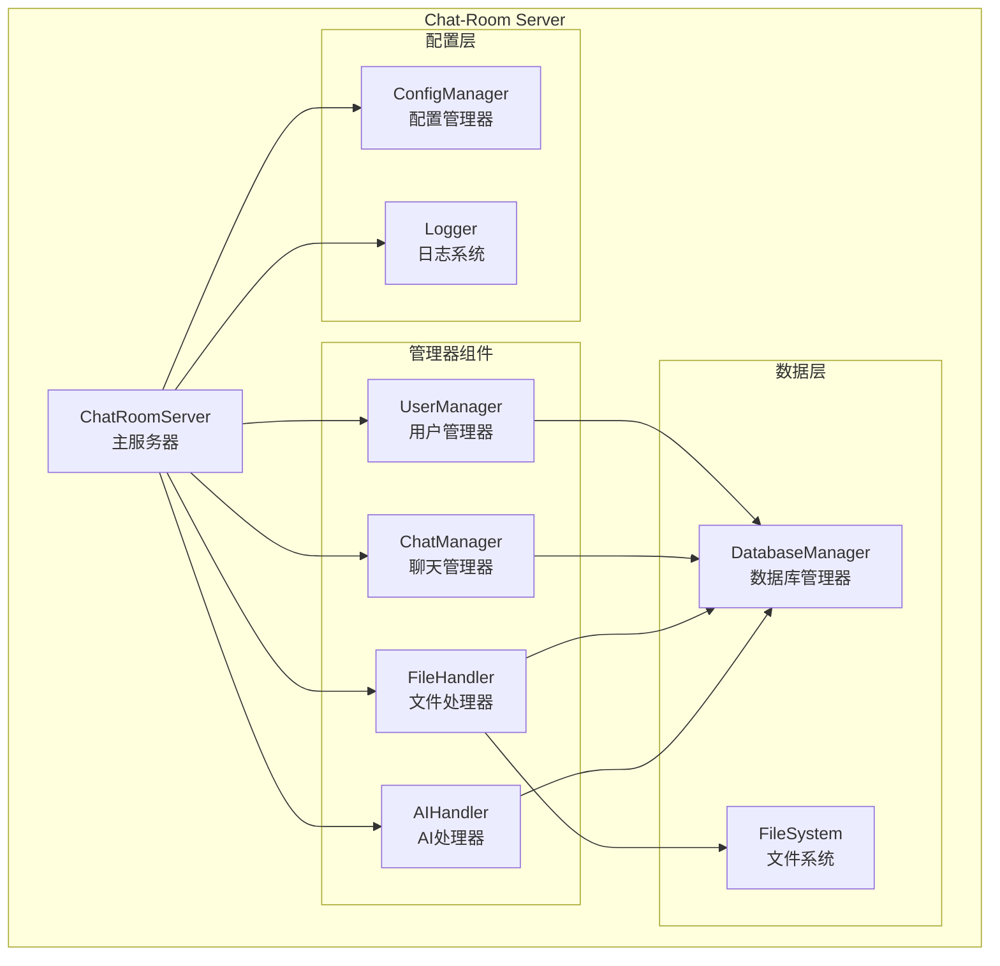
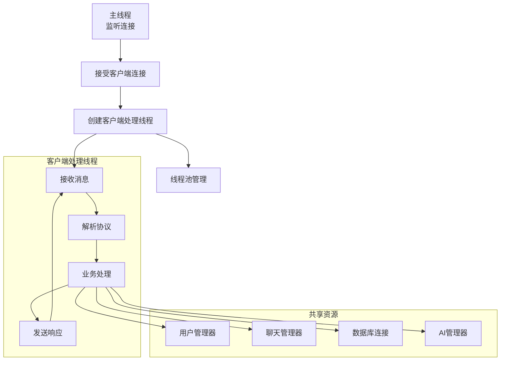
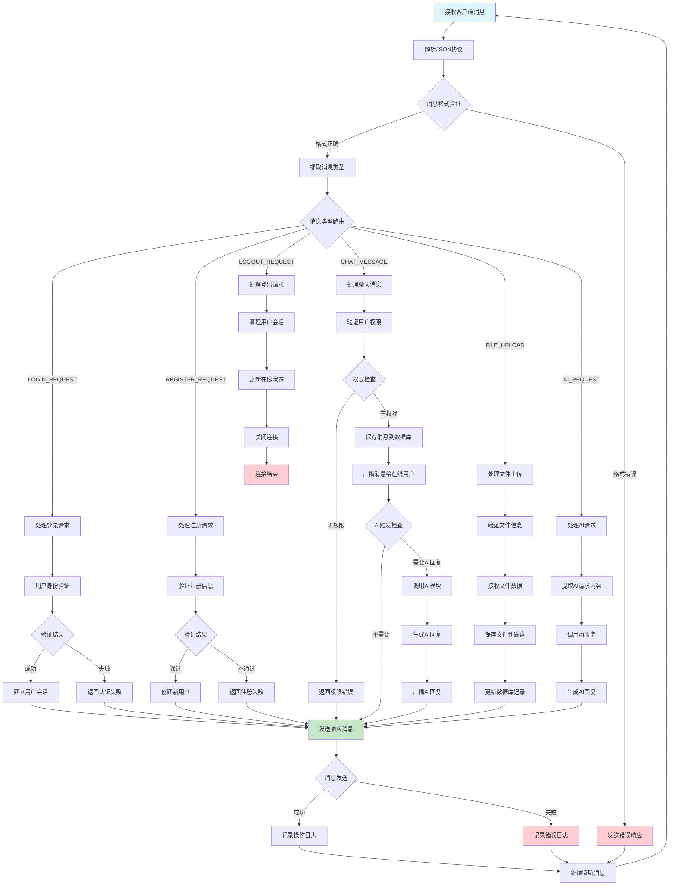
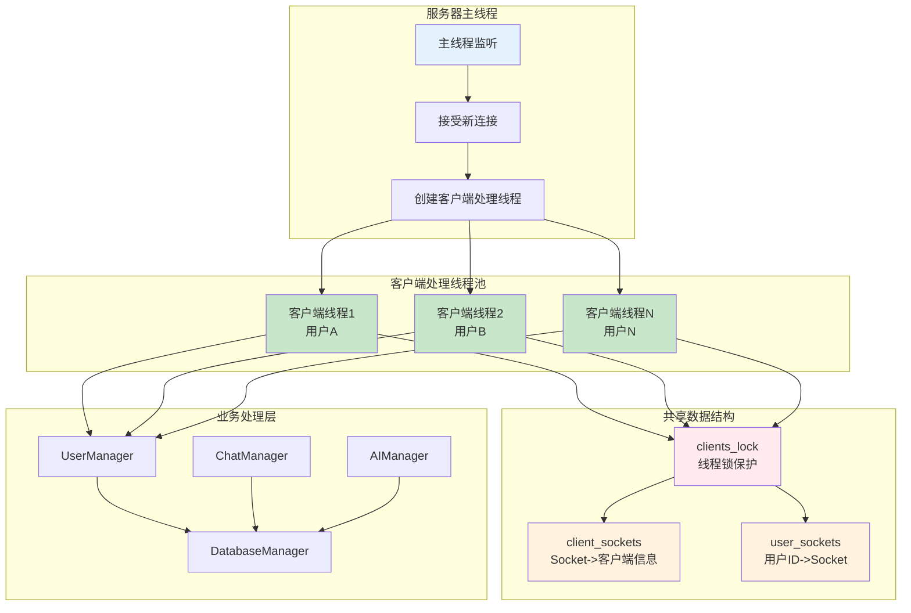

# 第四章 服务端实现

## 4.1 引言

服务器端是Chat-Room系统的核心组件，承担着网络连接管理、消息路由、业务逻辑处理和数据存储等关键职责。本章将详细介绍服务器端的架构设计与实现，重点分析多线程网络编程、并发处理机制、业务模块设计等核心技术。

服务器端采用多线程TCP服务器模型，能够同时处理多个客户端连接。通过模块化设计将功能分解为用户管理、聊天管理、文件处理、AI集成等独立模块，实现了高内聚、低耦合的系统架构。在网络层面，利用Socket编程技术建立可靠的TCP连接，结合自定义的JSON消息协议实现客户端与服务器间的稳定通信。

## 4.2 服务端架构设计

### 4.2.1 整体架构模式

服务器端采用经典的多线程服务器架构，主要由以下几个层次组成：

**网络接入层**：负责TCP连接的建立、维护和断开，处理原始的网络数据包。

**协议处理层**：解析JSON格式的消息协议，将网络数据转换为业务对象。

**业务逻辑层**：包含用户管理、聊天管理、文件处理、AI集成等核心业务模块。

**数据存储层**：提供统一的数据库访问接口，处理数据的持久化存储。

这种分层架构的设计使得各层职责清晰，便于维护和扩展。网络层专注于连接管理，业务层专注于逻辑处理，数据层专注于存储操作，形成了良好的关注点分离。

```python
# 服务器核心架构示例
class ChatRoomServer:
    def __init__(self, host: str = DEFAULT_HOST, port: int = DEFAULT_PORT):
        # 网络相关
        self.server_socket: Optional[socket.socket] = None
        self.client_sockets: Set[socket.socket] = set()
        self.client_threads: Dict[socket.socket, threading.Thread] = {}
        
        # 业务管理器
        self.user_manager = UserManager()
        self.chat_manager = ChatManager(self.user_manager)
        self.ai_manager = AIManager()
        self.admin_manager = AdminManager()
```



### 4.2.2 模块化设计原则

服务器端严格遵循模块化设计原则，将不同的功能封装在独立的模块中。每个模块都有明确的接口定义和职责边界，模块间通过接口进行交互，避免了紧耦合的问题。

**用户管理模块(UserManager)**：处理用户注册、登录、会话管理和在线状态跟踪。

**聊天管理模块(ChatManager)**：负责聊天组管理、文件管理、消息路由和历史记录。

**AI集成模块(AIManager)**：提供LLM对话服务，集成外部AI API。

**管理员模块(AdminManager)**：实现系统管理功能，如用户禁言、权限控制等。

**数据库模块(DatabaseManager)**：提供统一的数据访问接口，支持用户数据、聊天记录等的持久化存储。

这种模块化设计不仅提高了代码的可维护性，还便于进行单元测试和功能扩展。当需要增加新功能时，只需要新增对应的模块，而不会影响现有的业务逻辑。

## 4.3 网络通信实现

### 4.3.1 多线程TCP服务器

服务器端使用Python的socket库实现TCP服务器，采用"一连接一线程"的经典模型。主线程负责监听新的客户端连接，为每个新连接创建独立的工作线程处理客户端请求。

```python
def start_server(self):
    """启动服务器"""
    try:
        # 初始化数据库
        init_database()
        
        # 创建服务器Socket
        self.server_socket = socket.socket(socket.AF_INET, socket.SOCK_STREAM)
        self.server_socket.setsockopt(socket.SOL_SOCKET, socket.SO_REUSEADDR, 1)
        
        # 绑定地址和端口
        self.server_socket.bind((self.host, self.port))
        self.server_socket.listen(100)  # 支持100个等待连接
        
        self.running = True
        self.logger.info(f"服务器启动成功，监听 {self.host}:{self.port}")
        
        # 主循环：接受客户端连接
        while self.running:
            client_socket, client_address = self.server_socket.accept()
            
            # 为每个客户端创建处理线程
            client_thread = threading.Thread(
                target=self.handle_client,
                args=(client_socket, client_address),
                daemon=True
            )
            client_thread.start()
```



这种设计的优势在于每个客户端连接都有独立的线程处理，避免了阻塞问题。即使某个客户端出现异常，也不会影响其他客户端的正常服务。同时，通过设置daemon=True，确保主程序退出时所有工作线程能够正常终止。

### 4.3.2 客户端连接管理

服务器需要维护所有活跃的客户端连接，包括连接状态跟踪、超时检测和资源清理等功能。

**连接建立**：当新客户端连接到服务器时，系统会记录连接信息，包括Socket对象、客户端地址、连接时间等。

**连接维护**：通过心跳机制检测连接有效性，定期发送心跳包确保连接正常。

**连接清理**：当客户端断开连接或发生异常时，及时清理相关资源，包括关闭Socket、清理用户会话、更新在线状态等。

```python
def handle_client(self, client_socket: socket.socket, client_address):
    """处理客户端连接"""
    client_ip, client_port = client_address
    self.logger.info("新客户端连接", client_ip=client_ip, client_port=client_port)
    
    try:
        # 添加到客户端集合
        self.client_sockets.add(client_socket)
        
        # 设置超时
        client_socket.settimeout(CONNECTION_TIMEOUT)
        
        # 处理消息循环
        buffer = ""
        while self.running:
            data = client_socket.recv(BUFFER_SIZE)
            if not data:
                break
                
            # 消息解析和处理
            buffer += data.decode('utf-8')
            while '\n' in buffer:
                line, buffer = buffer.split('\n', 1)
                if line.strip():
                    self.process_message(client_socket, line.strip())
                    
    except Exception as e:
        self.logger.error("处理客户端时出错", error=str(e))
    finally:
        # 清理连接资源
        self._cleanup_client(client_socket)
```

### 4.3.3 消息协议处理

服务器实现了完整的JSON消息协议解析和处理机制。每个接收到的消息都会经过协议解析、消息验证、类型路由等步骤。

**协议解析**：将JSON字符串解析为Python对象，提取消息类型和数据内容。

**消息验证**：检查消息格式是否正确，必要字段是否完整。

**类型路由**：根据消息类型将请求分发到对应的处理函数。

```python
def process_message(self, client_socket: socket.socket, message_str: str):
    """处理单条消息"""
    try:
        # 解析JSON消息
        message = parse_message(message_str)
        if not message:
            self.send_error(client_socket, ErrorCode.INVALID_MESSAGE, "消息格式错误")
            return
        
        # 根据消息类型分发处理
        if message.message_type == MessageType.LOGIN_REQUEST:
            self.handle_login(client_socket, message)
        elif message.message_type == MessageType.CHAT_MESSAGE:
            self.handle_chat_message(client_socket, message)
        elif message.message_type == MessageType.FILE_UPLOAD_REQUEST:
            self.handle_file_upload_request(client_socket, message)
        # ... 其他消息类型处理
        
    except json.JSONDecodeError:
        self.send_error(client_socket, ErrorCode.INVALID_MESSAGE, "JSON格式错误")
    except Exception as e:
        self.logger.error("消息处理异常", error=str(e))
        self.send_error(client_socket, ErrorCode.SERVER_ERROR, "服务器内部错误")
```



## 4.4 并发处理机制

### 4.4.1 线程安全设计

在多线程TCP服务器中，服务器端采用简单的字典数据结构维护客户端连接，通过线程锁机制保护共享数据访问。

**客户端连接管理**：使用`Dict[socket.socket, Dict]`维护Socket到客户端信息的映射，同时维护`Dict[int, socket.socket]`实现用户ID到Socket的快速查找。

**同步机制**：采用`threading.RLock()`保护所有客户端数据操作，确保添加、移除客户端连接的原子性。

**消息广播同步**：广播消息时使用锁保护整个广播过程，避免消息丢失或重复发送。



### 4.4.2 多线程消息处理

服务器采用"一连接一线程"的并发模型，每个客户端连接由独立线程处理消息接收、解析和响应。在这种架构下，每个客户端线程独立运行消息接收循环，通过缓冲区机制处理TCP协议的粘包问题，确保消息的完整性和准确性。接收到的消息会根据消息类型自动分发到对应的业务处理模块，各个线程通过共享的管理器对象进行协调工作，实现了良好的模块间协作。对于需要广播的消息（如聊天消息、系统通知等），系统采用线程安全的方式向所有相关在线用户发送，通过锁机制保护共享数据结构的访问，避免了竞态条件和数据不一致的问题。

### 4.4.3 连接生命周期管理

在连接的整个生命周期中，系统实现了完善的管理机制。当新连接建立时，服务器会将其加入连接管理字典，同时设置适当的超时参数和缓冲区大小，为后续的数据传输做好准备。在连接运行过程中，系统会持续监控连接状态，一旦捕获到连接异常（如网络断开、客户端程序崩溃等），会立即启动清理流程，及时清理用户会话数据和Socket资源，防止资源泄漏。当连接正常或异常结束时，系统会自动执行完整的资源清理操作，包括用户登出处理、Socket连接关闭、内存资源释放以及相关数据结构的更新，确保系统始终保持稳定和高效的运行状态。这种全面的生命周期管理机制不仅提高了系统的稳定性，还为用户提供了更加可靠的服务体验。


## 4.5 业务模块实现

### 4.5.1 用户管理模块

用户管理模块是服务器端的核心组件之一，负责处理用户的整个生命周期管理，包括注册、认证、会话维护和状态跟踪等功能。

**用户注册功能**：提供安全的用户注册机制，包括用户名唯一性检查、密码强度验证和数据库存储。注册过程中会对密码进行哈希加密，确保用户隐私安全。

**用户认证系统**：实现基于用户名和密码的身份验证机制。认证成功后创建用户会话，维护登录状态。

**会话管理机制**：维护在线用户的会话信息，包括Socket连接、登录时间、最后活动时间等。会话数据采用内存存储，提供快速的状态查询能力。

```python
def register_user(self, username: str, password: str) -> Tuple[bool, str]:
    """用户注册"""
    try:
        # 验证用户名格式
        if not validate_username(username):
            return False, "用户名格式不正确"
        
        # 验证密码强度
        if not validate_password(password):
            return False, "密码强度不够"
        
        # 检查用户名是否已存在
        if self.db.user_exists(username):
            return False, "用户名已存在"
        
        # 创建新用户
        user_id = self.db.create_user(username, password)
        self.logger.info("新用户注册成功", username=username, user_id=user_id)
        
        return True, "注册成功"
        
    except Exception as e:
        self.logger.error("用户注册失败", error=str(e))
        return False, "注册失败"
```

**在线状态管理**：实时跟踪用户的在线状态，支持多种状态类型（在线、离开、忙碌、离线）。状态变化会及时同步给相关用户，保持系统状态的一致性。

### 4.5.2 聊天管理模块

聊天管理模块处理所有与聊天相关的业务逻辑，包括聊天组管理、消息路由、历史记录维护等核心功能。

**聊天组管理**：支持动态创建聊天组，管理聊天组成员，控制加入和退出权限。每个聊天组都有唯一的标识符和名称，支持公开和私密两种类型。

**消息路由系统**：实现高效的消息分发机制，将发送者的消息准确路由到目标聊天组的所有在线成员。路由过程中会进行权限检查，确保只有合法用户才能发送消息。

**历史消息管理**：提供消息持久化存储和查询功能。用户可以获取聊天组的历史消息，支持分页加载，避免一次性加载过多数据影响性能。

```python
def send_message(self, sender_id: int, group_id: int, content: str) -> ChatMessage:
    """发送消息"""
    try:
        # 权限验证
        if not self.db.is_user_in_chat_group(group_id, sender_id):
            raise PermissionDeniedError("您不在此聊天组中")
        
        # 获取发送者信息
        sender_info = self.db.get_user_by_id(sender_id)
        group_info = self.db.get_chat_group_by_id(group_id)
        
        # 保存消息到数据库
        message_id = self.db.save_message(group_id, sender_id, content)
        
        # 创建消息对象
        message = ChatMessage(
            message_id=message_id,
            sender_id=sender_id,
            sender_username=sender_info['username'],
            chat_group_id=group_id,
            chat_group_name=group_info['name'],
            content=content,
            timestamp=time.time()
        )
        
        return message
        
    except Exception as e:
        self.logger.error("发送消息失败", error=str(e))
        raise
```

**消息广播机制**：实现实时消息广播功能，将消息同时发送给聊天组内的所有在线用户。广播过程中会处理网络异常，确保消息的可靠传递。

### 4.5.3 AI集成模块

AI集成模块为Chat-Room系统提供智能对话功能，通过集成外部AI服务实现自动回复和智能助手等特性。

**AI服务集成**：集成智谱AI的GLM-4-Flash模型，提供高质量的自然语言理解和生成能力。通过RESTful API与AI服务通信，支持流式和批量处理模式。

**触发机制设计**：实现智能的AI触发机制，能够识别用户何时需要AI回复。支持@符号直接呼叫、关键词触发和私聊自动回复等多种触发方式。

**上下文管理**：维护对话上下文，确保AI回复的连贯性和相关性。上下文管理包括历史消息存储、上下文长度控制和会话隔离等功能。

```python
def process_message(self, user_id: int, username: str, message_content: str,
                   chat_group_id: int = None) -> Optional[str]:
    """处理用户消息并生成AI回复"""
    if not self.is_enabled():
        return None
    
    is_group_chat = chat_group_id is not None
    
    # 判断是否应该回复
    if not self.should_respond_to_message(message_content, is_group_chat):
        return None
    
    try:
        # 清理消息内容
        cleaned_message = self._clean_message(message_content)
        
        # 获取对话上下文
        context_id = str(chat_group_id) if is_group_chat else str(user_id)
        context_messages = self.context_manager.get_context(context_id, is_group_chat)
        
        # 调用AI生成回复
        ai_reply = self.zhipu_client.chat_completion(context_messages, system_prompt)
        
        if ai_reply:
            # 更新对话上下文
            self.context_manager.add_message(context_id, "assistant", ai_reply, is_group_chat)
            return ai_reply
            
    except Exception as e:
        self.logger.error("AI消息处理错误", error=str(e))
        return "抱歉，我现在无法回复您的消息。"
```

**配置管理系统**：提供灵活的AI配置管理，支持动态调整AI模型参数、触发条件、回复策略等。配置采用YAML格式，便于维护和修改。

### 4.5.4 文件处理模块

文件处理模块实现了完整的文件上传、下载和管理功能，支持多种文件类型和大文件传输。

**文件上传机制**：支持分块上传，能够处理大文件传输。上传过程中会进行文件类型检查、大小限制和安全扫描，确保系统安全。

**文件存储管理**：采用文件系统存储方式，按用户和聊天组组织文件目录结构。文件元数据存储在数据库中，便于查询和管理。

**下载服务**：提供高效的文件下载服务，支持断点续传和并发下载。下载过程中会进行权限验证，确保只有授权用户才能访问文件。

```python
def handle_file_upload_request(self, client_socket: socket.socket, message: FileUploadRequest):
    """处理文件上传请求"""
    try:
        # 验证用户权限
        user_info = self.verify_user_login(client_socket)
        if not user_info:
            return
        
        # 验证文件信息
        if not self._validate_file_upload(message):
            self.send_error(client_socket, ErrorCode.INVALID_FILE, "文件验证失败")
            return
        
        # 生成文件路径
        file_path = self._generate_file_path(user_info['user_id'], message.filename)
        
        # 接收文件数据
        self._receive_file_data(client_socket, file_path, message.file_size)
        
        # 保存文件信息到数据库
        file_id = self.db.save_file_info(
            user_info['user_id'], message.chat_group_id,
            message.filename, file_path, message.file_size
        )
        
        # 发送成功响应
        response = FileUploadResponse(success=True, file_id=file_id)
        self.send_message(client_socket, response)
        
    except Exception as e:
        self.logger.error("文件上传处理失败", error=str(e))
        self.send_error(client_socket, ErrorCode.SERVER_ERROR, "文件上传失败")
```


## 4.6 数据库集成

### 4.6.1 数据库连接管理

服务器端采用SQLite作为数据库，实现了完整的数据库连接管理机制。数据库连接采用单例模式，确保整个应用程序使用统一的数据库实例。

**连接池设计**：虽然SQLite是文件数据库，但仍然实现了连接管理机制，支持连接复用和自动重连功能。

**事务管理**：提供事务支持，确保数据操作的原子性和一致性。重要的业务操作都包装在事务中执行。

**错误恢复**：实现数据库连接异常的自动恢复机制，当连接断开时能够自动重新建立连接。

```python
def get_db():
    """获取数据库连接（单例模式）"""
    if not hasattr(get_db, "_db"):
        get_db._db = ChatRoomDatabase()
    return get_db._db

class ChatRoomDatabase:
    def __init__(self):
        self.db_path = DATABASE_PATH
        self.connection = None
        self._lock = threading.RLock()
        self._connect()
    
    def _connect(self):
        """建立数据库连接"""
        try:
            self.connection = sqlite3.connect(
                self.db_path, 
                check_same_thread=False,
                timeout=30.0
            )
            self.connection.row_factory = sqlite3.Row
            self.connection.execute("PRAGMA foreign_keys = ON")
            
        except Exception as e:
            logger.error(f"数据库连接失败: {e}")
            raise
```

### 4.6.2 数据访问层设计

数据访问层采用DAO（Data Access Object）模式，为每种数据类型提供专门的访问接口。这种设计将数据库操作与业务逻辑分离，提高了代码的可维护性。

**用户数据访问**：提供用户信息的增删改查操作，包括用户注册、身份验证、信息更新等。

**聊天数据访问**：处理聊天组和消息相关的数据操作，支持聊天组管理、消息存储和历史查询。

**文件数据访问**：管理文件元数据，支持文件信息的存储和查询。

```python
def save_message(self, group_id: int, sender_id: int, content: str, 
                message_type: str = "text") -> int:
    """保存消息到数据库"""
    with self._lock:
        try:
            cursor = self.connection.cursor()
            cursor.execute("""
                INSERT INTO messages (chat_group_id, sender_id, content, message_type, timestamp)
                VALUES (?, ?, ?, ?, ?)
            """, (group_id, sender_id, content, message_type, time.time()))
            
            message_id = cursor.lastrowid
            self.connection.commit()
            
            return message_id
            
        except Exception as e:
            self.connection.rollback()
            raise
```


## 4.8 安全机制实现

### 4.8.1 身份认证与授权

服务器端实现了完整的身份认证和授权机制，确保只有合法用户才能访问系统资源。

**密码安全**：使用BCrypt算法对用户密码进行哈希加密，添加盐值增强安全性。

**会话管理**：实现安全的会话管理机制，包括会话超时、会话验证和会话销毁。

**权限控制**：基于角色的访问控制，不同用户拥有不同的操作权限。

```python
def authenticate_user(self, username: str, password: str) -> Optional[Dict]:
    """用户身份认证"""
    try:
        # 从数据库获取用户信息
        user_data = self.db.get_user_by_username(username)
        if not user_data:
            return None
        
        # 验证密码
        if bcrypt.checkpw(password.encode('utf-8'), user_data['password_hash']):
            return {
                'user_id': user_data['user_id'],
                'username': user_data['username'],
                'role': user_data.get('role', 'user')
            }
        
        return None
        
    except Exception as e:
        self.logger.error("用户认证失败", error=str(e))
        return None
```

### 4.8.2 数据安全保护

系统实施了多层次的数据保护措施，确保用户数据的安全性和隐私性。

**输入验证**：对所有用户输入进行严格验证，防止SQL注入、XSS等攻击。

**数据加密**：对敏感数据进行加密存储，包括用户密码、私人消息等。

**访问控制**：实施细粒度的数据访问控制，确保用户只能访问授权的数据。

```python
def sanitize_message_content(content: str) -> str:
    """清理和验证消息内容"""
    # 移除危险字符
    content = re.sub(r'[<>"]', '', content)
    # 限制消息长度
    if len(content) > MAX_MESSAGE_LENGTH:
        content = content[:MAX_MESSAGE_LENGTH]
    # 过滤敏感词汇
    content = filter_sensitive_words(content)
    return content.strip()
```

## 4.9 监控与日志系统


服务器端实现了完整的日志记录系统，为系统运维和问题诊断提供详细的信息。

**结构化日志**：采用结构化日志格式，便于日志分析和处理。

**分级记录**：支持多种日志级别（DEBUG、INFO、WARNING、ERROR、CRITICAL），根据重要性记录不同类型的事件。

**日志轮转**：实现日志文件自动轮转机制，避免日志文件过大影响系统性能。

```python
# 日志记录示例
def log_user_action(user_id: int, username: str, action: str, **kwargs):
    """记录用户操作日志"""
    logger = get_logger("user.action")
    logger.info("用户操作", 
               user_id=user_id,
               username=username,
               action=action,
               timestamp=time.time(),
               **kwargs)
```

## 4.10 部署与运维


服务器端采用模块化的部署架构，支持灵活的部署方式和环境配置。

**配置管理**：使用YAML配置文件管理系统参数，支持不同环境的配置切换。

**依赖管理**：通过requirements.txt文件管理Python依赖包，确保部署环境的一致性。

**服务管理**：支持以系统服务的方式运行，便于自动启动和管理。

```python
# 服务器启动脚本示例
def main():
    """服务器主函数"""
    try:
        # 加载配置
        config = load_server_config()
        
        # 初始化日志系统
        setup_logging(config['logging'])
        
        # 创建服务器实例
        server = ChatRoomServer(
            host=config['server']['host'],
            port=config['server']['port']
        )
        
        # 启动服务器
        server.start_server()
        
    except KeyboardInterrupt:
        logger.info("收到停止信号，正在关闭服务器...")
    except Exception as e:
        logger.error("服务器启动失败", error=str(e))
    finally:
        # 清理资源
        cleanup_resources()
```

## 4.11 小结

本章详细介绍了Chat-Room系统服务器端的实现，涵盖了架构设计、网络通信、并发处理、业务模块、数据库集成等关键技术。

**技术特点总结**：

- **多线程架构**：采用"一连接一线程"模型，实现高并发处理能力
- **模块化设计**：将功能分解为独立模块，提高系统的可维护性和扩展性
- **线程安全机制**：通过锁机制和原子操作确保多线程环境下的数据一致性
- **完善的错误处理**：实现全面的异常处理和资源清理机制
- **性能优化**：通过缓存、连接池、批量处理等技术提升系统性能
- **安全保护**：实施身份认证、数据加密、网络防护等多层安全机制

**工程实践价值**：

服务器端的实现体现了现代网络应用开发的最佳实践，包括关注点分离、防御性编程、性能优化等重要概念。这些技术和方法在实际的企业级应用开发中具有重要的参考价值。

**网络编程知识体现**：

- **TCP Socket编程**：深入应用TCP协议特性，实现可靠的网络通信
- **并发编程模式**：掌握多线程编程的核心技术和最佳实践
- **网络协议设计**：设计和实现自定义的应用层协议
- **网络性能优化**：运用多种技术手段优化网络I/O性能

通过服务器端的实现，我们构建了一个功能完整、性能稳定、安全可靠的聊天服务器，为整个Chat-Room系统提供了坚实的技术基础。下一章将详细介绍客户端的实现，展示如何与服务器进行有效的交互和协作。
