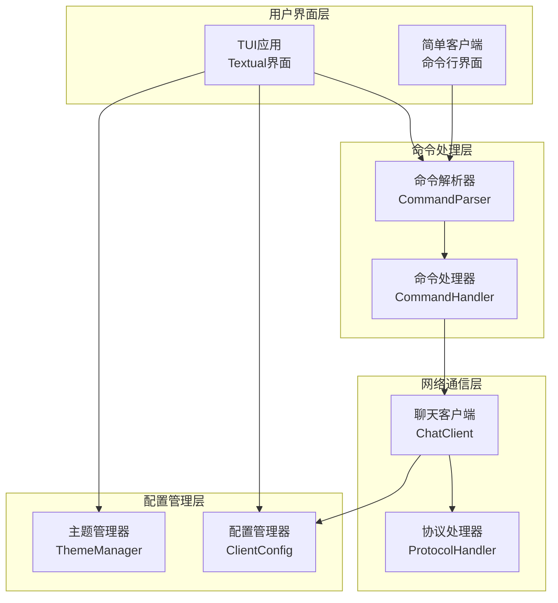
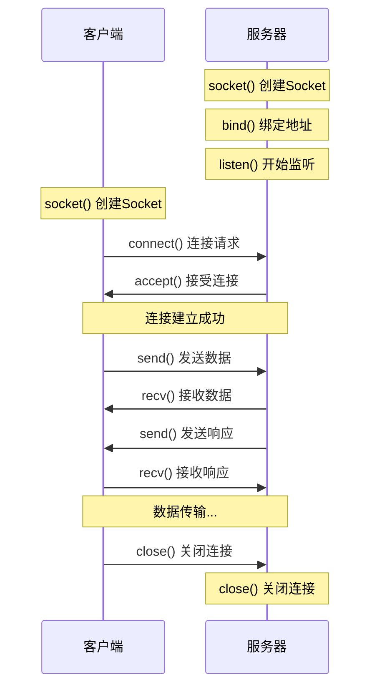
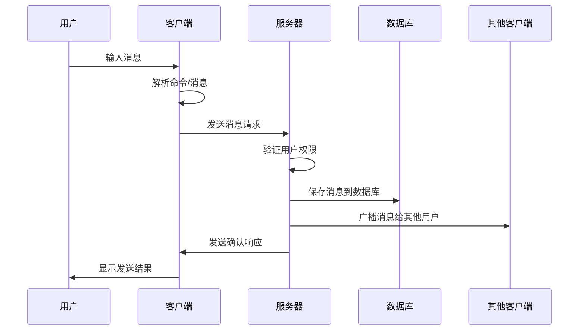
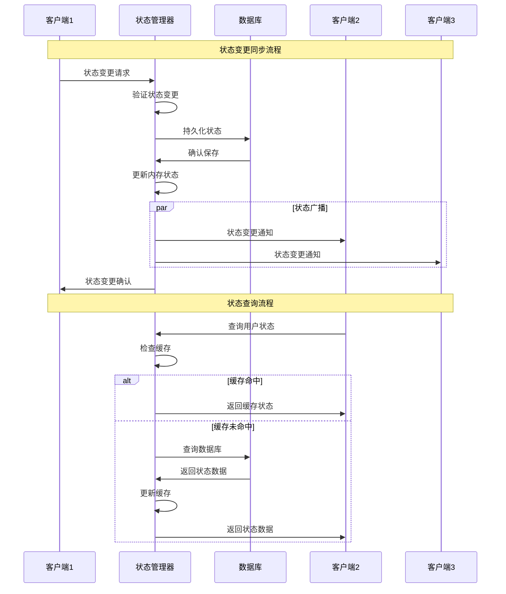
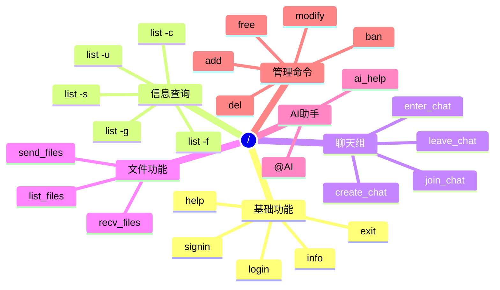
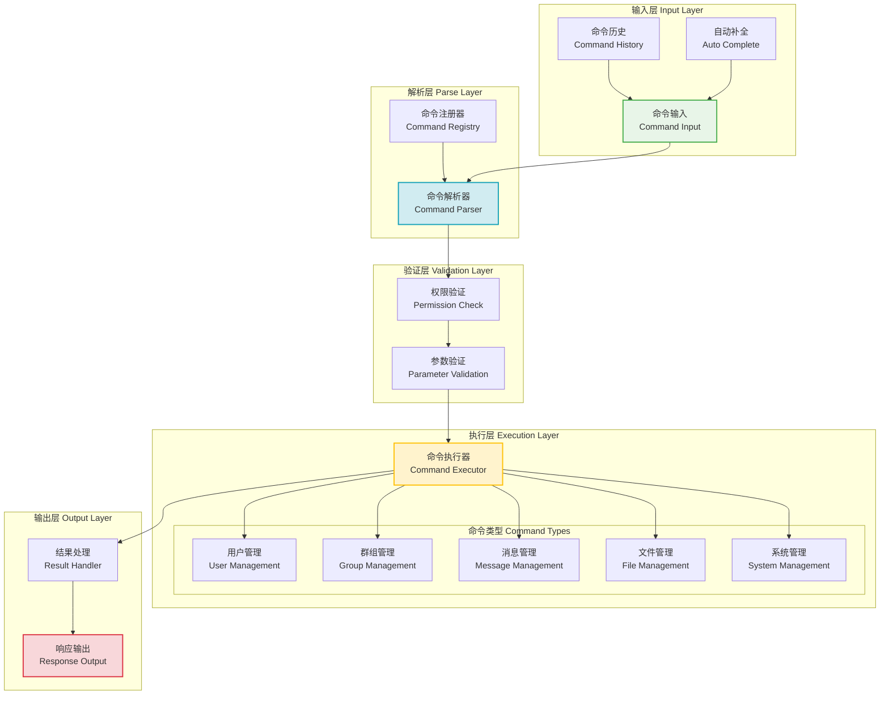
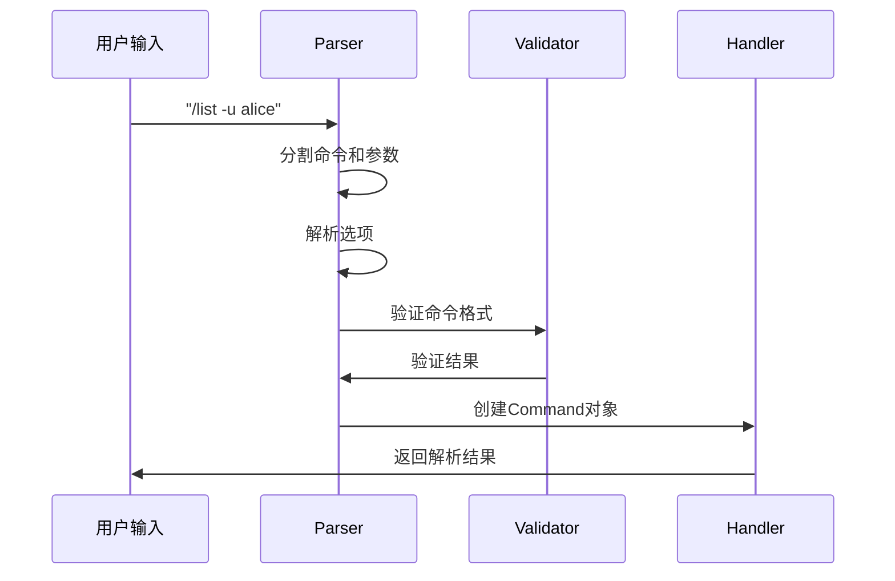
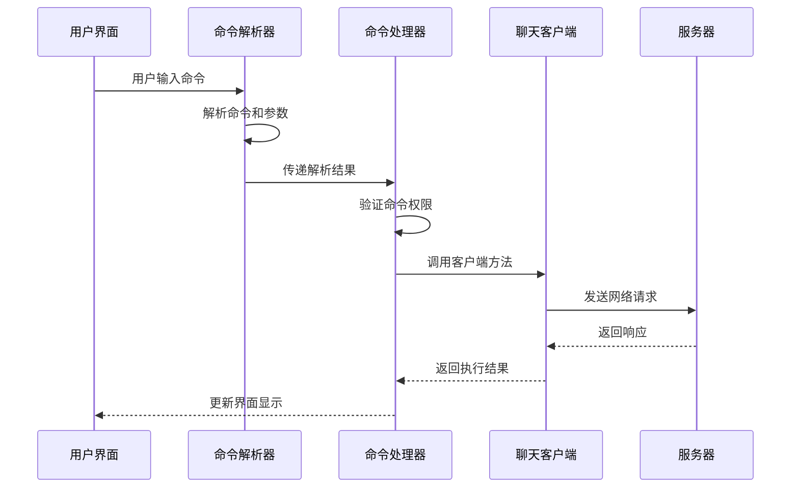
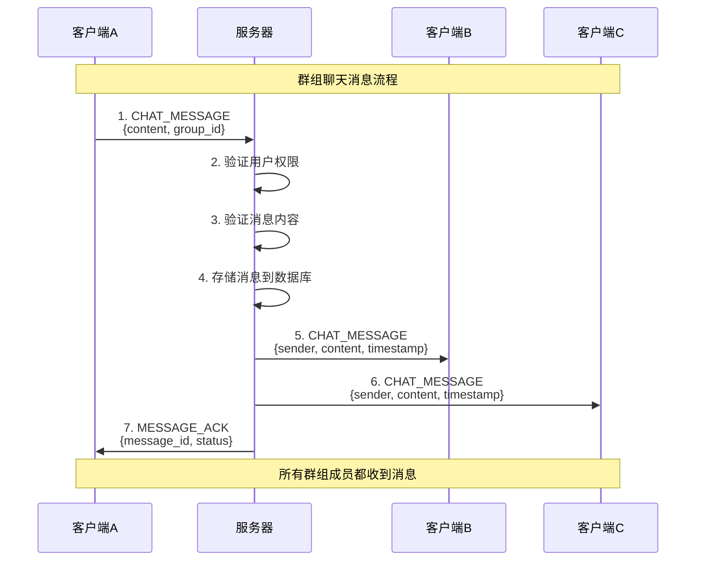

# 第五章 客户端实现

## 5.1 引言

客户端是Chat-Room系统中用户直接交互的界面组件，承担着网络通信、用户界面呈现、命令处理等关键职责。本章将详细介绍客户端的架构设计与实现，重点分析网络通信模块、TUI界面设计、命令系统等核心技术。

客户端采用模块化设计思想，将功能分解为网络通信、用户界面、命令处理等独立模块。在网络层面，通过Socket编程建立与服务器的TCP连接，实现消息的双向传输；在界面层面，基于Textual框架构建现代化的终端用户界面，提供直观的操作体验；在交互层面，实现了完整的命令解析系统，支持16种斜杠命令，满足用户的各种操作需求。

这种架构设计实现了网络层与界面层的有效分离，确保了代码的可维护性和可扩展性，同时为用户提供了简洁高效的聊天体验。

## 5.2 网络通信模块

### 5.2.1 Socket连接建立

客户端网络通信模块的核心是`NetworkClient`类，负责与服务器建立TCP连接并维护通信会话。连接建立过程遵循标准的TCP三次握手协议，确保通信的可靠性。

在连接建立阶段，客户端首先创建Socket对象，设置适当的超时参数，然后向服务器指定的地址和端口发起连接请求。连接成功后，客户端会启动独立的接收线程来处理服务器消息，实现了发送和接收的并发处理。

```python
class NetworkClient:
    """网络客户端 - 负责与服务器的Socket通信"""
    
    def connect(self) -> bool:
        """建立与服务器的TCP连接"""
        try:
            # 创建TCP Socket
            self.socket = socket.socket(socket.AF_INET, socket.SOCK_STREAM)
            
            # 设置连接超时，避免无限等待
            self.socket.settimeout(10)
            
            # 发起TCP连接请求
            self.socket.connect((self.host, self.port))
            
            # 连接成功后更新状态
            self.connected = True
            self.running = True
            
            # 启动消息接收线程，实现并发处理
            self.receive_thread = threading.Thread(
                target=self._receive_messages, 
                daemon=True
            )
            self.receive_thread.start()
            
            return True
            
        except socket.error as e:
            self.logger.error("连接服务器失败", error=str(e))
            return False
```


连接建立的设计考虑了网络异常的处理机制。通过设置适当的超时时间，避免了客户端在网络不可达时的无限等待。同时，采用daemon线程来处理消息接收，确保主程序退出时能够正确清理资源。

### 5.2.2 消息发送与接收

消息传输是客户端网络模块的核心功能，需要处理消息的序列化、边界检测、并发同步等关键问题。客户端采用JSON格式进行消息编码，结合消息长度前缀的方式解决TCP流式传输的边界问题。

在消息发送方面，客户端将消息对象序列化为JSON字符串，添加长度前缀后通过Socket发送。这种设计确保了消息的完整性和可解析性，同时便于协议的扩展和调试。

```python
def send_message(self, message: BaseMessage) -> bool:
    """发送消息到服务器"""
    try:
        # 将消息对象转换为JSON字符串
        message_json = message.to_json()
        message_data = message_json.encode('utf-8')
        
        # 添加消息长度前缀，解决TCP粘包问题
        message_length = len(message_data)
        length_prefix = struct.pack('!I', message_length)
        
        # 发送长度前缀和消息体
        self.socket.sendall(length_prefix + message_data)
        
        return True
        
    except socket.error as e:
        self.logger.error("消息发送失败", error=str(e))
        return False
```

在消息接收方面，客户端运行独立的接收线程，持续监听服务器消息。接收过程分为两个阶段：首先读取4字节的长度前缀，然后根据长度读取完整的消息体。这种设计有效避免了TCP流式传输中的粘包和分包问题。

```python
def _receive_messages(self):
    """消息接收线程 - 处理来自服务器的消息"""
    while self.running and self.connected:
        try:
            # 第一阶段：读取4字节长度前缀
            length_data = self._recv_exact(4)
            if not length_data:
                break
                
            # 解析消息长度
            message_length = struct.unpack('!I', length_data)[0]
            
            # 第二阶段：根据长度读取完整消息体
            message_data = self._recv_exact(message_length)
            if not message_data:
                break
                
            # 解码并处理消息
            message_str = message_data.decode('utf-8')
            self._handle_received_message(message_str)
            
        except socket.error:
            break
```



### 5.2.3 连接状态监控

连接状态监控是确保客户端稳定运行的重要机制。客户端需要实时监控网络连接状态，及时检测连接断开，并在必要时进行重连或提示用户。

客户端通过多种方式监控连接状态：在消息接收线程中检测Socket异常、在消息发送时捕获网络错误、定期进行心跳检测等。这种多层次的监控机制确保了连接异常能够被及时发现和处理。

```python
def disconnect(self):
    """断开与服务器的连接"""
    self.running = False
    self.connected = False
    
    if self.socket:
        try:
            # 优雅关闭Socket连接
            self.socket.shutdown(socket.SHUT_RDWR)
            self.socket.close()
        except:
            pass
        finally:
            self.socket = None
            
    # 等待接收线程结束
    if self.receive_thread and self.receive_thread.is_alive():
        self.receive_thread.join(timeout=2.0)
```

连接管理的设计体现了良好的资源管理策略。通过明确的状态标志位控制线程生命周期，避免了资源泄漏的问题。同时，采用优雅关闭机制，确保连接断开时的网络协议一致性。




## 5.4 用户交互设计

### 5.4.1 命令处理系统

命令处理系统是客户端用户交互的核心组件，实现了完整的命令解析、验证、执行机制。系统支持16种斜杠命令，涵盖用户管理、聊天操作、文件传输、AI交互等功能领域。

命令系统的设计采用了经典的解释器模式，将命令解析和执行分离。通过`CommandParser`负责语法分析，`CommandHandler`负责语义执行，实现了清晰的职责分工和良好的可扩展性。

```python
class CommandHandler:
    """命令处理器 - 解析并执行用户命令"""
    
    def __init__(self, chat_client):
        self.chat_client = chat_client
        self.parser = CommandParser()
        self.command_handlers = {}
        self._register_handlers()
    
    def handle_command(self, input_text: str) -> tuple[bool, str]:
        """处理用户命令输入"""
        # 第一步：解析命令结构
        command = self.parser.parse_command(input_text)
        if not command:
            return False, "无效的命令格式"
        
        # 第二步：验证命令合法性
        if command.name not in self.command_handlers:
            return False, f"未知命令: {command.name}"
        
        # 第三步：执行命令逻辑
        handler = self.command_handlers[command.name]
        return handler(command)
```



#### 5.4.1.1 命令解析机制

命令解析机制负责将用户输入的字符串转换为结构化的命令对象。解析过程包括词法分析、语法分析、参数提取等步骤，能够正确识别命令名称、位置参数、选项参数等不同组成部分。

解析器采用状态机模型处理复杂的命令语法，支持短选项（-u）、长选项（--user）、参数值、引号字符串等多种语法元素。这种设计确保了命令语法的灵活性和扩展性。

```python
class CommandParser:
    """命令解析器 - 处理命令语法分析"""
    
    def parse_command(self, input_text: str) -> Optional[Command]:
        """解析命令字符串为Command对象"""
        if not input_text.startswith('/'):
            return None
        
        # 移除命令前缀
        command_text = input_text[1:].strip()
        if not command_text:
            return None
        
        # 分词处理，支持引号字符串
        tokens = self._tokenize(command_text)
        if not tokens:
            return None
        
        # 构建命令对象
        command_name = tokens[0]
        args, options = self._parse_tokens(tokens[1:])
        
        return Command(
            name=command_name,
            args=args,
            options=options,
            raw_input=input_text
        )
```



解析机制的设计考虑了命令行工具的通用性和易用性。通过支持标准的参数格式，降低了用户的学习成本；通过详细的错误提示，帮助用户正确使用命令；通过参数验证，确保命令执行的安全性。

#### 5.4.1.2 命令执行流程

命令执行流程将解析后的命令对象转换为具体的业务操作。执行过程包括权限检查、参数验证、业务处理、结果返回等步骤，确保命令能够正确、安全地执行。

执行流程的设计采用了装饰器模式，通过`@require_login`、`@require_args`等装饰器实现了横切关注点的统一处理。这种设计减少了代码重复，提高了系统的可维护性。

```python
@require_login
@require_args(1, "请指定聊天组名称")
def handle_enter_chat(self, command: Command) -> tuple[bool, str]:
    """处理进入聊天组命令"""
    group_name = command.args[0]
    
    # 执行业务逻辑
    success, message = self.chat_client.enter_chat_group(group_name)
    
    # 状态同步处理
    if success:
        self._sync_chat_state(group_name)
    
    return success, message

def require_login(func):
    """登录状态检查装饰器"""
    def wrapper(self, command: Command) -> tuple[bool, str]:
        if not self.chat_client.is_logged_in():
            return False, "请先登录"
        return func(self, command)
    return wrapper
```




### 5.4.2 消息交互处理

消息交互处理是客户端的核心功能，负责处理用户消息的发送、接收、显示等操作。系统实现了多种消息类型的支持，包括文本消息、系统消息、错误消息、AI消息等。

消息处理的设计采用了观察者模式，通过消息处理器注册机制实现了松耦合的消息分发。不同类型的消息由相应的处理器负责，确保了处理逻辑的专一性和可扩展性。

```python
def setup_message_handlers(self):
    """设置消息处理器 - 实现消息类型分发"""
    from shared.constants import MessageType
    
    # 注册各类型消息的处理器
    self.chat_client.network_client.set_message_handler(
        MessageType.CHAT_MESSAGE, self.handle_chat_message
    )
    self.chat_client.network_client.set_message_handler(
        MessageType.SYSTEM_MESSAGE, self.handle_system_message
    )
    self.chat_client.network_client.set_message_handler(
        MessageType.ERROR_MESSAGE, self.handle_error_message
    )
    self.chat_client.network_client.set_message_handler(
        MessageType.AI_CHAT_RESPONSE, self.handle_ai_response
    )

def handle_chat_message(self, message):
    """处理聊天消息 - 实时显示"""
    timestamp = datetime.now().strftime(DISPLAY_TIME_FORMAT)
    sender = message.sender_username
    content = message.content
    
    # 区分自己和他人的消息，使用不同样式
    if sender == self.current_user:
        style_class = "user_message"
        display_text = f"[{timestamp}] 我: {content}"
    else:
        style_class = "other_message" 
        display_text = f"[{timestamp}] {sender}: {content}"
    
    # 添加到聊天显示区域
    self.chat_log.write(Text(display_text, style=style_class))
```

消息交互的设计充分考虑了聊天应用的特点和用户需求。通过实时消息推送，用户能够及时接收到其他用户的消息；通过消息分类显示，用户能够清楚地区分不同类型的信息；通过历史消息管理，用户能够回顾之前的聊天内容。




## 5.6 小结

本章详细介绍了Chat-Room客户端的设计与实现，重点分析了网络通信模块、TUI界面设计、命令处理系统等核心技术。客户端采用模块化设计思想，实现了网络层与界面层的有效分离，为用户提供了稳定、高效的聊天体验。

在网络通信方面，通过TCP Socket实现了可靠的服务器连接，采用JSON消息协议确保了数据传输的准确性，通过多线程处理实现了发送接收的并发执行。

在界面设计方面，基于Textual框架构建了现代化的TUI界面，采用响应式布局适应不同终端环境，通过事件驱动模型实现了流畅的用户交互。

在命令系统方面，实现了完整的命令解析执行机制，支持16种功能命令，通过装饰器模式实现了权限控制和参数验证，通过智能提示提升了用户体验。

客户端的实现充分体现了软件工程的最佳实践，为Chat-Room系统提供了可靠的用户界面支撑，也为后续功能扩展奠定了良好的基础。
