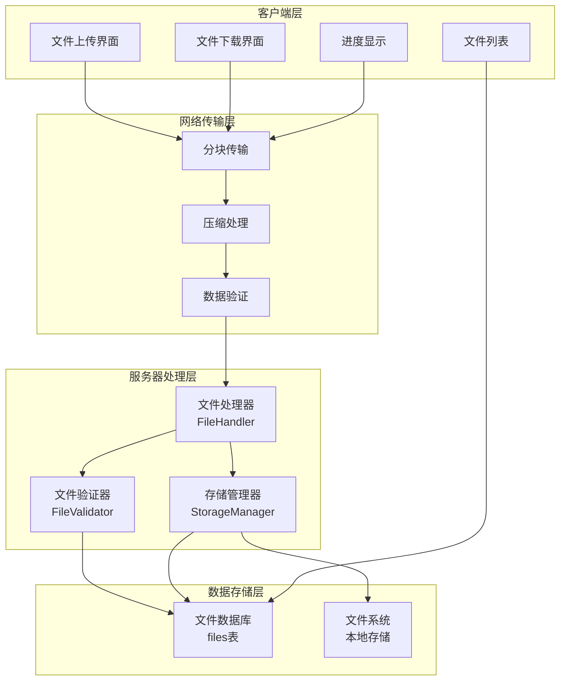
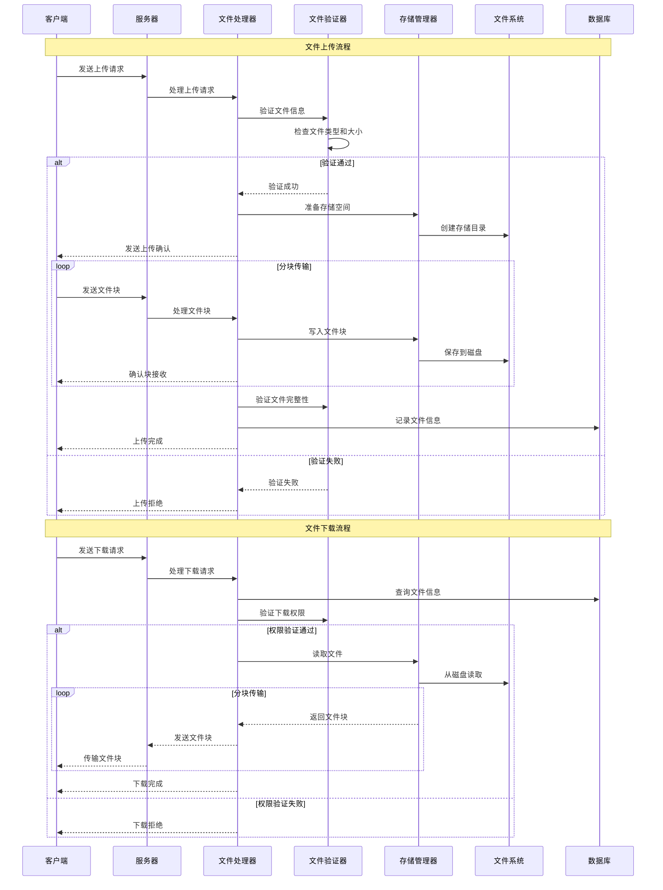
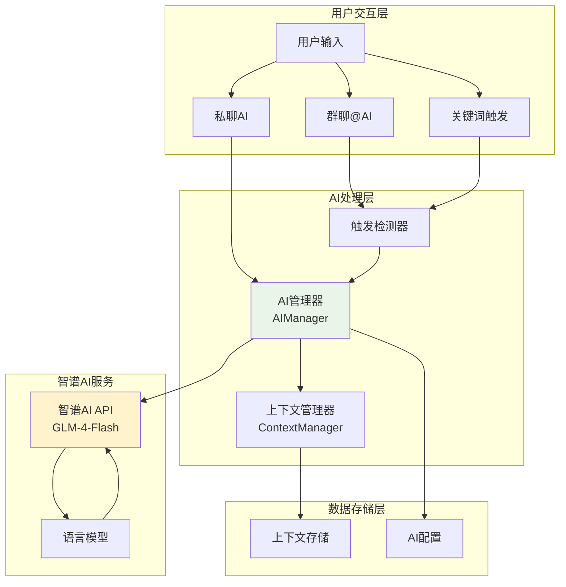
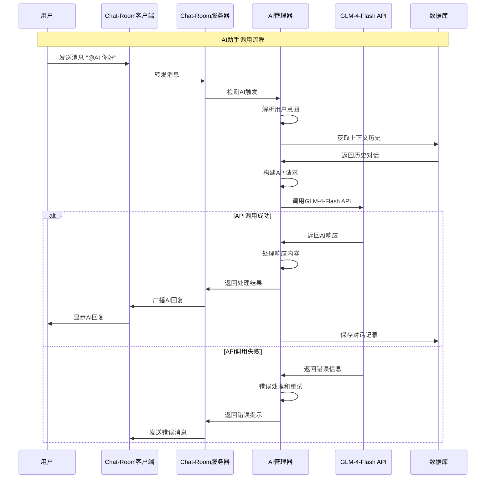
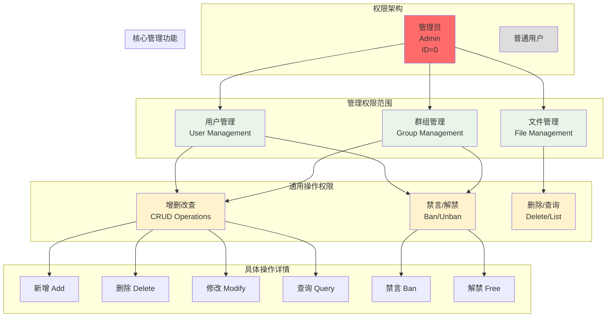
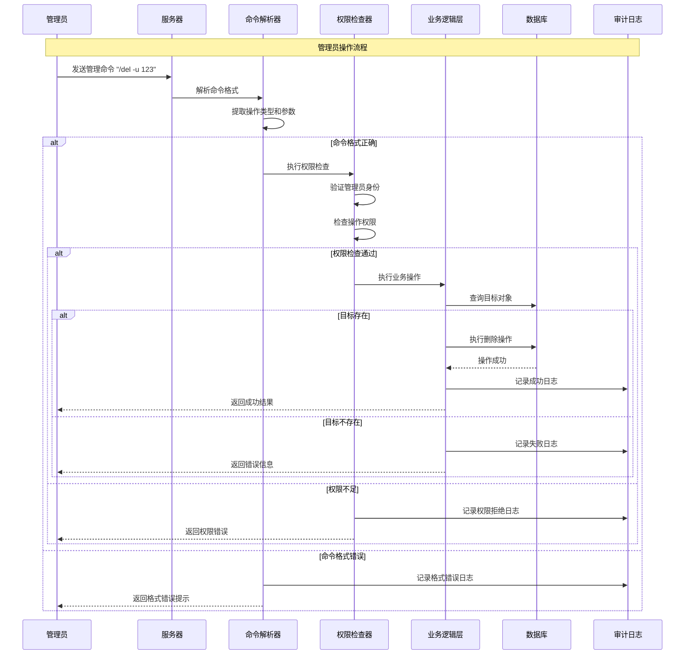

# 第六章 高级功能实现

本章将深入探讨Chat-Room系统的高级功能实现，包括文件传输系统、AI智能助手集成和管理员系统三个核心模块。这些高级功能显著提升了系统的实用性和智能化水平，体现了现代网络应用的典型特性。

## 6.1 文件传输系统

文件传输功能是现代聊天应用的重要特性，Chat-Room实现了完整的文件上传、下载、分块传输和安全验证机制。

### 6.1.1 文件传输架构设计

文件传输系统采用分层架构设计，包含客户端处理层、网络传输层、服务器处理层和数据存储层。



该架构的核心优势在于模块化设计和职责分离。客户端负责用户交互，网络层处理传输协议，服务器层处理业务逻辑，存储层管理数据持久化。

### 6.1.2 文件上传下载机制

Chat-Room的文件传输系统采用简洁的一次性传输设计，通过白名单验证确保安全性。

**文件上传流程**：

文件上传过程包含安全验证、唯一标识生成、本地存储、数据库记录和错误处理五个核心步骤。当用户选择文件上传时，客户端首先读取文件内容并发送到服务器。服务器接收到文件数据后，立即进行安全验证，检查文件大小是否超过50MB限制，文件扩展名是否在允许的白名单中（包括常见的文档、图片、音频、视频和压缩包格式），以及文件名是否包含危险字符。

验证通过后，系统为文件生成唯一的file_id作为标识符，并按日期创建存储目录结构。文件被保存到本地文件系统中，同时在数据库中记录文件的元信息，包括原始文件名、大小、类型、上传者ID、上传时间和存储路径等。整个过程采用同步处理方式，确保文件完整性和一致性。

**文件下载流程**：

文件下载通过file_id进行检索和权限验证。当用户请求下载文件时，服务器首先根据file_id查询数据库中的文件记录，验证文件是否存在。接着进行权限检查，确认用户是文件上传者或同群组成员，具有下载权限。

权限验证通过后，系统检查文件在本地存储中的完整性，确保文件未被意外删除或损坏。最后读取文件内容并传输给客户端，同时记录下载活动日志用于审计。下载过程采用直接传输方式，保证传输效率和用户体验。



## 6.2 AI智能助手集成

AI智能助手是Chat-Room的创新功能，集成了智谱AI的GLM-4-Flash模型，为用户提供智能对话和问答服务。

### 6.2.1 AI集成架构设计

AI功能采用模块化架构，包含触发检测、上下文管理、API调用和响应处理等组件。



### 6.2.2 AI响应流程机制

AI智能助手的响应流程是一个完整的消息处理链，从触发检测到最终回复，包含触发判断、上下文收集、模型调用和响应发送四个核心环节。

**完整响应流程**：

当用户在群聊或私聊中发送消息时，AI系统首先执行智能触发检测。系统会检查消息内容是否包含@AI标记、预设的触发关键词（如"帮助"、"问题"等），或者消息是否以问号结尾表示询问。在私聊模式下，所有消息都会触发AI响应，而在群聊中则需要满足特定触发条件以避免过度响应。

触发条件满足后，上下文管理器开始收集相关的对话历史。系统会从当前会话中提取最近的对话记录，包括用户消息和AI之前的回复，形成完整的上下文链。这个过程会考虑消息的时间顺序和相关性，确保AI能够理解当前对话的背景和连续性。

接下来，系统将用户的当前消息与收集到的上下文信息一起构建完整的请求，发送给智谱AI的GLM-4-Flash模型。模型基于这些信息生成相关、连贯的回复内容。

最后，AI生成的回复会被发送到相应的聊天环境中 - 群聊或私聊，同时这条AI回复也会被添加到上下文管理器中，为后续的对话提供参考。



### 6.2.4 GLM-4-Flash API集成

系统集成智谱AI的GLM-4-Flash模型，提供高质量的自然语言理解和生成能力。

**API客户端实现**：

```python
class ZhipuClient:
    """智谱AI API客户端"""
    
    def __init__(self, api_key: str = None):
        self.api_key = api_key or os.getenv('ZHIPU_API_KEY')
        self.model = "glm-4-flash"
        self.base_url = "https://open.bigmodel.cn/api/paas/v4"
        self.max_tokens = 1000
        self.temperature = 0.7
        
        # 尝试使用官方SDK
        try:
            from zhipuai import ZhipuAI
            self.client = ZhipuAI(api_key=self.api_key)
            self.use_sdk = True
        except ImportError:
            self.use_sdk = False
            self.headers = {
                "Authorization": f"Bearer {self.api_key}",
                "Content-Type": "application/json"
            }
    
    def chat_completion(self, messages: List[AIMessage], system_prompt: str = None) -> Optional[str]:
        """调用智谱AI聊天完成API"""
        try:
            # 构建请求消息
            api_messages = []
            if system_prompt:
                api_messages.append({"role": "system", "content": system_prompt})
            
            for msg in messages:
                api_messages.append({"role": msg.role, "content": msg.content})
            
            if self.use_sdk:
                return self._chat_completion_sdk(api_messages)
            else:
                return self._chat_completion_http(api_messages)
                
        except Exception as e:
            return None
```

API集成的技术要点：
- **SDK优先**：优先使用官方SDK，备用HTTP API实现
- **错误处理**：完善的异常处理和重试机制
- **参数控制**：支持温度、最大token等参数调节
- **连接管理**：自动测试连接状态和API可用性

## 6.3 管理员系统

管理员系统为Chat-Room提供了完整的后台管理功能，支持用户管理、群组管理、权限控制和系统监控。

### 6.3.1 权限架构设计


### 6.3.2 统一命令架构

管理员系统采用统一的CRUD命令架构，提供一致的操作接口。

**命令格式设计**：
```
/[操作类型] -[对象类型] [参数]
```

| 操作类型 | 功能描述 | 支持对象 |
|---------|---------|---------|
| `add` | 新增 | `-u` (用户) |
| `del` | 删除 | `-u` (用户), `-g` (群组), `-f` (文件) |
| `modify` | 修改 | `-u` (用户), `-g` (群组) |
| `ban` | 禁言 | `-u` (用户), `-g` (群组) |
| `free` | 解禁 | `-u` (用户), `-g` (群组), `-l` (列表) |


### 6.3.3 管理员操作流程

管理员系统采用统一的操作流程，确保所有管理命令的一致性和安全性。

**管理员操作完整流程**：

管理员操作流程包含命令解析、权限验证、业务执行和审计记录四个核心步骤。当管理员发送命令时，系统首先解析命令格式，提取操作类型、目标对象和参数信息。接着进行严格的权限验证，确认操作者具有管理员身份且有权执行该特定操作。权限验证通过后，系统执行实际的业务操作，如用户删除、群组禁言或文件删除等。最后，无论操作成功与否，系统都会记录完整的操作日志，包括操作者信息、目标对象、执行结果和时间戳，确保所有管理活动的可追溯性。



**核心流程组件**：

- **命令解析器**：负责解析管理员命令的格式和参数，支持CRUD操作的统一语法
- **权限检查器**：执行双重验证，确认管理员身份和具体操作权限
- **业务逻辑层**：执行实际的管理操作，包括用户管理、群组管理和文件管理
- **审计日志**：记录所有管理操作的完整审计轨迹，确保系统安全性


## 6.5 本章小结

本章详细介绍了Chat-Room系统的三个核心高级功能：文件传输系统、AI智能助手集成和管理员系统。这些功能的实现体现了现代网络应用的典型特征：

**文件传输系统**的核心价值在于其完整的传输协议设计和多层次安全验证机制。分块传输技术解决了大文件传输的技术难题，而文件安全验证确保了系统的安全性。存储管理的优化策略提高了系统的可维护性和扩展性。

**AI智能助手集成**展示了传统聊天应用与人工智能技术的深度融合。通过智能触发机制、上下文管理和GLM-4-Flash API集成，系统实现了自然的人机交互体验。这一功能的实现涉及了自然语言处理、API集成、状态管理等多个技术领域。

**管理员系统**采用了基于角色的访问控制模型，提供了完整的后台管理功能。统一的命令架构和完善的安全机制确保了系统的可管理性和安全性。操作审计功能为系统安全提供了重要保障。

这些高级功能的实现不仅提升了Chat-Room的实用性，更重要的是展示了网络编程中的高级技术应用。文件传输涉及的分块协议、完整性验证等技术是网络应用开发的重要内容；AI集成展示了现代应用与外部服务的集成模式；管理员系统体现了企业级应用的安全和管理要求。

通过这些高级功能的学习和实现，可以深入理解现代网络应用的架构设计原则、安全考虑和性能优化策略，为今后的网络应用开发奠定了坚实的技术基础。


