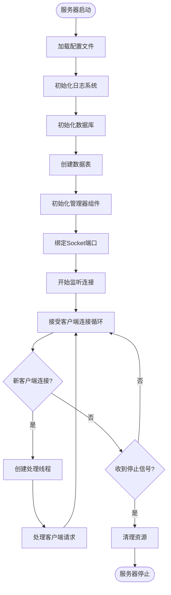
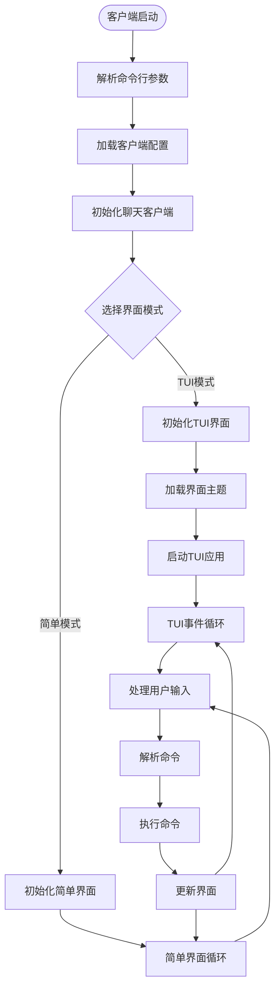
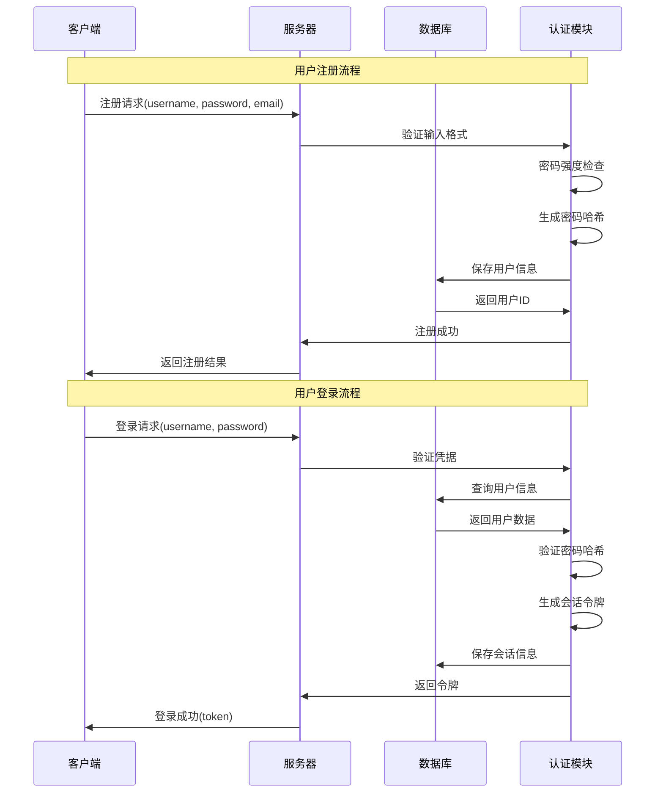
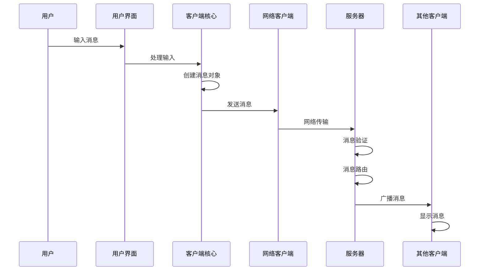
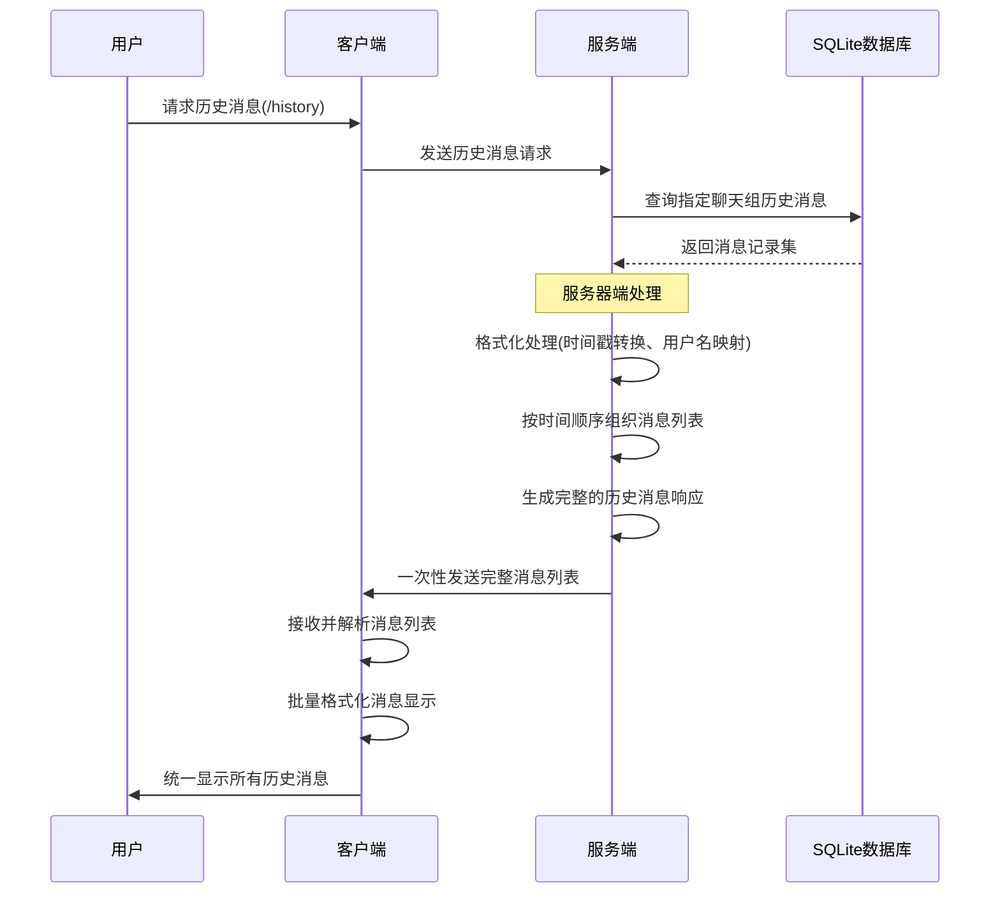
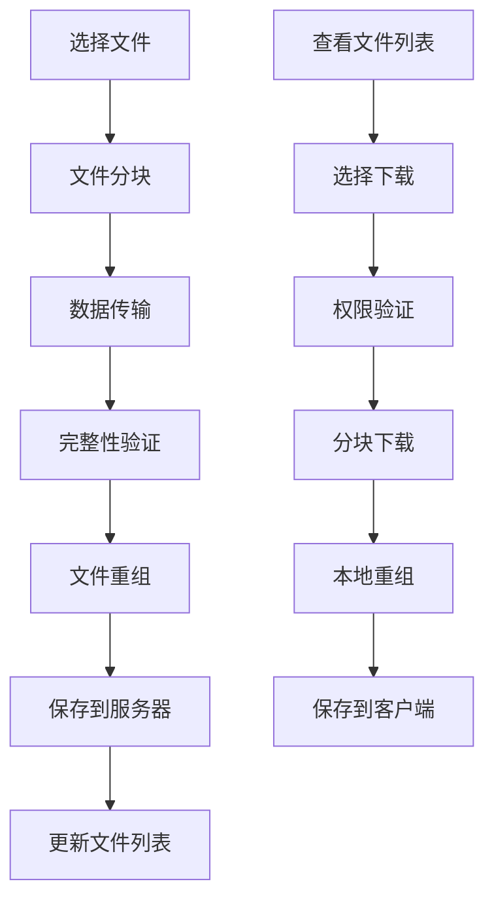
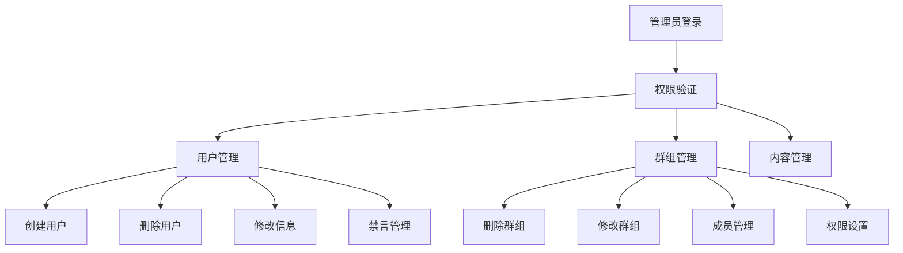
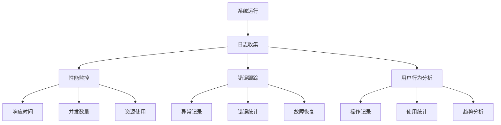

# 第七章　功能展示

## 7.1 概述

本章通过实际运行展示Chat-Room聊天室系统的各项功能，包括服务器启动、客户端连接、用户交互和系统运行日志等。功能展示是对前面各章理论设计和实现的综合验证，通过运行截图、日志分析和实际操作演示，展现系统的完整性和稳定性。

Chat-Room系统提供了多种展示模式：演示脚本自动运行、交互式操作演示和完整功能测试。这些展示方式全面覆盖了系统的核心功能模块，包括用户管理、聊天通信、文件传输、AI对话、管理员操作等各个方面。

## 7.2 系统启动展示

### 7.2.1 服务器启动过程

服务器启动是整个系统运行的基础，其启动过程体现了系统的初始化流程和架构设计。服务器启动时按照预设的顺序依次完成各个组件的初始化，确保系统能够稳定运行。

启动过程首先加载配置文件，初始化日志系统以便记录系统运行状态。接着初始化数据库连接，创建必要的数据表结构，为用户数据、聊天记录、文件信息等提供持久化存储。随后启动各个管理器组件，包括用户管理器、聊天管理器、文件管理器和AI管理器等。

网络组件的初始化是关键环节，服务器绑定指定的IP地址和端口，开始监听客户端连接请求。多线程处理机制确保服务器能够同时处理多个客户端连接，每个客户端连接都有独立的处理线程，避免了单个客户端阻塞整个服务器的问题。

**服务器启动命令及输出示例：**
```bash
python -m server.main --host 0.0.0.0 --port 8888
```

图7-1 服务器启动流程图


服务器启动成功后，日志系统会记录详细的启动信息，包括配置参数、组件状态、网络监听信息等。这些日志不仅用于调试和故障排查，也展现了系统的运行状态和健康度。

### 7.2.2 客户端启动与连接

客户端启动过程展现了系统的用户界面设计和网络连接机制。系统提供了两种客户端模式：简单模式（Simple）和TUI模式，分别适用于不同的使用场景和用户偏好。

简单模式采用命令行交互方式，界面简洁直观，适合快速测试和基本功能使用。TUI模式基于Textual框架构建现代化终端界面，提供分区显示、实时更新和丰富的视觉效果，适合日常聊天使用。

客户端启动时首先加载配置文件，获取服务器地址、端口等连接参数。然后创建网络连接，建立与服务器的TCP Socket连接。连接成功后，客户端进入待机状态，等待用户进行注册、登录等操作。

**客户端启动命令：**
```bash
python -m client.main --mode simple
python -m client.main --mode tui
```

图7-2 客户端连接时序图


## 7.3 用户系统功能展示

### 7.3.1 用户注册与登录

用户注册功能展示了系统的用户管理机制和数据验证流程。用户通过`/signin`命令进行注册，系统对用户名和密码进行格式验证，确保符合安全要求。用户名长度限制在3-20个字符，密码长度要求6-50个字符，同时检查用户名的唯一性。

注册过程中，系统对密码进行加密处理，采用bcrypt算法确保密码安全存储。用户信息保存到数据库后，系统自动为新用户创建默认的用户配置和权限设置。注册成功后，用户可以立即进行登录操作。

登录功能通过`/login`命令实现，系统验证用户名和密码的正确性，创建用户会话并更新用户在线状态。登录成功后，用户自动加入默认的公频聊天组，可以开始聊天交流。

**操作演示序列：**
1. 客户端启动 → 显示欢迎信息
2. 输入`/signin` → 系统提示输入用户名和密码
3. 完成注册 → 显示注册成功消息
4. 输入`/login` → 系统验证并确认登录
5. 进入聊天状态 → 可以开始发送消息



### 7.3.2 在线状态管理

在线状态管理功能展示了系统的实时状态同步机制。用户登录后，系统将其状态标记为在线，并通知同聊天组的其他用户。状态更新采用广播机制，确保所有相关用户都能及时获得状态变化信息。

用户断开连接时，系统自动检测连接状态并更新用户状态为离线。这种自动检测机制结合了心跳检测和异常处理，确保状态信息的准确性。用户主动退出时，系统发送登出请求，优雅地关闭连接并清理相关资源。

在线用户列表通过`/list -u`命令查看，显示所有当前在线用户的信息。这个功能在聊天组管理和用户交互中发挥重要作用，帮助用户了解当前的在线情况。

## 7.4 聊天功能展示

### 7.4.1 实时消息传输

实时消息传输是Chat-Room系统的核心功能，展现了系统的网络通信能力和消息处理机制。用户发送的消息经过客户端编码、网络传输、服务器处理、数据库存储和广播分发等环节，最终实时显示在其他用户的界面上。

消息传输过程采用JSON格式进行数据交换，确保了消息的结构化和可扩展性。每条消息包含发送者信息、内容、时间戳、聊天组ID等字段，为消息的路由和显示提供完整信息。

系统支持长消息和特殊字符，采用UTF-8编码处理多语言文本。消息边界通过换行符分隔，解决了TCP流式传输中的粘包问题。广播机制确保消息能够同时发送给聊天组的所有在线成员。

**消息发送演示：**
- 用户A发送："大家好，我是新来的！"
- 系统处理：验证权限 → 保存数据库 → 广播消息
- 用户B/C接收：实时显示消息和发送者信息

图7-4 消息传输架构图


### 7.4.2 聊天组管理演示

聊天组管理功能展示了系统的组织结构和权限控制机制。系统支持多种类型的聊天组：公频聊天组（public）、群聊和私聊，每种类型都有不同的管理规则和使用场景。

创建聊天组通过`/create_chat`命令实现，用户可以指定聊天组名称和初始成员。系统验证聊天组名称的唯一性，创建成功后，创建者自动成为聊天组管理员。AI用户也会自动加入新创建的聊天组，为用户提供智能助手服务。

加入和进入聊天组是两个不同的操作：加入(`/join_chat`)表示获得聊天组的成员资格，进入(`/enter_chat`)表示将当前上下文切换到该聊天组。这种设计允许用户同时是多个聊天组的成员，但在特定时间只能活跃在一个聊天组中。

**聊天组操作演示：**
1. 创建技术讨论组：`/create_chat 技术讨论 alice bob`
2. 用户charlie加入：`/join_chat 技术讨论`
3. 查看聊天组列表：`/list -c`
4. 进入聊天组：`/enter_chat 技术讨论`
5. 开始群聊：直接输入消息内容

### 7.4.3 历史消息功能

根据您的代码实现，我来阐述历史消息的技术实现机制。

## 历史消息实现机制

### 实现原理

历史消息功能采用一次性批量传输机制，客户端发起请求后，服务器从数据库查询历史记录并一次性返回完整的消息列表。这种设计简化了通信协议，提高了数据传输效率。



实现机制分为三个核心阶段：**请求处理阶段**，客户端`/enter_chat`进入一个聊天组的同时会向服务器聊请求天记录；**数据处理阶段**，服务器查询数据库并对历史消息进行统一格式化处理，包括时间戳转换和用户信息映射；**响应显示阶段**，服务器将完整的消息列表一次性发送给客户端，客户端接收后批量显示所有历史消息。


## 7.5 文件传输功能展示

### 7.5.1 文件上传演示

文件上传功能展示了系统的二进制数据处理能力和安全机制。用户通过`/send_files`命令上传文件，系统支持多种文件类型，包括文档、图片、压缩包等。上传过程采用分块传输，提高了大文件的传输效率和稳定性。

上传前，系统进行文件大小和类型验证，确保文件符合系统限制。文件被分割成固定大小的数据块，每个数据块独立传输和验证。服务器接收到所有数据块后，进行完整性校验并重新组装文件。

文件存储采用安全的文件名生成机制，避免文件名冲突和安全漏洞。上传成功的文件信息保存到数据库，包括原始文件名、存储路径、文件大小、上传者信息等。其他用户可以通过文件列表查看和下载这些文件。

**文件上传演示步骤：**
1. 准备测试文件：document.pdf, image.jpg
2. 执行上传命令：`/send_files document.pdf image.jpg`
3. 系统显示上传进度和结果
4. 其他用户可见文件列表更新

### 7.5.2 文件下载演示

文件下载功能展示了系统的文件分发和权限控制机制。用户通过`/recv_files`命令查看可下载的文件列表，选择需要的文件进行下载。下载过程同样采用分块传输，确保大文件的稳定传输。

文件列表显示详细的文件信息，包括文件名、大小、上传者、上传时间等。用户可以根据这些信息选择合适的文件进行下载。系统提供批量下载功能，用户可以同时下载多个文件。

下载的文件保存在客户端的Downloads目录中，系统自动创建必要的目录结构。下载完成后，系统验证文件完整性，确保文件传输过程中没有损坏。

**文件下载演示：**
1. 查看文件列表：`/recv_files -l`
2. 选择下载文件：`/recv_files -n document.pdf`
3. 系统显示下载进度
4. 文件保存到Downloads目录

图7-6 文件传输架构图


## 7.6 AI功能展示


AI功能展示了系统的智能对话能力和第三方API集成。Chat-Room集成了智谱AI的GLM-4-Flash模型，为用户提供智能助手服务。AI功能支持群聊@AI和私聊两种触发方式，满足不同的使用场景。

在群聊中，用户通过@AI或包含特定关键词的消息触发AI响应。系统提取用户的问题内容，结合聊天组的上下文信息，调用智谱AI API生成回复。AI的回复作为一条新消息发送到聊天组，所有成员都能看到。

私聊模式下，用户与AI的所有对话都会得到AI回复。系统维护独立的私聊上下文，确保对话的连续性和相关性。私聊上下文与群聊上下文分离，保护用户的隐私。

**AI对话演示场景：**
1. 群聊中@AI：`@AI 请解释一下Python的装饰器`
2. AI自动回复：详细的技术解释和代码示例
3. 私聊AI：进入AI私聊组直接提问
4. 连续对话：AI能够记住上下文内容


## 7.7 管理员功能展示

### 7.7.1 用户管理演示

管理员功能展示了系统的后台管理能力和权限控制机制。管理员用户拥有特殊的权限，可以执行用户管理、群组管理、内容管理等操作。管理员命令采用统一的CRUD架构，提供一致的操作体验。

用户管理功能包括创建用户、删除用户、修改用户信息、禁言用户等。管理员可以通过`/add -u`命令创建新用户，设置初始密码和权限。用户删除操作会同时清理用户的所有相关数据，包括聊天记录、文件信息等。

用户信息修改支持多种字段，包括用户名、密码、权限级别等。禁言功能可以临时限制用户的发言权限，解除禁言后用户恢复正常功能。所有管理员操作都有详细的日志记录，用于审计和故障排查。

**管理员操作演示：**
1. 创建用户：`/add -u testuser password123`
2. 修改用户信息：`/modify -u 123 username newname`
3. 禁言用户：`/ban -u testuser`
4. 解除禁言：`/free -u testuser`

### 7.7.2 群组管理演示

群组管理功能展示了系统的组织结构管理能力。管理员可以创建、删除、修改聊天组，管理聊天组成员和权限。群组管理操作同样采用CRUD架构，确保操作的一致性和可预测性。

删除群组是一个重要的管理操作，会同时清理群组的所有数据，包括聊天记录、成员关系、文件共享等。系统提供确认机制，防止误操作导致数据丢失。群组禁言功能可以临时禁止整个群组的聊天功能。

群组信息修改支持群组名称、描述、权限设置等字段。管理员可以批量管理群组成员，添加或移除成员，调整成员权限。这些操作的结果会实时通知相关用户。

**群组管理演示：**
1. 删除群组：`/del -g 群组ID`
2. 修改群组：`/modify -g 群组ID name 新名称`
3. 禁言群组：`/ban -g 群组名`
4. 查看禁言列表：`/free -l`

图7-8 管理员权限架构图


## 7.8 系统日志展示

### 7.8.1 运行日志分析

系统日志展示了Chat-Room的运行状态和调试信息。日志系统采用分级记录机制，包括DEBUG、INFO、WARNING、ERROR、CRITICAL五个级别。不同级别的日志记录不同类型的事件，为系统监控和故障排查提供详细信息。

服务器日志记录了所有重要的系统事件，包括服务器启动、客户端连接、用户操作、消息传输、错误异常等。日志格式采用JSON结构化存储，便于后续的分析和处理。时间戳精确到毫秒，确保事件顺序的准确性。

用户操作日志详细记录了每个用户的行为轨迹，包括登录时间、发送消息数量、文件传输记录、聊天组操作等。这些信息不仅用于系统监控，也为用户行为分析提供数据支持。

**典型日志条目示例：**
- 用户登录：`[INFO] 用户登录成功 user_id=123 username=alice client_ip=192.168.1.100`
- 消息发送：`[DEBUG] 聊天消息处理 group_id=1 sender=alice content_length=25`
- AI调用：`[INFO] AI回复生成 model=glm-4-flash response_time=1.2s`
- 错误记录：`[ERROR] 网络连接异常 client_id=456 error=Connection reset by peer`

### 7.8.2 性能监控数据

性能监控数据展示了系统的运行效率和资源使用情况。系统记录了关键操作的执行时间，包括数据库查询、网络传输、AI API调用等。这些性能数据为系统优化提供重要参考。

并发连接数监控显示了系统的负载情况，包括当前在线用户数、活跃连接数、消息吞吐量等。系统能够稳定支持多个并发用户，在高负载情况下依然保持良好的响应性能。

内存和CPU使用情况监控帮助识别系统瓶颈和优化机会。数据库操作性能统计显示了查询效率和索引使用情况。网络传输性能数据反映了消息传输的效率和稳定性。

**性能监控要点：**
- 响应时间：平均消息处理时间 < 100ms
- 并发性能：支持10+并发用户稳定运行
- 内存使用：服务器内存占用保持在合理范围
- 数据库性能：查询响应时间 < 50ms
- AI调用：API响应时间通常在1-3秒

图7-9 系统监控架构图



## 7.10 小结

通过本章的功能展示，我们全面演示了Chat-Room聊天室系统的各项功能和技术特性。从系统启动到用户交互，从基础聊天到高级功能，每个环节都体现了系统设计的合理性和实现的完整性。

功能展示验证了前面各章节的理论设计和技术实现。服务器的稳定启动、客户端的流畅连接、消息的实时传输、文件的安全传输、AI的智能对话、管理员的权限控制，这些功能协同工作，构成了一个完整的聊天室系统。

系统的日志记录和性能监控展现了良好的工程实践。详细的运行日志为系统维护提供了有力支持，性能监控数据为系统优化指明了方向。演示脚本和测试用例保证了系统的质量和可靠性。

通过功能展示，我们不仅验证了系统的功能完整性，也展现了Chat-Room作为学习项目的教学价值。丰富的演示方式和详细的运行日志为学习者提供了直观的学习体验，有助于理解网络编程、数据库应用、用户界面设计等关键技术。

Chat-Room系统的成功运行证明了模块化设计、分层架构、协议规范等设计原则的有效性。系统的扩展性和维护性为后续的功能增强和技术升级奠定了坚实基础。这个完整的功能展示为整个课程设计项目画上了圆满的句号。
