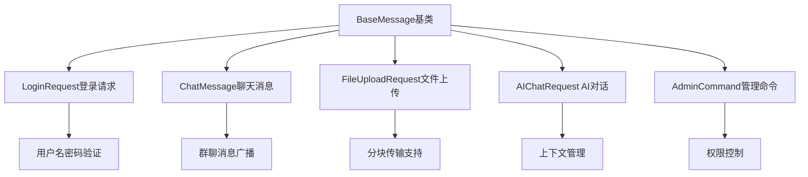
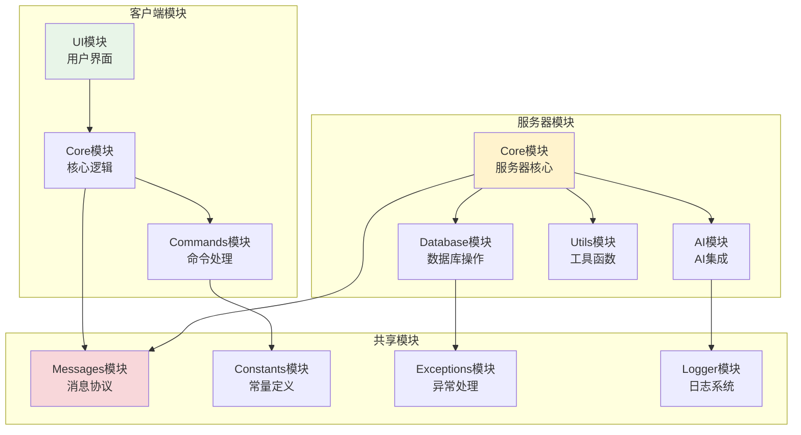
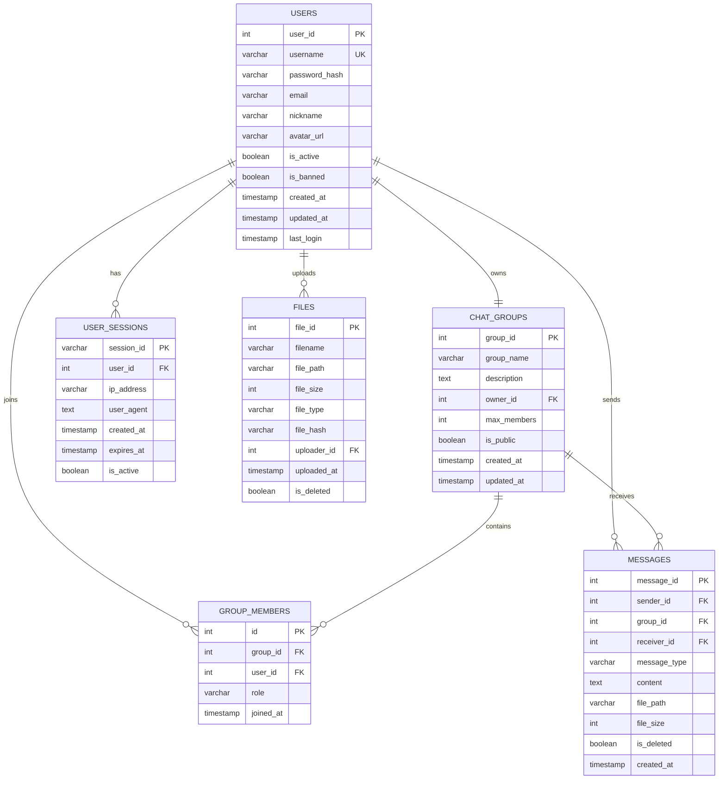
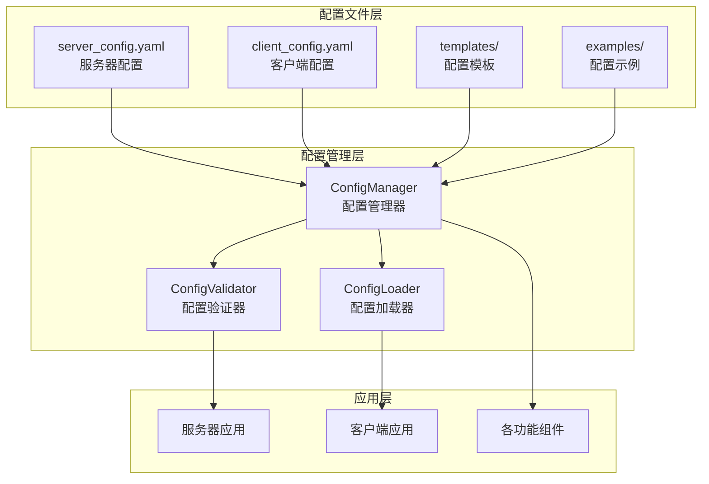
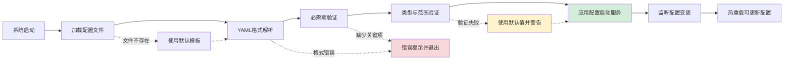

# 第八章 创新点与技术亮点

## 8.1 引言

Chat-Room项目在实现过程中，不仅遵循了经典的网络编程模式和软件工程原则，更在多个技术维度上展现了创新性的设计思路和实现方案。本章将从消息协议创新设计、模块化架构设计、数据库设计应用和AI集成创新应用四个方面，系统阐述项目的技术亮点和创新之处。

这些创新点不仅体现在技术实现的巧妙性上，更重要的是它们为解决实际的工程问题提供了有效的方案。通过对这些创新设计的深入分析，可以看出现代网络应用开发中技术选型、架构设计和功能实现的演进趋势。

## 8.2 消息协议创新设计

### 8.2.1 自定义JSON协议结构

Chat-Room项目设计了一套基于JSON的自定义消息协议，该协议在保持简洁性的同时，具备了良好的扩展性和类型安全性。协议采用面向对象的设计思想，将不同类型的消息封装为独立的数据类，形成了层次化的消息类型体系。




协议设计的核心理念是"消息即对象"，每个消息都包含完整的语义信息和必要的元数据。基础消息类BaseMessage定义了所有消息的共同属性，包括消息类型、时间戳和消息ID等。这种设计使得协议具备了强类型特性，能够在编译时发现协议错误，显著提高了系统的可靠性。

```python
@dataclass
class BaseMessage:
    message_type: str = ""
    timestamp: float = field(default_factory=time.time)
    message_id: str = field(default_factory=lambda: str(uuid.uuid4()))

@dataclass
class ChatMessage(BaseMessage):
    sender_id: int = 0
    sender_username: str = ""
    chat_group_id: int = 0
    content: str = ""
```

### 8.2.2 协议扩展性与兼容性

协议设计充分考虑了未来功能扩展的需求，采用了版本化管理和向后兼容的策略。通过在消息头部添加协议版本信息，系统能够同时支持多个协议版本，确保在功能升级过程中不会影响现有客户端的正常使用。

协议的扩展性主要体现在三个方面：首先是消息类型的可扩展性，新的业务功能可以通过增加新的消息类型来实现，而不需要修改现有的协议结构；其次是消息字段的可扩展性，利用JSON格式的灵活性，可以在不破坏兼容性的前提下为现有消息类型添加新的字段；最后是消息处理逻辑的可扩展性，通过工厂模式和策略模式的应用，新的消息处理器可以无缝集成到现有的处理框架中。


## 8.3 模块化架构设计


Chat-Room项目的架构设计严格遵循了模块化设计的核心原则，实现了真正意义上的低耦合高内聚。每个模块都有明确的职责边界和接口定义，模块间的依赖关系通过依赖注入和接口抽象来管理，避免了直接的实现依赖。



高内聚的实现体现在每个模块内部功能的紧密相关性上。以用户管理模块为例，它将用户注册、登录、会话管理、状态跟踪等相关功能集中在一个模块内，形成了完整的用户生命周期管理功能。低耦合的实现则通过接口抽象和事件驱动的方式来达成，模块间的交互都通过明确定义的接口进行，避免了实现细节的泄露。


### 8.3.3 可扩展性分析

模块化架构设计的最大价值在于其出色的可扩展性。项目在设计之初就考虑了多种扩展场景，包括功能扩展、性能扩展和部署扩展等。功能扩展通过插件系统来实现，新功能可以作为独立的插件开发和部署，不需要修改核心代码。性能扩展通过水平扩展的架构设计来支持，关键组件都设计为无状态或者状态可共享的形式，便于在多服务器环境中部署。

项目的扩展性还体现在其对新技术栈的适应能力上。由于采用了接口抽象和依赖注入的设计模式，底层实现可以在不影响上层业务逻辑的情况下进行替换。例如，数据库可以从SQLite迁移到MySQL或PostgreSQL；网络传输可以从TCP Socket升级到WebSocket；AI服务可以从智谱AI切换到其他AI服务提供商。


## 8.4 数据库设计与应用

### 8.4.1 关系模型优化设计

Chat-Room项目的数据库设计充分体现了关系数据库理论在实际应用中的优秀实践。数据库模式设计遵循了第三范式的要求，避免了数据冗余和更新异常问题。同时，针对聊天应用的特殊需求，在某些关键查询场景下适度引入了反范式设计，以优化查询性能。



数据库设计的创新之处在于对聊天应用特殊需求的深度考虑。例如，将群聊和私聊统一建模为聊天组概念，简化了业务逻辑的复杂性；引入消息类型字段支持文本、文件、系统消息等多种消息类型；设计了灵活的用户权限模型，支持普通用户、管理员和AI用户等不同角色。


## 8.5 AI集成的创新应用

### 8.5.1 上下文管理机制

上下文管理是AI对话系统的核心组件，Chat-Room项目设计了一套智能的上下文管理机制，能够自动维护和优化对话上下文。上下文管理器采用滑动窗口的策略，自动控制上下文的长度，在保证对话连贯性的同时避免token超限的问题。

上下文管理的创新之处在于其对不同对话场景的适应性。系统能够根据对话的类型（群聊或私聊）、对话的活跃度、用户的参与程度等因素动态调整上下文的保留策略。对于活跃的群聊，系统会保留更多的近期消息以维护讨论的连贯性；对于长时间的私聊，系统会采用更智能的消息筛选策略，保留关键的对话节点。

```python
class ContextManager:
    def get_context(self, context_id: str, is_group_chat: bool) -> List[AIMessage]:
        """获取优化的对话上下文"""
        messages = self._load_raw_context(context_id)
        
        if is_group_chat:
            # 群聊：保留最近的活跃对话
            return self._optimize_group_context(messages)
        else:
            # 私聊：保留完整的对话历史
            return self._optimize_private_context(messages)
```

### 8.5.2 智能对话体验优化

为了提供更自然和智能的对话体验，项目在AI集成层面实施了多项优化策略。首先是智能触发机制的设计，系统不仅支持显式的@AI触发，还能够通过关键词识别、语义分析等方式智能判断用户是否需要AI回复。这种设计避免了AI的过度活跃，确保AI只在用户真正需要的时候参与对话。

响应质量优化是另一个重要的创新点。系统根据不同的对话场景使用不同的提示词模板，群聊场景下AI会更加注重回复的简洁性和社交性，私聊场景下AI则会提供更详细和个性化的回复。

## 8.6 智能配置管理系统

### 8.6.1 基于YAML的配置架构

Chat-Room项目实现了一套完整的配置管理系统，采用YAML格式作为配置文件标准，为系统提供了灵活、可读的配置解决方案。配置系统的设计理念是"配置即代码"，通过结构化的配置文件实现了系统参数的统一管理和版本控制。




配置系统采用分层架构设计，底层是基础的ConfigManager类，提供配置文件的加载、保存、验证等核心功能。中间层是针对不同应用类型的专用配置类，如ServerConfig和ClientConfig，封装了特定的配置访问接口。上层是各个功能模块，通过统一的配置接口获取所需的参数。


### 8.6.2 配置的加载与验证

Chat-Room项目实现了一套完整的配置加载与验证体系，该体系确保了配置的正确性和完整性，同时提供了强大的容错能力。配置系统采用多层验证策略，从文件存在性检查到格式验证、类型验证和依赖关系验证，形成了全方位的配置安全保障。

系统启动时，配置管理器首先检查配置文件的存在性和可读性，然后解析YAML格式并进行结构完整性验证。在基础验证通过后，系统对关键配置项进行必需性检查，确保所有核心功能所需的参数都已正确配置。对于数值型配置，系统还会进行合理性范围验证，例如端口号必须在有效范围内，确保配置的实用性。

```python
class DatabaseManager:
    def __init__(self, config: ServerConfig):
        # 从配置中获取数据库参数
        self.db_path = config.get_database_path()
        self.max_connections = config.get('database.max_connections', 10)
        self.timeout = config.get('database.timeout', 30)
        
        # 验证并应用配置
        if not self.db_path.parent.exists():
            self.db_path.parent.mkdir(parents=True, exist_ok=True)
        
        self.connection_pool = self._create_connection_pool()

class AIService:
    def __init__(self, config: ServerConfig):
        # 从配置中获取AI服务参数
        self.api_key = config.get_ai_api_key()
        self.model = config.get('ai.model', 'glm-4-flash')
        self.max_tokens = config.get('ai.max_tokens', 1000)
        self.temperature = config.get('ai.temperature', 0.7)
        
        # 验证API密钥配置
        if not self.api_key:
            raise ValueError("AI API密钥未配置")
```

系统的容错机制采用智能降级策略。对于非关键配置项的错误，系统使用预设默认值并记录警告日志；对于关键配置项的错误，系统提供详细的错误信息和修复建议。配置系统还支持部分配置项的动态重载，某些参数修改可以在运行时生效，提高了运维效率。



配置系统还支持从环境变量迁移配置，这对于容器化部署和云环境部署特别有用。系统提供了配置迁移工具，能够自动检测相关的环境变量并生成对应的YAML配置文件，简化了从传统部署方式到现代化配置管理的迁移过程。

通过这套完整的配置管理系统，Chat-Room项目实现了配置的标准化、自动化和可维护性，为系统的长期运维和扩展提供了重要支撑。

## 8.9 小结

本章从消息协议创新设计、模块化架构设计、数据库设计应用、AI集成创新应用和智能配置管理系统五个维度，系统分析了Chat-Room项目的技术亮点和创新之处。这些创新不仅体现了现代软件开发的最佳实践，更为解决实际的工程问题提供了有效的方案。

**技术创新总结**：

- **协议设计创新**：基于JSON的自定义协议实现了可读性与效率的良好平衡
- **架构设计创新**：模块化和插件化设计为系统提供了出色的可扩展性
- **数据库设计创新**：关系模型优化和索引策略为系统提供了良好的性能基础
- **AI集成创新**：双模式AI交互和智能上下文管理提供了优秀的用户体验
- **配置管理创新**：基于YAML的配置系统实现了灵活、可维护的参数管理


**发展潜力**：

虽然当前的设计仍存在一些局限性，但项目具备了良好的技术演进基础。通过异步I/O模型、分布式架构、多协议支持等技术升级，系统可以逐步演进为支持大规模商用的聊天平台。这些创新设计不仅为当前项目提供了技术支撑，也为未来的技术演进奠定了坚实的基础。

通过对这些创新点的深入分析，我们可以看出现代网络应用开发中技术选型、架构设计和功能实现的重要原则和发展趋势，这对于理解和掌握网络编程的核心技术具有重要的参考价值。
