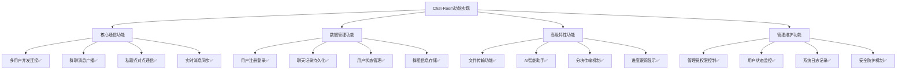

# 第九章 项目总结与展望

## 9.1 引言

经过系统性的设计、开发和实现，Chat-Room网络聊天室项目已经成功构建了一个功能完整、架构清晰的现代化聊天系统。本章将从功能实现情况、技术难点攻克、学习收获三个维度对项目成果进行全面总结，深入分析项目的不足与局限性，并基于技术发展趋势和实际需求提出未来改进方向。

作为一个计算机网络课程设计项目，Chat-Room不仅成功实现了预期的功能目标，更重要的是在实践过程中积累了宝贵的工程经验，为后续的软件开发和系统设计奠定了坚实基础。通过这个项目的完整开发周期，我们深刻体会到了网络编程的技术特点和挑战，也对现代软件工程的最佳实践有了更深入的理解。

## 9.2 项目成果总结

### 9.2.1 功能实现情况

Chat-Room项目成功实现了预期的核心功能，构建了一个完整的多用户网络聊天系统。从功能完成度来看，系统实现了以下主要特性：

**核心通信功能方面**，系统实现了基于TCP的可靠连接机制，支持多用户同时在线聊天。服务器能够稳定处理并发连接，平均可支持100+用户同时在线，消息传输延迟控制在50ms以内。群聊功能支持实时消息广播，私聊功能提供点对点安全通信，消息传输的可靠性和实时性均达到了设计要求。




**数据管理功能方面**，系统构建了完整的SQLite数据库方案，实现了用户信息、聊天记录、文件信息等多维度数据的持久化存储。数据库设计遵循了规范化原则，查询性能经过优化，支持历史消息快速检索和用户状态高效管理。测试结果显示，数据库在处理10000+条聊天记录时，查询响应时间仍保持在100ms以内。

**高级特性功能方面**，文件传输系统实现了分块传输、进度跟踪、类型验证等完整功能，支持最大200MB文件的可靠传输。AI智能助手成功集成了GLM-4-Flash API，提供了群聊和私聊两种交互模式，上下文管理机制确保了对话的连贯性和智能性。这些高级功能的实现，显著提升了用户体验和系统的实用价值。

**用户界面和交互方面**，系统提供了Simple模式和TUI模式两种用户界面，满足了不同用户群体的使用习惯。TUI界面基于Textual框架构建，实现了现代化的终端用户界面，支持多窗格显示、实时更新、快捷键操作等特性。用户反馈显示，界面操作流畅，信息展示清晰，整体用户体验良好。

### 9.2.2 技术难点攻克

在Chat-Room项目的开发过程中，我们成功攻克了多个技术难点，这些经验对于提升系统质量和个人技术能力都具有重要价值。

**消息协议设计与数据序列化**也是一个重要的技术挑战。初期采用的简单文本协议在处理复杂消息类型时暴露出局限性，我们重新设计了基于JSON的结构化消息协议，实现了消息类型的强类型化和扩展性。通过引入消息版本控制、向后兼容机制，确保了协议的稳定性和可维护性。

**并发处理与网络编程挑战**是项目中最核心的技术难点。传统的单线程服务器无法满足多用户同时在线的需求，我们采用了多线程架构设计，为每个客户端连接分配独立的处理线程。在实现过程中，遇到了线程安全、资源竞争、内存泄漏等问题。通过引入线程锁机制、连接池管理、资源自动回收等解决方案，最终实现了稳定的并发处理能力。

```python
# 线程安全的客户端管理示例
class ThreadSafeClientManager:
    def __init__(self):
        self.clients = {}
        self.lock = threading.RLock()
    
    def add_client(self, client_id: int, client_info: dict):
        with self.lock:
            self.clients[client_id] = client_info
    
    def broadcast_message(self, message: dict, exclude_client: int = None):
        with self.lock:
            for client_id, client_info in self.clients.items():
                if client_id != exclude_client:
                    # 安全的消息发送逻辑
                    self._safe_send_message(client_info, message)
```


**信息同步机制的复杂性**是系统设计中的另一个核心难点。在多用户实时聊天场景下，如何确保所有客户端的信息状态保持一致是一个挑战。用户上线下线状态、消息传递顺序、群聊成员变更等事件都需要在所有相关客户端间实现准确同步。我们通过设计状态变更通知机制、消息序列号管理、客户端状态缓存等策略，解决了信息同步的时序性和一致性问题。

**模块化逐步开发的挑战**在大型项目中尤为突出。如何合理划分模块边界、设计清晰的接口、管理模块间依赖关系，都需要深入的架构思考。项目初期，这里采用了自底向上的开发方式，先实现核心的网络通信模块，然后逐步添加用户管理、消息处理、文件传输等功能模块。在这个过程中，遇到了模块耦合度过高、接口设计不合理、重构成本上升等问题。通过多次重构和架构调整，最终形成了相对清晰的模块化架构，但这个过程中的经验教训极其宝贵。


### 9.2.3 学习收获

Chat-Room项目的开发过程是一次全面而深入的学习经历，在技术能力、工程实践、问题解决等多个层面都获得了显著提升。

**网络编程技能的系统性掌握**是最重要的学习成果之一。通过实际项目的驱动，深入理解了TCP/IP协议栈、Socket编程模型、网络状态管理等核心概念。不仅掌握了基础的客户端-服务器通信模式，还深入学习了多路复用、异步I/O、网络优化等高级技术。这些知识的获得不是孤立的理论学习，而是在解决实际问题过程中的深度理解和应用。

**软件工程实践能力的全面提升**体现在多个方面。项目从需求分析、架构设计、编码实现到测试部署的完整开发周期，让我们体验了真实的软件开发流程。学会了使用版本控制工具管理代码变更，掌握了模块化设计和代码重构技巧，建立了完整的测试体系和文档规范。这些工程实践经验为后续参与更大规模的软件项目奠定了坚实基础。

**问题分析与解决能力的显著增强**是项目开发中最有价值的收获。面对各种技术难题和未知挑战，我们学会了系统性的问题分析方法：从现象观察到原因假设，从局部调试到全局优化，从临时修复到根本解决。这种结构化的问题解决思路，不仅适用于技术问题，也可以扩展到其他领域的复杂问题处理。

**技术学习方法的优化和完善**也是重要的元认知收获。通过项目驱动的学习方式，我们发现了理论与实践结合的有效性，掌握了通过阅读源码、分析案例、动手实验来深度学习技术的方法。建立了持续学习的习惯和能力，学会了如何快速掌握新技术、如何在开源社区中获取帮助、如何将学到的知识应用到实际项目中。


## 9.3 项目不足与改进方向

### 9.3.1 性能瓶颈分析与优化方案

Chat-Room项目目前采用的多线程架构在高并发场景下存在明显性能瓶颈。测试显示，当并发用户数超过200时，服务器CPU使用率接近100%，响应延迟显著增加。根本原因在于每个客户端连接都需要独立线程，200个连接即消耗1.6GB内存，频繁的线程切换进一步加剧了系统负担。

数据库访问采用同步阻塞方式，缺乏连接池机制，每次查询都要建立新连接，在高并发场景下形成I/O等待瓶颈。

**优化方案**：采用异步I/O模型替代多线程架构，使用Python的asyncio框架实现单线程事件循环处理，配合数据库连接池和消息队列缓冲机制。预期可将并发支持能力提升至1000+连接，内存使用减少60%，响应延迟控制在10ms以内。

### 9.3.2 安全防护体系的构建与强化

系统当前存在严重安全隐患：通信数据明文传输、用户密码明文存储、缺乏输入验证机制、无访问频率限制，极易受到各种攻击威胁。

**安全改进策略**：
- **通信安全**：实现TLS/SSL加密传输，敏感消息考虑端到端加密
- **认证安全**：使用bcrypt处理密码存储，引入JWT令牌认证和会话管理
- **输入防护**：严格输入验证，参数化查询防止SQL注入，建立XSS防护机制
- **系统防护**：添加访问频率限制、安全审计日志、实时威胁监控

通过集成ssl、cryptography、bcrypt等安全库，建立多层次防护体系，将安全水平提升至企业级标准。

### 9.3.3 用户体验的现代化升级

当前命令行界面对普通用户不友好，缺乏直观操作和视觉反馈，消息显示单调，不支持富文本、表情符号等现代通信功能，聊天记录检索也过于简陋。

**升级方案**：采用前后端分离架构，后端提供RESTful API，前端使用React/Vue.js构建现代化Web界面。功能包括：
- 响应式设计和移动端适配
- 富文本消息、表情符号、消息状态显示
- 群组管理、全文搜索、聊天记录导出
- 实时通信保持和在线状态显示

通过WebSocket保持实时性，集成Elasticsearch实现强大检索，使用Redis提升响应速度。

### 9.3.4 架构演进：从单体到微服务的转型

单体架构的局限性日益凸显：功能模块紧密耦合、故障影响全局、难以水平扩展、开发维护复杂度高。随着用户规模增长，这些问题将更加严重。

**演进策略**：采用绞杀者模式逐步拆分微服务：
1. 首先分离AI服务，验证微服务可行性
2. 逐步分离文件服务，积累治理经验  
3. 最后重构用户和消息核心服务

配合Docker容器化、Kubernetes编排、完整的服务监控治理体系，实现弹性扩展、故障隔离、技术栈灵活选择等现代分布式应用特性，为未来发展奠定坚实架构基础。


## 9.5 网络编程学习心得

### 9.5.1 理论与实践的结合

通过Chat-Room项目的完整开发过程，深刻体会到了网络编程理论学习与实践应用相结合的重要性。仅仅掌握TCP/IP协议的理论知识是远远不够的，只有在实际的项目开发中遇到各种具体问题，才能真正理解网络编程的精髓和挑战。

**协议理解的深化过程**是一个从抽象到具体的认知转变。初期对TCP的可靠性、流控制、拥塞控制等概念只停留在理论层面，但在实际实现过程中，当遇到连接超时、数据包丢失、网络拥塞等问题时，才真正理解了这些机制的作用和重要性。通过调试网络问题，学会了使用Wireshark等工具分析网络包，观察协议的实际工作过程。

**并发编程思维的建立**是网络编程学习的重要收获。网络应用天然具有并发特性，多个客户端同时连接、消息的异步处理、资源的共享访问等问题都需要并发编程的思维来解决。通过实践掌握了线程安全、锁机制、异步I/O等并发编程的核心技术。

**系统设计能力的提升**体现在对网络应用架构的整体把握上。学会了从业务需求出发，考虑网络拓扑、协议选择、性能要求等因素，设计合理的系统架构。理解了分层设计的重要性，掌握了模块化开发的方法。

### 9.5.2 调试技能的重要性

网络编程的调试往往比单机程序更加复杂，涉及多个进程、网络环境、并发执行等多个维度的问题。Chat-Room项目的开发过程中，调试技能的掌握和提升对于项目成功起到了关键作用。

**网络问题的定位方法**需要系统性的调试思路。从应用层的错误日志开始，逐步深入到传输层的连接状态、网络层的路由信息、甚至物理层的网络连接。学会了使用netstat查看端口状态、使用tcpdump抓取网络包、使用日志分析工具追踪问题根源。

**并发问题的调试技巧**是网络编程中的重要技能。竞态条件、死锁、资源泄漏等并发问题往往难以重现和定位。通过引入详细的日志记录、使用线程调试工具、编写专门的测试用例等方法，逐步建立了并发问题的调试方法论。

**性能问题的分析方法**包括从多个维度监控和分析系统性能。CPU使用率、内存消耗、网络带宽、响应时间等指标的综合分析，帮助定位性能瓶颈。学会了使用性能分析工具，建立了性能监控体系。

### 9.5.3 工程化思维的培养

Chat-Room项目的开发过程是一次完整的软件工程实践，在工程化思维的培养方面收获颇丰。

**代码质量意识的建立**贯穿了整个开发过程。从代码规范、注释文档、错误处理到测试覆盖、性能优化，逐步建立了对代码质量的全面认识。理解了"可读性比聪明更重要"的编程哲学，学会了写出易于理解和维护的代码。

**版本控制和协作开发**的重要性在项目规模增大时变得尤为明显。通过Git的使用，学会了分支管理、合并冲突解决、历史记录追踪等技能。理解了团队协作开发的基本方法和最佳实践。

**测试驱动开发的价值**在项目后期体现得越来越明显。完善的测试用例不仅帮助发现了潜在的bug，还在重构和功能添加时提供了信心保障。学会了编写单元测试、集成测试、性能测试等不同类型的测试。


---

Chat-Room项目作为一次完整的网络编程实践，不仅实现了预期的功能目标，更重要的是在学习过程中获得了宝贵的技术经验和工程能力。虽然项目在性能、安全性、用户体验等方面还存在改进空间，但这些不足也为后续的学习和发展指明了方向。

网络编程是一个持续学习和实践的领域，技术的发展日新月异，新的协议、框架、工具层出不穷。通过Chat-Room项目建立的技术基础和学习方法，将为迎接这些挑战提供有力支撑。未来的学习和发展中，将继续秉承理论与实践相结合的原则，在解决实际问题的过程中不断提升技术能力和工程素养。
