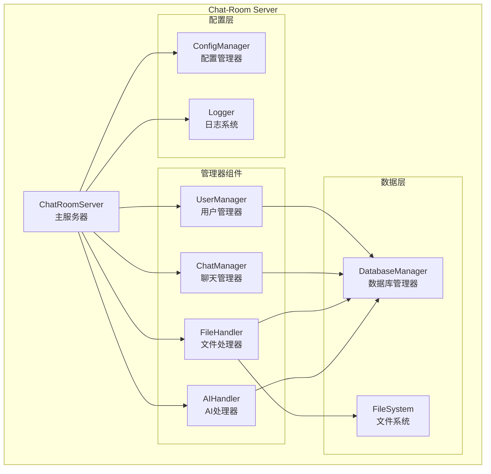
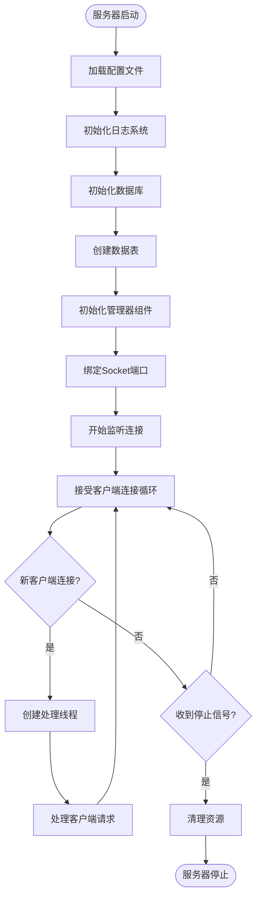

# Chat-Room 服务器端文档

## 📋 概述

Chat-Room服务器端是整个聊天室系统的核心，负责处理客户端连接、用户认证、消息路由、数据存储等核心功能。服务器采用多线程架构，支持并发连接，提供稳定可靠的聊天服务。

## 🏗️ 服务器架构

### 核心组件架构



### 服务器启动流程



## 🔧 核心模块

### 主服务器 (server/core/server.py)

#### ChatRoomServer类

```python
class ChatRoomServer:
    """聊天室服务器主类"""
    
    def __init__(self, host: str = "localhost", port: int = 8888):
        """
        初始化服务器
        
        Args:
            host: 服务器监听地址
            port: 服务器监听端口
        """
```

**主要方法**:
- `start()`: 启动服务器
- `stop()`: 停止服务器
- `handle_client(client_socket, address)`: 处理客户端连接
- `broadcast_message(message, exclude_client=None)`: 广播消息
- `remove_client(client_socket)`: 移除客户端连接

**配置参数**:
```yaml
server:
  host: "localhost"
  port: 8888
  max_connections: 100
  timeout: 30
```

### 用户管理器 (server/core/user_manager.py)

#### UserManager类

负责用户注册、登录、会话管理等功能。

**核心功能**:

1. **用户注册**
```python
def register_user(self, username: str, password: str) -> Tuple[bool, str]:
    """
    注册新用户
    
    Args:
        username: 用户名（3-20字符，字母数字下划线）
        password: 密码（6-50字符）
        
    Returns:
        (成功标志, 消息)
    """
```

2. **用户登录**
```python
def login_user(self, username: str, password: str) -> Tuple[bool, str, Optional[dict]]:
    """
    用户登录验证
    
    Args:
        username: 用户名
        password: 密码
        
    Returns:
        (成功标志, 消息, 用户信息)
    """
```

3. **会话管理**
```python
def create_session(self, user_id: int, client_socket) -> str:
    """创建用户会话"""
    
def get_session(self, session_token: str) -> Optional[dict]:
    """获取会话信息"""
    
def remove_session(self, session_token: str) -> bool:
    """移除会话"""
```

4. **在线状态管理**
```python
def set_user_online(self, user_id: int, client_socket) -> None:
    """设置用户在线状态"""
    
def set_user_offline(self, user_id: int) -> None:
    """设置用户离线状态"""
    
def get_online_users(self) -> List[dict]:
    """获取在线用户列表"""
```

### 聊天管理器 (server/core/chat_manager.py)

#### ChatManager类

负责聊天组管理、消息处理、历史记录等功能。

**核心功能**:

1. **聊天组管理**
```python
def create_chat_group(self, name: str, creator_id: int, members: List[int] = None) -> Tuple[bool, str]:
    """创建聊天组"""
    
def join_chat_group(self, group_name: str, user_id: int) -> Tuple[bool, str]:
    """加入聊天组"""
    
def enter_chat_group(self, group_name: str, user_id: int) -> Tuple[bool, str]:
    """进入聊天组"""
```

2. **消息处理**
```python
def send_message(self, group_id: int, user_id: int, content: str, message_type: str = "text") -> bool:
    """发送消息到聊天组"""
    
def broadcast_to_group(self, group_id: int, message: dict, exclude_user: int = None) -> None:
    """向聊天组广播消息"""
```

3. **历史消息**
```python
def get_chat_history(self, group_id: int, limit: int = 50, offset: int = 0) -> List[dict]:
    """获取聊天历史"""
    
def search_messages(self, group_id: int, keyword: str, limit: int = 20) -> List[dict]:
    """搜索消息"""
```

### 文件处理器 (server/core/file_handler.py)

#### FileHandler类

负责文件上传、下载、存储管理等功能。

**核心功能**:

1. **文件上传**
```python
def handle_file_upload(self, user_id: int, group_id: int, file_data: bytes, 
                      filename: str, file_size: int) -> Tuple[bool, str]:
    """处理文件上传"""
```

2. **文件下载**
```python
def handle_file_download(self, user_id: int, file_id: str) -> Tuple[bool, str, bytes]:
    """处理文件下载"""
```

3. **文件管理**
```python
def list_group_files(self, group_id: int) -> List[dict]:
    """列出聊天组文件"""
    
def delete_file(self, file_id: str, user_id: int) -> Tuple[bool, str]:
    """删除文件"""
```

**文件存储结构**:
```
server/data/files/
├── uploads/
│   ├── 2025/
│   │   ├── 06/
│   │   │   ├── 16/
│   │   │   │   ├── {file_id}_{original_name}
```

**配置参数**:
```yaml
file_transfer:
  max_file_size: 10485760  # 10MB
  allowed_types: [".txt", ".pdf", ".jpg", ".png", ".doc", ".docx"]
  upload_dir: "server/data/files/uploads"
```

### AI处理器 (server/ai/ai_handler.py)

#### AIHandler类

负责智谱AI集成、智能回复等功能。

**核心功能**:

1. **AI回复判断**
```python
def should_respond_to_message(self, message: str, group_id: int, user_id: int) -> bool:
    """判断是否需要AI回复"""
```

2. **生成AI回复**
```python
def generate_ai_response(self, message: str, context: dict) -> str:
    """生成AI回复"""
```

3. **上下文管理**
```python
def update_conversation_context(self, user_id: int, group_id: int, message: str) -> None:
    """更新对话上下文"""
```

**AI配置**:
```yaml
ai:
  enabled: true
  api_key: "your-zhipu-ai-api-key"
  model: "glm-4-flash"
  max_tokens: 1000
  temperature: 0.7
  context_window: 10  # 保留最近10条消息作为上下文
```

## 🗄️ 数据库设计

### 数据表结构

#### users表 - 用户信息
```sql
CREATE TABLE users (
    id INTEGER PRIMARY KEY AUTOINCREMENT,
    username TEXT UNIQUE NOT NULL,
    password_hash TEXT NOT NULL,
    created_at TIMESTAMP DEFAULT CURRENT_TIMESTAMP,
    last_login TIMESTAMP,
    is_active BOOLEAN DEFAULT 1
);
```

#### chat_groups表 - 聊天组信息
```sql
CREATE TABLE chat_groups (
    id INTEGER PRIMARY KEY AUTOINCREMENT,
    name TEXT UNIQUE NOT NULL,
    creator_id INTEGER NOT NULL,
    created_at TIMESTAMP DEFAULT CURRENT_TIMESTAMP,
    is_public BOOLEAN DEFAULT 1,
    FOREIGN KEY (creator_id) REFERENCES users (id)
);
```

#### group_members表 - 聊天组成员
```sql
CREATE TABLE group_members (
    id INTEGER PRIMARY KEY AUTOINCREMENT,
    group_id INTEGER NOT NULL,
    user_id INTEGER NOT NULL,
    joined_at TIMESTAMP DEFAULT CURRENT_TIMESTAMP,
    role TEXT DEFAULT 'member',
    FOREIGN KEY (group_id) REFERENCES chat_groups (id),
    FOREIGN KEY (user_id) REFERENCES users (id),
    UNIQUE(group_id, user_id)
);
```

#### messages表 - 消息记录
```sql
CREATE TABLE messages (
    id INTEGER PRIMARY KEY AUTOINCREMENT,
    group_id INTEGER NOT NULL,
    user_id INTEGER NOT NULL,
    content TEXT NOT NULL,
    message_type TEXT DEFAULT 'text',
    created_at TIMESTAMP DEFAULT CURRENT_TIMESTAMP,
    FOREIGN KEY (group_id) REFERENCES chat_groups (id),
    FOREIGN KEY (user_id) REFERENCES users (id)
);
```

#### files表 - 文件信息
```sql
CREATE TABLE files (
    id INTEGER PRIMARY KEY AUTOINCREMENT,
    file_id TEXT UNIQUE NOT NULL,
    group_id INTEGER NOT NULL,
    uploader_id INTEGER NOT NULL,
    original_filename TEXT NOT NULL,
    stored_filename TEXT NOT NULL,
    file_size INTEGER NOT NULL,
    file_type TEXT NOT NULL,
    upload_time TIMESTAMP DEFAULT CURRENT_TIMESTAMP,
    FOREIGN KEY (group_id) REFERENCES chat_groups (id),
    FOREIGN KEY (uploader_id) REFERENCES users (id)
);
```

### 数据库操作

#### 连接管理 (server/database/connection.py)
```python
class DatabaseManager:
    """数据库管理器"""
    
    def __init__(self, db_path: str):
        """初始化数据库连接"""
        
    def get_connection(self) -> sqlite3.Connection:
        """获取数据库连接"""
        
    def execute_query(self, query: str, params: tuple = ()) -> List[dict]:
        """执行查询"""
        
    def execute_update(self, query: str, params: tuple = ()) -> int:
        """执行更新"""
```

## 🔧 配置管理

### 服务器配置文件 (config/server_config.yaml)

```yaml
# 服务器基础配置
server:
  host: "localhost"
  port: 8888
  max_connections: 100
  timeout: 30
  debug: false

# 数据库配置
database:
  path: "server/data/chatroom.db"
  backup_interval: 3600  # 备份间隔（秒）
  max_backup_files: 10

# 文件传输配置
file_transfer:
  enabled: true
  max_file_size: 10485760  # 10MB
  allowed_types: [".txt", ".pdf", ".jpg", ".png", ".doc", ".docx", ".zip"]
  upload_dir: "server/data/files/uploads"
  download_dir: "server/data/files/downloads"

# AI功能配置
ai:
  enabled: false
  api_key: ""
  model: "glm-4-flash"
  base_url: "https://open.bigmodel.cn/api/paas/v4/"
  max_tokens: 1000
  temperature: 0.7
  context_window: 10

# 日志配置
logging:
  level: "INFO"
  file: "logs/server/server.log"
  max_size: 10485760  # 10MB
  backup_count: 5
  categories:
    database:
      level: "INFO"
      file: "logs/server/database.log"
    ai:
      level: "INFO"
      file: "logs/server/ai.log"
    performance:
      level: "WARNING"
      file: "logs/server/performance.log"

# 安全配置
security:
  password_min_length: 6
  password_max_length: 50
  username_min_length: 3
  username_max_length: 20
  session_timeout: 3600  # 会话超时（秒）
  max_login_attempts: 5
```

## 🚀 启动和部署

### 启动服务器

```bash
# 基本启动
python -m server.main

# 指定主机和端口
python -m server.main --host 0.0.0.0 --port 9999

# 启用调试模式
python -m server.main --debug

# 使用配置文件
python -m server.main --config config/production.yaml
```

### 命令行参数

- `--host`: 服务器监听地址（默认: localhost）
- `--port`: 服务器监听端口（默认: 8888）
- `--debug`: 启用调试模式
- `--config`: 指定配置文件路径

### 环境变量

```bash
export CHATROOM_HOST=0.0.0.0
export CHATROOM_PORT=8888
export CHATROOM_DEBUG=true
export ZHIPU_AI_API_KEY=your-api-key
```

## 📊 监控和维护

### 日志管理

服务器会生成以下日志文件：
- `logs/server/server.log`: 主服务器日志
- `logs/server/database.log`: 数据库操作日志
- `logs/server/ai.log`: AI功能日志
- `logs/server/performance.log`: 性能监控日志

### 性能监控

```python
# 查看服务器状态
from server.core.server import ChatRoomServer
server = ChatRoomServer()
print(f"活跃连接数: {server.get_active_connections()}")
print(f"总消息数: {server.get_total_messages()}")
```

### 数据库维护

```bash
# 数据库备份
python -c "from server.database.connection import backup_database; backup_database()"

# 数据库清理
python -c "from server.database.connection import cleanup_old_data; cleanup_old_data()"
```

这个服务器端文档提供了完整的服务器架构、API接口、配置管理和部署指南，帮助开发者理解和维护Chat-Room服务器端系统。
